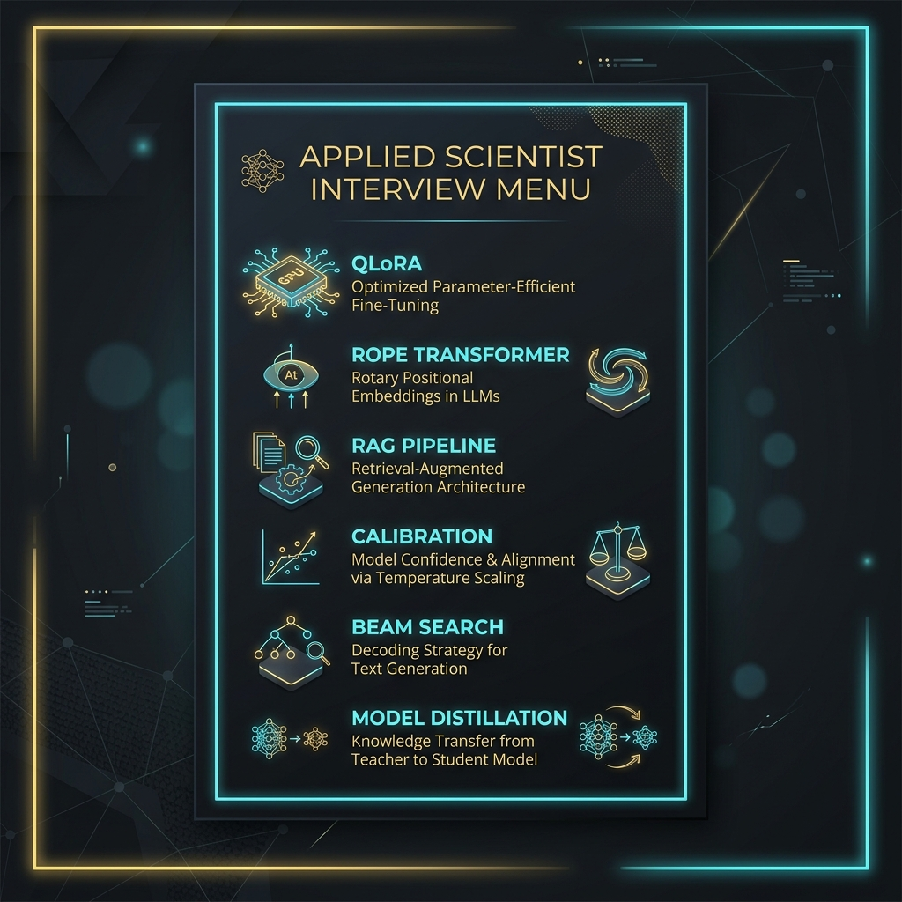
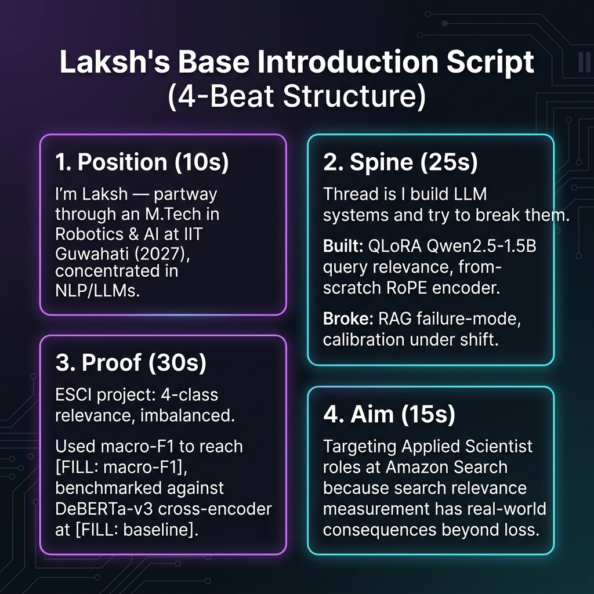
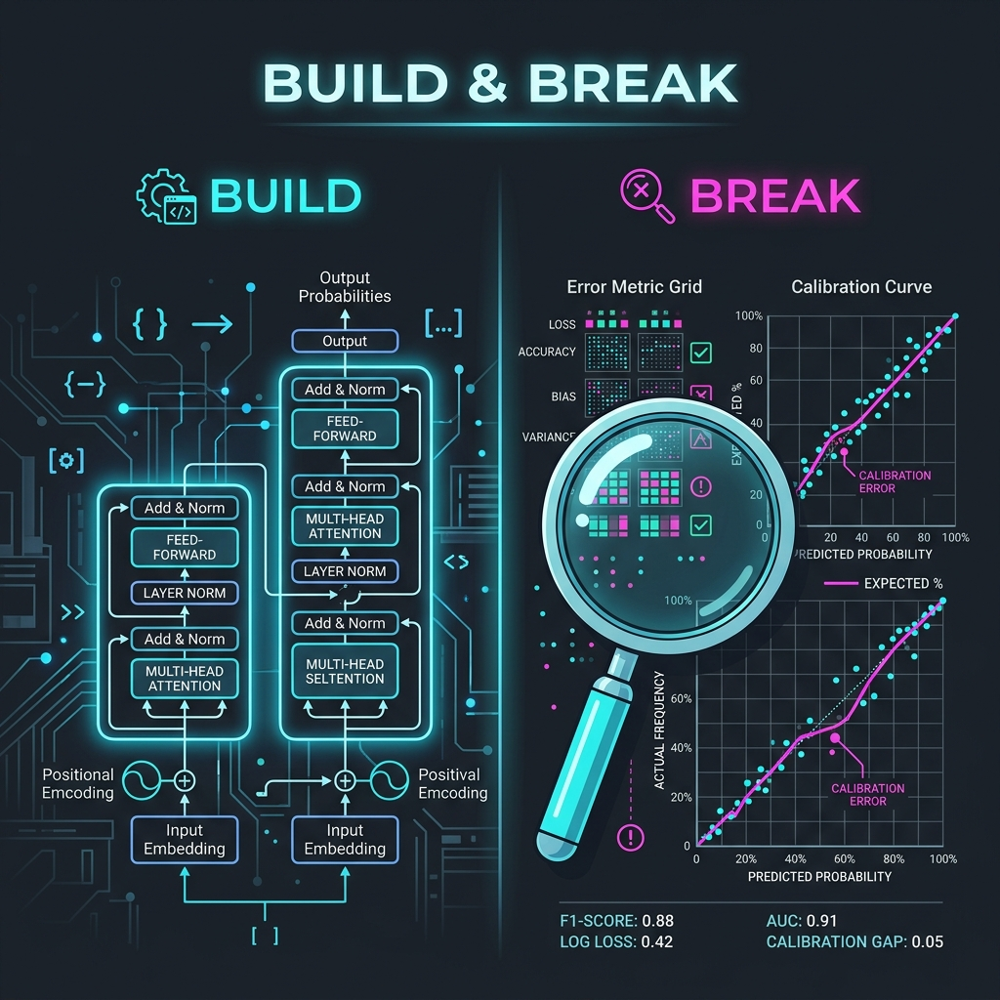
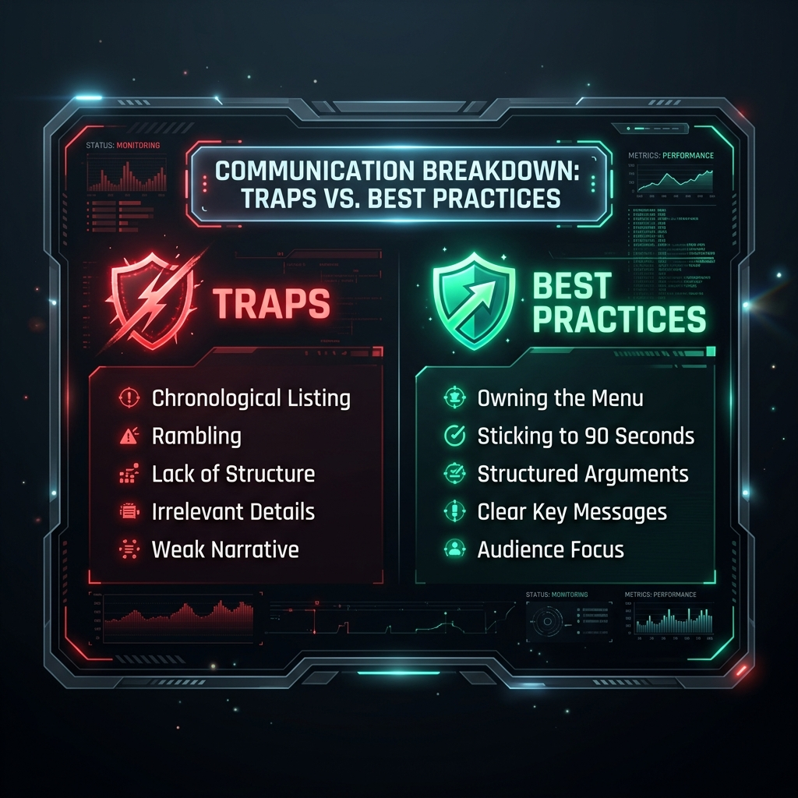

# Chapter 4 — The Introduction

| | |
|---|---|
| **Question covered** | "Tell me about yourself" — and its variants |
| **Why it gets a chapter** | It is asked in **every round of every loop**, and it is the only answer you fully control. |
| **Reading time** | ~10 min, then rehearsal |
| **Depends on** | [Ch 0 Target Lock](00_target_lock.md) · [Ch 1 Dossier](01_company_dossier.md) · [Ch 2 Audit](02_resume_audit_and_score.md) · [Ch 3 Tech Stack](03_your_tech_stack_defined.md) |

---

> 📍 **The Core Principle: Your introduction is a menu.** 
> Every term you volunteer is a dish the interviewer may order. You are not trying to sound impressive — you are trying to *steer the next forty minutes onto ground you have chosen*. A shorter introduction full of defensible hooks beats a longer one full of fragile ones.


*Metaphor: The terms you volunteer in your pitch act as menu items for the interviewer to order.*

---

## 🟢 What This Question Is Actually For

It is not small talk and not a warm-up. In an Amazon loop, it does three key jobs:

1. **Sets the agenda:** Whatever you name, they can ask about. Most candidates hand over the agenda by accident.
2. **Tests compression:** Can you summarize your own work at the right altitude? A scientist who cannot compress cannot present.
3. **Seeds the LP file:** Bar Raisers are trained on all 16 Leadership Principles. Your framing seeds **Learn and Be Curious** and **Deliver Results** before a single behavioral question is asked.

> ⏱️ **Target Length: 60–90 seconds.** Past ~2 minutes, you are monologuing, and interviewers stop listening while planning how to interrupt.

---

## 🔷 The Structure

The introduction is structured into four key beats. Front-load relevance for a listener deciding how interested to be:


*The four beats of a high-impact Applied Scientist introduction.*

| Beat | Seconds | Job |
|---|---|---|
| **1. Position** | ~10s | Who you are right now, in one line |
| **2. Spine** | ~25s | The thread connecting your work — not a project list |
| **3. Proof** | ~30s | *One* project, with a metric-driven result |
| **4. Aim** | ~15s | Why this role, at this company |

---

### The Spine Metaphor

Listing four projects makes you sound like a portfolio catalog. Naming the *thread* makes you sound like a scientist with a research direction — and it lets you drop three projects from the introduction while keeping their credit. They are still on the resume; you have simply not put them on the menu.


*Your Research Spine: Balancing the creation and interrogative evaluation of LLMs.*

For your background, the spine is:
> **You build LLM systems and then interrogate whether they actually work.** 
> * **Build:** QLoRA fine-tuning, from-scratch RoPE transformer.
> * **Break:** RAG failure-mode analysis, confidence calibration under shift.

That is a genuine research identity, mapping directly onto **Dive Deep** and **Insist on the Highest Standards**.

---

## 🔷 Your Base Introduction

⚠️ **Every `[FILL: metric]` must come from your run logs before you speak this aloud.** Delivering it with a gap is fine — you say "I'd have to check the exact figure." Delivering it with an invented number is the one unrecoverable error.

> "I'm Laksh — I'm partway through an M.Tech in Robotics and AI at IIT Guwahati, graduating in 2027, and my work is concentrated in NLP and large language models.
>
> The thread across my projects is that I **build LLM systems and then try to break them**. On the building side, I fine-tuned Qwen2.5-1.5B with QLoRA for query–product relevance on Amazon's ESCI dataset, and I implemented a transformer encoder from scratch with rotary position embeddings. On the breaking side, I did a failure-mode analysis of a RAG pipeline and a study of confidence calibration under distribution shift.
>
> The one I'd point to first is the ESCI work: four-class relevance, heavily imbalanced, so I used macro-F1 as the primary metric and reached `[FILL: macro-F1]`, benchmarked against a fully fine-tuned DeBERTa-v3 cross-encoder at `[FILL: baseline]`. `[FILL: one sentence on what that comparison taught you]`.
>
> I'm aiming at Applied Scientist roles because the part I care about is the measurement — deciding whether a model is actually good, not just whether the loss went down. That's what drew me to Amazon specifically; search relevance is where that question has real consequences."

* **Word count ≈ 175** → roughly 75 seconds spoken. Time yourself; most people run 20% long on the first attempt.

---

## 🔷 The Menu: What You Just Put On It

Every technical term above is now orderable. Cross-check each against your Chapter 3 self-check:

| Hook volunteered | Chapter 3 tier | Safe to serve? |
|---|---|---|
| **QLoRA** | Tier 1 #1 | Only if ✅ |
| **Qwen2.5-1.5B** | Tier 2 #22 | Only if ✅ |
| **ESCI / 4-class relevance** | Tier 3 #23 | Only if ✅ |
| **macro-F1** | Tier 1 #4 | Only if ✅ **and the number is in the vault** |
| **DeBERTa-v3 cross-encoder** | Tier 2 #14, #21 | Only if you can say *why* a cross-encoder is structurally advantaged |
| **RoPE / from-scratch transformer** | Tier 1 #5, #6 | Only if ✅ — and expect the derivation |
| **RAG failure-mode analysis** | Tier 1 #10, Tier 3 #30 | Strong ground; welcome the question |
| **Calibration / distribution shift** | Tier 1 #8, #9 | Only if ✅ |

> ⚠️ **The Rule:** If any row is **⚠️** or **❌** in Chapter 3, cut that hook from the introduction. It stays on your resume, but you stop advertising it in the first 90 seconds.

---

## 🔷 Deliberate Omissions

What you leave out is as important as what you include. It keeps your menu clean and focused:

| Omitted | Why |
|---|---|
| **NPTEL certificates & percentages** | Coursework percentages carry little weight for a scientist role and dilute stronger signals. |
| **700+ LeetCode** | Belongs in the coding round. Naming it early invites "so, competitive programming?" and reframes you as a coder rather than a scientist. |
| **CUDA, SQL, Computer Vision** | Chapter 2 Finding D — undemonstrated. Never volunteer an undemonstrated skill. |
| **Two of the four projects** | Named in one clause each, not described. Keeps the menu short; they remain available. |
| **"Passionate about AI"** | Says nothing, and consumes valuable seconds. |

### The Exception: Amazon ML Summer School 2026 (Invite-Only)

Do not force this into the base introduction — it fits awkwardly and can read as name-dropping. Instead, deploy it when asked *"Why Amazon?"*:

> "I was selected for Amazon's ML Summer School in 2026, which is where I first saw how the science work here connects to real search problems — that's a large part of why I'm targeting Applied Scientist here specifically."

---

## 🔷 Per-Round Variants

Adjust the **Proof** and **Aim** beats depending on the round focus:

### 1. For a coding round
Compress technical depth to start coding immediately:
> "…my work is mostly NLP and LLMs — fine-tuning, transformer internals, and evaluation. I also implement a lot from scratch, and I've solved 700+ DSA problems in C++, so I'm comfortable reasoning through implementation details out loud."
*(⚠️ Confirm coding language policy first - Chapter 0 checklist #4)*

### 2. For an ML breadth round
Signal scope over deep detail of a single project:
> "…I work across the LLM stack — parameter-efficient fine-tuning, transformer architecture, retrieval systems, and model evaluation. The evaluation side is what I keep returning to: calibration, failure attribution, whether a metric is actually measuring what you think."

### 3. For the behavioral / Bar Raiser round
Lead with trajectory and self-direction (seeds **Learn and Be Curious**):
> "…I came into my M.Tech from a CS background and taught myself most of the LLM material through projects — starting with fine-tuning, then implementing a transformer from scratch when I realized I understood the API better than the mechanism, and most recently on evaluation and failure analysis. Each project came from a gap I found in the previous one."

---

## 🔷 The Robotics Question

Your M.Tech is **Robotics and AI**; all four projects are NLP/LLM. Expect: *"Why a robotics programme if you're doing NLP?"*

**Structure:** Optimization/learning theory bridge → intentional specialization → proof.

> "The programme is Robotics and AI, and the AI side is where I concentrated — the coursework in optimisation and learning theory carried directly into what I do now. I chose NLP and LLMs deliberately over the last year because that's where the problems I find most interesting are, and all four of my recent projects are in that space. `[FILL: one specific robotics-course concept you actually use — e.g. state estimation, control theory, probabilistic modelling]`."

---

## 🔷 Traps & Shields


*Common pitfalls during the introduction vs. defensive best practices.*

| Trap | Cost & Remedy |
|---|---|
| **Chronology Drift** | Telling a timeline story. Nobody asked for a timeline; you burn 90 seconds before reaching anything relevant. *Fix: Start from the present and focus on relevance.* |
| **The Project Laundry List** | Listing all 4 projects equally. Gives no signal about what you value and quadruples the menu. *Fix: Naming 1 project in depth, 3 in passing.* |
| **Fabricating Metrics** | Guessing or making up a number. Unrecoverable if caught. *Fix: Say "I'd have to check the exact run log" instead.* |
| **Generic Passion** | Saying "I'm passionate about AI". Unfalsifiable, unmemorable, and a wasted opening. *Fix: Let your project spine prove your interest.* |
| **Student Apologetics** | "I'm just a student, so...". Never open by discounting yourself. *Fix: Own your qualifications; you were invited to interview.* |
| **Monologuing** | Running past 2 minutes. The interviewer stops listening and plans when to interrupt. *Fix: Stick strictly to the 60-90s window.* |
| **Inconsistent Storytelling** | Shifting facts between rounds. Interviewers compare notes. *Fix: Vary emphasis, never the core truth.* |

---

## 🟢 Rehearsal Protocol

1. **Fill the vault first:** Recover `[FILL: macro-F1]` and `[FILL: baseline]` from your run logs. Rehearse with "I'd have to check the exact figure" rather than placeholders.
2. **Speak it aloud, timed:** Three times. Spoken, not read. Target 60–90 seconds.
3. **Record and listen back:** The fastest fix for pacing, tone, and filler words. Use the studio below — record yourself on camera, replay it, and click **Review** for feedback on structure, length, and defensibility.
4. **Audit hooks:** Underline every technical term you said and verify it is ✅ in Chapter 3.
5. **Rehearse the follow-ups:** Prepare answers for *"Tell me more about the ESCI project"* and *"Why Amazon?"*

<RehearsalStudio prompt="Deliver your introduction as if the interviewer just said &quot;Tell me about yourself.&quot; Aim for the four beats — Position, Spine, Proof, Aim — in 60–90 seconds." minSeconds="60" maxSeconds="90" rubric="introduction" />

### Readiness Checklist

```markdown
- [ ] Runs 60–90 seconds spoken (not read)
- [ ] Contains zero unfilled/invented numbers
- [ ] Every volunteered hook is ✅ in Chapter 3
- [ ] Spine stated before projects are listed
- [ ] Names one project in depth, three in passing
- [ ] Has a specific "why Amazon" that is not generic flattery
- [ ] Robotics/NLP bridge prepared without defensiveness
- [ ] Per-round variants prepared (coding, breadth, behavioral)
```

**Next:** [Chapter 5 — Gap Map & Study Plan](05_gap_map_and_study_plan.md)
