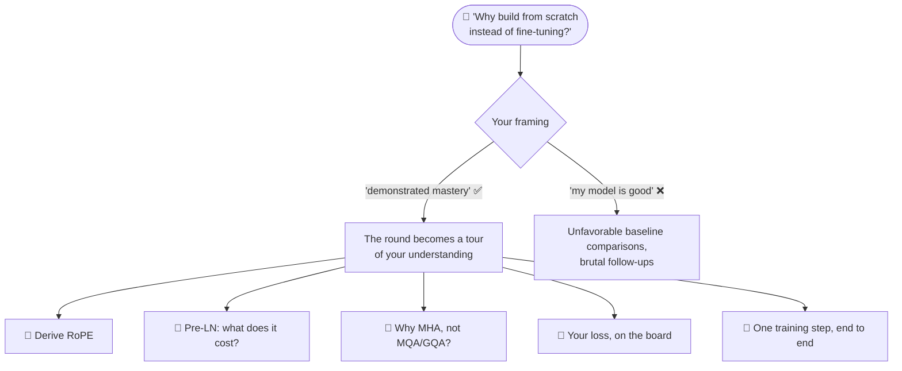
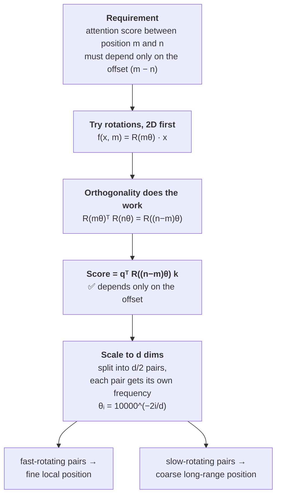
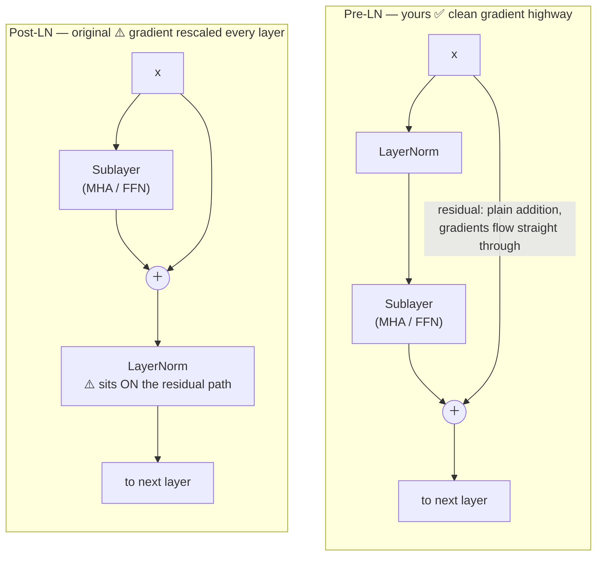
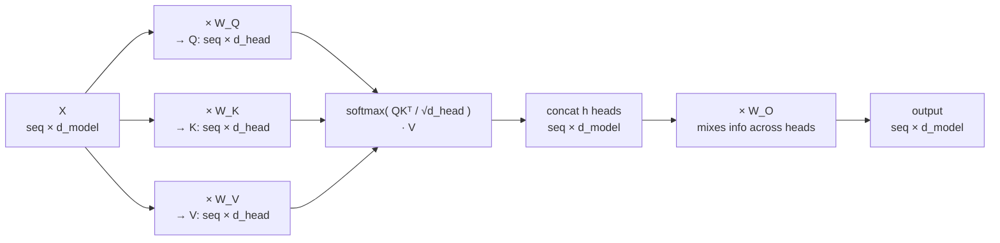
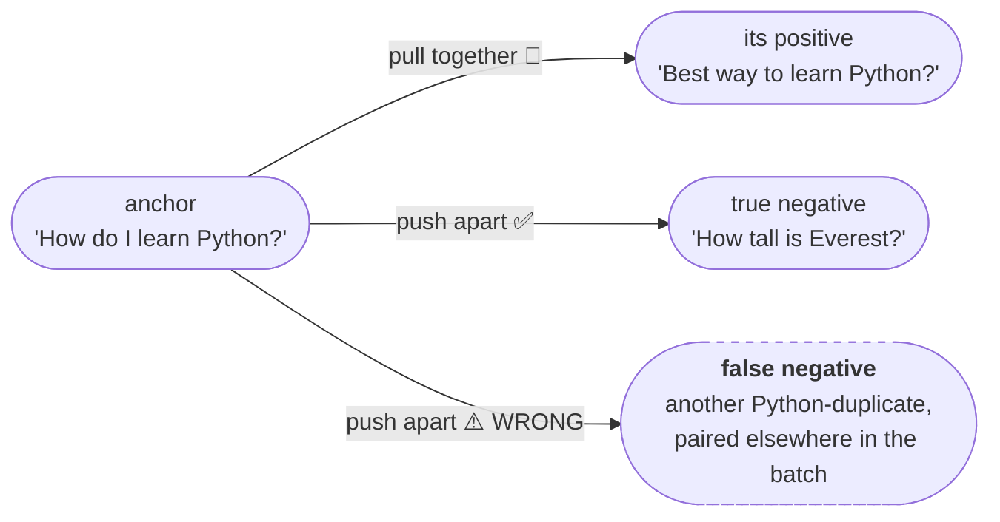
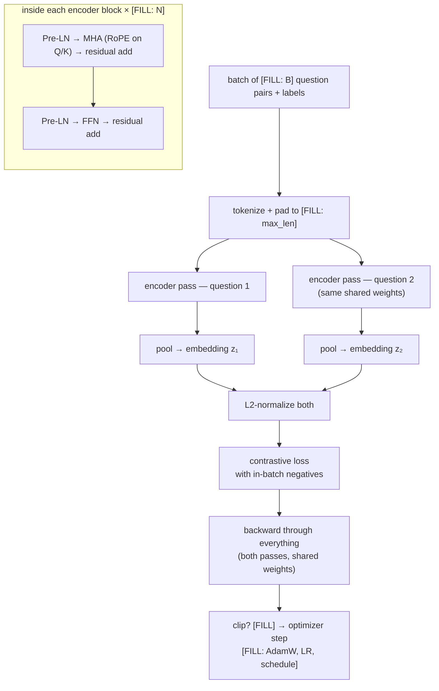
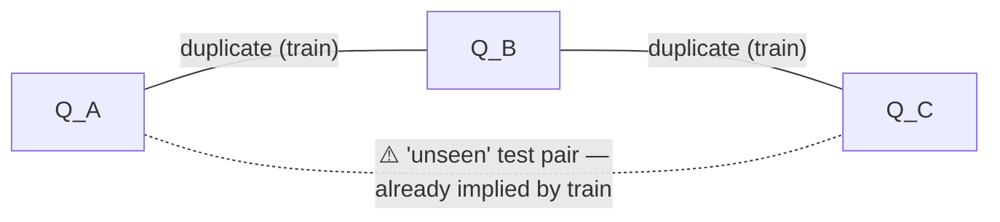

# Lesson 2 — Defending the From-Scratch RoPE Transformer

| | |
|---|---|
| **Prerequisites** | Session 1 README; your ROPE transformer run logs open in another window |
| **Time** | ~12 min visible reading + drills; deep-dive blocks open on demand |
| **Domain tag** | Transformers / Embeddings / Contrastive Learning |
| **Resume line under fire** | "Built a Transformer encoder from scratch with Rotary Position Embeddings, Pre-LayerNorm, and Multi-Head Attention; trained with a custom contrastive loss on Quora Question Pairs" |

🔬 **Interactive companion** (CPU-only, runs instantly): [▶ Open the Architecture Unit Tests notebook in Colab](https://colab.research.google.com/github/vinod-seth/Applied-Scientist-Interview-Gauntlet/blob/main/tutorial/01_finetuning_and_architecture/02_architecture_unit_tests.ipynb)

> 📍 **How this lesson works:** each 🎯 drill is a real interviewer question. **Answer out loud first** — 30–60 seconds, as if the interviewer is waiting — *then* open ✅ to compare against the model answer. 📚 blocks hold the full derivations and citations; open them only where your answer felt shaky. Same rule as Lesson 1: every number comes from your logs. `[FILL]` or silence — never an invented figure.

---

## 🟢 The Map of This Interrogation

This bullet gets a different chain than QLoRA. There, the question was "did you understand the tool you used?" Here it is "did you understand the thing you *built*?" — and since you chose every component, every choice is attackable. Your opening frame decides which branch you live in:

The honest frame: a learning project that demonstrates mastery of transformer internals — not a claim that from-scratch beats pretrained. Present it that way and the follow-ups become a tour of your strength.

---

## 🔷 Drill 1 — "Why build a transformer from scratch instead of fine-tuning a pretrained one?"

*The opening move, almost every time. 45 seconds. Out loud.*

✅ Model answer

"The purpose is demonstrated mastery, not a performance claim. A pretrained sentence-transformer — say all-MiniLM-L6-v2 — would almost certainly beat my from-scratch model on QQP, because it starts with distilled knowledge from 1B+ sentence pairs. What I gained is the ability to defend every component in this conversation: I can derive RoPE from the relative-position requirement, explain Pre-LN over Post-LN, and write my contrastive loss from memory. A fine-tuned model gives better numbers; a from-scratch model gives better *understanding* — which is what this round tests. My QQP performance was `[FILL: metric + value]` — I frame the project as 'built and trained a working transformer, then used it to study contrastive learning dynamics,' not as a SOTA claim."

🔁 The follow-up chain (how they push)

"What baseline did you compare against?" → "How many parameters in yours vs. MiniLM?" → "So you spent GPU hours to underperform — what's the ROI argument?" (answer: it's a learning project; the ROI is the engineer's depth, which is what's being evaluated right now) → "First change to make it production-quality?" (pretrain on a large corpus before contrastive fine-tuning — self-supervised pretraining is the entire gap).

---

## 🔷 Drill 2 — "Derive RoPE for me. Start from what you want the attention score to satisfy."

*The single cleanest test of math-vs-memorization. This is the derivation, as a picture:*

*Now say it — 60 seconds, board-style — before opening the answer.*

✅ Model answer

"I want ⟨f(q, m), f(k, n)⟩ = g(q, k, m−n) — the dot product depends on relative position only. In 2D: let f(x, m) = R(mθ)x, a rotation by mθ. Then ⟨R(mθ)q, R(nθ)k⟩ = qᵀR(mθ)ᵀR(nθ)k = qᵀR((n−m)θ)k, because rotation matrices are orthogonal. The score is now a function of (n−m) — done. For d-dimensional heads, pair the dimensions into d/2 two-dimensional subspaces, each with frequency θᵢ = 10000^(−2i/d): low-index pairs rotate fast (fine local position), high-index pairs rotate slowly (coarse long-range position). Applied to q and k only — values carry content, and rotating them would distort what gets read once attended."

🔁 The follow-up chain

"Why θᵢ = 10000^(−2i/d) specifically?" (empirical default from RoFormer; the base sets the wavelength range; larger bases extend it for longer contexts) → "What happens beyond training length?" (unseen rotation angles → attention patterns the model never trained on; NTK-aware scaling / YaRN rescale the frequency spectrum without adding parameters) → "Compare to learned absolute embeddings?" (learned embeddings have a fixed vocabulary of positions; RoPE generates any position, but the model still hasn't *learned* patterns for unseen positions — the advantage is smoothness, not magic).

📚 Full derivation, extrapolation behavior & citations

**The requirement.** We want the inner product between query q at position m and key k at position n to be a function of their *relative* distance (m − n), not their absolute positions: ⟨f(q, m), f(k, n)⟩ = g(q, k, m − n).

**Why rotations satisfy this.** In 2D, if f(x, m) = R(mθ)·x with R a rotation matrix, then ⟨f(q, m), f(k, n)⟩ = qᵀR(mθ)ᵀR(nθ)k = qᵀR((n − m)θ)k. Rotation matrices are orthogonal — lengths and angles preserved, transpose equals inverse — so the absolute-position rotations cancel, leaving only the offset.

**Extension to d dimensions.** Pair the d_head dimensions into d/2 pairs, each with its own frequency θᵢ = 10000^(−2i/d). This creates a spectrum: early pairs rotate fast (high-resolution local position), late pairs rotate slowly (coarse long-range position). The encoding applies pair-wise: [q₂ᵢ, q₂ᵢ₊₁] → R(m·θᵢ)[q₂ᵢ, q₂ᵢ₊₁].

**Extrapolation.** RoPE has no trainable position table — positions come from the formula, so extrapolation is possible in principle. In practice quality degrades at unseen lengths because the model never saw those attention patterns. NTK-aware scaling and YaRN (Peng et al. 2023, https://arxiv.org/abs/2309.00071) rescale the frequency spectrum to fix this.

Citation: Su et al. (2021), *RoFormer* (https://arxiv.org/abs/2104.09864).

---

## 🔷 Drill 3 — "Pre-LN makes training easy. What does it cost you, and how do you know?"

*The two architectures differ by where the LayerNorm sits — and by where gradients must travel:*

*Know your own numbers cold before answering: `[FILL: layers / heads / d_model / d_head / total params]`.*

✅ Model answer

"Two costs. First, the residual stream grows in magnitude across depth — each sublayer adds to it without renormalization. At `[FILL: your layer count]` layers this is manageable; at 48+ layers the final LayerNorm has to compress a wide dynamic range. Second, Xiong et al. 2020 show a *well-tuned* Post-LN model can slightly outperform Pre-LN at the same depth — the repeated normalization acts as an implicit regularizer. At my scale the trade-off is clear: Pre-LN trained stably without warmup, and the potential gap is within noise at my parameter count."

🔁 The follow-up chain

"Final LayerNorm before the output head?" `[FILL]` → "Why not RMSNorm?" (drops mean-centering, keeps variance normalization; ~5–10% faster per layer; near-equivalent when the mean is close to zero, as it usually is for residual streams) → "What pathology if you ran Post-LN without warmup?" (loss spikes or NaN early; early-layer gradient norms far exceed late-layer ones, so one learning rate either under-updates late layers or blows up early ones).

📚 Why Post-LN needs warmup — the mechanism

In Post-LN the residual stream passes through a LayerNorm at every layer, each of which rescales gradients, so effective gradient magnitude degrades across depth — deep Post-LN models need careful warmup and can fail to train beyond ~12 layers. In Pre-LN the normalization sits *inside* the sublayer branch; the residual stream is a clean sum, and Xiong et al. (2020, https://arxiv.org/abs/2002.04745) show gradients are well-behaved at initialization, eliminating warmup in most cases.

---

## 🔷 Drill 4 — "Walk me through the shapes in your Multi-Head Attention. Then: why not MQA or GQA?"

*Why √d_head? Why is W_O there at all? Answer both, then the MQA/GQA question.*

✅ Model answer

"Each of the h heads projects X with W_Q, W_K, W_V ∈ ℝ^(d_model × d_head), where d_head = d_model / n_heads. The 1/√d_head scaling keeps dot-product variance near 1 — without it, logits grow with dimension and push softmax into saturation, killing gradients. W_O mixes information across heads; without it each head's subspace stays isolated. On MQA/GQA: MQA shares one K/V head across all query heads; GQA groups query heads, one K/V head per group. Both shrink the KV cache at inference with modest quality cost — GQA at g=2–4 roughly matches MHA. I used standard MHA because (a) my model isn't served, so KV-cache size is irrelevant, and (b) for a learning project, full MHA keeps every head independently inspectable. For production inference, GQA would be my default."

🔁 The follow-up chain

"What KV-cache bottleneck would you hit at inference?" → "Can you convert MHA to GQA post-training?" (yes — mean-pool the K/V heads within each group, then brief continued training recovers most quality; Ainslie et al. 2023) → "Parameter count change?" (K/V projections shrink by the grouping factor; Q and O unchanged).

📚 The √d_head derivation, head specialization & citations

**Scaling derivation:** if q and k entries are iid with unit variance, their dot product has variance d_head. Dividing by √d_head restores unit variance, keeping softmax in its informative range instead of near-one-hot saturation (where the Jacobian is near zero and gradients stop).

**What heads learn:** Voita et al. (2019, https://arxiv.org/abs/1905.09418) — a small fraction of heads carry most of the function (positional, syntactic, rare-word heads); most are prunable. For your `[FILL: n_heads]`-head model, present head specialization as a hypothesis unless you actually ran attention-weight visualization.

**MQA:** Shazeer 2019 (https://arxiv.org/abs/1911.02150). **GQA:** Ainslie et al. 2023 (https://arxiv.org/abs/2305.13245).

---

## 🔷 Drill 5 — "Write your contrastive loss on the board. What's the temperature doing, and what happens if you set it wrong?"

*This is* your *custom loss — the strongest claim in the bullet and the easiest to expose if copy-pasted. The battlefield per batch looks like this:*

*With QQP's ~37% duplicate rate, a batch of 64 pairs gives each anchor 126 in-batch negatives — and a material fraction are false. Write your loss, state your τ, and explain what a wrong τ does. Then reveal.*

✅ Model answer

`[FILL: write your exact loss — formulation, similarity function (cosine vs. dot), temperature/margin value]`. "Temperature τ controls the sharpness of the softmax over similarities. Low τ (~0.05) concentrates gradient on the hardest negatives — faster learning, but a false negative that's actually a duplicate gets a huge wrongful repulsive gradient, and too-low τ risks embedding collapse. High τ (~1.0) spreads gradient uniformly — safer but slower, and fine distinctions may never form. I used τ = `[FILL]`. Empirical sweet spot for sentence-level tasks: 0.05–0.1 (SimCLR, Chen et al. 2020 — the finding transfers to NLP)."

🔁 The follow-up chain

"How did you choose τ? Did you sweep it?" `[FILL: if you swept]` → "What are false negatives doing to your gradient?" → "How would you mine hard negatives on QQP specifically?" (question-cluster overlap; or use the current model's top-k nearest neighbors as candidates, re-mine every N epochs).

📚 Formulations, false-negative math & embedding collapse

**InfoNCE / NT-Xent (symmetric):** for anchor i with positive j, loss = −log( exp(sim(zᵢ, zⱼ)/τ) / Σ_{k≠i} exp(sim(zᵢ, z_k)/τ) ). **Triplet:** max(0, sim(a, neg) − sim(a, pos) + margin) — simpler, one negative per anchor.

**False negatives on QQP:** in a batch of B pairs, each anchor's 2B−2 negatives include all other questions — some of which are duplicates paired elsewhere. Mitigation: filter known duplicates from the negative set (needs the label matrix), or accept the noise and *say so* — honesty beats pretending you handled it.

**Embedding collapse:** the degenerate solution — encoder maps everything to one point or a narrow cone; loss is low, all cosine similarities near 1.0, representations useless. Symptoms: early loss plateau, random downstream performance. Prevention: larger batches (more diverse negatives), batch norm on embeddings, temperature tuning, hard-negative mining.

Citation: Chen et al. (2020), *SimCLR* (https://arxiv.org/abs/2002.05709).

---

## 🔷 Drill 6 — "Walk me through one training step, end to end, for a batch of QQP pairs."

*The "do you actually own this code?" question. Your forward/backward, as a picture:*

*Narrate it in your own implementation's terms — pooling strategy included — then reveal.*

✅ Model answer

"A batch of `[FILL: batch size]` (question₁, question₂) pairs with binary labels, tokenized to max length `[FILL]` and padded. Each question passes through the same encoder: token embedding → `[FILL: N]` blocks of (Pre-LN → MHA with RoPE on Q/K → residual add → Pre-LN → FFN → residual add) → pooling: `[FILL: CLS / mean / last token]`. Both embeddings are L2-normalized for cosine similarity. Loss: `[FILL: your loss]` with in-batch negatives. Backward runs through the loss, the similarity computation, and both encoder passes (shared weights). Optimizer: `[FILL: AdamW, LR, schedule, grad clipping]`."

🔁 The follow-up chain

"Mean pool over what — including padding?" (mask padding before the mean; forgetting the mask pulls the mean toward the pad embedding and disproportionately dilutes short sequences) → "Show me the gradient path from the loss to a RoPE frequency parameter" (trick question — RoPE frequencies aren't learned in the standard formulation; they're fixed by the formula. If yours are learnable, say so and defend it).

---

## 🟢 QQP Dataset Traps — know the floor and the leaks

| Trap | The one-liner you must be able to expand |
|---|---|
| **Label noise** | Crowd-sourced binary labels; borderline pairs are genuinely ambiguous. Your error floor is the annotator-disagreement rate — don't claim past it. |
| **Transitivity leakage** | A≈B and B≈C imply A≈C. Random pair-splits leak equivalences across train/test. Proper eval splits by question *cluster*. `[FILL: your split strategy]` |
| **Length artifacts** | Short pairs are easy; a length heuristic scores well on average and fails on the long, nuanced pairs that matter. Per-length-bucket accuracy proves you checked. |

---

## 🟢 Concept Check

What property of rotation matrices makes RoPE encode *relative* position in the attention score?

* [ ] Rotation matrices are symmetric
* [x] Rotation matrices are orthogonal, so R(a)ᵀR(b) = R(b − a), making the inner product depend only on the position difference
* [ ] Rotation matrices have unit determinant, preserving vector norms
* [ ] Rotation matrices commute with the softmax function

Why is Pre-LayerNorm easier to train than Post-LayerNorm for deep transformers?

* [ ] Pre-LN uses fewer parameters per layer
* [ ] Pre-LN normalizes gradients during backpropagation
* [x] Pre-LN keeps the residual stream as a clean addition — gradients flow through the sum without passing through normalization layers, avoiding the rescaling that causes gradient pathologies in Post-LN
* [ ] Pre-LN eliminates the need for the output projection matrix

In a contrastive learning batch of 64 QQP pairs, approximately how many in-batch negatives does each anchor have, and what fraction are likely false negatives?

* [ ] 64 negatives, ~0% false negatives
* [ ] 127 negatives, ~5% false negatives
* [x] 126 negatives (2×64 − 2, excluding self and positive), and with QQP's ~37% positive rate, a meaningful fraction of those 126 are semantically duplicate questions mislabeled as negatives
* [ ] 63 negatives, ~50% false negatives

Your contrastive model's cosine similarities all cluster near 0.98 for both positive and negative pairs after 5 epochs. What is happening?

* [ ] The temperature is too high, spreading gradients too thin
* [ ] The learning rate is too low to move the embeddings
* [x] Embedding collapse — the encoder maps all inputs to near-identical points, producing uniformly high cosine similarity; the loss is low but the representations are useless
* [ ] The model has converged to the optimal embedding space

🔑 Click to Reveal Answers & Explanations

**Q1: option 2.** Orthogonality is the key: rotating both q and k makes the transpose-product collapse to a single rotation by the *difference* angle. Unit determinant preserves norms — nice, but not the mechanism. Symmetry is simply false for general rotations.

**Q2: option 3.** Pre-LN's residual stream accumulates sublayer outputs by plain addition; in Post-LN every layer's LayerNorm rescales the gradient, and at depth this repeated rescaling leaves the signal poorly conditioned.

**Q3: option 3.** 128 embeddings → 126 negatives per anchor. QQP's ~37% duplicate rate means a substantial share of those "negatives" are semantic duplicates paired elsewhere in the batch — contamination that pushes apart embeddings that should be close.

**Q4: option 3.** Collapse is the degenerate optimum of contrastive objectives. Diagnosis: check embedding variance across the batch. Fixes: bigger batches, tuned temperature (too-low τ accelerates collapse), batch norm on embeddings, hard-negative mining.

---

## 🔷 Hands-On Lab: Build Your RoPE Transformer Pitch Menu

30 minutes, produces the artifact you'll use in the boss fight and the real loop.

1. From your run logs, fill every ROPE row of the Metric Vault in [PROGRESS.md](../../PROGRESS.md). Empty slots get marked `QUALITATIVE-ONLY`.
2. Write your 4-minute pitch (beat structure from the [round playbook](../../playbooks/round_playbook.md): result → framing → decision tour → invite the drill).
   - **Result first:** "I built a transformer encoder from scratch with RoPE and Pre-LN, trained with contrastive learning on QQP, achieving `[FILL: metric]`."
   - **Frame as mastery, not SOTA.**
   - **Decision tour:** RoPE over learned embeddings · Pre-LN over Post-LN · contrastive loss over cross-entropy.
   - **Invite:** stop at ~4 minutes.
3. Underline every technical term. Self-assess Bronze/Silver/Gold honestly. **Delete or downgrade every hook that isn't Silver+.**
4. Say the pitch out loud, timed. Twice.

Expected output: a pitch ≤ 4 minutes, zero unfilled numbers, zero Bronze hooks.

---

## 🟢 Summary

- RoPE = rotations on q/k pairs, derived from "score must depend on offset only"; orthogonality does the work; d/2 frequency pairs give a multi-resolution position spectrum.
- Pre-LN trades a small performance ceiling for a clean gradient highway and warmup-free training — the right call at your scale, and you can name the cost.
- Your loss, your τ, your false-negative story are *your code* — reproduce them from memory or the round stalls there.
- Frame the project as demonstrated mastery. QQP's label noise and transitivity leakage bound achievable performance — knowing that bound is Gold-tier.

**References:** Su et al. 2021 (RoPE, arXiv:2104.09864) · Xiong et al. 2020 (Pre-LN, arXiv:2002.04745) · Voita et al. 2019 (head analysis, arXiv:1905.09418) · Chen et al. 2020 (SimCLR, arXiv:2002.05709) · Shazeer 2019 (MQA, arXiv:1911.02150) · Ainslie et al. 2023 (GQA, arXiv:2305.13245) · Peng et al. 2023 (YaRN, arXiv:2309.00071)

**Next:** [Lesson 3 — Tiered Challenges & Boss Fight](03_tiered_challenges_and_boss_fight.md)
