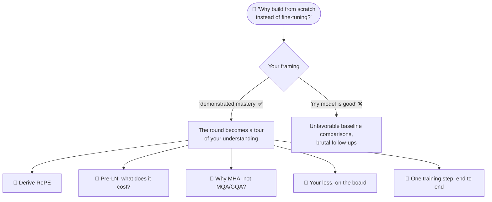
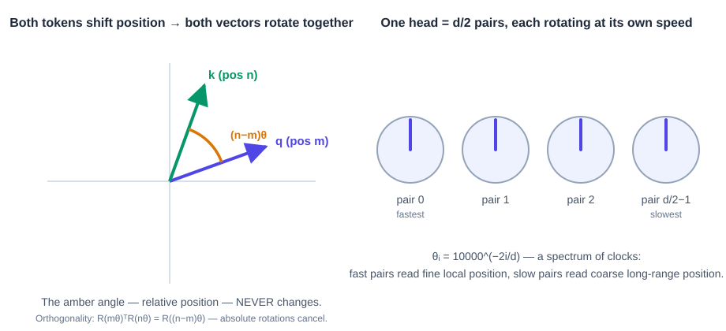
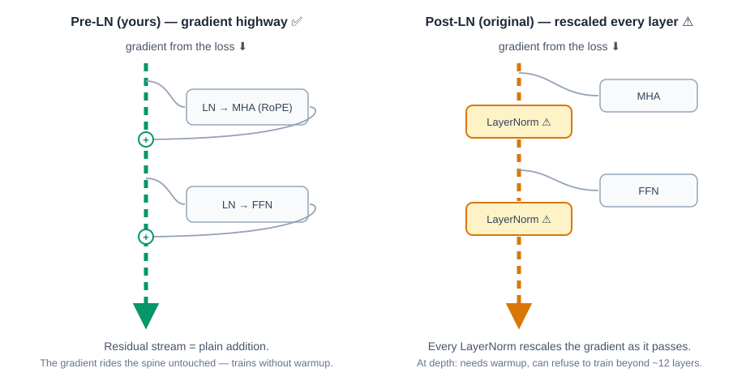
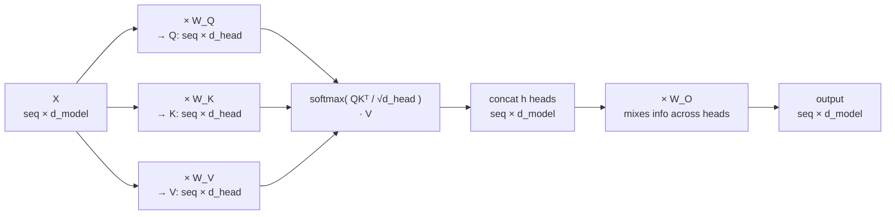
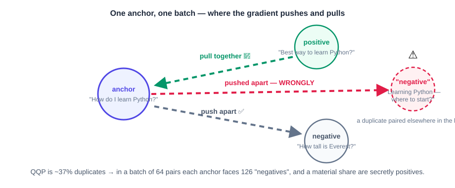
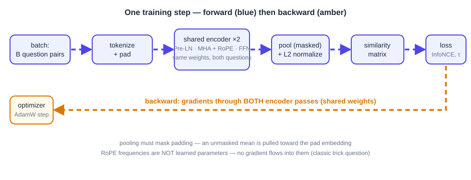
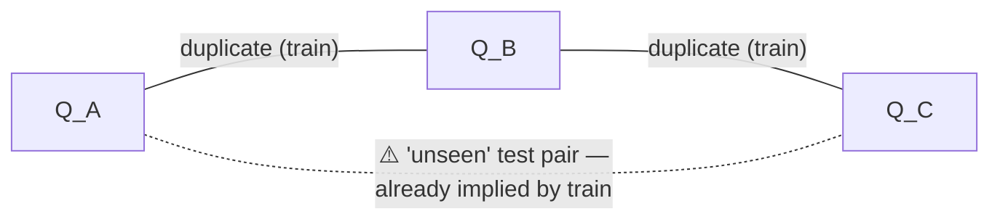

# Lesson 2 — Defending the From-Scratch RoPE Transformer

| | |
|---|---|
| **Prerequisites** | Session 1 README; your ROPE transformer run logs open in another window |
| **Time** | ~12 min visible reading + drills; deep-dive blocks open on demand |
| **Domain tag** | <abbr title="A neural-network architecture built on self-attention layers that process all tokens in parallel, replacing recurrence.">Transformers</abbr> / <abbr title="Dense vector representations of discrete inputs (words, tokens) in a continuous space where geometry encodes meaning.">Embeddings</abbr> / <abbr title="A training paradigm that learns representations by pulling similar pairs together and pushing dissimilar pairs apart in embedding space.">Contrastive Learning</abbr> |
| **Resume line under fire** | "Built a <abbr title="Transformer encoder: the bidirectional half of the original Transformer that reads the full input at once — used here for embedding, not generation.">Transformer encoder</abbr> from scratch with <abbr title="Rotary Position Embeddings: encodes position by rotating query/key vectors so the attention score depends only on relative offset.">Rotary Position Embeddings</abbr>, <abbr title="Pre-LayerNorm: normalization inside the sublayer branch before attention/FFN, keeping the residual stream clean.">Pre-LayerNorm</abbr>, and <abbr title="Multi-Head Attention: runs several parallel attention operations in independent subspaces, then concatenates the results.">Multi-Head Attention</abbr>; trained with a custom <abbr title="Contrastive loss: an objective that minimizes distance between positive pairs and maximizes distance between negatives in embedding space.">contrastive loss</abbr> on <abbr title="Quora Question Pairs: ~400k question pairs labeled duplicate / not-duplicate.">Quora Question Pairs</abbr>" |

🔬 **Interactive companion** (CPU-only, runs instantly): [▶ Open the Architecture Unit Tests notebook in Colab](https://colab.research.google.com/github/vinod-seth/Applied-Scientist-Interview-Gauntlet/blob/main/tutorial/01_finetuning_and_architecture/02_architecture_unit_tests.ipynb)

> 📍 **How this lesson works:** each 🎯 drill is a real interviewer question. **Answer out loud first** — 30–60 seconds, as if the interviewer is waiting — *then* open ✅ to compare against the model answer. 🔁 shows how they push deeper; 📚 holds full derivations and citations for shaky spots only. Same rule as Lesson 1: every number comes from your logs. `[FILL]` or silence — never an invented figure.

---

## 🟢 The Map of This Interrogation

This bullet gets a different chain than QLoRA. There the question was "did you understand the tool you used?" Here it is "did you understand the thing you *built*?" — you chose every component, so every choice is attackable. Your opening frame decides which branch you live in:

```mermaid
flowchart TD
    OPEN(["🎤 'Why build from scratch<br/>instead of fine-tuning?'"]) --> FRAME{Your framing}
    FRAME -->|"'demonstrated mastery' ✅"| TOUR["The round becomes a tour<br/>of your understanding"]
    FRAME -->|"'my model is good' ❌"| PAIN["Unfavorable baseline comparisons,<br/>brutal follow-ups"]
    TOUR --> D2["🎯 Derive RoPE"]
    TOUR --> D3["🎯 Pre-LN: what does it cost?"]
    TOUR --> D4["🎯 Why MHA, not MQA/GQA?"]
    TOUR --> D5["🎯 Your loss, on the board"]
    TOUR --> D6["🎯 One training step, end to end"]
```

The honest frame: a learning project that demonstrates mastery of transformer internals — not a claim that from-scratch beats pretrained. Present it that way and the follow-ups become a tour of your strength.

---

## 🔷 Drill 1 — "Why build a transformer from scratch instead of fine-tuning a pretrained one?"

*The opening move, almost every time. 45 seconds. Out loud.*

✅ Model answer

**The beats to hit:**

- **Primary frame:** demonstrated mastery, not a <abbr title="State of the art — the best published result on a benchmark.">SOTA</abbr> performance claim.
- **Own the baseline:** a pretrained sentence-transformer (e.g. `all-MiniLM-L6-v2`) will win on <abbr title="Quora Question Pairs — ~400k question pairs labeled duplicate / not-duplicate; the training and eval dataset for this project.">QQP</abbr> — it starts from 1B+ pretraining pairs.
- **What building bought you:** command of every decision —
  - derive <abbr title="Rotary Position Embedding — encodes token position by rotating query/key vectors so the attention score depends only on the relative offset.">RoPE</abbr> from the <abbr title="Relative-position requirement: the constraint that attention scores should depend only on the distance between tokens, not their absolute positions.">relative-position requirement</abbr>,
  - defend <abbr title="Pre-LayerNorm — normalization inside the sublayer branch, before attention/FFN; keeps the residual stream a clean addition.">Pre-LN</abbr> vs <abbr title="Post-LayerNorm — normalization after the residual addition (original 2017 Transformer); gradients pass through it at every layer.">Post-LN</abbr> from gradient flow,
  - write the contrastive loss from memory.
- **Numbers stay honest:** QQP result = `[FILL: metric + value]`, framed as a study artifact.

**Say it:**

> *"The purpose is demonstrated mastery, not a performance claim — a fine-tuned MiniLM would beat my model, because it starts with a billion pairs of distilled knowledge. What building from scratch bought me is that I can defend every component in this conversation: derive RoPE, justify Pre-LN, write my loss on the board. My QQP result was `[FILL]`, and I frame the project as building a working transformer to study contrastive training dynamics."*

🔁 The follow-up chain (how they push)

"What baseline did you compare against?" → "How many parameters in yours vs. MiniLM?" → "So you spent GPU hours to underperform — what's the ROI argument?" (it's a learning project; the ROI is the engineer's depth, which is what's being evaluated right now) → "First change to make it production-quality?" (<abbr title="Self-supervised pretraining: training on unlabeled text (e.g., masked language modeling) to learn general representations before task-specific fine-tuning.">self-supervised pretraining</abbr> on a large corpus before contrastive fine-tuning — that is the entire gap).

---

## 🔷 Drill 2 — "Derive RoPE for me. Start from what you want the attention score to satisfy."

*The single cleanest test of math-vs-memorization. Watch the mechanism, then say the derivation — 60 seconds, board-style:*

✅ Model answer (4 steps)

1. **The requirement** — the <abbr title="Attention score: the dot-product similarity between a query and a key vector, determining how much one token attends to another.">attention score</abbr> must depend only on the offset $(m-n)$:

$$\langle f(q, m),\; f(k, n) \rangle = g(q, k, m-n)$$

2. **Try rotations in 2D** — let $f(x, m) = R(m\theta)\,x$. <abbr title="Rotation matrix: a square matrix that rotates vectors without changing their length. Its transpose equals its inverse.">Rotation matrices</abbr> are <abbr title="Orthogonal: a matrix whose transpose equals its inverse. Rotations, reflections — they preserve lengths and angles.">orthogonal</abbr> ($R^\top = R^{-1}$), so the absolute positions cancel:

$$\langle R(m\theta)q,\; R(n\theta)k \rangle = q^\top R(m\theta)^\top R(n\theta)\,k = q^\top R\big((n-m)\theta\big)\,k$$

3. **Scale to $d$ dims** — split the head into $d/2$ two-dimensional pairs, each with its own frequency:

$$\theta_i = 10000^{-2i/d}$$

   Low-index pairs rotate fast → fine local position. High-index pairs rotate slowly → coarse long-range position.

4. **Rotate $q$ and $k$ only** — values carry content; rotating $v$ would distort what gets read once attended.

🔁 The follow-up chain

"Why $\theta_i = 10000^{-2i/d}$ specifically?" (empirical default from RoFormer; the base sets the <abbr title="Wavelength range: the span from shortest to longest period in the frequency set — determines the finest and coarsest positional resolution.">wavelength range</abbr>; larger bases extend it for longer contexts) → "What happens beyond training length?" (unseen rotation angles → attention patterns the model never trained on; <abbr title="NTK-aware scaling: a context-length extension method that modifies RoPE's frequency base to preserve the neural tangent kernel's behavior at longer sequences.">NTK-aware scaling</abbr> / <abbr title="YaRN (Yet another RoPE extensioN): rescales RoPE frequencies non-uniformly to extend context length without retraining.">YaRN</abbr> rescale the <abbr title="Frequency spectrum: the set of rotation speeds across dimension pairs — fast pairs encode fine local position, slow pairs encode coarse long-range position.">frequency spectrum</abbr> without adding parameters) → "Compare to <abbr title="Learned absolute embeddings: a trainable lookup table mapping each position index to a vector. Fixed vocabulary — cannot generalize to unseen positions.">learned absolute embeddings</abbr>?" (a learned table has a fixed vocabulary of positions; RoPE generates any position, but the model still hasn't *learned* patterns for unseen positions — the advantage is smoothness, not magic).

📚 Full derivation, extrapolation behavior & citations

**The requirement.** We want the inner product between query $q$ at position $m$ and key $k$ at position $n$ to be a function of their *relative* distance $(m-n)$, not their absolute positions.

**Why rotations satisfy this.** In 2D, with $f(x, m) = R(m\theta)x$, orthogonality gives $R(m\theta)^\top R(n\theta) = R((n-m)\theta)$ — lengths and angles preserved, transpose equals inverse, absolute rotations cancel.

**Extension to $d$ dimensions.** Pair the <abbr title="Head dimensions: the d_head-dimensional vector space each attention head operates in. d_head = d_model / n_heads.">head dimensions</abbr> into $d/2$ pairs; the encoding applies pair-wise: $[q_{2i},\, q_{2i+1}] \mapsto R(m\,\theta_i)\,[q_{2i},\, q_{2i+1}]$. The frequency spectrum makes early pairs high-resolution local clocks and late pairs slow long-range clocks.

**Extrapolation.** RoPE has no trainable position table — positions come from the formula, so extrapolation is possible in principle. In practice quality degrades at unseen lengths because the model never saw those attention patterns. NTK-aware scaling and YaRN (Peng et al. 2023, https://arxiv.org/abs/2309.00071) rescale the frequency spectrum to fix this.

Citation: Su et al. (2021), *RoFormer* (https://arxiv.org/abs/2104.09864).

---

## 🔷 Drill 3 — "Pre-LN makes training easy. What does it cost you, and how do you know?"

*Watch where the gradient travels in each design — then answer.* Know your numbers cold first: `[FILL: layers / heads / d_model / d_head / total params]`.

✅ Model answer

| | **Pre-LN (yours)** | **Post-LN (original)** |
|---|---|---|
| <abbr title="LayerNorm: normalizes activations to zero mean and unit variance within each token's feature vector. Stabilizes training by reducing internal covariate shift.">LayerNorm</abbr> sits | inside the <abbr title="Sublayer branch: the attention or FFN computation path that runs parallel to the residual skip connection.">sublayer branch</abbr> | **on** the <abbr title="Residual path: the skip connection that adds the sublayer's output to its input, enabling gradient flow through depth.">residual path</abbr> |
| Gradient path | clean addition, flows straight through | rescaled by every <abbr title="LN: LayerNorm — divides by the standard deviation and re-centers, which rescales gradients at every layer.">LN</abbr> |
| <abbr title="Warmup: a learning-rate schedule phase that starts with a very small LR and ramps up, preventing early-training gradient instability.">Warmup</abbr> | not needed | required |
| Deep stacks | stable | can fail beyond ~12 layers |
| Final quality | slightly lower ceiling | slightly higher — *if* well-tuned |
| Hidden cost | <abbr title="Residual magnitude growth: in Pre-LN the residual stream is a running sum without renormalization, so its scale grows with depth.">residual magnitude grows with depth</abbr> | training fragility |

**Say it:**

> *"Two costs. First, the <abbr title="Residual stream: the running sum of sublayer outputs carried through the network via skip connections.">residual stream</abbr> grows across depth — each sublayer adds to it without renormalization; at my `[FILL]` layers that's manageable, at 48+ the final LayerNorm must compress a wide <abbr title="Dynamic range: the ratio between the largest and smallest magnitudes in a tensor. A wide range makes normalization harder.">dynamic range</abbr>. Second, Xiong et al. 2020 show a well-tuned Post-LN can slightly outperform Pre-LN at equal depth — the repeated normalization acts as an implicit <abbr title="Regularizer: any mechanism that constrains model complexity to reduce overfitting. Here, the rescaling in Post-LN provides an implicit form.">regularizer</abbr>. At my scale the trade-off is clear: Pre-LN trained stably without warmup, and the potential gap is within noise at my parameter count."*

🔁 The follow-up chain

"Final LayerNorm before the output head?" `[FILL]` → "Why not <abbr title="RMSNorm: Root Mean Square Normalization — drops mean-centering and normalizes by the RMS only. ~5–10% faster per layer than LayerNorm.">RMSNorm</abbr>?" (drops mean-centering, keeps variance normalization; ~5–10% faster per layer; near-equivalent when the mean is close to zero, as it usually is for residual streams) → "What pathology if you ran Post-LN without warmup?" (loss spikes or <abbr title="NaN: Not a Number — a floating-point sentinel indicating overflow or undefined operations. In training, NaN loss means numerical instability.">NaN</abbr> early; early-layer <abbr title="Gradient norms: the magnitude of the gradient vector for a layer's parameters. Large differences across layers indicate poor conditioning.">gradient norms</abbr> far exceed late-layer ones, so one learning rate either under-updates late layers or blows up early ones).

📚 Why Post-LN needs warmup — the mechanism

In Post-LN the residual stream passes through a LayerNorm at every layer, each of which rescales gradients, so effective gradient magnitude degrades across depth. In Pre-LN the normalization sits *inside* the sublayer branch; the residual stream is a clean sum, and Xiong et al. (2020, https://arxiv.org/abs/2002.04745) show gradients are well-behaved at initialization, eliminating warmup in most cases.

---

## 🔷 Drill 4 — "Walk me through the shapes in your Multi-Head Attention. Then: why not MQA or GQA?"

```mermaid
flowchart LR
    X["X<br/>seq × d_model"] --> WQ["× W_Q<br/>→ Q: seq × d_head"]
    X --> WK["× W_K<br/>→ K: seq × d_head"]
    X --> WV["× W_V<br/>→ V: seq × d_head"]
    WQ --> ATT["softmax( QKᵀ / √d_head )<br/>· V"]
    WK --> ATT
    WV --> ATT
    ATT --> CAT["concat h heads<br/>seq × d_model"]
    CAT --> WO["× W_O<br/>mixes info across heads"]
    WO --> OUT["output<br/>seq × d_model"]
```

*Why divide by √d_head? Why is W_O there at all? Answer both, then the MQA/GQA question.*

✅ Model answer

**The beats to hit:**

- **Shapes:** each of $h$ heads projects with $W_Q, W_K, W_V \in \mathbb{R}^{d_{model} \times d_{head}}$, where $d_{head} = d_{model}/h$.
- **The scaling:** $1/\sqrt{d_{head}}$ keeps <abbr title="Logit variance: the variance of the raw attention scores before softmax. Without scaling, it grows linearly with d_head, pushing softmax toward one-hot.">logit variance</abbr> ≈ 1 — without it, <abbr title="Softmax: a function that converts a vector of raw scores into a probability distribution. Saturates (goes near one-hot) when inputs have high variance.">softmax</abbr> saturates near one-hot and gradients die.
- **$W_O$:** mixes information across heads; without it each head's subspace stays isolated.
- **<abbr title="Multi-Query Attention — all query heads share a single key/value head, shrinking the KV cache at inference.">MQA</abbr> / <abbr title="Grouped-Query Attention — query heads are grouped; each group shares one key/value head. Middle ground between MHA and MQA.">GQA</abbr>:** both shrink the inference <abbr title="Key/value tensors cached per generated token at inference; size scales with layers × heads × context length.">KV cache</abbr> (MQA: one shared K/V head; GQA: one per group) at modest quality cost — GQA at $g{=}2\text{–}4$ ≈ matches <abbr title="Multi-Head Attention — runs several attention operations in parallel subspaces and concatenates the results.">MHA</abbr>.

**Say it:**

> *"I used standard MHA because my model isn't served — KV-cache size is irrelevant — and for a learning project full MHA keeps every head independently inspectable. For production inference, GQA would be my default."*

🔁 The follow-up chain

"What KV-cache bottleneck would you hit at inference?" → "Can you convert MHA to GQA <abbr title="Post-training conversion: modifying a trained model's architecture (e.g., reducing KV heads) and briefly continuing training to recover quality.">post-training</abbr>?" (yes — mean-pool the K/V heads within each group, then brief continued training recovers most quality; Ainslie et al. 2023) → "Parameter count change?" (K/V projections shrink by the <abbr title="Grouping factor: how many query heads share one K/V head in GQA. Factor g means K/V parameter count drops by g.">grouping factor</abbr>; Q and O unchanged).

📚 The scaling derivation, head specialization & citations

**Scaling derivation:** if $q$ and $k$ entries are <abbr title="IID: independent and identically distributed — each entry is drawn independently from the same distribution.">iid</abbr> with unit variance, their <abbr title="Dot product: the sum of element-wise products of two vectors. For attention, it measures query-key similarity.">dot product</abbr> has variance $d_{head}$. Dividing by $\sqrt{d_{head}}$ restores unit variance, keeping softmax in its informative range instead of near-one-hot saturation (where the <abbr title="Jacobian: the matrix of partial derivatives of a function's outputs w.r.t. its inputs. When softmax saturates, its Jacobian is near zero, killing gradients.">Jacobian</abbr> is near zero and gradients stop).

**What heads learn:** Voita et al. (2019, https://arxiv.org/abs/1905.09418) — a small fraction of heads carry most of the function (positional, syntactic, rare-word heads); most are <abbr title="Prunable: removable without meaningful performance loss, indicating the head learned a redundant or near-empty function.">prunable</abbr>. For your `[FILL: n_heads]`-head model, present <abbr title="Head specialization: the phenomenon where different attention heads learn distinct functions (positional tracking, syntactic parsing, rare-word handling, etc.).">head specialization</abbr> as a hypothesis unless you actually ran attention-weight visualization.

**MQA:** Shazeer 2019 (https://arxiv.org/abs/1911.02150). **GQA:** Ainslie et al. 2023 (https://arxiv.org/abs/2305.13245).

---

## 🔷 Drill 5 — "Write your contrastive loss on the board. What's the temperature doing, and what happens if you set it wrong?"

*This is* your *custom loss — the strongest claim in the bullet and the easiest to expose if copy-pasted. Watch the forces inside one batch:*

✅ Model answer

**Write on the board:** `[FILL: your exact formulation — similarity function (cosine vs. dot), temperature/margin value]`. The standard symmetric form:

$$\mathcal{L}_i = -\log \frac{\exp(\mathrm{sim}(z_i, z_j)/\tau)}{\sum_{k \neq i} \exp(\mathrm{sim}(z_i, z_k)/\tau)}$$

**The <abbr title="Temperature (τ): a scalar that controls the sharpness of the softmax over similarities. Low τ concentrates gradient on hard negatives; high τ spreads it uniformly.">temperature</abbr> story:**

- **Low $\tau$ (~0.05):** gradient concentrates on the <abbr title="Hardest negatives: the negative examples closest to the anchor in embedding space — most confusable and most informative for learning.">hardest negatives</abbr> → faster learning, but <abbr title="False negatives: examples labeled as negatives that are actually semantically similar (positives). They receive wrongful repulsive gradients.">false negatives</abbr> get huge wrongful repulsion, and <abbr title="Collapse risk: the danger that the encoder maps all inputs to near-identical points, producing uniformly high similarity and useless representations.">collapse risk</abbr> rises.
- **High $\tau$ (~1.0):** gradient spreads uniformly → safer but slower; fine distinctions may never form.
- **Yours:** $\tau =$ `[FILL]`. Empirical sweet spot for sentence tasks: 0.05–0.1 (<abbr title="SimCLR (Simple Contrastive Learning of Representations): a framework by Chen et al. 2020 that established temperature-scaled InfoNCE as the standard contrastive objective.">SimCLR</abbr>; transfers to NLP).

**Say it:**

> *"Temperature controls the sharpness of the softmax over similarities — low tau focuses the gradient on hard negatives but amplifies false-negative damage and collapse risk; high tau is safe but slow. I used `[FILL]`, in the empirical 0.05–0.1 range."*

🔁 The follow-up chain

"How did you choose $\tau$? Did you sweep it?" `[FILL: if you swept]` → "What are false negatives doing to your gradient?" → "How would you mine hard negatives on QQP specifically?" (question-cluster overlap; or use the current model's top-k nearest neighbors as candidates, re-mine every N epochs).

📚 Formulations, false-negative math & embedding collapse

**Alternatives:** <abbr title="Triplet loss: a contrastive objective using (anchor, positive, negative) triples with a fixed margin. Simpler than InfoNCE but uses only one negative per anchor.">Triplet loss</abbr> $\max(0,\ \mathrm{sim}(a, n) - \mathrm{sim}(a, p) + \text{margin})$ — simpler, one negative per anchor. <abbr title="InfoNCE (Noise Contrastive Estimation): the multi-negative contrastive loss that scores the positive against all 2B-2 in-batch negatives via a temperature-scaled softmax.">InfoNCE</abbr> uses all $2B-2$ <abbr title="In-batch negatives: using all other examples in the same mini-batch as negative examples, giving O(B²) training signal from B examples.">in-batch negatives</abbr>.

**False negatives on QQP:** in a batch of $B$ pairs, each anchor's $2B-2$ negatives include all other questions — some of which are duplicates paired elsewhere. Mitigation: filter known duplicates from the negative set (needs the label matrix), or accept the noise and *say so* — honesty beats pretending you handled it.

**<abbr title="Embedding collapse: a degenerate state where the encoder maps all inputs to a single point or narrow cone. Loss is low but representations are useless.">Embedding collapse</abbr>:** the degenerate solution — the encoder maps everything to one point or a narrow cone; loss is low, all <abbr title="Cosine similarity: the cosine of the angle between two vectors, ranging from -1 (opposite) to 1 (identical direction). Standard similarity measure for normalized embeddings.">cosine similarities</abbr> near 1.0, representations useless. Symptoms: early loss plateau, random downstream performance. Prevention: larger batches (more diverse negatives), <abbr title="Batch norm on embeddings: normalizing the embedding vectors across the batch dimension to prevent collapse by ensuring the distribution doesn't degenerate.">batch norm</abbr> on embeddings, temperature tuning, <abbr title="Hard-negative mining: actively selecting the most confusable negative examples for training, rather than relying on random in-batch negatives.">hard-negative mining</abbr>.

Citation: Chen et al. (2020), *SimCLR* (https://arxiv.org/abs/2002.05709).

---

## 🔷 Drill 6 — "Walk me through one training step, end to end, for a batch of QQP pairs."

*The "do you actually own this code?" question. Watch the batch travel forward (blue), the gradients travel back (amber) — then narrate it in your implementation's terms, pooling strategy included:*

✅ Model answer

**The beats to hit (all `[FILL]`s from *your* code):**

- Batch of `[FILL: B]` question pairs, tokenized to `[FILL: max_len]`, padded.
- Same encoder, both questions: embedding → `[FILL: N]` × (Pre-LN → MHA + RoPE on Q/K → add → Pre-LN → <abbr title="Feed-forward network: the per-token two-layer MLP (linear → activation → linear) inside each transformer block.">FFN</abbr> → add).
- Pooling: `[FILL: CLS / mean / last]` — **masked**, then <abbr title="L2-normalize: scale each embedding vector to unit length (dividing by its Euclidean norm) so cosine similarity equals the dot product.">L2-normalize</abbr> both embeddings.
- Loss: `[FILL: your loss]` with in-batch negatives.
- Backward through both encoder passes (shared weights); optimizer `[FILL: AdamW, LR, schedule, clipping]`.

**Say it:** narrate exactly that list as flowing speech — the interviewer is checking the *order* and the *specifics*, not eloquence.

🔁 The follow-up chain

"<abbr title="Mean pool: averaging all token representations to produce a single sequence vector. Must mask padding tokens to avoid pulling the average toward the pad embedding.">Mean pool</abbr> over what — including padding?" (mask padding before the mean; forgetting the mask pulls the mean toward the <abbr title="Pad embedding: the learned vector for the padding token. Including it in pooling dilutes the representation, especially for short sequences.">pad embedding</abbr> and disproportionately dilutes short sequences) → "Show me the gradient path from the loss to a RoPE frequency parameter" (trick question — RoPE frequencies aren't learned in the standard formulation; they're fixed by the formula. If yours are learnable, say so and defend it).

---

## 🟢 QQP Dataset Traps — know the floor and the leaks

| Trap | The one-liner you must be able to expand |
|---|---|
| **<abbr title="Label noise: errors in the ground-truth annotations. Crowd-sourced binary labels have inherent ambiguity; the annotator-disagreement rate sets a performance ceiling.">Label noise</abbr>** | Crowd-sourced binary labels; borderline pairs are genuinely ambiguous. Your error floor is the <abbr title="Annotator-disagreement rate: the fraction of examples where independent annotators assign different labels. This sets the irreducible error floor.">annotator-disagreement rate</abbr> — don't claim past it. |
| **<abbr title="Transitivity leakage: if A≈B and B≈C appear in training, the unseen pair A≈C is already implied — inflating test metrics if not handled.">Transitivity leakage</abbr>** | A≈B and B≈C imply A≈C. Random pair-splits leak equivalences across train/test. Proper eval splits by question *cluster*. `[FILL: your split strategy]` |
| **<abbr title="Length artifacts: shortcuts where the model exploits sequence length as a feature instead of semantic content. Short pairs are trivially easy.">Length artifacts</abbr>** | Short pairs are easy; a length heuristic scores well on average and fails on the long, nuanced pairs that matter. <abbr title="Per-length-bucket accuracy: evaluating model accuracy separately for short, medium, and long input pairs to detect length-dependent shortcuts.">Per-length-bucket accuracy</abbr> proves you checked. |

```mermaid
flowchart LR
    A["Q_A"] ---|"duplicate (train)"| B["Q_B"]
    B ---|"duplicate (train)"| C["Q_C"]
    A -.-|"⚠️ 'unseen' test pair —<br/>already implied by train"| C
```

---

## 🟢 Concept Check

What property of rotation matrices makes RoPE encode *relative* position in the attention score?

* [ ] Rotation matrices are symmetric
* [x] Rotation matrices are orthogonal, so R(a)ᵀR(b) = R(b − a), making the inner product depend only on the position difference
* [ ] Rotation matrices have unit determinant, preserving vector norms
* [ ] Rotation matrices commute with the softmax function

Why is Pre-LayerNorm easier to train than Post-LayerNorm for deep transformers?

* [ ] Pre-LN uses fewer parameters per layer
* [ ] Pre-LN normalizes gradients during backpropagation
* [x] Pre-LN keeps the residual stream as a clean addition — gradients flow through the sum without passing through normalization layers, avoiding the rescaling that causes gradient pathologies in Post-LN
* [ ] Pre-LN eliminates the need for the output projection matrix

In a contrastive learning batch of 64 QQP pairs, approximately how many in-batch negatives does each anchor have, and what fraction are likely false negatives?

* [ ] 64 negatives, ~0% false negatives
* [ ] 127 negatives, ~5% false negatives
* [x] 126 negatives (2×64 − 2, excluding self and positive), and with QQP's ~37% positive rate, a meaningful fraction of those 126 are semantically duplicate questions mislabeled as negatives
* [ ] 63 negatives, ~50% false negatives

Your contrastive model's cosine similarities all cluster near 0.98 for both positive and negative pairs after 5 epochs. What is happening?

* [ ] The temperature is too high, spreading gradients too thin
* [ ] The learning rate is too low to move the embeddings
* [x] Embedding collapse — the encoder maps all inputs to near-identical points, producing uniformly high cosine similarity; the loss is low but the representations are useless
* [ ] The model has converged to the optimal embedding space

🔑 Click to Reveal Answers & Explanations

**Q1: option 2.** Orthogonality is the key: rotating both q and k makes the transpose-product collapse to a single rotation by the *difference* angle. Unit determinant preserves norms — nice, but not the mechanism. Symmetry is simply false for general rotations.

**Q2: option 3.** Pre-LN's residual stream accumulates sublayer outputs by plain addition; in Post-LN every layer's LayerNorm rescales the gradient, and at depth this repeated rescaling leaves the signal poorly conditioned.

**Q3: option 3.** 128 embeddings → 126 negatives per anchor. QQP's ~37% duplicate rate means a substantial share of those "negatives" are semantic duplicates paired elsewhere in the batch — contamination that pushes apart embeddings that should be close.

**Q4: option 3.** Collapse is the degenerate optimum of contrastive objectives. Diagnosis: check embedding variance across the batch. Fixes: bigger batches, tuned temperature (too-low τ accelerates collapse), batch norm on embeddings, hard-negative mining.

---

## 🔷 Hands-On Lab: Build Your RoPE Transformer Pitch Menu

30 minutes, produces the artifact you'll use in the assessment and the real loop.

1. From your run logs, fill every ROPE row of the Metric Vault in [PROGRESS.md](../../PROGRESS.md). Empty slots get marked `QUALITATIVE-ONLY`.
2. Write your 4-minute pitch (beat structure from the [round playbook](../../playbooks/round_playbook.md): result → framing → decision tour → invite the drill).
   - **Result first:** "I built a transformer encoder from scratch with RoPE and Pre-LN, trained with contrastive learning on QQP, achieving `[FILL: metric]`."
   - **Frame as mastery, not SOTA.**
   - **Decision tour:** RoPE over learned embeddings · Pre-LN over Post-LN · contrastive loss over cross-entropy.
   - **Invite:** stop at ~4 minutes.
3. Underline every technical term. Self-assess Level 1 / 2 / 3 honestly. **Delete or downgrade every hook you cannot at least derive.**
4. Say the pitch out loud, timed. Twice.

Expected output: a pitch ≤ 4 minutes, zero unfilled numbers, zero hooks you cannot defend.

<RehearsalStudio prompt="Deliver your 4-minute from-scratch RoPE transformer pitch: result first → frame as demonstrated mastery, not a SOTA claim → decision tour (RoPE over learned embeddings, Pre-LN over Post-LN, contrastive loss) → invite the drill." minSeconds="210" maxSeconds="240" rubric="project-pitch" />

---

## 🟢 Summary

- RoPE = rotations on q/k pairs, derived from "score must depend on offset only"; orthogonality does the work; $d/2$ frequency pairs give a multi-resolution position spectrum.
- Pre-LN trades a small performance ceiling for a clean gradient highway and warmup-free training — the right call at your scale, and you can name the cost.
- Your loss, your $\tau$, your false-negative story are *your code* — reproduce them from memory or the round stalls there.
- Frame the project as demonstrated mastery. QQP's label noise and transitivity leakage bound achievable performance — knowing that bound is top-tier.

**References:** Su et al. 2021 (RoPE, arXiv:2104.09864) · Xiong et al. 2020 (Pre-LN, arXiv:2002.04745) · Voita et al. 2019 (head analysis, arXiv:1905.09418) · Chen et al. 2020 (SimCLR, arXiv:2002.05709) · Shazeer 2019 (MQA, arXiv:1911.02150) · Ainslie et al. 2023 (GQA, arXiv:2305.13245) · Peng et al. 2023 (YaRN, arXiv:2309.00071)

**Next:** [Lesson 3 — Depth Drills & Mock Round](03_depth_drills_and_mock_round.md)
