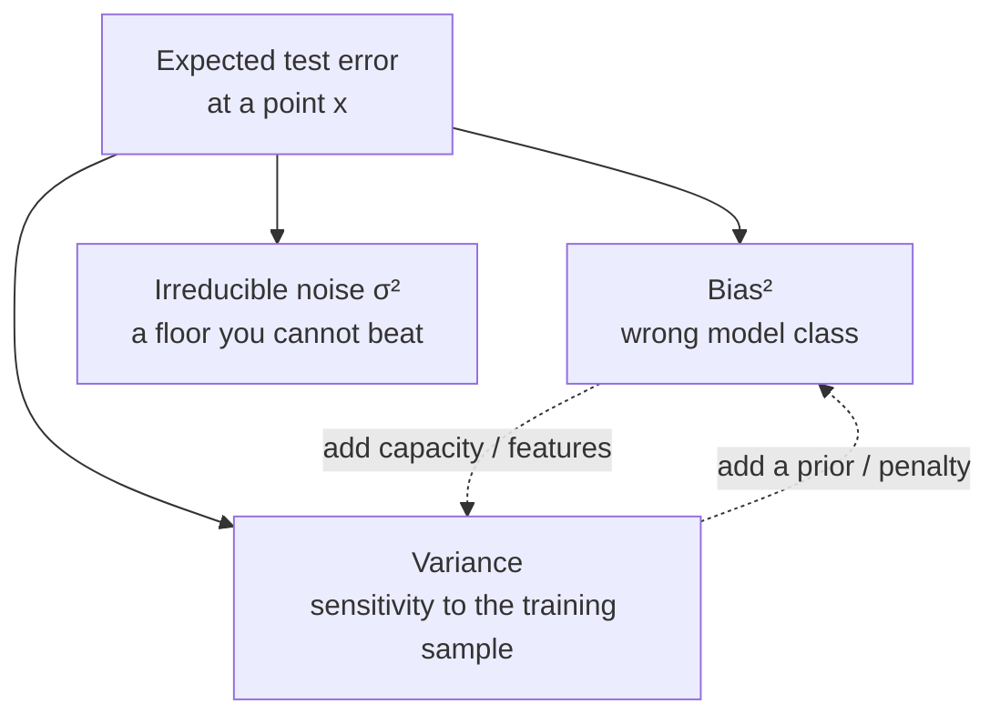

# Lesson 1 — Generalization: Bias–Variance & Regularization-as-Priors

| | |
|---|---|
| **Prepares** | The two most common openers of a breadth round: "explain the bias–variance tradeoff" and "why does regularization work?" |
| **Time** | ~10 min visible + drills; derivations open on demand |
| **Domain tag** | Generalization / Statistical Learning |

> 📍 **How this lesson works:** each 🔷 drill is a rapid-fire question. **Answer out loud first** (~30s), then open ✅ to compare. 🔁 shows the follow-up; 📚 holds the derivation. The whole point of a breadth round is the *caveat*, so read the 🔁 blocks even when your headline was right.

## 🟢 The One Picture

Test error decomposes into three parts you can name on demand — and every regularizer is a deliberate trade of one for another.



Bias and variance pull against each other; noise is fixed. Regularization deliberately *adds* a little bias to *remove* a lot of variance — and it does so by encoding a belief about the weights.

---

## 🔷 Drill 1 — "Derive the bias–variance decomposition. What are the three terms?"

*Squared-error loss, one test point. 45 seconds.*

<details><summary>✅ Model answer</summary>

For a target $y = f(x) + \varepsilon$ with $\mathbb{E}[\varepsilon]=0,\ \mathrm{Var}(\varepsilon)=\sigma^2$, and an estimator $\hat f$ trained on a random sample, the expected squared error at $x$ splits into three:

$$\mathbb{E}\big[(y - \hat f(x))^2\big] = \underbrace{(f(x) - \mathbb{E}[\hat f(x)])^2}_{\text{Bias}^2} + \underbrace{\mathbb{E}\big[(\hat f(x) - \mathbb{E}[\hat f(x)])^2\big]}_{\text{Variance}} + \underbrace{\sigma^2}_{\text{noise}}$$

**Bias** is the error from the model class being wrong on average; **variance** is how much the fit wobbles across different training samples; **<abbr title="Irreducible noise (σ²): the variance of the random noise in the data-generating process. It represents the absolute error floor that no model can beat.">noise</abbr>** is the irreducible floor. <abbr title="Underfitting: when a model lacks capacity or training time to capture the underlying structure, causing high error on both training and test data (high bias).">Underfitting</abbr> = high bias; <abbr title="Overfitting: when a model learns noise and specific details of the training data rather than the general pattern, leading to high test error (high variance).">overfitting</abbr> = high variance.
</details>

<details><summary>🔁 The follow-up chain</summary>

"Does this hold for any loss?" (No — the clean additive split is specific to squared error; for 0-1 or cross-entropy loss the analog is messier and bias/variance interact) → "So how do you *see* it in practice?" (train vs. validation gap: large gap = variance, both-high = bias — see the lab) → "Does more capacity always raise variance?" (classically yes, but **double descent** breaks the U-curve — see 📚).
</details>

<details><summary>📚 Deep-dive: the U-curve and where it breaks</summary>

Classic view: as capacity rises, bias falls and variance rises, so test error is U-shaped with a sweet spot in the middle. Modern over-parameterized networks show **<abbr title="Double descent: a phenomenon where increasing model capacity or training time past the interpolation threshold causes test error to decrease again.">double descent</abbr>** (Belkin et al. 2019, https://arxiv.org/abs/1812.11118): past the <abbr title="Interpolation threshold: the point where model capacity is just large enough to achieve zero training error on the dataset.">interpolation threshold</abbr> — where the model exactly fits the training set — test error *falls again*. The classic tradeoff still describes the under-parameterized regime; it just isn't the whole story for huge models. Saying this unprompted signals you know the frontier, not just the textbook.
</details>

---

## 🔷 Drill 2 — "Why does regularization work? Be precise."

*Not "it prevents overfitting." 30 seconds.*

<details><summary>✅ Model answer</summary>

Regularization adds a penalty (or constraint) that **shrinks the hypothesis space toward simpler solutions**, trading a small increase in bias for a large decrease in variance. Mechanistically, an <abbr title="L2 regularization (Ridge): adding the sum of squared weights to the loss function, penalizing large weights and shrinking them smoothly toward zero.">L2 penalty</abbr> $\lambda\lVert w\rVert_2^2$ shrinks every weight toward zero, so the fit reacts less to any single training point — lower variance. You accept that the constrained solution can't perfectly match the data (a little bias) in exchange for a fit that generalizes.

The sharpest framing: **a penalty on the weights is a prior belief about the weights** (Drill 3).
</details>

<details><summary>🔁 The follow-up chain</summary>

"L1 vs L2 — practical difference?" (<abbr title="L1 regularization (Lasso): adding the sum of absolute weight values to the loss, driving non-essential feature weights to exactly zero to create sparse models.">L1</abbr> drives weights *exactly* to zero → feature selection / sparsity; L2 shrinks but rarely zeroes) → "Name a regularizer with no penalty term" (<abbr title="Early stopping: halting training when validation performance starts to degrade, preventing over-optimization on the training set.">early stopping</abbr>, <abbr title="Dropout: randomly zeroing activations during training with probability p to prevent co-adaptation of features.">dropout</abbr>, <abbr title="Data augmentation: creating modified copies of existing training data (rotations, crops, flips) to artificially expand the training distribution.">data augmentation</abbr>, batch norm's noise) → "How do you pick $\lambda$?" (cross-validation on the metric you actually care about, not the training loss).
</details>

---

## 🔷 Drill 3 — "Show that L2 regularization is a Gaussian prior."

*The connective tissue between this session's topics. 60 seconds, board-style.*

$$\underbrace{\hat w_{\text{MAP}} = \arg\max_w \; \log p(D \mid w) + \log p(w)}_{\text{MAP estimate}}$$

<details><summary>✅ Model answer (the three lines)</summary>

Put a zero-mean Gaussian prior on the weights, $w \sim \mathcal{N}(0, \tau^2 I)$, so $\log p(w) = -\frac{1}{2\tau^2}\lVert w\rVert_2^2 + \text{const}$. The MAP objective is the log-likelihood plus this log-prior:

$$\hat w_{\text{MAP}} = \arg\max_w \; \log p(D\mid w) - \tfrac{1}{2\tau^2}\lVert w\rVert_2^2$$

Negate to a minimization and the second term is exactly the L2 penalty with $\lambda = \frac{1}{2\tau^2}$. **So L2 = a <abbr title="Gaussian prior: assuming weights follow a normal distribution centered at zero. In MAP estimation, this manifests as an L2 norm penalty.">Gaussian prior</abbr>**, and a *stronger* penalty (larger $\lambda$) is a *tighter* prior (smaller $\tau^2$) — more confident that weights are near zero. Likewise **L1 = a <abbr title="Laplace prior: assuming weights follow a double-exponential distribution with a sharp spike at zero. In MAP, this produces an L1 penalty and sparse weights.">Laplace prior</abbr>**, whose sharp peak at zero is what produces sparsity.
</details>

<details><summary>🔁 The follow-up chain</summary>

"So what's un-regularized <abbr title="MLE (Maximum Likelihood Estimation): finding parameters that maximize the likelihood of the observed data, assuming no prior beliefs (uniform prior).">MLE</abbr> in this language?" (a flat/improper prior — no belief about the weights, so it overfits when data is scarce) → "Does this mean regularization is always <abbr title="Bayesian estimation: treating parameters as random variables with prior distributions, updating beliefs with data via Bayes' theorem to form a posterior.">Bayesian</abbr>?" (early stopping and dropout regularize without corresponding to a clean prior, so no — but the penalty-based ones map cleanly) → "Why does a tighter prior help small data more?" (with little likelihood signal, the prior dominates; with abundant data it washes out).
</details>

---

## 🟢 Concept Check

In the bias–variance decomposition for squared error, which term can you *not* reduce by choosing a better model?

* [ ] Bias²
* [ ] Variance
* [x] The irreducible noise σ² — it's a property of the data-generating process, not the model
* [ ] All three shrink to zero with enough capacity

An L1 penalty is equivalent to which prior on the weights?

* [ ] A Gaussian prior
* [x] A Laplace prior — its sharp peak at zero pushes coefficients to exactly zero, giving sparsity
* [ ] A uniform prior
* [ ] No prior; L1 is not Bayesian

<details>
<summary>🔑 Answers</summary>

**Q1: option 3.** Noise σ² is the floor — no model can predict the random part of $y$. Bias and variance are the model's to trade.

**Q2: option 2.** L1 corresponds to a Laplace (double-exponential) prior; its non-smooth peak at zero is exactly why the MAP solution sits *at* zero for many coefficients, unlike the Gaussian (L2) prior which only shrinks.
</details>

---

## 🔷 Rapid-Fire Rehearsal

Say these out loud; the coach holds you to the *caveat*, not the headline, and keeps going until a real interviewer would move on.

```rehearsal-drill
RUBRIC: tech-term
TITLE: Generalization — Rapid Fire
INTRO: Fundamentals fired fast. Answer in one or two clean sentences, then let the coach push you to the caveat. Reveal the model answer to compare.
MIN: 20
MAX: 60
[[Bias–variance tradeoff]]
Q: Explain the bias–variance tradeoff.
A: Test error (for squared loss) splits into bias² (the model class is wrong on average), variance (the fit's sensitivity to the particular training sample), and irreducible noise σ². Simple models sit high-bias/low-variance, complex models the reverse; you tune capacity to the minimum-error point. **Caveat that scores:** the clean additive split is specific to squared error, σ² is a floor you can't beat, and for very over-parameterized models double descent breaks the classic U-curve.
[[Overfitting vs underfitting]]
Q: How do you tell overfitting from underfitting from the learning curves?
A: Underfitting = training *and* validation error both high and close (high bias — the model can't fit even the training data). Overfitting = low training error but a large validation gap (high variance — it memorized the sample). The fix differs: underfitting wants more capacity/features/less regularization; overfitting wants more data, more regularization, or less capacity.
[[Why regularization works]]
Q: Why does regularization reduce overfitting — mechanistically?
A: It shrinks the hypothesis space toward simpler solutions, trading a little bias for a large variance reduction. Concretely an L2 penalty pulls every weight toward zero so the fit reacts less to any single point. The deep version: a weight penalty *is* a prior — L2 is a Gaussian prior, L1 a Laplace prior — so regularization is encoding a belief that weights are small.
[[L1 vs L2]]
Q: L1 versus L2 regularization — what's the real difference and when do you pick which?
A: L2 (ridge, Gaussian prior) shrinks weights smoothly but rarely to exactly zero — good default, stable, handles correlated features by sharing weight. L1 (lasso, Laplace prior) drives many weights *exactly* to zero, giving feature selection and sparse, interpretable models, but is unstable among correlated features (picks one arbitrarily). Elastic net combines both. Pick L1 when you want sparsity/selection, L2 when you want stable shrinkage.
[[Regularizers without a penalty]]
R: default
Q: Name three ways to regularize that don't add a penalty term to the loss.
A: Early stopping (halt before the model overfits — implicitly limits effective capacity), dropout (randomly zeroing units injects noise and forces redundant representations, ~an ensemble average), and data augmentation (label-preserving input transforms enlarge the effective dataset). Batch norm and label smoothing also act as mild regularizers. The point: regularization is any mechanism that reduces variance, not just an L-p term.
[[Double descent]]
R: mechanism
Q: What is double descent, and why does it matter for the bias–variance story?
A: As capacity grows, test error first follows the classic U (descent, then rise to a peak at the interpolation threshold where the model just fits the training set), and then **descends again** into the over-parameterized regime. Mechanistically, past interpolation there are many zero-training-error solutions and the optimizer's implicit bias selects a low-norm, smoother one, so variance falls again. It matters because it shows the classic monotonic "more capacity → more variance" rule only holds below the interpolation threshold.
```

---

## 🟢 Summary

- **Bias–variance (squared error):** error = bias² + variance + σ². Underfit = bias, overfit = variance, noise is the floor. Double descent qualifies the U-curve for huge models.
- **Regularization = trading bias for variance**, and every penalty is a prior: **L2 = Gaussian**, **L1 = Laplace** (sparsity). Early stopping / dropout / augmentation regularize with no penalty term.
- **This connects forward:** the prior in this lesson becomes the MAP objective in Lesson 2.

**References:** Belkin et al. 2019 (double descent, arXiv:1812.11118) · Hastie, Tibshirani & Friedman, *Elements of Statistical Learning* (ch. 3, 7) · Bishop, *Pattern Recognition and ML* (§3.3 Bayesian linear regression).

**Next:** [Lesson 2 — Estimation & Optimization](02_estimation_and_optimization.md)
