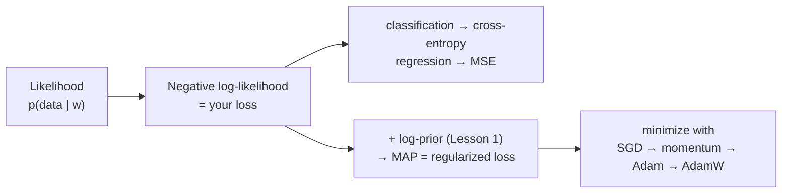
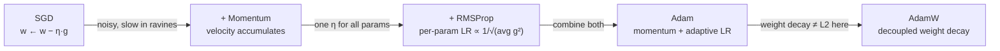

# Lesson 2 — Estimation & Optimization: MLE/MAP → SGD to AdamW

| | |
|---|---|
| **Prepares** | "What loss are you actually minimizing?" and "Why Adam? What's the difference from AdamW?" |
| **Time** | ~11 min visible + drills |
| **Domain tag** | Probabilistic ML / Optimization |

> 📍 **How this lesson works:** answer each 🔷 drill out loud first. The prize here is showing that the loss you minimize *is* a likelihood, and that "Adam" is not one undifferentiated thing.

## 🟢 The One Chain

Every supervised loss you use is a negative log-likelihood; adding the prior from Lesson 1 makes it MAP; an optimizer then walks it downhill.



---

## 🔷 Drill 1 — "What's the connection between maximum likelihood and cross-entropy?"

*They are the same thing. Say why. 40 seconds.*

<details><summary>✅ Model answer</summary>

Maximum likelihood picks parameters that maximize $p(D\mid w) = \prod_i p(y_i\mid x_i, w)$. Taking $-\log$ turns the product into a sum and maximization into minimization:

$$\hat w_{\text{MLE}} = \arg\min_w \; -\sum_i \log p(y_i\mid x_i, w)$$

For a categorical model with softmax outputs, $-\log p(y_i\mid x_i,w)$ **is exactly the cross-entropy** between the one-hot label and the predicted distribution. So minimizing cross-entropy = maximizing likelihood. For a Gaussian output model, the same NLL becomes squared error — **MSE is just MLE under Gaussian noise.**
</details>

<details><summary>🔁 The follow-up chain</summary>

"So what is MAP then?" (add the log-prior: $\hat w_{\text{MAP}} = \arg\min_w -\log p(D\mid w) - \log p(w)$ — the regularized loss from Lesson 1) → "When does MLE fail?" (small data — it overfits because a flat prior lets weights chase noise; MAP's prior stabilizes it) → "Is MLE biased?" (often, but it's *consistent* and asymptotically efficient — with enough data it converges to the truth).
</details>

<details><summary>📚 Deep-dive: why NLL is the right objective</summary>

Minimizing NLL is minimizing the KL divergence from the true conditional distribution to the model, up to a constant. It's a *proper scoring rule*: uniquely minimized when the model outputs the true probabilities — which is also why it (unlike accuracy) rewards calibrated confidence, tying back to Session 2's calibration work. Label smoothing modifies the target distribution to prevent the softmax from chasing infinite logits on one-hot targets.
</details>

---

## 🔷 Drill 2 — "Walk from vanilla SGD to Adam. What does each addition fix?"

*The optimizer genealogy. Name the problem each step solves. 60 seconds.*



<details><summary>✅ Model answer</summary>

- **SGD:** $w \leftarrow w - \eta g$. Cheap and generalizes well, but noisy and slow through ravines/plateaus.
- **+ Momentum:** accumulate a velocity $v \leftarrow \beta v + g$, step with $v$. Damps oscillation across steep directions, accelerates along consistent ones.
- **+ RMSProp / Adagrad:** scale each parameter's step by $1/\sqrt{\text{running avg of } g^2}$ — a **per-parameter adaptive learning rate**, so rare/large-gradient params get smaller steps.
- **Adam:** combines both — momentum (1st moment) *and* adaptive LR (2nd moment), with bias correction for the early steps.
- **AdamW:** fixes a subtle bug — see Drill 3.
</details>

<details><summary>🔁 The follow-up chain</summary>

"If Adam converges faster, why does anyone still use SGD?" (SGD+momentum often *generalizes better* on vision; Adam can converge to sharper minima — the gap is an active area, but the honest answer is "Adam for fast/transformer training, SGD+momentum when final generalization matters and you can tune") → "What matters more, optimizer or learning-rate schedule?" (frequently the schedule — warmup + cosine decay — and the peak LR) → "Why warmup?" (early gradients are large and Adam's second-moment estimate is noisy, so a small initial LR avoids destabilizing updates).
</details>

---

## 🔷 Drill 3 — "Adam vs. AdamW — what exactly is decoupled, and why does it matter?"

*The question that separates memorizers from users. 45 seconds.*

<details><summary>✅ Model answer</summary>

In plain Adam, people implement weight decay by adding an L2 term to the loss — so the decay gradient gets **run through Adam's per-parameter $1/\sqrt{v}$ scaling** along with everything else. That means parameters with large historical gradients get *less* effective decay: the regularization strength becomes coupled to the gradient history, which is not what you want. **AdamW decouples it** — it applies the weight decay directly to the weights as a separate shrinkage step, $w \leftarrow w - \eta\lambda w$, outside the adaptive scaling:

$$w \leftarrow w - \eta\Big(\hat m/(\sqrt{\hat v}+\epsilon) + \lambda w\Big)$$

So every parameter decays at the same rate regardless of its gradient magnitude. This reliably improves generalization for transformers, which is why AdamW is the default for LLM training (and what you used in the QLoRA project).
</details>

<details><summary>🔁 The follow-up chain</summary>

"So for AdamW, L2 penalty and weight decay are…" (no longer equivalent — that equivalence only holds for plain SGD) → "Typical hyperparameters?" ($\beta_1{=}0.9,\ \beta_2{=}0.999$ or $0.95$ for LLMs, $\epsilon{=}10^{-8}$, decoupled decay $\sim$0.01–0.1) → "Does weight decay interact with normalization layers?" (yes — you usually *exclude* biases and LayerNorm/BatchNorm gains from decay).
</details>

---

## 🟢 Concept Check

Minimizing cross-entropy for a softmax classifier is equivalent to:

* [ ] Minimizing the L2 distance between logits and labels
* [x] Maximizing the likelihood of the data under the categorical model
* [ ] Maximizing accuracy directly
* [ ] Minimizing the KL divergence from the model to a uniform distribution

The key difference between Adam and AdamW is:

* [ ] AdamW uses momentum and Adam does not
* [ ] AdamW removes the adaptive learning rate
* [x] AdamW decouples weight decay from the adaptive gradient scaling, applying it directly to the weights
* [ ] They are identical; AdamW is just a renamed implementation

<details>
<summary>🔑 Answers</summary>

**Q1: option 2.** Cross-entropy is the negative log-likelihood of the categorical model, so minimizing it maximizes the data likelihood. (It also minimizes KL from the *true* distribution to the model — not to a uniform one.)

**Q2: option 3.** Both use momentum and adaptive LR; AdamW's only change is decoupling weight decay so every parameter shrinks at the same rate.
</details>

---

## 🔷 Rapid-Fire Rehearsal

```rehearsal-drill
RUBRIC: tech-term
TITLE: Estimation & Optimization — Rapid Fire
INTRO: Answer each in one or two clean sentences; the coach pushes to the caveat. Reveal the model answer to compare.
MIN: 20
MAX: 60
[[MLE and cross-entropy]]
Q: What is the relationship between maximum likelihood and cross-entropy loss?
A: They are the same objective. MLE maximizes p(data|w); taking negative log turns it into a sum you minimize, and for a softmax/categorical model that negative log-likelihood is exactly cross-entropy. Under a Gaussian output model the same NLL is mean-squared error. **Caveat:** so choosing a loss is choosing a noise/output distribution, and cross-entropy is a proper scoring rule that rewards calibrated probabilities, not just correct argmax.
[[MLE vs MAP]]
Q: What's the difference between MLE and MAP estimation?
A: MLE maximizes the likelihood alone; MAP maximizes likelihood times a prior — equivalently, it minimizes the NLL plus a log-prior penalty. So MAP is regularized MLE: an L2 penalty is a Gaussian prior, L1 a Laplace prior. **Caveat:** with abundant data the likelihood dominates and MAP ≈ MLE; with little data the prior matters most, which is exactly when regularization saves you.
[[SGD to Adam genealogy]]
R: mechanism
Q: Walk from vanilla SGD to Adam — what problem does each addition solve?
A: SGD steps down the gradient — cheap but noisy and slow in ravines. Momentum accumulates a velocity to damp oscillation and accelerate consistent directions. RMSProp/Adagrad add a per-parameter learning rate scaled by 1/√(running average of squared gradients), so differently-scaled parameters get appropriate steps. Adam combines momentum (first moment) and adaptive LR (second moment) with bias correction. **Caveat:** Adam trains fast but SGD+momentum often generalizes better on vision, so it's task-dependent.
[[Adam vs AdamW]]
Q: Adam versus AdamW — what's decoupled and why does it matter?
A: In Adam, L2 weight decay is added to the loss so its gradient gets divided by Adam's per-parameter 1/√v scaling — parameters with large gradient history get less effective decay, coupling regularization to gradient magnitude. AdamW applies weight decay directly to the weights as a separate shrinkage step, outside the adaptive scaling, so every parameter decays equally. **Caveat:** this means L2-penalty ≠ weight-decay for adaptive optimizers (they only coincide for plain SGD); AdamW is the LLM-training default.
[[Learning rate schedule]]
R: default
Q: Why does the learning-rate schedule often matter more than the optimizer choice, and what's a standard one?
A: The peak LR sets the size of every step, and the schedule controls exploration early versus fine-tuning late, so it frequently dominates final quality. A standard recipe is linear warmup (small LR for the first few % of steps, because early gradients and Adam's variance estimate are noisy) followed by cosine decay to near zero. Too-high LR diverges or finds sharp minima; too-low wastes compute and can get stuck.
[[Vanishing/exploding gradients]]
R: mechanism
Q: What causes vanishing or exploding gradients, and how do you fix each?
A: Backprop multiplies Jacobians layer by layer; if their spectral norms are consistently <1 the product shrinks toward zero (vanishing), if >1 it blows up (exploding). Vanishing starves early layers of signal; exploding causes NaNs and loss spikes. Fixes: residual connections and normalization keep the effective product near 1, careful initialization (He/Xavier) sets the starting scale, gradient clipping caps the exploding case, and non-saturating activations (ReLU family) avoid the flat regions that zero the gradient.
```

---

## 🟢 Summary

- **Your loss is a likelihood:** cross-entropy = NLL of the categorical model = MLE; MSE = MLE under Gaussian noise. Add the prior → **MAP = regularized loss**.
- **Optimizer genealogy:** SGD → +momentum (damp oscillation) → +adaptive LR (per-param) = **Adam** → **AdamW** (decoupled weight decay). The **schedule** (warmup + cosine) often matters more than the choice.
- **AdamW's one idea:** decay the weights directly, not through the adaptive scaling — the LLM-training default and what QLoRA used.

**References:** Kingma & Ba 2015 (Adam, arXiv:1412.6980) · Loshchilov & Hutter 2019 (AdamW, arXiv:1711.05101) · Bishop, *PRML* (ch. 3–4, MLE/MAP).

**Next:** [Lesson 3 — Metrics & Validation Design](03_metrics_and_validation_design.md)
