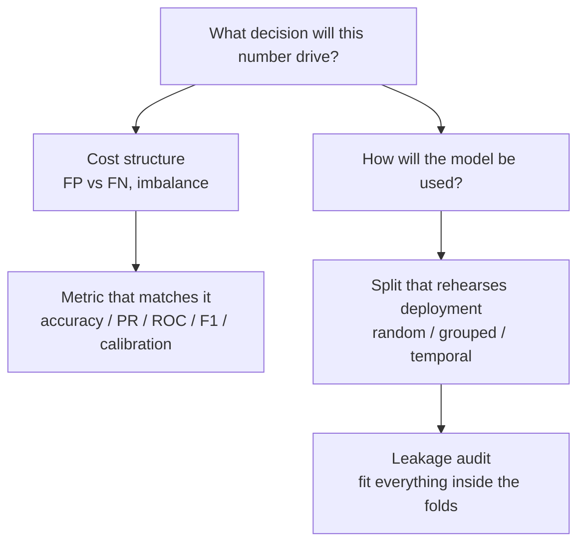
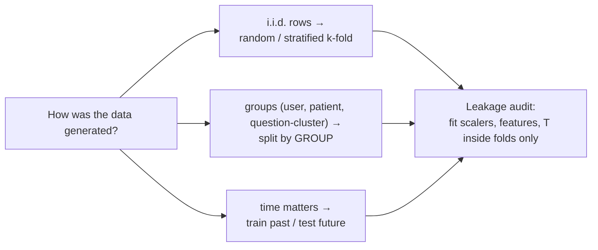

# Lesson 3 — Metrics & Validation Design

| | |
|---|---|
| **Prepares** | "Which metric would you use here, and why?" and "How would you split this data?" — the breadth round's judgment questions |
| **Time** | ~11 min visible + drills |
| **Domain tag** | Evaluation / Experimental Design |

> 📍 **How this lesson works:** these questions have no formula to recite — they test *judgment*. The winning shape is always: name the cost structure or leakage risk first, then the metric or split that matches it. You already own two case studies (macro-F1 on ESCI, ECE under shift); use them as evidence.

## 🟢 The One Picture



Metric choice and split design answer the same question from two sides: *what does honest measurement look like for this deployment?*

---

## 🔷 Drill 1 — "Accuracy, precision, recall, F1 — when is each the wrong choice?"

*Not definitions — failure modes. 45 seconds.*

<details><summary>✅ Model answer</summary>

- **Accuracy** fails under imbalance: a 99%-negative dataset gives a do-nothing classifier 99% accuracy. It also silently assumes FP and FN cost the same.
- **<abbr title="Precision: the fraction of positive predictions that are truly positive (TP / (TP + FP)). Measures freedom from false alarms.">Precision</abbr>** (of predicted positives, how many are right) ignores what you missed — a model that predicts one confident positive can have precision 1.0 and be useless.
- **<abbr title="Recall (Sensitivity / True Positive Rate): the fraction of actual positive instances correctly caught by the model (TP / (TP + FN)).">Recall</abbr>** (of true positives, how many you caught) ignores false alarms — predict everything positive and recall is 1.0.
- **<abbr title="F1 score: the harmonic mean of precision and recall, balancing false positives and false negatives at a specific decision threshold.">F1</abbr>** balances the two, but it's the harmonic mean at *one threshold*, it ignores true negatives, and plain F1 weights precision and recall equally, which is itself a cost assumption ($F_\beta$ exists precisely to reweight).

The pattern for answering: **state who pays for FP vs. FN, then pick.** Fraud/medical screening → recall-heavy; spam-to-inbox or alert fatigue → precision-heavy.
</details>

<details><summary>🔁 The follow-up chain</summary>

"Your ESCI project used macro-F1 — defend that" (four imbalanced classes; accuracy and micro-F1 are dominated by Exact, macro averages per-class F1 so a collapsed minority class is visible — my number: `[FILL: macro-F1]`) → "What does macro-F1 hide?" (it doesn't tell you *which* class collapsed — always bring the per-class breakdown) → "Weighted F1?" (weights per-class F1 by support — a middle ground that partially re-hides the minority classes).
</details>

---

## 🔷 Drill 2 — "ROC-AUC vs PR-AUC — which do you trust under heavy imbalance, and why?"

*The classic trap question. 45 seconds.*

<details><summary>✅ Model answer</summary>

**<abbr title="PR-AUC (Precision-Recall Area Under Curve): integrates precision across all recall thresholds. Superior to ROC-AUC for heavily imbalanced datasets.">PR-AUC</abbr>.** <abbr title="ROC-AUC (Receiver Operating Characteristic Area Under Curve): plots True Positive Rate vs False Positive Rate across thresholds. Measures general ranking quality.">ROC</abbr> plots <abbr title="TPR (True Positive Rate): equivalent to recall, TP / (TP + FN).">TPR</abbr> vs. <abbr title="FPR (False Positive Rate): the fraction of negative instances incorrectly classified as positive (FP / (FP + TN)).">FPR</abbr>; with a huge negative class, the false-positive *rate* stays tiny even when false positives outnumber true positives many times over, so the ROC curve looks excellent while the model is practically useless. Precision, by contrast, is computed *among predicted positives*, so it directly feels the flood of false alarms. Under heavy imbalance the PR curve tells you what a user of the alerts experiences; ROC tells you the ranking quality over the whole population.

One-line mechanism: **FPR divides by all negatives (huge denominator); precision divides by predicted positives (small denominator).**
</details>

<details><summary>🔁 The follow-up chain</summary>

"What does AUC actually measure?" (ROC-AUC = probability a random positive is ranked above a random negative — a pure ranking statistic, threshold-free) → "Is a ranking metric enough to ship?" (no — deployment needs a threshold, chosen on validation data for the operating point the product needs; and if you act on the *probabilities* you also need calibration, which is Session 2's ECE story) → "Baseline of PR-AUC?" (the positive rate — a random classifier's precision equals prevalence, so quote PR-AUC relative to it).
</details>

---

## 🔷 Drill 3 — "Design the validation split. What can go wrong?"

*The highest-signal question in the set — it's about leakage. 60 seconds.*



<details><summary>✅ Model answer</summary>

Match the split to how the model will meet new data:

- **i.i.d. rows** → random (stratified, if classes are imbalanced) k-fold.
- **Grouped data** — multiple rows per user/patient/question — → split by **group**, or the model memorizes the entity and the score is fiction. My QQP case: duplicate pairs are transitive (A≈B, B≈C ⟹ A≈C), so a random pair-split leaks clusters across train/test; you must split by question cluster.
- **Temporal data** → train on the past, test on the future; random splits let the model peek ahead.

Then the leakage audit: **anything fitted must be fitted inside the training folds only** — normalization statistics, feature selection, vocabulary, imputation, even the calibration temperature. Fitting on the full set then <abbr title="Cross-validation: splitting data into k folds to iteratively train and validate, preventing evaluation on training data.">cross-validating</abbr> gives optimistic-but-wrong numbers.
</details>

<details><summary>🔁 The follow-up chain</summary>

"When is k-fold the wrong tool entirely?" (large deep-learning runs — too expensive, use a fixed held-out split; and any temporal setting) → "What's the test set for, then?" (touched once, at the end, for the final honest number — every peek turns it into a validation set) → "How would you detect <abbr title="Data leakage: when information from outside the training dataset (e.g. test set, future time, or target proxies) corrupts the model during training.">leakage</abbr> after the fact?" (suspiciously high scores, feature importance dominated by an ID-like or future-derived feature, and a deployment drop far exceeding the validation gap).
</details>

<details><summary>📚 Deep-dive: your two projects as validation case studies</summary>

You own two live examples — use them unprompted:
1. **QQP transitivity leakage** (Session 1): random pair-splits leak duplicate clusters; the honest split groups by question cluster. This is *grouped* leakage.
2. **Calibration under shift** (Session 2): temperature fitted on clean validation data stops being valid under corruption — a *distribution* mismatch between validation and deployment. The split rehearsed the wrong deployment.

Quoting your own projects turns an abstract answer into evidence you've been burned and learned.
</details>

---

## 🟢 Concept Check

A disease affects 1 in 1,000 people. A screening model's ROC-AUC is 0.98, but users complain almost every alert is wrong. What happened?

* [ ] The model is miscalibrated
* [x] Heavy imbalance: FPR can stay tiny while false positives still swamp the rare true positives — precision collapses even with high ROC-AUC. PR-AUC would have shown it.
* [ ] The test set was too small
* [ ] ROC-AUC was computed on the training set

You standardize features using the full dataset's mean/std, then run 5-fold cross-validation. The scores are:

* [ ] Unbiased, because standardization doesn't use labels
* [x] Optimistically biased — the scaler saw the validation folds' distribution, a leak; it must be fit inside each training fold
* [ ] Pessimistically biased
* [ ] Unchanged, because standardization is linear

<details>
<summary>🔑 Answers</summary>

**Q1: option 2.** With 999:1 negatives, even FPR = 0.02 produces ~20 false alarms per true positive — precision ≈ 5% while ROC looks superb. The metric didn't match the cost structure.

**Q2: option 2.** Statistics fitted on all rows carry information about the held-out folds into training — a classic pipeline leak. Even "unsupervised" steps must live inside the fold. (That it doesn't use labels makes it subtler, not safe.)
</details>

---

## 🔷 Rapid-Fire Rehearsal

```rehearsal-drill
RUBRIC: tech-term
TITLE: Metrics & Validation — Rapid Fire
INTRO: Judgment questions — name the cost structure or leakage risk first, then the metric or split. The coach pushes until an interviewer would move on.
MIN: 20
MAX: 60
[[Precision vs recall]]
Q: Precision versus recall — define both and tell me when you'd optimize for each.
A: Precision = of everything I flagged positive, how much was right (penalizes false alarms). Recall = of everything truly positive, how much I caught (penalizes misses). Optimize recall when missing a positive is expensive — disease screening, fraud triage — and precision when false alarms are expensive — spam filtering, paging an on-call human. **Caveat:** the choice is a statement about asymmetric costs; say the costs out loud before naming the metric, and remember the threshold is what moves you along the tradeoff.
[[ROC-AUC vs PR-AUC]]
R: mechanism
Q: Why does ROC-AUC look fine under heavy class imbalance while PR-AUC collapses?
A: Because of the denominators. FPR divides false positives by ALL negatives — a huge number under imbalance — so even a flood of false alarms barely moves the ROC curve. Precision divides by predicted positives — a small number — so the same flood crushes it. Mechanism in one line: ROC normalizes by the majority class, PR normalizes by your own predictions, so PR reflects what an alert consumer experiences when positives are rare.
[[Macro vs micro F1]]
Q: Macro-F1 versus micro-F1 — what's the difference, and why did you choose macro for ESCI?
A: Micro-F1 pools all decisions, so frequent classes dominate — under imbalance it tracks accuracy. Macro-F1 computes F1 per class and averages unweighted, so every class counts equally and a collapsed minority class drags the score visibly. ESCI is dominated by Exact, and the rare classes are the interesting ones, so macro-F1 was the honest choice; my value was [FILL]. **Caveat:** macro hides WHICH class failed — always carry the per-class table too.
[[Cross-validation]]
Q: What is k-fold cross-validation actually for, and when is it the wrong tool?
A: Partition the data into k folds; train on k−1, validate on the held-out fold, rotate, and average — giving a lower-variance estimate of generalization than one split, at k× the cost. Wrong tool when: data is temporal (must split past→future), data is grouped (split by group instead or you leak entities), or training is too expensive (deep learning uses one fixed split). **Caveat:** the test set stays outside the whole loop, touched once at the end.
[[Data leakage]]
R: mechanism
Q: What is data leakage, and give me the mechanisms by which it sneaks into a well-intentioned pipeline.
A: Leakage is any information from outside the training fold influencing training, inflating validation scores that then collapse in deployment. Mechanisms: preprocessing fitted on the full set (scalers, feature selection, vocabulary); grouped rows split randomly so the same user/question-cluster appears in train and test (my QQP transitivity case); temporal peeking (features computed with future information); and target leakage (a feature that is a proxy for the label, available only after the outcome). Audit rule: everything fitted, fitted inside the fold; every split, rehearsing deployment.
[[Choosing a metric]]
Q: A stakeholder asks "is the model good?" — walk me through how you choose the metric to answer that.
A: Start from the decision the number drives: what action, and who pays for each error type? Then match: balanced costs and classes → accuracy is fine; rare positives with costly misses → recall/PR-AUC at a chosen operating point; ranking products → AUC or NDCG; acting on probabilities → add calibration (ECE), which accuracy can't see. Then report the metric AT the deployment operating point with a baseline for context — never a single context-free number. My projects: macro-F1 for imbalanced ESCI, ECE for trust-under-shift.
```

---

## 🟢 Summary

- **Metric = cost structure.** Say who pays for FP vs. FN, then pick. Imbalance breaks accuracy; ROC's FPR denominator hides false-alarm floods that PR exposes; macro-F1 makes minority collapse visible (your ESCI case).
- **Split = deployment rehearsal.** i.i.d. → stratified k-fold; grouped → split by group (your QQP case); temporal → past/future. Fit *everything* inside the folds; the test set is touched once.
- **Ranking vs. probabilities:** AUC measures ranking; if you act on probabilities you also need calibration — your Session 2 story.

**References:** Davis & Goadrich 2006 (PR vs ROC, ICML) · Saito & Rehmsmeier 2015 (PR curves on imbalanced data, PLOS ONE) · Kaufman et al. 2012 (leakage taxonomy, TKDD).

**Next:** [Rapid-Fire Rehearsal & Mock Breadth Round](04_rapid_fire_and_mock_round.md)
