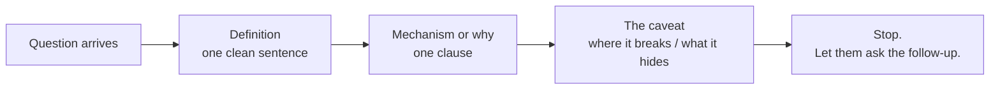

# Lesson 4 — Rapid-Fire Rehearsal & Mock Breadth Round

| | |
|---|---|
| **Prepares** | The real thing: a 30-minute ML-breadth round where questions arrive fast and you have ~30 seconds each |
| **Prerequisites** | Lessons 1–3 worked through, including their rapid-fire drills |
| **Time** | ~45 min (mock round + honest self-assessment) |

> 📍 **The shift in this lesson.** Lessons 1–3 let you think between questions. A real breadth round doesn't. Here the interviewer reads a question aloud, you answer immediately, and only afterwards do you see how you did. That gap — between "I know this" and "I said it cleanly under time pressure" — is the entire point of this session.

---

## 🟢 Before You Start

1. Work through all three rapid-fire drills in Lessons 1–3 at least once. This round assumes you've already heard the questions coached.
2. Have your project numbers to hand (`[FILL: macro-F1]`, `[FILL: ECE]`) — the interviewer will ask you to ground an abstract answer in your own work.
3. Speak **out loud**. Reading silently defeats the exercise; the failure mode this round exposes is verbal, not conceptual.

---

## 🟢 The Bar for This Round

A breadth answer that passes has three properties, in order:

| Property | What it sounds like | What fails |
|---|---|---|
| **Correct** | The definition is actually right | Approximately-right hand-waving |
| **Compressed** | One or two sentences, ~30 seconds | A three-minute lecture that buries the answer |
| **Caveated** | One clause showing you know its limits | The headline with nothing behind it |

**Stopping is a skill.** In a breadth round, over-talking costs you questions and signals poor calibration about what matters. Answer, then stop.

---

## 🟢 The Mock Round

Twelve questions across all three lessons, delivered in sequence. The interviewer reads each aloud; you answer, then move to the next. At the end you get a consolidated evaluation of the whole round.

<RehearsalStudio rubric="tech-term" minSeconds="20" maxSeconds="60" prompt="Answer each question in one or two clean sentences — definition, mechanism, caveat — then stop." questions="Explain the bias-variance tradeoff. || Why does regularization reduce overfitting? Be mechanistic, not just 'it prevents overfitting'. || What's the difference between L1 and L2 regularization, and when would you choose each? || Show me that L2 regularization is equivalent to a Gaussian prior on the weights. || What's the relationship between maximum likelihood estimation and cross-entropy loss? || What's the difference between MLE and MAP estimation? || Walk me from vanilla SGD to Adam. What problem does each addition solve? || Adam versus AdamW — what exactly is decoupled, and why does it matter? || Why does the learning-rate schedule often matter more than the optimizer choice? || Precision versus recall — when would you optimize for each? || Why can ROC-AUC look excellent under heavy class imbalance while the model is practically useless? || What is data leakage, and give me two mechanisms by which it enters a well-intentioned pipeline." />

> [!TIP]
> If a question stalls you, that is the round working. Note it, finish the sequence anyway — a real interviewer keeps going — then return to that lesson's drill and re-rehearse just that item.

---

## 🟢 Honest Self-Assessment

Score yourself on each fundamental. The bar is not "I recognized the topic" — it is **"I said something correct, compressed, and caveated, out loud, within about 30 seconds."**

| # | Fundamental | Lesson | Can you answer it cold? |
|---|---|---|---|
| 1 | Bias–variance decomposition (three terms) | 1 | ☐ Clean ☐ Shaky ☐ No |
| 2 | Overfitting vs. underfitting from learning curves | 1 | ☐ Clean ☐ Shaky ☐ No |
| 3 | Why regularization works (mechanistically) | 1 | ☐ Clean ☐ Shaky ☐ No |
| 4 | L1 vs. L2 — difference and when to pick | 1 | ☐ Clean ☐ Shaky ☐ No |
| 5 | L2 = Gaussian prior (the derivation) | 1 | ☐ Clean ☐ Shaky ☐ No |
| 6 | MLE ⇄ cross-entropy | 2 | ☐ Clean ☐ Shaky ☐ No |
| 7 | MLE vs. MAP | 2 | ☐ Clean ☐ Shaky ☐ No |
| 8 | SGD → momentum → adaptive → Adam | 2 | ☐ Clean ☐ Shaky ☐ No |
| 9 | Adam vs. AdamW (decoupled decay) | 2 | ☐ Clean ☐ Shaky ☐ No |
| 10 | Precision vs. recall (cost structure) | 3 | ☐ Clean ☐ Shaky ☐ No |
| 11 | ROC-AUC vs. PR-AUC under imbalance | 3 | ☐ Clean ☐ Shaky ☐ No |
| 12 | Data leakage — mechanisms and the audit rule | 3 | ☐ Clean ☐ Shaky ☐ No |

**How to read your result**

| Clean count | What it means | Next step |
|---|---|---|
| **10–12** | Breadth-round ready on core theory | Move to Session 4; revisit any single ☐ Shaky before the loop |
| **6–9** | The concepts are there; the *delivery* isn't | Re-run the mock round twice more — this is a rehearsal problem, not a knowledge problem |
| **≤ 5** | Genuine gaps in fundamentals | Re-read the lesson for each gap, run its drill, then re-attempt this round |

---

## 🟢 The Chain Question

Breadth interviewers often finish by walking the whole chain in one question. Rehearse this one separately — it's the highest-value single answer in this session.

<RehearsalStudio rubric="mechanism" minSeconds="60" maxSeconds="120" prompt="Answer out loud, ~90 seconds: 'Walk me from model capacity to a number I can trust. How do bias-variance, regularization, likelihood, the optimizer, and validation design connect?' Give the causal chain, not five separate definitions." />

✅ Model answer — the chain

"A model generalizes when its **capacity** is matched to the data. Too little and it's biased; too much and it's high-variance — that's the <abbr title="Bias-variance decomposition: splitting expected test error into squared bias, variance, and irreducible noise.">bias–variance decomposition</abbr>, plus an irreducible noise floor.

**Regularization** is how I control that capacity without changing architecture: an L2 penalty shrinks weights toward zero, buying a large variance reduction for a little bias. And that penalty isn't arbitrary — it *is* a prior. L2 is a <abbr title="Gaussian prior: assuming weights follow a zero-mean normal distribution, producing L2 weight decay under MAP.">Gaussian prior</abbr> on the weights, L1 a <abbr title="Laplace prior: assuming weights follow a double-exponential distribution with a zero peak, producing L1 sparsity under MAP.">Laplace prior</abbr>.

That connects directly to **estimation**: minimizing cross-entropy is maximizing likelihood, and adding the log-prior turns <abbr title="MLE (Maximum Likelihood Estimation): optimizing data likelihood under a uniform prior assumption.">MLE</abbr> into <abbr title="MAP (Maximum A Posteriori): optimizing data likelihood weighted by a prior distribution on parameters.">MAP</abbr>. So 'regularized loss' and 'MAP estimate' are the same object seen from two directions.

Then the **optimizer** — SGD plus momentum, or AdamW — is just the machinery that walks that penalized objective downhill; the learning-rate schedule usually matters more than the choice itself.

Finally none of it means anything without honest **measurement**: a metric matched to the cost structure, and a split that rehearses deployment — grouped or temporal where needed, with everything fitted inside the folds. If the validation design leaks, every number upstream is fiction."

---

## 🟢 Summary

- A breadth answer is **correct → compressed → caveated → stop**. Over-talking is a failure mode, not thoroughness.
- The twelve fundamentals in this session are one chain: **capacity → prior → penalized likelihood → optimizer → honest measurement**.
- Failing a question in rehearsal costs nothing; failing it in the loop costs the offer. Re-run the mock round until the delivery is automatic.

**Session complete.** Next: [Session 4 — Deep Learning & Transformers](../04_deep_learning_transformers/00_locked.md) *(locked)*.
