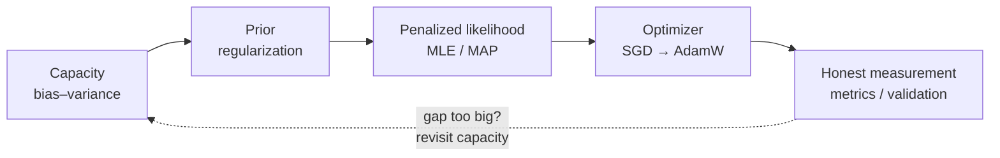

# Session 3 — ML Fundamentals: Core Theory

| | |
|---|---|
| **What it prepares** | The ML-breadth round's rapid-fire fundamentals — the questions that come fast and expect a crisp, correct, one-breath answer |
| **Prerequisites** | Sessions 1–2 (you'll reuse contrastive loss, calibration, ECE); comfort reading basic linear algebra and probability notation |
| **Session length** | 3 lessons + a rapid-fire rehearsal and mock round, ~3–4 hours |
| **Format** | Lean drill cards: answer out loud first, then open the model answer. Every derivation and citation sits in a collapsed block. |

---

## 🟢 What This Round Actually Tests

Sessions 1–2 defended things you *built* and *measured* — deep, narrow, five-follow-ups-per-topic. The ML-breadth round is the opposite shape: **wide and shallow-but-exact**. The interviewer fires a fundamental, you have ~30 seconds, and the bar is a clean definition plus the one caveat that shows you understand it rather than memorized it.

The trap is that these feel easy, so candidates get lazy and answer approximately. "Regularization prevents overfitting" is not an answer — it's a headline. The version that passes is "L2 regularization is a zero-mean Gaussian prior on the weights; it shrinks them toward zero, trading a little bias for a large variance reduction." Same length, completely different signal.

This session drills the five fundamentals most likely to open that round, each to the depth of *the caveat*, not just the headline.

---

## 🟢 Scope Brief: The Five Fundamentals

| Fundamental | The headline everyone knows | The caveat that actually scores |
|---|---|---|
| **Bias–variance** | "Simple models underfit, complex overfit" | The decomposition is exact for squared error; irreducible noise is a floor; double descent breaks the classic U-curve |
| **Regularization** | "It prevents overfitting" | Each penalty *is* a prior — L2 = Gaussian (MAP), L1 = Laplace (sparsity); early stopping and dropout regularize without a penalty term |
| **Estimation (MLE/MAP)** | "MLE fits the data" | Cross-entropy *is* negative log-likelihood; MAP = MLE + log-prior; MLE overfits with little data, which is exactly why priors help |
| **Optimization (SGD→AdamW)** | "Adam is the default" | Momentum vs. adaptive LR are different fixes; Adam ≠ AdamW (decoupled weight decay); the LR schedule often matters more than the optimizer |
| **Metrics & validation** | "Use accuracy / cross-validation" | Metric must match the cost structure (PR vs. ROC under imbalance); the real skill is a *leak-free* split, not the k in k-fold |

> 📍 **The connective tissue.** These are not five separate topics — they are one story. A model generalizes when its **capacity** (bias–variance) is controlled by a **prior** (regularization), fit by **maximizing a penalized likelihood** (MLE/MAP) using an **optimizer** (SGD→AdamW), and honestly **measured** (metrics/validation). Interviewers love to walk that chain; this session teaches it as a chain.

---

## 🟢 Session Structure

1. [Lesson 1 — Generalization: Bias–Variance & Regularization-as-Priors](01_generalization_bias_variance_regularization.md)
2. [Lesson 2 — Estimation & Optimization: MLE/MAP → SGD to AdamW](02_estimation_and_optimization.md)
3. [Lesson 3 — Metrics & Validation Design](03_metrics_and_validation_design.md)
4. [Rapid-Fire Rehearsal & Mock Breadth Round](04_rapid_fire_and_mock_round.md)

🔬 **Interactive companion** (CPU-only, runs instantly): [▶ Open the Core Theory Lab in Colab](https://colab.research.google.com/github/vinod-seth/Applied-Scientist-Interview-Gauntlet/blob/main/tutorial/03_core_theory/core_theory_lab.ipynb) — watch bias and variance trade off on a real fit, see L2/L1 shrinkage, and compare SGD vs. AdamW trajectories.

> [!NOTE]
> This session uses the **simplified format** — drills, model answers, iterative rehearsal, and an honest self-assessment. There is no XP or boss-fight gate here; the goal is that you can answer each fundamental cleanly and out loud, then walk the chain that connects them.
