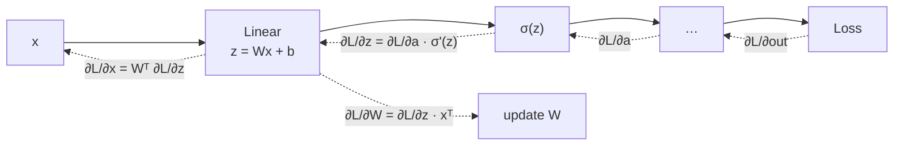

# Lesson 1 — Backpropagation & Gradient Flow

| | |
|---|---|
| **Prepares** | "Derive backprop for this layer" and "why do deep networks stop training?" — the two questions that open most DL rounds |
| **Time** | ~11 min visible + drills |
| **Domain tag** | Deep Learning / Optimization |

> 📍 **How this lesson works:** each 🔷 drill is a question you answer out loud first (~45s), then open ✅ to compare. 🔁 shows how the interviewer pushes; 📚 holds the full derivation. The bar in this lesson is **derivation, not description** — "chain rule" is the start of an answer, not an answer.

## 🟢 The One Picture

Backprop is one idea applied repeatedly: every node receives the gradient of the loss with respect to its *output*, and passes on the gradient with respect to its *input*.



Two consequences drive everything else in this session: the backward pass **needs the forward activations** (so you must store them, which is where memory goes), and the gradient reaching layer *k* is a **product** of every Jacobian above it (which is where training dies).

---

## 🔷 Drill 1 — "Derive backprop for a single linear layer followed by an activation."

*Board question. Shapes matter. 60 seconds.*

<details><summary>✅ Model answer</summary>

Forward: $z = Wx + b$, $a = \sigma(z)$. Given the incoming gradient $\delta_a = \partial L/\partial a$ from above:

$$\delta_z = \frac{\partial L}{\partial z} = \delta_a \odot \sigma'(z)$$

$$\frac{\partial L}{\partial W} = \delta_z\, x^\top, \qquad \frac{\partial L}{\partial b} = \delta_z, \qquad \frac{\partial L}{\partial x} = W^\top \delta_z$$

Three things to say without prompting: the **elementwise product** with $\sigma'(z)$ (the activation is applied per-unit, so its Jacobian is diagonal); $\partial L/\partial W$ is an **outer product**, which is why it has the same shape as $W$; and $W^\top$ appears in the input gradient — the same weights carry signal forward and gradient backward.

For a batch, sum over examples: $\partial L/\partial W = \sum_i \delta_z^{(i)} (x^{(i)})^\top$, which is why the gradient is a matmul, not a loop.
</details>

<details><summary>🔁 The follow-up chain</summary>

"Why do you need $x$ during the backward pass?" (because $\partial L/\partial W$ contains it — so the forward activations must be *stored*, and that storage is the activation memory in your Session 1 memory budget) → "What does gradient checkpointing trade?" (stores only a subset of activations and recomputes the rest during backward: ~√n memory for one extra forward pass) → "What's the cost of the backward pass relative to forward?" (roughly 2× the forward FLOPs — one matmul for the input gradient, one for the weight gradient).
</details>

---

## 🔷 Drill 2 — "Why do gradients vanish or explode in deep networks? Give the mechanism."

*Not "because the network is deep." 45 seconds.*

<details><summary>✅ Model answer</summary>

The gradient at layer $k$ is a **product of Jacobians** from the loss down to that layer:

$$\frac{\partial L}{\partial h_k} = \frac{\partial L}{\partial h_n} \prod_{i=k+1}^{n} \frac{\partial h_i}{\partial h_{i-1}}$$

A product of $n-k$ terms is an exponential in depth. If those Jacobians have typical singular values below 1, the product decays geometrically — gradients **vanish**, and early layers stop learning. Above 1, it grows geometrically — gradients **explode**, and you get NaNs or wild parameter jumps.

Two classic contributors: **saturating activations** (sigmoid's derivative peaks at 0.25, so ten layers of it multiplies by ≤ 4×10⁻⁷ at best), and **poorly scaled initialization**, which sets the typical Jacobian magnitude at step zero.
</details>

<details><summary>🔁 The follow-up chain</summary>

"So how do modern networks train at 100+ layers?" (residual connections make the Jacobian $I + \partial F/\partial h$ — an identity path means the product doesn't decay; plus normalization keeps per-layer scale controlled, and non-saturating activations like ReLU/GELU) → "Which of the two is easier to fix?" (exploding — gradient clipping is a one-line, reliable fix; vanishing is architectural) → "Does clipping fix vanishing?" (no — clipping only bounds magnitude from above).
</details>

<details><summary>📚 Deep-dive: initialization as variance control</summary>

Initialization exists to keep the *variance* of activations and gradients roughly constant across depth. For a layer with $n_{in}$ inputs, **Xavier/Glorot** sets $\mathrm{Var}(W) = 2/(n_{in}+n_{out})$ — derived for symmetric activations like tanh. **He/Kaiming** sets $\mathrm{Var}(W) = 2/n_{in}$, the factor 2 compensating for ReLU zeroing half its inputs and thus halving the variance.

Get this wrong and you start in the vanishing or exploding regime before the first update — which is why "my deep net won't train" is often an initialization bug, not an optimizer one. Transformers additionally scale residual-branch initialization by depth for the same reason.
</details>

---

## 🔷 Drill 3 — "Walk the gradient through a residual block. Why does the skip connection help?"

*The single highest-value mechanism in modern DL. 45 seconds.*

<details><summary>✅ Model answer</summary>

For $h_{out} = h + F(h)$, differentiate:

$$\frac{\partial h_{out}}{\partial h} = I + \frac{\partial F}{\partial h}$$

The **identity term is the point.** The gradient reaching earlier layers is now a product of terms each of the form $(I + J_i)$, which expands to the identity path plus correction terms — so there is always a route by which gradient arrives **undiminished**, no matter the depth. Vanishing requires every path to decay; the skip guarantees one that doesn't.

The complementary framing: the block only has to learn a *residual* correction to the identity, so a layer that has nothing useful to add can output ≈0 and harmlessly pass the signal through. Making "do nothing" easy to represent is what lets depth be safe.
</details>

<details><summary>🔁 The follow-up chain</summary>

"Where does the norm go — before or after the residual add?" (Pre-LN, inside the branch, keeps the residual stream a clean sum — see Session 1's derivation; Post-LN puts a norm on the gradient path at every layer and needs warmup) → "Can the residual stream explode?" (yes — magnitude grows across depth since each block *adds* to it; the final norm absorbs it, and this is Pre-LN's known cost) → "Do residuals ever hurt?" (they cost memory: the skip tensor must be kept live for the backward pass).
</details>

---

## 🟢 Concept Check

During the backward pass you compute $\partial L/\partial W = \delta_z x^\top$. What does this imply about training memory?

* [ ] Nothing — gradients are computed from the loss alone
* [x] The forward activations $x$ must be stored until the backward pass reaches that layer, which is why activation memory scales with depth × batch × sequence length
* [ ] Only the weights need storing
* [ ] It implies the backward pass is cheaper than the forward pass

A network uses sigmoid activations and 30 layers, and its early layers barely change during training. What is the most likely mechanism?

* [ ] The learning rate is too high
* [x] Vanishing gradients — sigmoid's derivative is ≤ 0.25, so the product of 30 Jacobians decays geometrically toward zero
* [ ] The batch size is too small
* [ ] The loss function is wrong

<details>
<summary>🔑 Answers</summary>

**Q1: option 2.** The weight gradient contains the layer's *input*, so every activation on the forward path must be retained. That is exactly the activation-memory term in Session 1's 16GB budget, and exactly what gradient checkpointing trades away for recomputation.

**Q2: option 2.** Symptom (early layers frozen, later layers learning) plus mechanism (saturating derivative compounded over depth) is the complete answer. A too-high learning rate produces the *opposite* signature — instability and loss spikes, not frozen early layers.
</details>

---

## 🔷 Rapid-Fire Rehearsal

```rehearsal-drill
RUBRIC: mechanism
TITLE: Backpropagation — Rapid Fire
INTRO: Derivation questions. Give the mechanism and the shapes, not a description — then stop. The coach pushes until an interviewer would move on.
MIN: 30
MAX: 75
[[Backprop through a linear layer]]
Q: Derive the gradients for a linear layer followed by an activation. Include shapes.
A: Forward z = Wx + b, a = σ(z). Backward, given δ_a from above: **δ_z = δ_a ⊙ σ'(z)** (elementwise, because the activation's Jacobian is diagonal), then **∂L/∂W = δ_z xᵀ** (an outer product, so it matches W's shape), **∂L/∂b = δ_z**, and **∂L/∂x = Wᵀ δ_z** — the same weights carry signal forward and gradient backward. Batched, the weight gradient sums over examples, which makes it a matmul rather than a loop. **Say unprompted:** the presence of x in ∂L/∂W is exactly why forward activations must be stored for the backward pass.
[[Vanishing and exploding gradients]]
Q: Why do gradients vanish or explode, mechanistically?
A: The gradient at layer k is a **product of Jacobians** from the loss down to k, so it is exponential in depth. Typical singular values below 1 make it decay geometrically (vanish, early layers freeze); above 1 make it grow geometrically (explode, NaNs). Contributors: saturating activations — sigmoid's derivative maxes at 0.25 — and bad initialization setting the wrong scale at step zero. **Fixes differ:** exploding is cheap to fix with gradient clipping; vanishing is architectural — residuals, normalization, non-saturating activations.
[[Why residual connections work]]
Q: Why does a skip connection fix deep-network training? Give the derivative.
A: For h_out = h + F(h), ∂h_out/∂h = **I + ∂F/∂h**. The identity term guarantees a path by which gradient reaches earlier layers undiminished regardless of depth — vanishing would require every path to decay, and the skip provides one that cannot. Equivalent framing: the block only learns a correction to identity, so a useless layer can output ≈0 and pass signal through unharmed. Making "do nothing" easy to represent is what makes depth safe.
[[Initialization]]
Q: Why does initialization scheme matter, and what's the difference between Xavier and He?
A: Initialization sets the variance of activations and gradients at step zero; get it wrong and you begin in the vanishing or exploding regime before any update. **Xavier/Glorot** uses Var(W) = 2/(n_in + n_out), derived for symmetric activations like tanh. **He/Kaiming** uses Var(W) = 2/n_in — the extra factor of 2 compensates for ReLU zeroing half its inputs and so halving the variance. Rule of thumb: He with ReLU-family activations, Xavier with tanh/sigmoid.
[[Gradient checkpointing]]
Q: What does gradient checkpointing actually store, and what does it cost?
A: Instead of keeping every forward activation for the backward pass, it stores activations only at selected checkpoints and **recomputes** the intermediate ones during backward. The trade is roughly O(√n) activation memory instead of O(n), paid for with about one extra forward pass (~30% more compute). You reach for it when activation memory — not parameters — is what pins your batch size, which is the common case for long sequences.
[[Backward pass cost]]
Q: How expensive is the backward pass relative to the forward pass, and why?
A: Roughly **2× the forward FLOPs**, so a training step is about 3× a forward pass. The reason is that each linear layer needs two matmuls on the way back — one for the input gradient (Wᵀδ) to keep propagating, and one for the weight gradient (δxᵀ) to update parameters — where the forward needed only one. **Caveat:** that is FLOPs; wall-clock also depends on memory bandwidth, which is why the arithmetic-intensity argument behind FlashAttention matters (Lesson 3).
```

---

## 🟢 Summary

- **Backprop** = repeated chain rule on a computational graph. For a linear layer: $\delta_z = \delta_a \odot \sigma'(z)$, $\partial L/\partial W = \delta_z x^\top$, $\partial L/\partial x = W^\top \delta_z$. The presence of $x$ is why activations are stored — and why checkpointing exists.
- **Vanishing/exploding** is a *product of Jacobians* — exponential in depth. Clipping fixes exploding cheaply; vanishing needs architecture.
- **Residuals** make the Jacobian $I + \partial F/\partial h$, guaranteeing an undiminished gradient path. This is the mechanism that made depth practical.

**References:** He et al. 2015 (ResNet, arXiv:1512.03385) · He et al. 2015 (Kaiming init, arXiv:1502.01852) · Glorot & Bengio 2010 (Xavier init, AISTATS) · Chen et al. 2016 (gradient checkpointing, arXiv:1604.06174).

**Next:** [Lesson 2 — The Normalization Family & Residual Connections](02_normalization_and_residuals.md)
