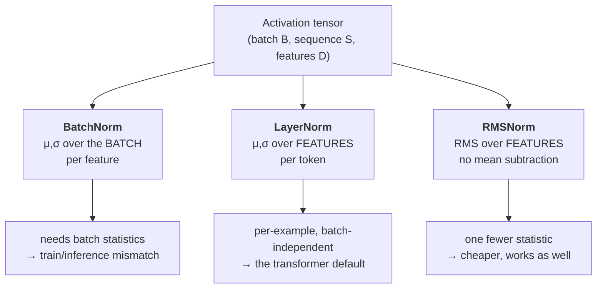

# Lesson 2 — The Normalization Family & Residual Connections

| | |
|---|---|
| **Prepares** | "What exactly does LayerNorm compute?" and "why not BatchNorm in a transformer?" — questions where vague answers are visibly vague |
| **Time** | ~11 min visible + drills |
| **Domain tag** | Deep Learning / Architecture |

> 📍 **How this lesson works:** the whole area hinges on one question — **which axis are the statistics computed over?** Get that right and every follow-up falls out. Get it vague and every follow-up exposes it. Session 1 covered Pre-LN vs Post-LN placement; this lesson covers the *family* and what each member actually computes.

## 🟢 The One Picture

Every normalizer does the same three steps — compute statistics, standardize, then rescale with learned parameters. They differ **only in which axis the statistics come from**.



All three then apply learned scale and shift: $y = \gamma \hat{x} + \beta$. That final step is what stops normalization from *removing* representational capacity — the network can undo the normalization if it needs to.

---

## 🔷 Drill 1 — "Write down exactly what LayerNorm computes."

*Formula, axis, and parameters. 45 seconds.*

<details><summary>✅ Model answer</summary>

For a single token's feature vector $x \in \mathbb{R}^D$, statistics are taken **across the D features of that one token** — no other token, no other example:

$$\mu = \frac{1}{D}\sum_{i=1}^{D} x_i, \qquad \sigma^2 = \frac{1}{D}\sum_{i=1}^{D}(x_i - \mu)^2$$

$$\hat{x}_i = \frac{x_i - \mu}{\sqrt{\sigma^2 + \epsilon}}, \qquad y_i = \gamma_i \hat{x}_i + \beta_i$$

$\gamma, \beta \in \mathbb{R}^D$ are learned. $\epsilon$ prevents division by zero.

The property that matters: **it is completely independent of batch composition.** The same token produces the same output whether it arrives alone or in a batch of 512, at training or at inference. That is the whole reason transformers use it.
</details>

<details><summary>🔁 The follow-up chain</summary>

"Why does that independence matter for sequences?" (variable-length sequences and autoregressive decoding mean batch statistics would be computed over inconsistent, padding-contaminated populations) → "What does $\gamma$ actually buy?" (without it, every layer's output would be forced to zero mean and unit variance — restricting what the layer can represent; $\gamma,\beta$ let the network re-scale or even undo the normalization) → "RMSNorm drops $\mu$. Why is that safe?" (see Drill 3).
</details>

---

## 🔷 Drill 2 — "Why BatchNorm in CNNs but LayerNorm in transformers?"

*The comparison question. 45 seconds.*

<details><summary>✅ Model answer</summary>

**BatchNorm** normalizes each *feature/channel* using statistics across the **batch**. That works well for CNNs on fixed-size images with reasonably large batches: channel statistics are meaningful and stable.

It breaks for transformers on three counts:
1. **Sequences vary in length**, so batch statistics get computed over ragged, padding-polluted populations.
2. **Small effective batches** — long sequences force small batches, and BatchNorm's estimates get noisy exactly when the batch shrinks.
3. **Train/inference mismatch** — BatchNorm keeps *running averages* for inference, a different computation from training. In autoregressive decoding, where you generate one token at a time, there is no meaningful batch at all.

**LayerNorm** sidesteps all three by normalizing within a single token's features. Batch size 1 behaves identically to batch size 512.
</details>

<details><summary>🔁 The follow-up chain</summary>

"What actually happens at BatchNorm with batch size 1?" (variance over one example is zero, so the output degenerates — you must fall back to running statistics; this is why BatchNorm and tiny batches are a known failure) → "Is GroupNorm a middle ground?" (yes — statistics over feature groups within one example: batch-independent like LayerNorm, retaining some of BatchNorm's channel structure; common in detection/segmentation with small batches) → "Does BatchNorm regularize?" (yes, incidentally — batch-dependent noise acts as a regularizer, which is part of why removing it can hurt accuracy even when training is stable).
</details>

<details><summary>📚 Deep-dive: the internal-covariate-shift story is wrong</summary>

The original BatchNorm paper (Ioffe & Szegedy 2015) explained the benefit as reducing **internal covariate shift** — the drift in each layer's input distribution as the layers below it update. That explanation became folklore.

Santurkar et al. (2018, arXiv:1805.11604) tested it directly: they *injected* noise after BatchNorm to deliberately re-introduce distributional shift, and training still improved. Their alternative account is that BatchNorm **smooths the optimization landscape** — reducing the Lipschitz constant of the loss and its gradients, so larger learning rates become stable.

Knowing that the canonical explanation was overturned — and being able to name what replaced it — is a strong senior signal, because most candidates repeat the 2015 story as settled fact.
</details>

---

## 🔷 Drill 3 — "What does RMSNorm remove, and why does that work?"

*The modern-LLM question — Llama, Mistral, and most recent models use it. 30 seconds.*

<details><summary>✅ Model answer</summary>

RMSNorm removes the **mean subtraction** (and usually the $\beta$ shift), keeping only a root-mean-square rescale:

$$y_i = \gamma_i \cdot \frac{x_i}{\sqrt{\frac{1}{D}\sum_j x_j^2 + \epsilon}}$$

The claim from Zhang & Sennrich (2019) is that LayerNorm's benefit comes almost entirely from the **re-scaling**, not the **re-centering** — so dropping the mean loses little. Practically it removes one pass over the features and one set of parameters, giving a few percent speedup at scale with no measurable quality loss, which is why Llama-family models adopted it.

The honest caveat: it works well *empirically* for large transformers; it is not a theorem that centering never matters.
</details>

<details><summary>🔁 The follow-up chain</summary>

"Where in the block does it go?" (Pre-LN position — inside the branch, before attention/FFN; see Session 1 for the gradient argument) → "What is QK-norm?" (normalizing queries and keys before the attention dot product, a newer trick that stabilizes large-scale training by bounding logit magnitude) → "Is there a norm-free approach?" (yes — carefully scaled initialization schemes like NFNets/DeepNorm can train deep nets without normalization layers, at the cost of much more delicate tuning).
</details>

---

## 🟢 Concept Check

Which statement about LayerNorm is correct?

* [ ] It computes statistics across the batch dimension for each feature
* [x] It computes mean and variance across the feature dimension of each token independently, making it batch-size independent
* [ ] It requires running averages at inference time
* [ ] It removes the need for learned parameters

Why would replacing LayerNorm with BatchNorm in a decoder-only LLM be a serious mistake?

* [ ] BatchNorm has more parameters
* [x] Autoregressive decoding generates one token at a time with no meaningful batch, and BatchNorm's train/inference statistics differ — the model would behave inconsistently between training and generation
* [ ] BatchNorm cannot be backpropagated through
* [ ] BatchNorm only works on images

<details>
<summary>🔑 Answers</summary>

**Q1: option 2.** The axis *is* the answer to nearly every normalization question. LayerNorm's per-token, per-feature computation is what makes it batch-independent — and therefore what makes it correct for variable-length sequences and single-token decoding.

**Q2: option 2.** BatchNorm's dependence on batch statistics plus its separate inference-time path (running averages) is fundamentally incompatible with generating one token at a time. Note option 4 is wrong for a subtler reason worth knowing: BatchNorm *is* used outside vision — it is the sequence/decoding setting, not the modality, that breaks it.
</details>

---

## 🔷 Rapid-Fire Rehearsal

```rehearsal-drill
RUBRIC: mechanism
TITLE: Normalization — Rapid Fire
INTRO: Every answer here starts with "which axis?" Name the statistics and the axis first, then the consequence — then stop.
MIN: 25
MAX: 70
[[What LayerNorm computes]]
Q: Write down exactly what LayerNorm computes, including the axis and the learned parameters.
A: For one token's feature vector x ∈ R^D, take μ and σ² **across the D features of that single token**: μ = (1/D)Σxᵢ, σ² = (1/D)Σ(xᵢ−μ)². Then x̂ᵢ = (xᵢ−μ)/√(σ²+ε) and yᵢ = γᵢx̂ᵢ + βᵢ, with γ,β ∈ R^D learned. **The property that matters:** it is completely independent of batch composition — the same token gives the same output alone or in a batch of 512, in training or at inference. γ and β matter because without them every layer would be forced to zero mean and unit variance, restricting what it can represent.
[[BatchNorm vs LayerNorm]]
Q: Why do CNNs use BatchNorm but transformers use LayerNorm?
A: BatchNorm normalizes each channel using statistics **across the batch** — fine for fixed-size images with large batches. It breaks for transformers three ways: variable-length sequences make batch statistics ragged and padding-polluted; long sequences force small batches exactly where BatchNorm's estimates get noisy; and it keeps running averages for inference, a different computation from training — fatal in autoregressive decoding where there is no meaningful batch. LayerNorm normalizes **within one token's features**, so batch size 1 behaves identically to batch size 512.
[[RMSNorm]]
Q: What does RMSNorm drop relative to LayerNorm, and why is that acceptable?
A: It drops the **mean subtraction** (and usually the β shift), keeping only the RMS rescale: yᵢ = γᵢ · xᵢ / √((1/D)Σxⱼ² + ε). Zhang & Sennrich's claim is that LayerNorm's benefit comes almost entirely from **re-scaling** rather than **re-centering**, so removing the mean costs little while saving a pass over the features and a parameter set — a few percent speedup at scale, which is why Llama-family models use it. **Honest caveat:** this is an empirical result for large transformers, not a theorem that centering never matters.
[[Internal covariate shift]]
Q: BatchNorm was introduced to reduce "internal covariate shift." Is that explanation right?
A: Largely **no**, and knowing that is the point. Santurkar et al. 2018 injected noise *after* BatchNorm to deliberately re-introduce distributional shift, and training still improved — so reduced covariate shift cannot be the mechanism. Their account is that BatchNorm **smooths the optimization landscape**, lowering the Lipschitz constant of the loss and its gradients so larger learning rates stay stable. Most candidates repeat the 2015 story as settled fact, so naming the overturn is a strong signal.
[[Batch size 1]]
Q: What breaks if you run BatchNorm with batch size 1?
A: The variance computed over a single example is zero, so the normalization degenerates — you must fall back on running statistics, which means training-time behavior no longer matches the training-time computation. This is why BatchNorm and tiny batches are a documented failure mode, and why **GroupNorm** exists as the middle ground: statistics over feature *groups* within one example, so it is batch-independent like LayerNorm while retaining some channel structure. Common in detection and segmentation where memory forces small batches.
[[Where the norm goes]]
Q: Pre-LN or Post-LN, and what does the choice cost?
A: **Pre-LN** puts the norm inside the sublayer branch, leaving the residual stream a clean sum — gradients flow through the addition unobstructed, so deep stacks train without warmup. **Post-LN** normalizes after the residual add, putting a LayerNorm on the gradient path at every layer, which compounds with depth and needs a warmup schedule. Pre-LN's cost: the residual stream grows in magnitude across depth (each block adds without renormalizing), which the final norm must absorb, and a well-tuned Post-LN can edge it slightly on final quality.
```

---

## 🟢 Summary

- **The axis is the answer.** BatchNorm: statistics over the batch, per feature. LayerNorm: over features, per token. RMSNorm: RMS over features, no centering. All three then apply learned $\gamma$ (and usually $\beta$).
- **Transformers need LayerNorm** because it is batch-independent — essential for variable-length sequences and single-token decoding, where BatchNorm has no meaningful batch and a train/inference mismatch.
- **The internal-covariate-shift explanation was overturned** (Santurkar et al. 2018); the better account is landscape smoothing.
- **RMSNorm** drops re-centering for a few percent speed at no measured cost — the modern LLM default.

**References:** Ba et al. 2016 (LayerNorm, arXiv:1607.06450) · Ioffe & Szegedy 2015 (BatchNorm, arXiv:1502.03167) · Santurkar et al. 2018 (how BatchNorm helps, arXiv:1805.11604) · Zhang & Sennrich 2019 (RMSNorm, arXiv:1910.07467) · Wu & He 2018 (GroupNorm, arXiv:1803.08494).

**Next:** [Lesson 3 — Attention Variants](03_attention_variants.md)
