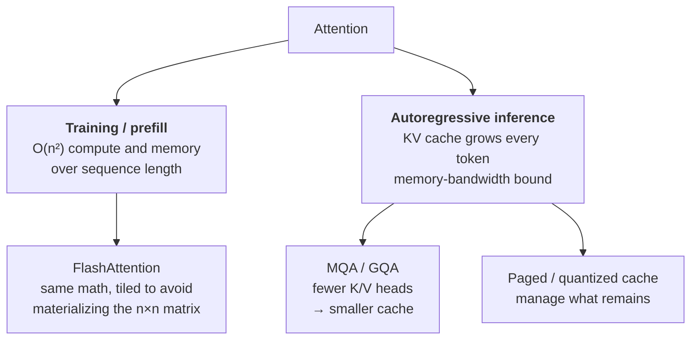
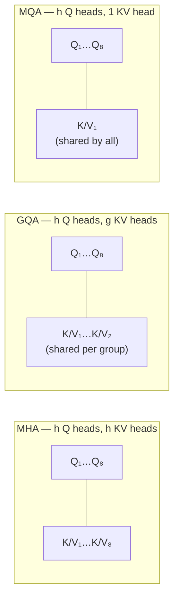

# Lesson 3 — Attention Variants: MHA → MQA/GQA, KV Cache, FlashAttention

| | |
|---|---|
| **Prepares** | "Why does long-context inference get expensive?" — the systems half of a transformer round, and the area most candidates have only read about |
| **Time** | ~12 min visible + drills |
| **Domain tag** | Transformers / Inference Efficiency |

> 📍 **How this lesson works:** Session 1 derived RoPE and MHA shapes for *your* model. This lesson is about **what attention costs and how the field made it cheaper** — the KV cache, MQA/GQA, and FlashAttention. Nearly every answer here is arithmetic, so do the arithmetic out loud; it is far more convincing than the name-dropping most candidates offer.

## 🟢 The One Picture

Two different costs drive two different families of fixes. Confusing them is the most common error in this area.



**FlashAttention attacks the n² term. MQA/GQA attack the KV cache.** They are orthogonal — production systems use both.

---

## 🔷 Drill 1 — "Why is attention O(n²), and what does that actually cost?"

*Arithmetic, not adjectives. 45 seconds.*

<details><summary>✅ Model answer</summary>

Attention computes $\mathrm{softmax}(QK^\top/\sqrt{d})V$. The product $QK^\top$ is $(n \times d)(d \times n) = n \times n$ — one score for **every pair of positions**. So compute is $O(n^2 d)$ and, in a naive implementation, memory is $O(n^2)$ because that score matrix is materialized.

The consequence is the part to say out loud: doubling context **quadruples** attention cost. Going 2k → 8k is 16×. That single fact is why long context was hard, and why every efficiency technique in this lesson exists.

Per layer, per head, the score matrix at $n = 8192$ holds ~67M entries — in fp16, ~134 MB *per head per layer*, which is why materializing it is untenable.
</details>

<details><summary>🔁 The follow-up chain</summary>

"Is the FFN also quadratic?" (no — the FFN is $O(n d^2)$, linear in sequence length; at short contexts the FFN dominates FLOPs, and attention only takes over as $n$ grows past $d$) → "So which dominates at 128k context?" (attention, decisively) → "Name a sub-quadratic alternative" (linear/kernelized attention, sliding-window or sparse attention, and state-space models like Mamba — each trading exactness or expressivity for scaling).
</details>

---

## 🔷 Drill 2 — "What is the KV cache, why does it exist, and what does it cost?"

*The single most-asked inference question. Do the arithmetic. 60 seconds.*

<details><summary>✅ Model answer</summary>

In autoregressive decoding you generate one token at a time. Without caching, producing token $t$ would recompute keys and values for all $t-1$ previous tokens — repeating work every step. The **KV cache** stores the K and V tensors for all past tokens, so each new token computes only its *own* K/V and attends over the cache. That turns per-token work from $O(t)$ recomputation into $O(1)$ new computation plus an $O(t)$ read.

The cost is memory, and it grows every token:

$$\text{cache bytes} = 2 \times L \times H \times d_{head} \times n \times \text{bytes/elem}$$

(2 for K and V; $L$ layers, $H$ heads, $n$ tokens so far.)

**Worked example** — a 7B-class model with $L=32$, $H=32$, $d_{head}=128$, fp16, at 8k context:
$2 \times 32 \times 32 \times 128 \times 8192 \times 2 \approx 4.3$ GB — **per sequence**. Batch 8 requests and the cache alone exceeds the model weights. That is the pressure that produced MQA and GQA.
</details>

<details><summary>🔁 The follow-up chain</summary>

"So what's the bottleneck in decoding — compute or memory?" (memory *bandwidth*: each generated token reads the whole cache, so decoding is bandwidth-bound, not FLOP-bound — which is why batching helps throughput so much) → "How do you shrink it?" (fewer K/V heads via MQA/GQA; quantize the cache to int8; evict or window old tokens; PagedAttention to stop fragmentation waste) → "What is PagedAttention?" (vLLM's idea: manage the cache in fixed-size pages like virtual memory, so you stop over-allocating for the worst-case length and can share prefixes across requests).
</details>

---

## 🔷 Drill 3 — "MHA, MQA, GQA — what exactly differs, and what do you give up?"

*Session 1 touched this from the architecture side; here it's the inference trade. 45 seconds.*



<details><summary>✅ Model answer</summary>

All three keep $h$ **query** heads; they differ in how many **key/value** heads exist:

- **MHA** — $h$ K/V heads, one per query head. Maximum expressivity, largest cache.
- **MQA** — a **single** K/V head shared by all query heads. Cache shrinks by $h\times$ (e.g. 32×), but quality degrades measurably and training can destabilize.
- **GQA** — $g$ groups, each with its own K/V head shared by $h/g$ query heads. Cache shrinks by $h/g\times$. At $g = 8$ it typically matches MHA quality closely while cutting the cache ~4–8×.

GQA is the modern default (Llama 2 70B onward) precisely because it sits at the useful point on that curve. Note what is *not* reduced: query projections and the output projection are unchanged, so **training-time** compute barely moves — this is an inference-memory optimization.
</details>

<details><summary>🔁 The follow-up chain</summary>

"Can you convert an existing MHA checkpoint to GQA?" (yes — mean-pool the K/V heads within each group, then briefly continue training; Ainslie et al. show most quality is recovered with a small fraction of original compute) → "Why does sharing K/V hurt less than sharing Q?" (query heads are what let different heads *ask different questions*; keys/values are the shared content being queried, so collapsing them loses less) → "What does GQA do to the parameter count?" (K/V projections shrink by the grouping factor; Q and O unchanged).
</details>

---

## 🔷 Drill 4 — "What does FlashAttention actually do? Is it an approximation?"

*The question where saying "it's faster" fails and one word — I/O — succeeds. 45 seconds.*

<details><summary>✅ Model answer</summary>

**It is exact — mathematically identical output, not an approximation.** It is an *I/O-aware* implementation.

The insight: on modern GPUs attention is **memory-bandwidth bound, not compute bound**. The naive implementation writes the full $n \times n$ score matrix to high-bandwidth memory (HBM), reads it back for the softmax, writes again, reads again for the $\times V$ product. Those round-trips dominate the runtime.

FlashAttention **tiles** the computation: it loads blocks of Q, K, V into fast on-chip SRAM and computes the attention output for that tile using an **online (streaming) softmax** that maintains running max and sum statistics — so a correct softmax is produced without ever materializing the full matrix. Result: memory drops from $O(n^2)$ to $O(n)$, and wall-clock improves 2–4× despite performing *more* FLOPs (the backward pass recomputes tiles rather than storing them).

The headline to say: **it trades extra compute for far fewer memory round-trips, because bandwidth — not arithmetic — was the binding constraint.**
</details>

<details><summary>🔁 The follow-up chain</summary>

"If it's exact, why isn't every implementation like this?" (it requires hand-written CUDA kernels tuned to the memory hierarchy; the naive version is what you get from composing standard framework ops) → "How is this different from sparse attention?" (sparse/linear attention changes the *math* — approximating or skipping pairs — and can lose quality; FlashAttention changes only the *schedule*) → "What is arithmetic intensity?" (FLOPs per byte moved; attention has low intensity, so it sits on the bandwidth-bound side of the roofline — which is exactly the observation FlashAttention exploits).
</details>

---

## 🟢 Concept Check

A model doubles its context window from 4k to 8k. What happens to the attention score computation?

* [ ] It doubles
* [x] It quadruples — attention is O(n²) in sequence length because every position attends to every other
* [ ] It stays the same
* [ ] It halves

Which statement about FlashAttention is correct?

* [ ] It approximates attention by dropping low-scoring pairs
* [x] It computes exactly the same output, using tiling and an online softmax to avoid materializing the n×n matrix in HBM — an I/O optimization, not a mathematical one
* [ ] It replaces softmax with a linear kernel
* [ ] It only works during inference

<details>
<summary>🔑 Answers</summary>

**Q1: option 2.** The quadratic scaling is the fact that motivates the entire lesson. Saying "it quadruples" and then "which is why long context needed FlashAttention and cache optimizations" connects the arithmetic to the engineering.

**Q2: option 2.** Exactness is the distinguishing property. Option 1 describes *sparse* attention and option 3 describes *linear* attention — both change the math and can cost quality. Mixing these up is the most common error here, and being precise about it is a strong signal.
</details>

---

## 🔷 Rapid-Fire Rehearsal

```rehearsal-drill
RUBRIC: mechanism
TITLE: Attention Variants — Rapid Fire
INTRO: Systems questions. Do the arithmetic out loud — a worked KV-cache number beats any amount of terminology. Then stop.
MIN: 30
MAX: 80
[[Why attention is O(n²)]]
Q: Why is attention quadratic in sequence length, and what does that mean in practice?
A: QKᵀ is (n×d)(d×n) = n×n — one score for **every pair of positions** — so compute is O(n²d) and naive memory is O(n²). In practice: **doubling context quadruples attention cost**; 2k → 8k is 16×. At n = 8192 the score matrix holds ~67M entries, ~134 MB in fp16 *per head per layer*, which is why materializing it is untenable. **Contrast:** the FFN is O(nd²) — linear in n — so it dominates at short context and attention takes over as n grows past d.
[[The KV cache]]
Q: What is the KV cache, why does it exist, and what does it cost?
A: In autoregressive decoding, producing token t would otherwise recompute K and V for all t−1 earlier tokens every step. The cache stores past K/V so each new token computes only its own. Cost is memory that grows every token: **2 × layers × heads × d_head × n × bytes**. For a 7B-class model (32 layers, 32 heads, d_head 128, fp16) at 8k context that is ~4.3 GB **per sequence** — batch 8 and the cache exceeds the weights. **Say unprompted:** decoding is therefore memory-*bandwidth* bound, not FLOP bound, since every token reads the whole cache.
[[MHA vs MQA vs GQA]]
Q: MHA, MQA, GQA — what differs, and what do you trade?
A: All keep h **query** heads; they differ in K/V head count. **MHA:** h K/V heads — max expressivity, largest cache. **MQA:** one shared K/V head — cache shrinks h× (e.g. 32×) but quality degrades measurably and training can destabilize. **GQA:** g groups each with one K/V head shared by h/g query heads — cache shrinks h/g×, and at g=8 quality closely matches MHA, which is why it is the modern default from Llama 2 70B onward. **Key caveat:** Q and O projections are unchanged, so this is an inference-memory optimization, not a training-compute one.
[[FlashAttention]]
Q: What does FlashAttention do, and is it an approximation?
A: **It is exact** — mathematically identical output. It is an I/O-aware implementation. Attention on GPUs is memory-bandwidth bound, and the naive version round-trips the n×n matrix to HBM repeatedly. FlashAttention **tiles** Q/K/V into on-chip SRAM and uses an **online softmax** carrying running max and sum, producing a correct softmax without ever materializing the full matrix — memory O(n²) → O(n), 2–4× faster wall-clock while doing *more* FLOPs (backward recomputes tiles). **The headline:** it trades compute for far fewer memory round-trips because bandwidth was the binding constraint.
[[Flash vs sparse vs linear]]
Q: How is FlashAttention different from sparse or linear attention?
A: FlashAttention changes only the **schedule** — same math, exact output. Sparse attention changes the **math** by restricting which pairs are computed (sliding windows, strided or block patterns), and linear/kernelized attention approximates the softmax with a kernel feature map to get O(n) scaling. The first is free accuracy-wise; the latter two trade exactness or expressivity for scaling. Mixing these up is the most common error in this area, so state the distinction explicitly.
[[Shrinking the KV cache]]
Q: Your long-context serving is out of memory from the KV cache. What are your options?
A: Four families, roughly by ease: **(1) fewer K/V heads** — GQA, or convert an MHA checkpoint by mean-pooling K/V within groups plus brief continued training. **(2) Quantize the cache** to int8 or fp8 — usually a small quality cost. **(3) Bound what you keep** — sliding-window attention, or evict/summarize distant tokens, accepting a real capability loss. **(4) Manage it better** — PagedAttention (vLLM) treats the cache as fixed-size pages like virtual memory, eliminating worst-case over-allocation and letting requests share common prefixes. Name the quality cost of each; only (4) is close to free.
```

---

## 🟢 Summary

- **Attention is $O(n^2)$** in sequence length — doubling context quadruples cost. The FFN is only linear in $n$, so attention dominates at long context.
- **The KV cache** turns per-token recomputation into a memory cost that grows every token — ~4.3 GB per 8k sequence for a 7B-class model. Decoding is therefore **bandwidth-bound**.
- **MQA/GQA** shrink the cache by reducing K/V heads; GQA at $g\!\approx\!8$ is the modern default because it keeps MHA-level quality.
- **FlashAttention is exact** — tiling plus an online softmax to avoid HBM round-trips. It changes the schedule, not the math; sparse and linear attention change the math.

**References:** Vaswani et al. 2017 (arXiv:1706.03762) · Shazeer 2019 (MQA, arXiv:1911.02150) · Ainslie et al. 2023 (GQA, arXiv:2305.13245) · Dao et al. 2022 (FlashAttention, arXiv:2205.14135) · Dao 2023 (FlashAttention-2, arXiv:2307.08691) · Kwon et al. 2023 (PagedAttention/vLLM, arXiv:2309.06180).

**Next:** [Lesson 4 — Training Pathologies & the Debugging Playbook](04_training_pathologies.md)
