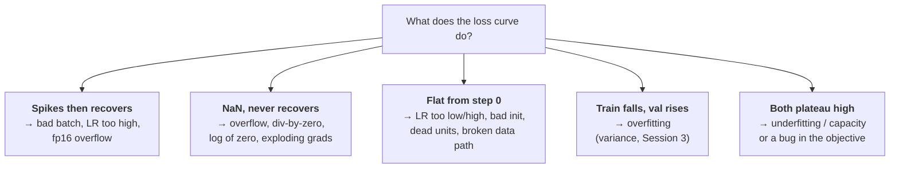

# Lesson 4 — Training Pathologies & the Debugging Playbook

| | |
|---|---|
| **Prepares** | "Your loss just spiked to NaN at step 40k. What do you do?" — the round where interviewers watch you *think* rather than recite |
| **Time** | ~12 min visible + drills |
| **Domain tag** | Deep Learning / Practical Training |

> 📍 **How this lesson works:** every question here is a *diagnosis* question, and the winning shape is always the same — **read the symptom → name the mechanism → propose the discriminating test → then act.** Candidates who jump straight to "lower the learning rate" lose, even when lowering the learning rate turns out to be the fix.

## 🟢 The One Picture

Loss curves have a small vocabulary of shapes, and each points at a different mechanism.



**Before touching a hyperparameter, localize.** Log gradient norms per layer, activation statistics, and the learning rate actually in effect. Most "mysterious" failures are visible in those three signals.

---

## 🔷 Drill 1 — "Your loss spikes to NaN mid-training. Diagnose it."

*The classic. Ordered hypotheses, not a guess. 60 seconds.*

<details><summary>✅ Model answer</summary>

**Localize first:** is the jump gradual or instantaneous, and which layer moves first? Log per-layer gradient norms and activation ranges — that alone usually names the culprit.

Then the ordered hypotheses:

1. **Mixed-precision overflow.** fp16 has max ≈ 65504; an activation or gradient exceeding it becomes `inf`, then `NaN`. Check whether the loss scaler is repeatedly skipping steps — that is the fingerprint. (bf16 has fp32's range and largely removes this failure.)
2. **Exploding gradients** — gradual growth in gradient norm before the blow-up. Fix with clipping; check normalization placement.
3. **A bad batch** — a corrupted label, an all-padding sequence, a degenerate example. Fingerprint: the failure **reproduces deterministically** on that batch.
4. **Numerical edge cases in the loss** — `log(0)`, division by a near-zero denominator, softmax over all `-inf` (a fully-masked row).
5. **Learning rate too high**, or warmup that ended too early.

The discriminating test to volunteer: **re-run the same batch with the same seed.** Deterministic reproduction points at data or a numerical edge case; non-reproduction points at accumulated instability.
</details>

<details><summary>🔁 The follow-up chain</summary>

"How does loss scaling work?" (multiply the loss by a large constant so small fp16 gradients don't underflow to zero, then unscale before the optimizer step; dynamic scalers halve the factor whenever they detect inf/NaN and skip that step) → "Why does bf16 help?" (same exponent range as fp32, so overflow essentially disappears; you trade mantissa precision, which training tolerates far better) → "You clipped and it still NaNs — now what?" (clipping bounds gradients but not *activations*; suspect the forward pass — check for masked-out softmax rows and log-of-zero).
</details>

---

## 🔷 Drill 2 — "Training loss is flat from step zero. Walk me through it."

*Different mechanism entirely from the spike. 45 seconds.*

<details><summary>✅ Model answer</summary>

Flat-from-the-start usually means **no useful signal is reaching the parameters**, and there are four common causes:

1. **The data path is broken** — labels shuffled relative to inputs, wrong tensor being fed, or a mask zeroing everything. *Test:* try to **overfit a single batch**. A healthy model drives loss to ~0 on 8 examples in a few hundred steps; if it cannot, the bug is in the model or data, not the hyperparameters.
2. **Learning rate wrong in either direction** — too low and updates are invisible; too high and it bounces without descending.
3. **Bad initialization / vanishing gradients** — check whether early-layer gradient norms are orders of magnitude below late layers.
4. **Dead units** — with ReLU, a large negative bias can push a unit permanently to zero output and zero gradient. *Test:* what fraction of activations are exactly zero?

The single-batch overfit test is the one to say first. It cleanly separates "bug" from "tuning," which is the fork the whole diagnosis hangs on.
</details>

<details><summary>🔁 The follow-up chain</summary>

"What's the dying-ReLU fix?" (LeakyReLU/GELU give nonzero gradient for negative inputs; also lower the learning rate and check initialization — dead units are often caused by an early oversized update) → "How would you check the learning rate is even applied?" (log the *effective* LR from the scheduler each step — a misconfigured warmup or a scheduler stepping per-epoch instead of per-batch is a common silent bug) → "Loss decreases but accuracy stays at chance?" (suspect a label/prediction misalignment, or a metric computed on the wrong axis).
</details>

---

## 🔷 Drill 3 — "Training loss keeps falling; validation loss started rising 10k steps ago. What now?"

*Overfitting, but the interesting part is the ordering of remedies. 45 seconds.*

<details><summary>✅ Model answer</summary>

That divergence is the definition of **overfitting** — variance, in Session 3's decomposition. Order the responses by expected value per unit of effort:

1. **Early stopping** — you already have the answer: the best checkpoint was 10k steps ago. Free.
2. **More or better data**, including augmentation — attacks the cause rather than the symptom.
3. **Stronger regularization** — weight decay (decoupled, via AdamW), dropout, label smoothing.
4. **Less capacity** — a smaller model, but only after the cheaper options; capacity is rarely the first thing worth changing.

Two things to say unprompted: **check for a distribution mismatch** between train and validation before concluding overfitting — a rising validation curve can also mean your validation set drifted or leaked. And **which metric matters**: validation *loss* can rise while validation *accuracy* still improves, because a confidently wrong prediction is penalized heavily by cross-entropy. Decide from the metric tied to the deployment decision.
</details>

<details><summary>🔁 The follow-up chain</summary>

"Why can val loss rise while val accuracy rises too?" (cross-entropy punishes confident errors superlinearly, so growing overconfidence raises loss even as the argmax improves — the calibration story from Session 2) → "Would you use dropout in a large transformer?" (often at low rates or not at all during LLM pretraining, where data is plentiful and the model is under-trained relative to capacity; dropout matters much more when fine-tuning on small data) → "Is early stopping principled?" (yes — it limits *effective* capacity, which is Session 3's regularization-as-variance-reduction framing).
</details>

---

## 🟢 Concept Check

Your loss goes to NaN and the same batch reproduces the failure every time with a fixed seed. What does that reproducibility tell you?

* [ ] It confirms the learning rate is too high
* [x] It points at the data or a numerical edge case in that specific batch — accumulated instability would not reproduce so precisely
* [ ] It means the optimizer state is corrupted
* [ ] Nothing; NaNs are always random

You cannot drive training loss to near zero on a single batch of 8 examples. What is the most useful conclusion?

* [ ] The learning rate needs tuning
* [x] There is a bug in the model or data pipeline — a healthy setup can memorize 8 examples, so this separates "bug" from "tuning" before you touch any hyperparameter
* [ ] The model needs more capacity
* [ ] The dataset is too small

<details>
<summary>🔑 Answers</summary>

**Q1: option 2.** Deterministic reproduction is the discriminating evidence. Instability that accumulates over thousands of steps depends on the whole trajectory and will not pin to one batch; a corrupted label or a fully-masked sequence will.

**Q2: option 2.** The single-batch overfit test is the highest-value debugging move in deep learning precisely because it is a *classifier* for the whole problem space: pass means your machinery works and you have a tuning problem; fail means stop tuning and go find the bug.
</details>

---

## 🔷 Rapid-Fire Rehearsal

```rehearsal-drill
RUBRIC: mechanism
TITLE: Training Pathologies — Rapid Fire
INTRO: Diagnosis questions. Always: read the symptom, name the mechanism, give the discriminating test, then act. Jumping to a fix without a diagnosis is the failure mode being tested.
MIN: 30
MAX: 80
[[Loss goes to NaN]]
Q: Your loss spikes to NaN at step 40k. Walk me through the diagnosis.
A: **Localize first** — is the jump gradual or instantaneous, and which layer moves first? Log per-layer gradient norms and activation ranges. Then ordered hypotheses: **(1) fp16 overflow** (max ≈ 65504; fingerprint is the loss scaler repeatedly skipping steps — bf16 largely removes this); **(2) exploding gradients** (gradual norm growth before the blow-up; fix with clipping, check norm placement); **(3) a bad batch** (corrupted label, all-padding sequence); **(4) numerical edge cases** — log(0), division by ~0, softmax over a fully-masked row; **(5) LR too high or warmup ended early**. **The discriminating test:** re-run the same batch with the same seed — deterministic reproduction means data or a numerical edge case; non-reproduction means accumulated instability.
[[Loss flat from step zero]]
Q: Training loss is completely flat from the first step. What do you check?
A: Flat-from-start means **no useful signal reaches the parameters**. Causes: a broken data path (labels shuffled relative to inputs, a mask zeroing everything), learning rate wrong in either direction, bad init or vanishing gradients, or dead units. **Say the single-batch overfit test first:** try to drive loss to ~0 on 8 examples. A healthy model does that in a few hundred steps; failure means the bug is in the model or data, not the hyperparameters. That test cleanly separates "bug" from "tuning," which is the fork everything else depends on.
[[Overfitting response]]
Q: Training loss keeps falling but validation loss has been rising for 10k steps. What do you do, in what order?
A: That divergence is overfitting — variance. Order by value per unit effort: **(1) early stopping** — the best checkpoint already exists, 10k steps back, and it is free; **(2) more or better data**, including augmentation, which attacks the cause; **(3) stronger regularization** — decoupled weight decay via AdamW, dropout, label smoothing; **(4) less capacity**, last because it is rarely the cheapest lever. **Two things unprompted:** first rule out a train/validation distribution mismatch or leak, since those also raise the validation curve; and note val *loss* can rise while val *accuracy* improves, because cross-entropy punishes confident errors — decide on the metric tied to the deployment decision.
[[Mixed precision]]
Q: What actually breaks in fp16 training, and how do loss scaling and bf16 address it?
A: fp16 has a narrow exponent range (max ≈ 65504) so large activations or gradients overflow to inf and then NaN, while small gradients underflow to zero. **Loss scaling** multiplies the loss by a large constant so small gradients stay representable, then unscales before the optimizer step; dynamic scalers halve the factor and skip the step whenever inf/NaN is detected — repeated skipping is your overflow fingerprint. **bf16** keeps fp32's exponent range and sacrifices mantissa bits instead, so overflow essentially disappears and training tolerates the lost precision well. That is why bf16 is the default on hardware that supports it.
[[Dying ReLU]]
Q: What is the dying ReLU problem, how would you detect it, and how do you fix it?
A: A ReLU unit whose pre-activation is pushed persistently negative outputs zero **and has zero gradient**, so it can never recover — the unit is permanently dead. It is usually caused by an oversized early update or bad initialization. **Detection:** measure the fraction of activations that are exactly zero per layer; a large and *growing* fraction that never recovers is the signal. **Fixes:** LeakyReLU or GELU, which pass gradient for negative inputs; lower the learning rate; check initialization (He for ReLU-family).
[[Gradient clipping]]
Q: What does gradient clipping do, what does it not do, and where would you set the threshold?
A: It rescales the gradient when its norm exceeds a threshold — typically clip-by-global-norm, which preserves the *direction* and only shortens the step, unlike clip-by-value which distorts direction. It reliably prevents exploding-gradient blow-ups. **What it does not do:** fix vanishing gradients (it only bounds from above), and it does not protect against forward-pass problems — if activations overflow or a softmax row is fully masked, you still get NaN despite clipping. **Threshold:** log gradient norms first and set it around the high end of the observed healthy range (commonly ~1.0 for transformers), rather than picking a number blind.
```

---

## 🟢 Summary

- **Read the symptom before turning a knob.** Spike, NaN, flat, and diverging-validation are four different mechanisms with four different fixes.
- **The two highest-value tests:** re-run the same batch with a fixed seed (separates data/numerics from accumulated instability), and try to overfit a single batch (separates bug from tuning).
- **Mixed precision:** fp16's narrow range causes overflow — loss scaling and bf16 are the answers, and repeated scaler skips are the fingerprint.
- **Overfitting remedies are ordered:** early stopping → data → regularization → capacity, and rule out a validation mismatch or leak first.

**References:** Micikevicius et al. 2018 (mixed precision, arXiv:1710.03740) · Pascanu et al. 2013 (gradient clipping, arXiv:1211.5063) · Karpathy, *A Recipe for Training Neural Networks* (karpathy.github.io/2019/04/25/recipe/).

**Next:** [Mock Round — Deep Learning Breadth](05_mock_round.md)
