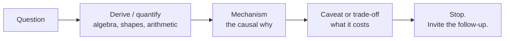

# Lesson 5 — Mock Round: Deep Learning Breadth

| | |
|---|---|
| **Prepares** | A 45-minute DL round: derivations on demand, systems arithmetic, and one open debugging scenario |
| **Prerequisites** | Lessons 1–4 worked through, including their rapid-fire drills |
| **Time** | ~50 min (mock round + honest self-assessment) |

> 📍 **How this round differs from Session 3's.** Session 3's breadth round rewarded *compression* — 30 seconds, then stop. This one rewards **derivation**: the interviewer wants the algebra, the shapes, and the arithmetic. Answers here are longer, and stopping too early reads as not knowing the next step.

---

## 🟢 Before You Start

1. Have paper. Two of these questions are board questions, and speaking algebra without writing it is harder than it sounds.
2. Have your Session 1 numbers to hand — the memory budget and your model's layers/heads/d_model. The interviewer will ask you to instantiate general arithmetic on a real model.
3. Speak **out loud**. The transition from "I understand backprop" to "I can derive backprop while someone watches" is the entire point.

---

## 🟢 The Bar for This Round

| Property | What it sounds like | What fails |
|---|---|---|
| **Derived** | Algebra, shapes, and the arithmetic, produced live | "It uses the chain rule" |
| **Mechanistic** | *Why* it happens, in causal steps | Naming the phenomenon and stopping |
| **Quantified** | Real numbers on a real configuration | "It uses a lot of memory" |
| **Honest** | "I'd have to check" over an invented figure | A confident wrong number |

---

## 🟢 The Mock Round

Twelve questions across all four lessons, delivered in sequence. The interviewer reads each aloud; you answer, then move on. At the end you get a consolidated evaluation of the whole round.

<RehearsalStudio rubric="mechanism" minSeconds="40" maxSeconds="120" prompt="Derive or quantify each answer out loud — algebra, shapes, arithmetic — then give the mechanism and the trade-off, then stop." questions="Derive the gradients for a linear layer followed by an activation, including the shapes. || Why do gradients vanish or explode in deep networks? Give the mechanism, not the phenomenon. || Why does a residual connection fix deep-network training? Show me the derivative. || Why must forward activations be stored during training, and what does gradient checkpointing trade to avoid it? || Write down exactly what LayerNorm computes — the axis, the formula, and the learned parameters. || Why do transformers use LayerNorm instead of BatchNorm? Give me three distinct reasons. || BatchNorm was introduced to reduce internal covariate shift. Is that explanation correct? || What does RMSNorm remove relative to LayerNorm, and why is that acceptable? || Why is attention quadratic in sequence length, and what does that mean when you go from 2k to 8k context? || What is the KV cache, and roughly how large does it get for a 7B model at 8k context? Do the arithmetic. || Is FlashAttention an approximation? Explain what it actually does. || Your training loss spikes to NaN at step 40k. Walk me through your diagnosis in priority order." />

> [!TIP]
> If a derivation stalls, say what you *do* know and where you got stuck — "I know the weight gradient is an outer product, I'm not certain about the transpose placement" is a far better answer than silence, and it is what a real interviewer wants to hear.

---

## 🟢 The Two Board Questions

These deserve separate rehearsal because writing while talking is a distinct skill.

<RehearsalStudio rubric="mechanism" minSeconds="60" maxSeconds="150" prompt="Board question, ~2 minutes: 'Derive backpropagation for a two-layer MLP with a ReLU in between and a cross-entropy loss. Give every gradient with its shape, and say what must be stored during the forward pass.' Narrate as you would while writing on a whiteboard." />

<RehearsalStudio rubric="mechanism" minSeconds="60" maxSeconds="150" prompt="Board question, ~2 minutes: 'A 7B-class model has 32 layers, 32 heads, d_head 128, in fp16. Compute the KV cache size at 8k context for one sequence, then for a batch of 8. Then tell me what GQA with 8 groups changes, and what it does not change.' Do the arithmetic out loud." />

---

## 🟢 Honest Self-Assessment

The bar is **"I derived or quantified it out loud, correctly, without notes."** Recognition is not the same as production.

| # | Topic | Lesson | Can you produce it cold? |
|---|---|---|---|
| 1 | Backprop for a linear layer (with shapes) | 1 | ☐ Clean ☐ Shaky ☐ No |
| 2 | Vanishing/exploding as a product of Jacobians | 1 | ☐ Clean ☐ Shaky ☐ No |
| 3 | Residual derivative $I + \partial F/\partial h$ | 1 | ☐ Clean ☐ Shaky ☐ No |
| 4 | Why activations are stored; checkpointing trade | 1 | ☐ Clean ☐ Shaky ☐ No |
| 5 | LayerNorm formula and axis | 2 | ☐ Clean ☐ Shaky ☐ No |
| 6 | BatchNorm vs LayerNorm — three reasons | 2 | ☐ Clean ☐ Shaky ☐ No |
| 7 | Internal covariate shift was overturned | 2 | ☐ Clean ☐ Shaky ☐ No |
| 8 | RMSNorm — what it drops and why | 2 | ☐ Clean ☐ Shaky ☐ No |
| 9 | Attention $O(n^2)$ and its consequence | 3 | ☐ Clean ☐ Shaky ☐ No |
| 10 | KV cache arithmetic on a real config | 3 | ☐ Clean ☐ Shaky ☐ No |
| 11 | FlashAttention is exact; what it actually does | 3 | ☐ Clean ☐ Shaky ☐ No |
| 12 | NaN diagnosis, ordered, with the seed test | 4 | ☐ Clean ☐ Shaky ☐ No |

**How to read your result**

| Clean count | What it means | Next step |
|---|---|---|
| **10–12** | DL breadth is round-ready | Move to Session 5; revisit any single ☐ Shaky before the loop |
| **6–9** | You know the material but can't produce it live | Re-run this round twice — a rehearsal problem, not a knowledge problem |
| **≤ 5** | Real gaps in the derivations | Re-read the lesson for each gap, run its drill, then re-attempt |

---

## 🟢 The Synthesis Question

DL interviewers often close by connecting the areas. This is the highest-value single answer in the session.

<RehearsalStudio rubric="mechanism" minSeconds="75" maxSeconds="150" prompt="Answer out loud, ~2 minutes: 'Deep networks were untrainable, then they weren't. Walk me through what actually changed — and connect it to why a modern LLM is expensive to serve.' Give one causal narrative, not a list of techniques." />

✅ Model answer — the arc

"The original obstacle was **gradient flow**. The gradient at layer *k* is a product of Jacobians, so it is exponential in depth — with saturating activations and poorly scaled initialization, that product either vanished or exploded, and depth simply didn't train.

Three things fixed it. **Better initialization** (Xavier, then He) set the variance so you didn't start in a bad regime. **Non-saturating activations** removed the ≤0.25 derivative ceiling. And most importantly **residual connections** changed the Jacobian to $I + \partial F/\partial h$ — an identity path that guarantees gradient arrives undiminished no matter the depth. **Normalization** then kept per-layer scale controlled so large learning rates stayed stable; the original covariate-shift explanation for why that helps was later overturned in favour of landscape smoothing.

With depth solved, transformers scaled — and the bottleneck moved from *trainability* to *cost*. Attention is $O(n^2)$ in sequence length, so long context is quadratically expensive; **FlashAttention** addressed that without changing the math, by tiling and an online softmax so the $n\times n$ matrix is never materialized, since the real constraint was memory bandwidth rather than FLOPs.

At inference the binding cost is different again: the **KV cache**. It grows linearly with every generated token — several gigabytes per sequence at 8k for a 7B model — and every token reads the whole thing, so decoding is bandwidth-bound. That is what motivated **GQA**, which shares K/V heads across query-head groups to shrink the cache with almost no quality loss.

So the arc is: fix the gradient path to make depth possible, then fight the memory and bandwidth costs that depth and context create."

---

## 🟢 Summary

- This round rewards **derivation and arithmetic**, not compression. Write things down; narrate the algebra.
- The two board questions (backprop for an MLP, KV-cache arithmetic) are the highest-probability whiteboard asks in a DL round — rehearse them until the shapes are automatic.
- The synthesis arc — **gradient flow → depth → quadratic attention → inference memory** — connects all four lessons and is what a strong candidate offers unprompted.

**Session complete.** Next: [Session 5 — LLMs, Fine-Tuning & Retrieval](../05_llms_finetuning_retrieval/00_locked.md) *(locked)*.
