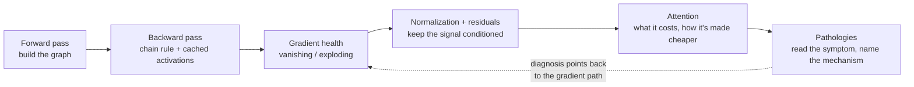

# Session 4 — ML Fundamentals: Deep Learning & Transformers

| | |
|---|---|
| **What it prepares** | The deep-learning half of the breadth round — where "explain it" becomes "derive it," and where a wrong answer is *specifically* wrong rather than vague |
| **Prerequisites** | Session 3 (bias–variance, MLE/MAP, optimizers) and Session 1's RoPE / Pre-LN material, which this session extends |
| **Session length** | 4 lessons + a mock round, ~4–5 hours |
| **Format** | Drill cards: answer out loud first, then open the model answer. Derivations and citations sit in collapsed blocks. |

---

## 🟢 What This Round Actually Tests

Session 3 was breadth at ~30 seconds per answer. This is the other half of the same round, and it is **slower and deeper**. The interviewer asks you to derive backprop through a specific layer, or to say precisely what LayerNorm computes and why that helps, or to explain what a KV cache costs at 8k context. Approximate answers stop working, because these questions have *exact* answers and the interviewer knows them.

The failure mode here is not ignorance — it's **fluency without mechanism**. Most candidates can say "batch norm normalizes activations to stabilize training." Very few can say *what statistics it computes*, *why that helped in the original paper*, *why the original explanation turned out to be wrong*, and *what actually breaks at batch size 1*. This session drills the second version.

---

## 🟢 Scope Brief: The Four Areas

| Area | The version everyone gives | The version that scores |
|---|---|---|
| **Backpropagation** | "Chain rule backwards through the network" | The computational graph, why you cache activations (and what that costs), where gradients actually vanish, and why residuals fix it |
| **Normalization** | "It stabilizes training" | *Which statistics over which axis*, why LayerNorm suits sequences and BatchNorm doesn't, RMSNorm's deletion, and the internal-covariate-shift story being wrong |
| **Attention variants** | "MHA runs several attentions in parallel" | The KV-cache arithmetic that forces MQA/GQA, why FlashAttention is an I/O result not an approximation, and the O(n²) that motivates everything |
| **Training pathologies** | "Lower the learning rate" | Reading the symptom — spike vs. plateau vs. NaN vs. divergence — and naming the mechanism before touching a knob |

> 📍 **Relationship to Session 1.** Session 1 defended *your* transformer: RoPE derivation, Pre-LN vs Post-LN, your contrastive loss. This session covers the same machinery as **general knowledge an interviewer expects from any DL candidate** — and goes where Session 1 didn't: backprop mechanics, the full normalization family, the inference-time attention variants (MQA/GQA/Flash), and the training-failure playbook. Where the two touch, this session assumes Session 1 and pushes further rather than repeating it.

---

## 🟢 Session Structure

1. [Lesson 1 — Backpropagation & Gradient Flow](01_backpropagation_and_gradient_flow.md)
2. [Lesson 2 — The Normalization Family & Residual Connections](02_normalization_and_residuals.md)
3. [Lesson 3 — Attention Variants: MHA → MQA/GQA, KV Cache, FlashAttention](03_attention_variants.md)
4. [Lesson 4 — Training Pathologies & the Debugging Playbook](04_training_pathologies.md)
5. [Mock Round — Deep Learning Breadth](05_mock_round.md)

🔬 **Interactive companion** (CPU-only, runs instantly): [▶ Open the Deep Learning Lab in Colab](https://colab.research.google.com/github/vinod-seth/Applied-Scientist-Interview-Gauntlet/blob/main/tutorial/04_deep_learning_transformers/deep_learning_lab.ipynb) — verify a hand-derived gradient against autograd, watch signal die without residuals, measure KV-cache growth, and reproduce a loss spike.

> [!NOTE]
> Nothing here is scored or gated. The goal is that you can derive each mechanism out loud, and that when a training run misbehaves you can name the mechanism before reaching for a knob.
