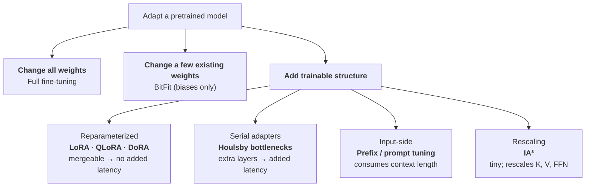
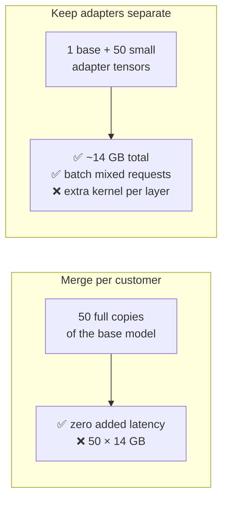

# Lesson 1 — The PEFT Landscape: Beyond LoRA

| | |
|---|---|
| **Prepares** | "You used QLoRA. What else was available, and why not that?" — the design-space question your resume guarantees |
| **Time** | ~13 min visible + drills |
| **Domain tag** | LLMs / Parameter-Efficient Fine-Tuning |

> 📍 **How this lesson works:** Session 1 defended *your* QLoRA run — NF4, your rank, your memory budget. This lesson places that one choice inside the landscape it came from, so that when the interviewer says "why not prefix tuning?" or "what would you do with 8× the GPU?", you answer with a trade-off rather than a preference. Nearly every answer here is memory arithmetic. Do it out loud.

## 🟢 Learning Objectives

After this lesson you can:

- **Derive the memory cost** of full fine-tuning from bytes per parameter, and name which term freezing the base removes.
- **State LoRA exactly** — parameterization, initialization, parameter count — and explain what $\alpha$ decouples.
- **Place any adaptation method** on the mergeability axis and give the cost it trades.
- **Design a multi-adapter serving path** and justify merging or not merging.
- **Name three situations** where you would reject parameter-efficient tuning outright.

## 🟢 The One Picture

<abbr title="Parameter-efficient fine-tuning: adapting a model by training a small set of added or selected parameters while the pretrained weights stay frozen">PEFT</abbr> methods all answer one question — *which parameters am I allowed to change?* — and they differ on a second one that decides deployment: *can the change be folded back into the weights?*



**The axis that matters in production is the last one in each box.** LoRA-family updates merge into $W$ and cost nothing at inference; serial adapters add depth to every forward pass; soft prompts eat tokens you wanted for the user's input.

---

## 🔷 Drill 1 — "Full fine-tuning a 7B model needs how much memory, and where does it go?"

*The arithmetic that makes every PEFT method obvious. 60 seconds.*

<details><summary>✅ Model answer</summary>

Count bytes per parameter for standard mixed-precision <abbr title="Adam with decoupled weight decay: the optimizer used for nearly all LLM training; keeps two running statistics per parameter">AdamW</abbr> training:

| Item | Precision | Bytes/param |
|---|---|---|
| Weights | fp16/bf16 | 2 |
| Gradients | fp16/bf16 | 2 |
| Adam state $m$ | fp32 | 4 |
| Adam state $v$ | fp32 | 4 |
| fp32 master weights | fp32 | 4 |
| **Total** | | **≈16** |

At 7B parameters that is **≈112 GB**, before activations — so full fine-tuning does not fit on one 80 GB card, let alone your 16 GB one.

Now read the table backwards: **the weights are only 2 of the 16 bytes.** Twelve of the sixteen are gradients, optimizer state, and master copies, all of which exist *only for parameters you are training*. That is the entire insight behind PEFT: freeze the base, and 14 of those 16 bytes disappear regardless of what the frozen weights cost.

> **Say it:** "Full fine-tuning 7B costs roughly 16 bytes per parameter — about 112 GB — and only 2 of those bytes are the weights themselves. The rest is optimizer state on trainable parameters. Freezing the base deletes that term, which is why LoRA fits where full fine-tuning cannot."
</details>

<details><summary>🔁 The follow-up chain</summary>

"What does LoRA on 7B cost then?" (frozen fp16 base 14 GB + adapter parameters, typically well under 1% of the model, with their own optimizer state — a few hundred MB — plus activations, which now dominate) → "And QLoRA?" (the frozen base drops to ~3.5 GB in 4-bit, so the base stops being the binding term at all; this is what got it onto a 16 GB card) → "So is QLoRA's saving the same saving as LoRA's?" (**no, and this is the discriminating question** — LoRA removes the *optimizer/gradient* term, QLoRA additionally shrinks the *frozen weight* term; they compose, and confusing them is the most common error here) → "What is left dominating memory after both?" (activations and, at long sequence length, attention memory — which is why gradient checkpointing usually appears alongside QLoRA).
</details>

---

## 🔷 Drill 2 — "State LoRA precisely: the parameterization, the initialization, and what α does."

*Session 1 covered this for your run; here it must be exact and general. 45 seconds.*

<details><summary>✅ Model answer</summary>

For a frozen weight matrix $W_0 \in \mathbb{R}^{d \times k}$, LoRA learns a low-rank update:

$$W = W_0 + \frac{\alpha}{r} BA, \qquad B \in \mathbb{R}^{d \times r},\; A \in \mathbb{R}^{r \times k},\; r \ll \min(d,k)$$

- **Trainable parameters:** $r(d + k)$ instead of $dk$. At $d = k = 4096$ and $r = 8$: 65,536 versus 16.8M — **0.4%**.
- **Initialization:** $A$ random Gaussian, $B$ **zero**. So $BA = 0$ at step 0 and training starts exactly at the pretrained model — no warm-up shock.
- **$\alpha$:** a fixed scaling constant. Dividing by $r$ means changing $r$ does not change the update's effective magnitude, so you can sweep rank without re-tuning the learning rate. Practically $\alpha/r$ behaves like a learning-rate multiplier on the adapter.

The justification is that fine-tuning updates have low <abbr title="The smallest number of parameters needed to reach a target performance when optimizing in a random low-dimensional subspace of the full parameter space">intrinsic dimension</abbr> — Aghajanyan et al. showed task adaptation succeeds in surprisingly few dimensions, so constraining $\Delta W$ to rank $r$ costs less than it sounds.
</details>

<details><summary>🔁 The follow-up chain</summary>

"Which modules do you attach it to?" (the original paper used $W_q$ and $W_v$ only; current practice attaches to all attention projections and often the MLP too — **module coverage generally matters more than rank**, and saying that is the informed answer) → "How do you choose $r$?" (start at 8–16; raise it when the task changes behavior broadly rather than narrowly; the honest answer is that it is empirical and cheap to sweep — the effect saturates quickly on narrow tasks) → "What breaks if you set $B$ random too?" (the model starts perturbed by a random rank-$r$ matrix, which is a strictly worse initialization and can destabilize early steps) → "Does LoRA cost anything at inference?" (no, if merged: $W_0 + \frac{\alpha}{r}BA$ is computed once and stored — identical latency to the base model).
</details>

---

## 🔷 Drill 3 — "Walk the landscape. What are the alternatives and what does each trade?"

*The catalogue question. The score comes from the trade column, not the names. 60 seconds.*

<details><summary>✅ Model answer</summary>

| Method | What it trains | Trade |
|---|---|---|
| **Full FT** | Everything | Best ceiling on large distribution shifts; ~16 bytes/param, one checkpoint per task |
| **LoRA** | Low-rank $BA$ per matrix | Mergeable, no inference cost; needs a choice of rank and target modules |
| **<abbr title="Quantized LoRA: keeps the base model frozen in 4-bit precision and trains only the low-rank adapters on top of it">QLoRA</abbr>** | LoRA on a 4-bit <abbr title="4-bit NormalFloat: a quantization grid whose levels are the quantiles of a normal distribution, matched to how neural network weights are actually distributed">NF4</abbr> frozen base | Smallest footprint; slower steps from dequantization, and merging back into a 4-bit base is lossy |
| **<abbr title="Weight-Decomposed Low-Rank Adaptation: separates each weight into a length and a direction, then applies the low-rank update to the direction only">DoRA</abbr>** | Splits $W$ into magnitude and direction, LoRA on direction | Closes much of the LoRA-vs-full-FT gap at low rank; extra compute per step |
| **<abbr title="Infused Adapter by Inhibiting and Amplifying Inner Activations: learns three vectors that multiply existing activations up or down, adding no new matrices">IA³</abbr>** | Three learned vectors rescaling $K$, $V$, FFN activations | Tiniest footprint (~0.01%); less expressive, and few-shot oriented |
| **<abbr title="Small trainable modules inserted between a frozen model's existing layers, each squeezing the hidden state to a narrow width and back">Adapters</abbr> (Houlsby)** | Inserted bottleneck MLPs | Strong and modular, but **serial** — real added inference latency |
| **<abbr title="Trainable vectors prepended to the input or to every layer's keys and values; the model's own weights are never touched">Prefix / prompt tuning</abbr>** | Continuous vectors prepended to keys/values or embeddings | No weight change at all; consumes context budget and is notoriously sensitive to optimization |
| **<abbr title="Trains only the additive offset terms already present in each layer, leaving every multiplicative weight frozen">BitFit</abbr>** | Bias terms only | Nearly free, a useful baseline, but a low ceiling |

The one-line map: **LoRA-family wins on deployment because it merges; adapters win on modularity; soft prompts win when you cannot touch weights at all.**
</details>

<details><summary>🔁 The follow-up chain</summary>

"If LoRA merges away, why did anyone keep adapters?" (multi-task serving — separate adapter modules compose and swap cleanly, and pre-LoRA they were the established method) → "Why did prefix tuning fall out of favour?" (it spends context length, its quality is unstable across tasks, and LoRA matches or beats it without touching the input) → "What is DoRA actually doing?" (decomposing the weight into a magnitude vector and a direction matrix, then applying LoRA only to the direction; the reported effect is a learning pattern closer to full fine-tuning at the same rank).
</details>

---

## 🔷 Drill 4 — "You must serve 50 customer-specific adapters. Design the serving path."

*The systems question that separates a reader from a practitioner. 60 seconds.*



<details><summary>✅ Model answer</summary>

Merging is correct for **one** adapter and catastrophic for fifty: each merged model is a full-size checkpoint, so you would hold 50 × 14 GB and lose the ability to batch requests from different customers together.

Keep the adapters **unmerged**. One base model stays resident; each request carries a small $(A, B)$ pair; the runtime computes $W_0x$ once for the whole batch and adds the per-request $\frac{\alpha}{r}BAx$ term with a batched adapter kernel. That is the design behind multi-adapter serving systems such as S-LoRA and Punica, and it is what makes per-customer models economically viable at all.

The cost you accept: one extra small matrix multiply per adapted layer, and the memory manager now juggles adapter residency alongside the <abbr title="Cached key and value tensors for all previously generated tokens, so each new token attends over them instead of recomputing them">KV cache</abbr> you sized in Session 4.

> **Say it:** "I'd keep them unmerged. Merging gives zero latency overhead but costs a full model copy per adapter and kills cross-customer batching. With adapters held separately, one base serves the batch and each request adds its own low-rank term — that's the S-LoRA design."
</details>

<details><summary>🔁 The follow-up chain</summary>

"What if all 50 need different ranks?" (fine — rank is per-adapter; the batched kernel pads or groups by rank, which is exactly what those serving systems handle) → "Where do the adapters live when idle?" (host memory, paged in on demand; they are megabytes, so the swap is cheap relative to the KV cache) → "Now say a customer wants their adapter merged for on-prem deployment" (merge that one — it is a legitimate single-tenant case; the caveat is a QLoRA adapter merged into a 4-bit base, where you should dequantize to fp16 first and accept a checkpoint that no longer fits the original budget).
</details>

---

## 🔷 Drill 5 — "When is PEFT the wrong choice?"

*The question most candidates cannot answer, which is why it discriminates. 45 seconds.*

<details><summary>✅ Model answer</summary>

Three situations:

1. **Large distribution shift.** A new language, a new modality, or a domain the base model barely saw needs capacity that a low-rank update cannot supply. Biderman et al. (2024) put this precisely: LoRA **learns less and forgets less** than full fine-tuning — on large-shift targets like code it lags, while retaining base capabilities better. That trade is the answer.
2. **The task is knowledge, not behavior.** If the model needs *facts* it never saw, fine-tuning of any kind is a poor knowledge-insertion mechanism — retrieval is the right tool (Lesson 4). Fine-tuning teaches format, style, and task shape far more reliably than it teaches facts.
3. **You have plenty of data and compute.** With a large task dataset and hardware to match, full fine-tuning still has the higher ceiling. PEFT is a constraint-driven choice, and saying so is more credible than treating it as universally optimal.

And the honest fourth: if a prompt with three examples already meets the bar, fine-tuning nothing is the correct engineering answer.
</details>

<details><summary>🔁 The follow-up chain</summary>

"Is 'forgets less' a benefit or a symptom?" (both — it is regularization from the constrained update; it preserves general capability, and it is the same constraint that limits how much new behavior you can install) → "How would you *test* which side you're on?" (train both on a subsample, compare target-task gain against a held-out general benchmark; if LoRA closes on the target within a few points, the constrained version is the better deployment) → "How does this apply to your ESCI work?" (⚠️ candidate-specific: relevance classification is a narrow behavioral task on a domain the base model has seen — the regime where LoRA is expected to match full fine-tuning; say that, and say what you would check to confirm it).
</details>

---

## 🟢 Concept Check

Full fine-tuning a 7B model in mixed precision with AdamW needs roughly 16 bytes per parameter. What is the largest single contributor?

* [ ] The fp16 weights
* [x] Optimizer state and master weights — 12 of the 16 bytes exist only for *trainable* parameters, which is exactly what freezing the base removes
* [ ] Activations
* [ ] The KV cache

You are serving 50 per-customer LoRA adapters on one model. You should:

* [ ] Merge each adapter and load 50 models
* [x] Keep the adapters unmerged so one base serves a mixed batch, adding each request's low-rank term with a batched kernel
* [ ] Average the 50 adapters into one
* [ ] Use prefix tuning instead, since it needs no weights

<details>
<summary>🔑 Answers</summary>

**Q1: option 2.** The weights are only 2 bytes of the 16. Naming the 12-byte optimizer term is what makes the entire PEFT family follow logically instead of sounding like a trick.

**Q2: option 2.** Merging is right for one adapter and wrong for fifty — it costs a full checkpoint each and prevents cross-customer batching. Option 3 destroys the per-customer behavior you built. Option 4 confuses a training-time method with a serving problem.
</details>

---

## 🔷 Rapid-Fire Rehearsal

```rehearsal-drill
RUBRIC: mechanism
TITLE: PEFT Landscape — Rapid Fire
INTRO: Memory arithmetic first, names second. Every answer should contain either a byte count or a trade-off. Then stop.
MIN: 30
MAX: 80
[[Where full fine-tuning memory goes]]
Q: How much memory does full fine-tuning a 7B model need, and where does it go?
A: Roughly **16 bytes per parameter** in mixed-precision AdamW: 2 fp16 weights + 2 fp16 gradients + 4+4 Adam moments in fp32 + 4 fp32 master weights — about **112 GB at 7B**, before activations. **The key reading:** only 2 of the 16 bytes are the weights; the other 14 exist solely for *trainable* parameters. Freezing the base deletes that term, which is the whole argument for PEFT.
[[LoRA, stated precisely]]
Q: State LoRA exactly — parameterization, initialization, and what alpha does.
A: **W = W₀ + (α/r)·BA** with B ∈ ℝ^(d×r), A ∈ ℝ^(r×k), r ≪ min(d,k). Trainable count is **r(d+k) instead of dk** — at d=k=4096, r=8 that is 65,536 vs 16.8M, about 0.4%. **A is Gaussian, B is zero**, so BA = 0 at step 0 and training begins exactly at the pretrained model. **α/r** keeps the update's effective magnitude constant as rank changes, so you can sweep r without re-tuning the learning rate. Justification: fine-tuning updates have low intrinsic dimension.
[[LoRA vs QLoRA savings]]
Q: Is QLoRA's memory saving the same as LoRA's?
A: **No — and this is the discriminating question.** LoRA removes the *gradient and optimizer* term for the base weights (14 of 16 bytes/param). QLoRA additionally shrinks the *frozen weight* term by storing the base in **4-bit NF4** — 7B goes from ~14 GB to ~3.5 GB. They compose: LoRA is why you don't pay for optimizer state, QLoRA is why the frozen base stops binding. **What's left dominating:** activations, which is why gradient checkpointing usually appears alongside. Slower steps are the cost, from dequantizing on every forward.
[[The landscape and its trades]]
Q: Walk the PEFT landscape. What does each method trade?
A: **LoRA/QLoRA/DoRA** — reparameterized, **mergeable**, so zero inference cost; DoRA splits weights into magnitude and direction and closes much of the low-rank gap at extra step cost. **Adapters (Houlsby)** — inserted bottleneck MLPs: modular, but **serial**, so real added latency. **Prefix/prompt tuning** — no weight change, but consumes context budget and optimizes unstably. **IA³** — three learned rescaling vectors for K, V and FFN, ~0.01% of parameters, less expressive. **BitFit** — biases only, a cheap baseline with a low ceiling. **The map:** LoRA-family wins on deployment because it merges; adapters win on modularity; soft prompts win when weights are untouchable.
[[Serving many adapters]]
Q: You must serve 50 customer-specific adapters. How?
A: **Keep them unmerged.** Merging is correct for one adapter and catastrophic for fifty — 50 × 14 GB of checkpoints, and you lose cross-customer batching. Instead: one resident base computes W₀x for the whole batch, and each request adds its own (α/r)BAx through a batched adapter kernel — the S-LoRA / Punica design. Cost: one extra small matmul per adapted layer, plus adapter residency competing with the KV cache. Idle adapters page from host memory; they are megabytes.
[[When PEFT is wrong]]
Q: When is PEFT the wrong choice?
A: Three cases. **(1) Large distribution shift** — new language, new modality, unseen domain: Biderman et al. 2024 found LoRA **learns less and forgets less** than full fine-tuning, which is a genuine trade, not a free lunch. **(2) The need is knowledge, not behavior** — fine-tuning is a poor fact-insertion mechanism; retrieval is the right tool. It teaches format and task shape far better than facts. **(3) Ample data and compute** — full fine-tuning still has the higher ceiling; PEFT is a constraint-driven choice. **And the honest fourth:** if a three-shot prompt already clears the bar, fine-tune nothing.
```

---

## 🟢 Summary

- **Memory arithmetic drives everything.** Mixed-precision AdamW costs ≈16 bytes/param, of which only 2 are weights. PEFT deletes the other 14 for the frozen base; 4-bit quantization then shrinks what remains.
- **LoRA is $W_0 + \frac{\alpha}{r}BA$** with $B = 0$ at init, trainable count $r(d+k)$, and zero inference cost once merged. Target-module coverage usually matters more than rank.
- **The landscape splits on mergeability**: LoRA-family merges (no latency), serial adapters do not, soft prompts spend context instead of weights.
- **Serving many adapters means not merging** — one base, per-request low-rank terms, batched.
- **PEFT is a constrained choice, not a free one.** Large shifts, knowledge insertion, and abundant compute all argue for something else.

**References**

- Hu et al. (2021) — *LoRA: Low-Rank Adaptation of Large Language Models* — https://arxiv.org/abs/2106.09685
- Dettmers et al. (2023) — *QLoRA: Efficient Finetuning of Quantized LLMs* — https://arxiv.org/abs/2305.14314
- Aghajanyan et al. (2020) — *Intrinsic Dimensionality Explains the Effectiveness of Language Model Fine-Tuning* — https://arxiv.org/abs/2012.13255
- Houlsby et al. (2019) — *Parameter-Efficient Transfer Learning for NLP* — https://arxiv.org/abs/1902.00751
- Li & Liang (2021) — *Prefix-Tuning: Optimizing Continuous Prompts for Generation* — https://arxiv.org/abs/2101.00190
- Lester et al. (2021) — *The Power of Scale for Parameter-Efficient Prompt Tuning* — https://arxiv.org/abs/2104.08691
- Liu et al. (2022) — *Few-Shot Parameter-Efficient Fine-Tuning is Better and Cheaper than In-Context Learning* (IA³) — https://arxiv.org/abs/2205.05638
- Liu et al. (2024) — *DoRA: Weight-Decomposed Low-Rank Adaptation* — https://arxiv.org/abs/2402.09353
- Ben-Zaken et al. (2021) — *BitFit: Simple Parameter-efficient Fine-tuning for Transformer-based Masked Language-models* — https://arxiv.org/abs/2106.10199
- Biderman et al. (2024) — *LoRA Learns Less and Forgets Less* — https://arxiv.org/abs/2405.09673
- Sheng et al. (2023) — *S-LoRA: Serving Thousands of Concurrent LoRA Adapters* — https://arxiv.org/abs/2311.03285
- Chen et al. (2023) — *Punica: Multi-Tenant LoRA Serving* — https://arxiv.org/abs/2310.18547

**Next:** [Lesson 2 — Decoding & Sampling Strategies](02_decoding_and_sampling.md)
