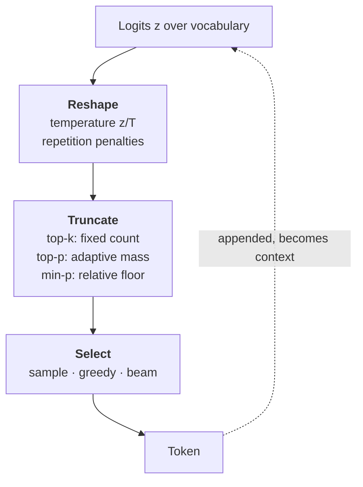
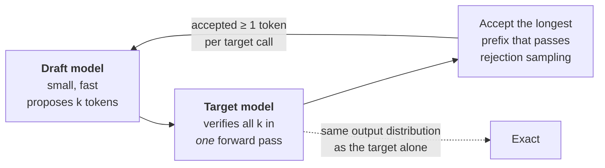

# Lesson 2 — Decoding & Sampling Strategies

| | |
|---|---|
| **Prepares** | "Your model outputs garbage / repeats itself / isn't reproducible" — the decoding questions, where the mechanism is simple and almost nobody states it correctly |
| **Time** | ~12 min visible + drills |
| **Domain tag** | LLMs / Inference & Generation |

> 📍 **How this lesson works:** decoding is the cheapest place in the stack to change a model's behavior and the place candidates are least precise about. Every drill here has an exact answer — a formula, an ordering, or a named failure. The highest-value single fact in the lesson is *why maximizing likelihood produces bad open-ended text*, because it explains why sampling exists at all.

## 🟢 Learning Objectives

After this lesson you can:

- **Explain why sampling exists** — what goes wrong when you maximize sequence likelihood on open-ended text.
- **Define temperature, top-k, top-p and min-p precisely**, and state the failure mode each one answers.
- **Order the operations** in a decoding stack and predict how temperature changes a top-p cut.
- **Diagnose a repetition loop** to one of three causes before reaching for a penalty.
- **Explain speculative decoding** as an exact optimization, and constrained decoding as a syntax-only guarantee.

## 🟢 The One Picture

A language model gives you a distribution over the vocabulary at every step. Decoding is the policy that turns that distribution into one token — and every method is either **truncation** (delete tokens from consideration) or **reshaping** (change their relative probabilities).



**Order matters.** Standard implementations reshape first, then truncate, then sample — so temperature changes *which* tokens survive a top-p cut, not just how often they are picked. Candidates who assume the operations commute get the follow-up wrong.

---

## 🔷 Drill 1 — "Why sample at all? Isn't the most likely text the best text?"

*The conceptual question the whole lesson hangs on. 45 seconds.*

<details><summary>✅ Model answer</summary>

No — and the reason is empirical and well documented. Maximizing sequence likelihood on open-ended generation produces <abbr title="Output that stays grammatical while collapsing into blandness and self-repetition, rather than becoming incorrect">**degenerate text**</abbr>: bland, and then repetitive, often collapsing into a loop. Holtzman et al. (2020) showed the mechanism directly: human text does *not* sit in the high-probability region. Real writing constantly takes moderately-probable turns, so its per-token probability fluctuates, while beam-search output tracks a flat, high-probability ridge that no human would produce.

There is also a positive-feedback effect. Once a phrase repeats, the context now contains evidence for that phrase, so its probability rises further — repetition is self-reinforcing under greedy decoding.

The correct framing: **the model's distribution is well calibrated at the token level; the argmax of a sequence is simply not the objective we want** for open-ended text. Sampling deliberately trades likelihood for the variability that makes output read as human.

> **Say it:** "Because likelihood-maximizing text is degenerate — Holtzman et al. showed human text doesn't live in the high-probability region, and greedy or beam decoding drifts into repetitive loops that reinforce themselves. Sampling trades a bit of likelihood for the variability real text has."
</details>

<details><summary>🔁 The follow-up chain</summary>

"Then why does <abbr title="Keeps several candidate continuations alive at once and extends them in parallel, returning the whole sequence with the highest total probability">beam search</abbr> work for translation?" (**because the task's output distribution is low-entropy** — for a given source sentence there are few correct translations, so the mode is a good answer; open-ended continuation has enormous legitimate variety, and its mode is not) → "So what's the general rule?" (deterministic decoding when the answer is essentially unique — translation, extraction, classification, structured output; sampling when many outputs are legitimate) → "Does more beam width help?" (beyond a small width it often *hurts* open-ended quality — the 'beam search curse': you find higher-likelihood, worse text).
</details>

---

## 🔷 Drill 2 — "Define temperature, top-k and top-p precisely, and say why top-p exists."

*Nearly everyone names these; the score is in the failure mode of top-k. 60 seconds.*

<details><summary>✅ Model answer</summary>

**Temperature** rescales logits before the softmax:

$$p_i = \frac{\exp(z_i / T)}{\sum_j \exp(z_j / T)}$$

$T \to 0$ approaches greedy (the argmax takes all mass); $T = 1$ is the model's own distribution; $T > 1$ flattens it. Temperature never changes the *ranking* — it is monotone — only the gaps.

**Top-k** keeps the $k$ highest-probability tokens and renormalizes. **Top-p** (<abbr title="Draws from the shortest list of leading candidates whose probabilities reach p, so the list widens exactly when the model is unsure">nucleus sampling</abbr>) keeps the smallest set whose cumulative probability reaches $p$, then renormalizes.

**Why top-p exists** is the whole answer: $k$ is a *fixed count* applied to distributions of wildly different sharpness. After "The capital of France is", the distribution is nearly one-hot — $k = 50$ admits 49 tokens that are effectively wrong. After "She opened the door and", thousands of continuations are reasonable — $k = 50$ truncates good options. Top-p adapts: the nucleus is 1–2 tokens when the model is confident and hundreds when it is not, because the *entropy of the distribution*, not a hyperparameter, sets the cut.

**Min-p** is the newer variant: keep tokens with $p_i \ge p_{\text{floor}} \cdot \max_j p_j$ — a relative threshold, which stays sensible at high temperature where top-p's cumulative mass can drag in tail tokens.
</details>

<details><summary>🔁 The follow-up chain</summary>

"Do temperature and top-p interact?" (yes — temperature is applied *first*, so raising it flattens the distribution and the same $p$ then admits many more tokens; the two knobs are not independent, and tuning them jointly is why "temperature 1.2, top-p 0.95" behaves nothing like "temperature 0.7, top-p 0.95") → "What do you set for a JSON-emitting tool call?" (temperature 0, plus constrained decoding — the answer should be unique and parseable) → "What's a sane default for open generation?" (temperature ~0.7–0.8 with top-p ~0.9–0.95; the point is not the numbers but that you say them as *a starting configuration you would then evaluate*).
</details>

---

## 🔷 Drill 3 — "Your generation loops: 'the results show that the results show that…'. Diagnose and fix."

*A debugging question, so answer it in diagnosis order. 60 seconds.*

<details><summary>✅ Model answer</summary>

**Diagnose first.** Repetition has three distinct causes, and the fixes differ:

| Cause | Evidence | Fix |
|---|---|---|
| **Decoding is deterministic** | Loop appears at $T = 0$ / beam, vanishes when sampling | Sample: $T \approx 0.7$, top-p 0.9 |
| **Self-reinforcing context** | Loop starts mid-generation and locks in | Repetition or frequency penalty; no-repeat-n-gram as a blunt guard |
| **The model itself** | Loops even under healthy sampling, or a fine-tune induced it | Check training data for duplicated targets; check that <abbr title="End-of-sequence: the token a model emits to stop; mask it out of the training targets and the model never learns to stop">EOS</abbr> is present and unmasked in training targets |

Then apply the smallest fix. A <abbr title="Divides the scores of tokens already generated, making them less likely to be chosen again — applied indiscriminately, including to words that should repeat">repetition penalty</abbr> divides the logits of already-generated tokens by $\theta > 1$; frequency/presence penalties subtract a term scaled by prior counts.

State the cost unprompted: **these penalties are indiscriminate.** They punish legitimate repetition — code indentation, a repeated variable name, a person's name in a biography, the word "the". A penalty above ~1.2 visibly damages code and factual text. Preferring "sample properly" over "penalize harder" is the senior instinct.
</details>

<details><summary>🔁 The follow-up chain</summary>

"Why does a fine-tuned model start rambling past its answer?" (the classic missing-EOS bug — if the fine-tuning targets were truncated or the EOS token was masked out of the loss, the model never learns to stop; check a decoded training example before touching decoding parameters) → "Is no-repeat-n-gram safe?" (it hard-bans any repeated $n$-gram, which is wrong for code and for any text with legitimate refrains — safe only for short, prose-like outputs) → "How would you *measure* repetition rather than eyeball it?" (distinct-$n$ ratios, or the fraction of generated $n$-grams already present in the prompt; a metric turns this from taste into a regression test).
</details>

---

## 🔷 Drill 4 — "What is speculative decoding, and why is it free?"

*Connects directly to Session 4's bandwidth argument. 60 seconds.*



<details><summary>✅ Model answer</summary>

A small **draft** model generates $k$ tokens cheaply. The large **target** model then scores all $k$ positions **in a single forward pass** — because scoring a known sequence is parallel, while generating is serial. A <abbr title="Accepts each proposed token with a probability that corrects for the proposer's bias, so the accepted stream matches the target distribution exactly">rejection-sampling</abbr> step accepts the longest prefix consistent with the target's distribution and resamples at the first disagreement.

The property that matters: **the output distribution is provably identical to sampling from the target model alone.** It is not an approximation and not a quality trade — it is a latency optimization.

Why it wins is Session 4's argument: decoding is **memory-bandwidth bound**, not compute bound. Generating one token reads all the weights and the whole KV cache to do very little arithmetic, so the hardware sits idle. Verifying $k$ tokens reads those same weights *once* and does $k$ times the arithmetic — it rides for nearly free on a trip you were making anyway. Typical reported speedups are 2–3×, set by the draft model's acceptance rate.
</details>

<details><summary>🔁 The follow-up chain</summary>

"What decides the speedup?" (acceptance rate × draft cost — a draft that agrees often and runs 10× faster is ideal; a draft that is too weak gets rejected and you paid for nothing, a draft that is too strong costs as much as the target) → "Where does it come from?" (usually a much smaller model from the same family/tokenizer; self-speculative variants use early exits from the target model itself) → "Does it help throughput too?" (much less — under heavy batching the GPU is already saturated, so speculative decoding mainly buys *single-stream latency*; saying that is the systems-aware answer) → "What about Medusa-style heads?" (extra prediction heads on the target model propose the draft, removing the separate model at the cost of training those heads).
</details>

---

## 🔷 Drill 5 — "How do you guarantee valid JSON from a model?"

*⚠️ JD-DEPENDENT but very common on applied teams. 45 seconds.*

<details><summary>✅ Model answer</summary>

Prompting for JSON gets you *usually* valid JSON, which in production means a parse-failure rate you now have to handle. The guarantee comes from <abbr title="Blocks any token that would break the required format before sampling, so malformed output cannot be produced rather than merely being unlikely">**constrained decoding**</abbr>: compile the schema or grammar into a state machine, and at each step **mask the logits of every token that cannot legally come next** before sampling. Invalid output becomes unreachable rather than unlikely.

Costs and caveats worth volunteering:

- It guarantees **syntax, not semantics** — a schema-valid object can still be factually wrong or have an empty required field filled with `"unknown"`.
- The mask is tokenizer-dependent; building it efficiently is the engineering (the Outlines line of work precomputes an index so the per-step cost is roughly a lookup).
- Over-constraining can degrade quality: forcing a format the model finds unnatural pushes it off distribution, which is why "reason first in free text, then emit the constrained object" usually beats constraining the whole response.
</details>

<details><summary>🔁 The follow-up chain</summary>

"How is this different from a retry loop?" (a retry is unbounded and pays full generation cost per attempt; masking makes invalid states impossible in one pass) → "Would you constrain the reasoning too?" (no — constrain only the final structured span, for the reason above) → "What still needs validation after constrained decoding?" (types are guaranteed, *values* are not: enums outside the schema's control, ranges, referential integrity — so you still validate and still need an error path).
</details>

---

## 🟢 Concept Check

Why does top-p (nucleus) sampling exist when top-k already truncates the tail?

* [ ] Because it is faster to compute
* [x] Because a fixed k is wrong for distributions of different sharpness — top-p's candidate set adapts to the model's uncertainty, staying tiny when confident and large when many continuations are valid
* [ ] Because it guarantees the most likely token is chosen
* [ ] Because it removes the need for temperature

Speculative decoding changes the model's output distribution:

* [ ] Yes — it trades a little quality for speed
* [x] No — rejection sampling makes the output distribution provably identical to the target model's; it is purely a latency optimization exploiting the fact that decoding is bandwidth-bound
* [ ] Only when the draft model is weak
* [ ] Only at temperature 0

<details>
<summary>🔑 Answers</summary>

**Q1: option 2.** The comparison to make out loud: after "The capital of France is" the distribution is nearly one-hot and $k=50$ admits 49 wrong tokens; after "She opened the door and" thousands of continuations are valid and $k=50$ cuts good ones. Entropy sets the cut, not a hyperparameter.

**Q2: option 2.** Exactness is the whole appeal, exactly as with FlashAttention in Session 4 — both are systems optimizations that leave the math untouched. The speedup comes from verifying $k$ tokens in one weight-reading pass on hardware that was bandwidth-starved.
</details>

---

## 🔷 Rapid-Fire Rehearsal

```rehearsal-drill
RUBRIC: mechanism
TITLE: Decoding & Sampling — Rapid Fire
INTRO: Exact definitions, then the failure mode each method fixes. Where a formula exists, say it. Then stop.
MIN: 30
MAX: 80
[[Why sample at all]]
Q: Why sample at all? Isn't the most likely text the best text?
A: **No — likelihood-maximizing text is degenerate.** Holtzman et al. 2020 showed human text does not live in the high-probability region: real writing constantly takes moderately-probable turns, while beam output tracks a flat high-probability ridge and collapses into loops. **Mechanism of the loop:** once a phrase repeats, the context now contains evidence for it, so its probability rises — repetition is self-reinforcing. **The framing:** the model is well calibrated per token; the sequence argmax is simply not the objective we want for open-ended text.
[[Temperature, top-k, top-p]]
Q: Define temperature, top-k and top-p, and say why top-p exists.
A: **Temperature:** p_i = exp(z_i/T) / Σ exp(z_j/T) — T→0 is greedy, T=1 is the model's distribution, T>1 flattens. It is monotone, so ranking never changes, only gaps. **Top-k:** keep the k highest-probability tokens, renormalize. **Top-p (nucleus):** keep the smallest set whose cumulative probability reaches p. **Why top-p exists:** a fixed k is applied to distributions of very different sharpness — after "The capital of France is" the distribution is near one-hot and k=50 admits 49 wrong tokens; after "She opened the door and" thousands of continuations are valid and k=50 truncates good ones. Top-p lets entropy set the cut. **Min-p** thresholds relative to the max probability, which holds up better at high temperature.
[[Order of operations]]
Q: Do temperature and top-p interact?
A: **Yes — they are not independent knobs.** Standard implementations reshape first (temperature, penalties) and truncate second (top-k/top-p), so raising temperature flattens the distribution and the *same* p then admits far more tokens. "T=1.2, top-p 0.95" behaves nothing like "T=0.7, top-p 0.95". **Practical defaults:** ~0.7–0.8 with top-p 0.9–0.95 for open generation; **T=0 plus constrained decoding** for tool calls, extraction, or anything parsed downstream. Say the numbers as a starting configuration you would then evaluate, not as truth.
[[Repetition loops]]
Q: Your generation loops on a phrase. Diagnose and fix.
A: **Diagnose before penalizing — three causes.** (1) *Deterministic decoding*: the loop appears at T=0 or under beam and vanishes when sampling → sample at ~0.7/0.9. (2) *Self-reinforcing context*: the loop begins mid-generation and locks in → repetition or frequency penalty, no-repeat-n-gram as a blunt guard. (3) *The model itself*: it loops even under healthy sampling, or a fine-tune caused it → inspect training data for duplicated targets and **check EOS is present and unmasked in the targets** — a missing EOS is the classic "won't stop" bug. **Cost to state unprompted:** penalties are indiscriminate, punishing code indentation, repeated names, and "the"; above ~1.2 they visibly damage code and factual text. **Measure it** with distinct-n rather than eyeballing.
[[Speculative decoding]]
Q: What is speculative decoding, and why is it nearly free?
A: A small **draft** model proposes k tokens; the large **target** scores all k in **one forward pass**, because scoring a known sequence is parallel while generating is serial. Rejection sampling accepts the longest valid prefix. **The output distribution is provably identical to the target's** — it is not a quality trade. **Why it wins:** decoding is memory-bandwidth bound (Session 4) — one token reads all weights and the whole KV cache to do very little arithmetic, so verifying k tokens rides free on a trip you were already making. **2–3× typical**, set by acceptance rate × draft cost. **Caveat:** it buys single-stream *latency*; under heavy batching the GPU is already saturated, so throughput gains are much smaller.
[[Guaranteed valid JSON]]
Q: How do you guarantee valid JSON from a model?
A: Not by prompting — that gives you a parse-failure *rate*. Use **constrained decoding**: compile the schema into a state machine and **mask the logits of every token that cannot legally come next**, so invalid output is unreachable rather than unlikely (the Outlines line of work precomputes the index so per-step cost is about a lookup). **Three caveats to volunteer:** it guarantees syntax, not semantics — a valid object can still be wrong; the mask is tokenizer-dependent; and over-constraining pushes the model off distribution, so constrain only the final structured span and let it reason in free text first. You still validate ranges, enums and referential integrity afterwards.
```

---

## 🟢 Summary

- **Sampling exists because likelihood-maximizing text is degenerate.** Human text does not occupy the high-probability region; greedy and beam decoding drift into self-reinforcing loops.
- **Deterministic decoding is correct when the answer is essentially unique** — translation, extraction, classification, structured output. Sampling is correct when many outputs are legitimate.
- **Top-p adapts the cut to the distribution's entropy**, which is precisely what a fixed $k$ cannot do. Temperature is applied first, so the two knobs interact.
- **Repetition has three causes** — deterministic decoding, self-reinforcing context, and the model or its training data (missing EOS). Diagnose before reaching for a penalty; penalties are indiscriminate.
- **Speculative decoding is exact**, trading spare compute for fewer weight-reading passes — the same bandwidth argument that produced FlashAttention.
- **Constrained decoding guarantees syntax, not semantics.**

**References**

- Holtzman et al. (2020) — *The Curious Case of Neural Text Degeneration* — https://arxiv.org/abs/1904.09751
- Fan et al. (2018) — *Hierarchical Neural Story Generation* (top-k sampling) — https://arxiv.org/abs/1805.04833
- Welleck et al. (2020) — *Neural Text Generation with Unlikelihood Training* — https://arxiv.org/abs/1908.04319
- Meister et al. (2023) — *Locally Typical Sampling* — https://arxiv.org/abs/2202.00666
- Keskar et al. (2019) — *CTRL: A Conditional Transformer Language Model for Controllable Generation* (repetition penalty) — https://arxiv.org/abs/1909.05858
- Leviathan et al. (2023) — *Fast Inference from Transformers via Speculative Decoding* — https://arxiv.org/abs/2211.17192
- Chen et al. (2023) — *Accelerating Large Language Model Decoding with Speculative Sampling* — https://arxiv.org/abs/2302.01318
- Cai et al. (2024) — *Medusa: Simple LLM Inference Acceleration Framework with Multiple Decoding Heads* — https://arxiv.org/abs/2401.10774
- Willard & Louf (2023) — *Efficient Guided Generation for Large Language Models* — https://arxiv.org/abs/2307.09702
- Wang et al. (2022) — *Self-Consistency Improves Chain of Thought Reasoning in Language Models* — https://arxiv.org/abs/2203.11171

**Next:** [Lesson 3 — Scaling Behavior & the Post-Training Stack](03_scaling_and_post_training.md)
