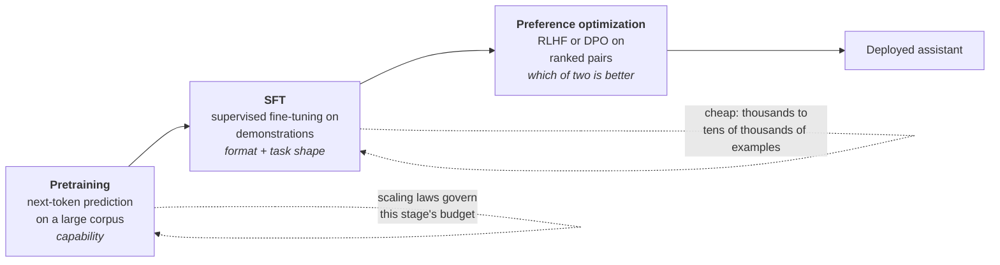
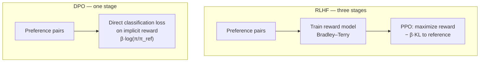

# Lesson 3 — Scaling Behavior & the Post-Training Stack

| | |
|---|---|
| **Prepares** | "You have a fixed compute budget — how big a model and how much data?" and "how does a base model become an assistant?" |
| **Time** | ~13 min visible + drills |
| **Domain tag** | LLMs / Scaling Laws & Alignment |
| **Last verified** | 2026-07-29 (scaling-law results and post-training methods checked on this date) |

> 📍 **How this lesson works:** two blocks that interviewers treat as one round. First, what more compute buys and how to spend it — an arithmetic question with a published answer. Second, what happens *after* pretraining, which is where "I've read about RLHF" and "I can state the objective" separate. An Applied Scientist candidate is expected to be exact about both.

## 🟢 The One Picture



**The division of labour to state out loud:** pretraining installs capability, SFT installs the *shape* of a good answer, and preference optimization installs *ranking* — the thing demonstrations cannot teach, because writing one good answer never says what makes it better than a plausible alternative.

---

## 🔷 Drill 1 — "You have a fixed compute budget. How big a model, and how many tokens?"

*A pure arithmetic question with a published answer. 60 seconds.*

<details><summary>✅ Model answer</summary>

Start with the budget identity. Training <abbr title="Floating-point operations: the standard unit for counting the arithmetic work in a training run">FLOPs</abbr> are approximately

$$C \approx 6ND$$

for $N$ parameters and $D$ training tokens (roughly 2 FLOPs per parameter for the forward pass and 4 for the backward).

Hoffmann et al. (2022) — the Chinchilla paper — fit loss as a function of both and minimized under that constraint. The result: **$N$ and $D$ should scale in roughly equal proportion**, giving a rule of thumb near **20 tokens per parameter**.

The empirical demonstration is the part to quote: **Chinchilla (70B parameters, 1.4T tokens) beat Gopher (280B parameters, 300B tokens) across benchmarks at the same training compute.** A model 4× smaller, trained on ~4.7× more data, won. That single comparison overturned the prevailing "make it bigger" reading of Kaplan et al. (2020), which had allocated most new compute to parameters.

For a worked instance: a $10^{22}$ FLOP budget gives $ND = 10^{22}/6 \approx 1.67 \times 10^{21}$; imposing $D = 20N$ yields $N \approx 9$B and $D \approx 180$B tokens.
</details>

<details><summary>🔁 The follow-up chain</summary>

"Why did Kaplan et al. get a different answer?" (their sweeps used a fixed learning-rate schedule not adapted to each run's token count, which biased the fit toward parameters; Chinchilla varied the schedule per run) → "What does the fitted loss curve look like?" (Chinchilla's parametric form is $L(N,D) = E + A/N^{\alpha} + B/D^{\beta}$ — an **irreducible term** $E$ plus two power laws, so loss approaches a floor rather than zero) → "What does that irreducible term represent?" (the entropy of the text itself: no model predicts genuinely unpredictable next tokens, so there is a floor no scaling reaches) → "Which of Chinchilla's three approaches does the 20:1 rule come from?" (**the isoFLOP and training-curve analyses, not the parametric fit** — Besiroglu et al. 2024 replicated the paper's third approach and found the published coefficients irreconcilable with its own data, since solving the constrained optimization with them yields a much higher token-per-parameter ratio; the Lab does exactly that calculation, and being able to say which approach a number rests on is a strong signal) → "Is the 20:1 rule still what people do?" (**no — and that's the next question**).
</details>

---

## 🔷 Drill 2 — "Modern models are trained far past 20 tokens per parameter. Why?"

*The question that tests whether you understood the constraint or memorized the ratio. 45 seconds.*

<details><summary>✅ Model answer</summary>

Because **Chinchilla optimizes training compute only**, and almost nobody's real objective is training compute.

If you serve a model to millions of requests, inference dominates lifetime cost — and inference cost scales with **parameters**, not with the tokens the model was trained on. So it pays to move down the compute-optimal curve: take a *smaller* model and train it far past the 20:1 point, accepting worse loss-per-training-FLOP in exchange for a permanently cheaper model to serve.

That is exactly what the Llama-family releases did — 8B-class models trained on multi-trillion-token corpora, on the order of a thousand-plus tokens per parameter, an order of magnitude past Chinchilla-optimal. Sardana et al. formalized it: once you add expected inference volume to the objective, the optimum shifts to smaller models trained longer.

> **Say it:** "Chinchilla answers 'minimize loss for a fixed training budget.' If you're serving the model, the objective includes inference, and inference cost scales with parameters — so you deliberately overtrain a smaller model. Llama-3-8B on trillions of tokens is that trade, not a mistake."
</details>

<details><summary>🔁 The follow-up chain</summary>

"Is there a limit to overtraining?" (returns diminish along the $B/D^{\beta}$ term, and eventually data quality and repetition bind — repeated epochs decay in value, so past a point you need new data, not more passes) → "How does quantization interact?" (a heavily overtrained model can be *more* sensitive to post-training quantization — the reported effect is that its weights carry more information per parameter, so a smaller footprint is not free) → "When would you still want the Chinchilla point?" (a research or one-off run whose output is a measurement rather than a served product).
</details>

---

## 🔷 Drill 3 — "Are emergent abilities real?"

*A judgment question. The strong answer is a qualified 'it depends what you mean'. 45 seconds.*

<details><summary>✅ Model answer</summary>

Partly. The original claim (Wei et al. 2022) was that some abilities appear **abruptly** past a scale threshold rather than improving smoothly.

Schaeffer et al. (2023) then showed a large share of those curves are **artifacts of the metric**. Exact-match and multi-step accuracy are *discontinuous* scoring functions: a 40-token answer that is 90% right scores zero, so a smooth improvement in per-token accuracy produces a step-shaped curve in the aggregate metric. Re-score the same model outputs with a continuous metric — token edit distance, log-likelihood of the correct answer — and the sharp jump usually flattens into a smooth trend. Small test sets and log-scaled axes exaggerate the effect further.

The balanced statement: **capabilities improve smoothly with scale; the *metrics we care about* can improve abruptly**, because a task that requires eight correct steps in a row stays at zero until per-step reliability is high enough. That is real and operationally important even when the underlying curve is smooth.

Saying only "emergence is a mirage" is as weak as saying only "emergence is real" — the informed answer names the metric-continuity mechanism and keeps the practical consequence.
</details>

<details><summary>🔁 The follow-up chain</summary>

"Then can you predict a capability before training?" (loss is predictable from scaling laws; downstream task performance much less so — which is why labs track proxy evals across a scan of smaller runs) → "What's the practical implication for your own evaluation?" (prefer continuous or partial-credit metrics when comparing model sizes; an exact-match-only suite will hide real progress) → "Does this affect the choice of benchmarks?" (yes — combine a hard discontinuous metric that reflects the product with a continuous one that shows movement).
</details>

---

## 🔷 Drill 4 — "How does a base model become an assistant? Name each stage and what it buys."

*The pipeline question. Names alone score nothing; the 'what it buys' column is the answer. 60 seconds.*

<details><summary>✅ Model answer</summary>

| Stage | Data | Objective | What it buys |
|---|---|---|---|
| **Pretraining** | Trillions of unlabeled tokens | Next-token cross-entropy | Capability and knowledge. The base model *completes* text; it does not answer |
| **SFT / instruction tuning** | 10³–10⁵ curated (prompt, response) pairs | Same cross-entropy, on demonstrations | The **format** of an answer: follow an instruction, stop, adopt the assistant register |
| **Preference optimization** | Ranked pairs: response A vs B | RLHF (reward model + PPO) or <abbr title="Direct Preference Optimization: trains a policy on preference pairs directly, using a closed-form relation between the optimal policy and the reward, so no separate reward model or RL loop is needed">DPO</abbr> | **Ranking** — helpfulness, honesty, refusal behavior, tone. What demonstrations cannot teach |

The load-bearing point is why the third stage exists at all: an SFT demonstration says "this is a good answer" but never says "this is *better than* that plausible alternative." Preference data supplies exactly that comparison, and comparison is also far cheaper and more reliable for humans to produce than writing gold answers — annotators agree far more on *which of two is better* than on what the ideal response should be.

Cost profile worth adding: pretraining is millions of dollars, SFT is thousands, preference optimization sits between. Nearly all of the behavior a user perceives comes from the two cheap stages.
</details>

<details><summary>🔁 The follow-up chain</summary>

"Can you skip SFT and do preference optimization on the base model?" (in principle, but it is unstable and inefficient — SFT gets the policy into a region where sampled responses are worth comparing at all) → "What is the alignment tax?" (measured regressions on some capability benchmarks after alignment; mitigated by mixing pretraining or SFT data back into the later stages) → "Where do reasoning models fit?" (a further stage of reinforcement learning against **verifiable** rewards — mathematics and code, where correctness is checkable — using group-relative methods such as GRPO instead of a learned reward model; this is the newest layer on the stack).
</details>

---

## 🔷 Drill 5 — "RLHF versus DPO. State both objectives and the real trade."

*The senior-signal question in this lesson. 75 seconds.*



<details><summary>✅ Model answer</summary>

**RLHF** (Ouyang et al. 2022) has three stages. Fit a reward model $r_\phi$ on preference pairs with the Bradley–Terry likelihood, $P(y_w \succ y_l) = \sigma(r(y_w) - r(y_l))$. Then optimize the policy with PPO against

$$\max_{\pi} \; \mathbb{E}_{y \sim \pi}[r_\phi(y)] - \beta \, \mathrm{KL}(\pi \,\|\, \pi_{\text{ref}})$$

The <abbr title="Kullback–Leibler divergence: a measure of how far one probability distribution has moved from another, used here to keep the tuned policy close to the model it started from">KL</abbr> term is not decoration — without it the policy drifts to whatever exploits the reward model, producing fluent, high-scoring, useless text. That is **reward hacking**, and the KL penalty is the leash.

**DPO** (Rafailov et al. 2023) removes the reward model entirely. The insight: for the KL-regularized objective above, the optimal policy has a closed form, which can be inverted to express the *reward* in terms of the policy. Substituting into the Bradley–Terry likelihood turns preference learning into a **direct classification loss on the policy** — the implicit reward is $\beta \log \frac{\pi_\theta(y)}{\pi_{\text{ref}}(y)}$. No reward model, no sampling loop, no PPO.

**The trade:** DPO is dramatically simpler, cheaper, and more stable — which is why it became the default for most teams. But it is **off-policy**: it only ever sees the fixed preference dataset, whereas RLHF keeps sampling from the *current* policy and scoring those samples, which supplies fresh signal exactly where the policy is now weak. When you have a strong reward model and compute to spare, online RLHF still tends to reach a higher ceiling. Iterative or online DPO variants exist precisely to recover some of that.
</details>

<details><summary>🔁 The follow-up chain</summary>

"What is $\beta$ in DPO?" (the same KL strength — how far the policy may move from the reference; too high freezes it, too low lets it degenerate) → "Does DPO have its own failure mode?" (yes — it can push down the likelihood of *both* responses in a pair while widening their gap, degrading the model even as the loss improves; it also overfits preference-data quirks) → "What is RLAIF?" (preference labels produced by a model instead of humans, following a written specification — Constitutional AI is the reference version; it trades some label quality for enormous scale) → "How would you tell if a reward model is being hacked?" (watch reward against a held-out human or stronger-model evaluation: reward climbing while independent quality falls is the fingerprint).
</details>

---

## 🟢 Concept Check

Chinchilla's headline result is that, at a fixed training-compute budget:

* [ ] Parameters should absorb most additional compute
* [x] Parameters and training tokens should scale in roughly equal proportion — about 20 tokens per parameter — demonstrated by 70B/1.4T beating 280B/300B
* [ ] Data quality matters more than quantity
* [x] The earlier Kaplan scaling recommendation was biased by learning-rate schedules that were not adapted per run

DPO's main advantage over RLHF is:

* [ ] It produces a better reward model
* [x] It removes the reward model and RL loop entirely — the optimal-policy closed form lets preference learning become a direct classification loss on the policy
* [ ] It requires no preference data
* [ ] It eliminates the KL constraint

<details>
<summary>🔑 Answers</summary>

**Q1: options 2 and 4.** Both are true and they are connected — the schedule artifact is *why* the earlier recommendation over-weighted parameters. Option 3 is a real fact about training but not Chinchilla's claim, and mixing the two is a common slip.

**Q2: option 2.** DPO still needs preference data (option 3) and still has a KL term — $\beta$ — hiding inside its implicit reward (option 4). What it removes is the separate reward model and the sampling loop. The trade to add unprompted: DPO is off-policy, so online RLHF can still reach a higher ceiling.
</details>

---

## 🔷 Rapid-Fire Rehearsal

```rehearsal-drill
RUBRIC: mechanism
TITLE: Scaling & Post-Training — Rapid Fire
INTRO: Arithmetic for the scaling questions, objectives for the alignment ones. Every answer should contain either a number or a loss function. Then stop.
MIN: 30
MAX: 90
[[Compute-optimal allocation]]
Q: Fixed compute budget — how big a model and how many tokens?
A: Start from **C ≈ 6ND** (about 2 FLOPs/param forward, 4 backward). Hoffmann et al. 2022 minimized fitted loss under that constraint and found **N and D should scale in roughly equal proportion — about 20 tokens per parameter.** **The demonstration to quote:** Chinchilla at **70B params / 1.4T tokens beat Gopher at 280B / 300B tokens** on the same training compute — 4× smaller, 4.7× more data, and it won. That overturned the "spend it on parameters" reading of Kaplan et al. 2020, whose fit was biased by a fixed learning-rate schedule not adapted per run. **Worked instance:** a 10²² FLOP budget gives ND ≈ 1.67×10²¹, so with D = 20N you get N ≈ 9B, D ≈ 180B.
[[Why models are overtrained now]]
Q: Modern models are trained far past 20 tokens per parameter. Why?
A: Because **Chinchilla optimizes training compute only**, and that is rarely the real objective. If you serve the model, **inference dominates lifetime cost, and inference cost scales with parameters — not with training tokens.** So you deliberately take a smaller model past the compute-optimal point, accepting worse loss-per-training-FLOP for a permanently cheaper model to serve. Llama-family 8B models trained on multi-trillion-token corpora are that trade, roughly an order of magnitude past Chinchilla-optimal. **The limit:** returns decay along the data term, repeated epochs lose value, and heavily overtrained models can be *more* sensitive to post-training quantization.
[[Are emergent abilities real]]
Q: Are emergent abilities real?
A: **Partly — and the qualified answer is the point.** Wei et al. 2022 claimed abrupt appearance past a scale threshold. Schaeffer et al. 2023 showed much of that is a **metric artifact**: exact-match and multi-step accuracy are discontinuous scoring functions, so a 90%-correct answer scores zero and smooth per-token improvement produces a step-shaped aggregate curve. Re-score with a continuous metric and the jump usually flattens; small test sets and log axes exaggerate it. **The balanced statement:** capabilities improve smoothly, but the *metrics we care about* can improve abruptly, because a task needing eight correct steps stays at zero until per-step reliability is high. **Practical consequence:** use partial-credit metrics when comparing model sizes, or you will hide real progress.
[[The post-training stack]]
Q: How does a base model become an assistant?
A: Three stages. **Pretraining** — trillions of unlabeled tokens, next-token cross-entropy → capability and knowledge; the base model *completes* text, it does not answer. **SFT** — 10³–10⁵ curated (prompt, response) pairs, same objective on demonstrations → the **format** of an answer: follow the instruction, stop, adopt the assistant register. **Preference optimization** — ranked pairs via RLHF or DPO → **ranking**: helpfulness, honesty, refusal, tone. **Why the third stage exists:** a demonstration says "this is good" but never "this is *better than* that plausible alternative" — and annotators agree far more on which of two responses is better than on what the ideal one is. Cost profile: pretraining is millions, SFT is thousands, and nearly all perceived behavior comes from the two cheap stages.
[[RLHF vs DPO]]
Q: RLHF versus DPO — state both objectives and the real trade.
A: **RLHF** (Ouyang et al. 2022): fit a reward model on preference pairs with the Bradley–Terry likelihood σ(r(y_w) − r(y_l)), then PPO on **E[r(y)] − β·KL(π ‖ π_ref)**. The KL term is the leash — without it the policy drifts into whatever exploits the reward model, which is **reward hacking**. **DPO** (Rafailov et al. 2023): the KL-regularized objective has a closed-form optimal policy, which can be inverted to express reward in terms of the policy; substituting into Bradley–Terry turns preference learning into a **direct classification loss**, with implicit reward β·log(π/π_ref). No reward model, no sampling loop. **The trade:** DPO is simpler, cheaper and more stable, but it is **off-policy** — it only sees a fixed dataset, while RLHF keeps scoring fresh samples from the *current* policy, which is why online RLHF can still reach a higher ceiling. **DPO's own failure mode:** it can push down the likelihood of both responses while widening their gap.
[[Detecting reward hacking]]
Q: How would you tell whether your reward model is being hacked?
A: Watch **proxy reward against an independent evaluation** — held-out human judgments or a stronger model — as training proceeds. The fingerprint is **reward climbing while independent quality falls**; that divergence is the definition of overoptimizing a proxy. Supporting signals: KL to the reference policy growing quickly, output length inflating (length is the most common reward-model bias), and stereotyped phrasings appearing across unrelated prompts. **Mitigations:** raise β, early-stop on the independent eval rather than reward, ensemble reward models, and refresh preference data on the current policy's own samples so the reward model stays in distribution.
```

---

## 🟢 Summary

- **$C \approx 6ND$** is the budget identity behind every scaling question. Chinchilla's compute-optimal allocation is roughly **20 tokens per parameter**, demonstrated by 70B/1.4T beating 280B/300B.
- **Compute-optimal is not deployment-optimal.** Inference cost scales with parameters, so serving-oriented models are deliberately overtrained far past 20:1.
- **Emergence is partly a metric artifact** — discontinuous scoring turns smooth capability gains into step curves — but the operational consequence for multi-step tasks is real.
- **The stack is capability → format → ranking:** pretraining, SFT, then preference optimization, which exists because demonstrations cannot express *better than*.
- **RLHF maximizes a learned reward under a KL leash; DPO folds that objective into a direct classification loss.** DPO's simplicity costs on-policy signal.

**References:** Kaplan et al. 2020 (scaling laws, arXiv:2001.08361) · Hoffmann et al. 2022 (Chinchilla, arXiv:2203.15556) · Besiroglu et al. 2024 (Chinchilla replication attempt, arXiv:2404.10102) · Sardana et al. 2023 (beyond Chinchilla-optimal / inference-aware scaling, arXiv:2401.00448) · Wei et al. 2022 (emergent abilities, arXiv:2206.07682) · Schaeffer et al. 2023 (are emergent abilities a mirage?, arXiv:2304.15004) · Ouyang et al. 2022 (InstructGPT / RLHF, arXiv:2203.02155) · Rafailov et al. 2023 (DPO, arXiv:2305.18290) · Bai et al. 2022 (Constitutional AI / RLAIF, arXiv:2212.08073) · Shao et al. 2024 (GRPO, arXiv:2402.03300) · Gao et al. 2022 (reward-model overoptimization, arXiv:2210.10760).

**Next:** [Lesson 4 — The RAG Design Space](04_rag_design_space.md)
