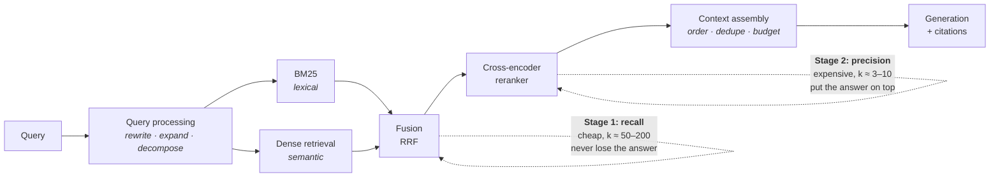

# Lesson 4 — The RAG Design Space

| | |
|---|---|
| **Prepares** | "Design the retrieval system" — the round your RAG bullet invites, where Session 2 defended what you *measured* and this defends what you would *build* |
| **Time** | ~13 min visible + drills |
| **Domain tag** | LLMs / Retrieval-Augmented Generation |

> 📍 **How this lesson works:** Session 2 defended your failure-mode analysis — the definitions, the sweep, the oracle-context test. That was one point in a design space. This lesson is the space: the standard production stack, what each stage is *for*, and the comparison against the two alternatives (fine-tuning and long context) that an interviewer will always raise. Chunking mechanics and failure taxonomy are Session 2's; they are not repeated here.

## 🟢 The One Picture

Every serious retrieval stack is two stages with opposite objectives, and naming that split is the fastest way to sound like you have built one.



**Stage 1 must not lose the answer; stage 2 must put it first.** A retrieval bug is almost always a stage-1 recall failure, and a "the model ignored the context" complaint is usually a stage-2 ordering failure.

---

## 🔷 Drill 1 — "Design a retrieval system for a support knowledge base. Start from nothing."

*An open design question — so give the stack, then the reason for each stage. 90 seconds.*

<details><summary>✅ Model answer</summary>

I'd build the two-stage pipeline above and justify each stage by what it prevents:

1. **Query processing.** Raw user queries are often conversational or under-specified. Rewriting a follow-up into a standalone query fixes the most common multi-turn failure; decomposing a compound question fixes the multi-hop one.
2. **Hybrid first-stage retrieval.** BM25 and a dense encoder, run in parallel, fused. This is the recall stage — I would tune it at $k \approx 100$ and measure **recall@k against known gold passages**, not end-to-end accuracy, because a document that never enters the candidate set cannot be recovered downstream.
3. **Cross-encoder reranker.** Reorder those ~100 down to the 5 that go in the prompt. This is where precision comes from.
4. **Context assembly.** Deduplicate near-identical chunks, respect a token budget, and place the highest-scoring passages at the **start and end** of the context, because attention to the middle is measurably weaker.
5. **Generation with citations.** Require the model to cite chunk IDs, which makes hallucination detectable rather than merely suspected.

Then the measurement plan, which is the part that makes this an Applied Scientist answer rather than an architecture diagram: **retrieval recall@k and reranker nDCG measured separately from end-to-end answer accuracy**, plus the oracle-context run that tells me the generation ceiling. Without those three numbers I cannot attribute a failure to a stage.
</details>

<details><summary>🔁 The follow-up chain</summary>

"What would you build *first*?" (BM25 plus the generator, with an eval set — a lexical baseline is one afternoon of work and frequently strong; every later stage has to beat it) → "Where does chunking fit?" (an index-time decision that interacts with the whole stack — Session 2's sweep is the method; the design point here is that retrieval and generation want different chunk sizes, which is why 'retrieve small, expand to the parent section before generating' is a standard fix) → "What's the first thing you'd measure in production?" (the fraction of queries where the top-1 passage is never cited by the generator — cheap to compute and it separates retrieval problems from generation problems).
</details>

---

## 🔷 Drill 2 — "Why hybrid? Aren't embeddings strictly better than BM25?"

*A favourite, because the confident answer is wrong. 60 seconds.*

<details><summary>✅ Model answer</summary>

No. They fail on **disjoint** query types, which is exactly why fusing them beats either alone.

<abbr title="A lexical ranking function scoring documents by query-term frequency, damped by document length and weighted by how rare each term is across the corpus">BM25</abbr> matches terms and weights them by rarity. It is unbeatable on the queries where the *literal string* is the signal: a product SKU, an error code `ERR_1042`, a person's name, a rare API method, a term the embedder never saw in training. Because it needs no training, it also transfers to any new domain immediately.

A dense <abbr title="An encoder that maps a query and a document to vectors independently, so document vectors can be precomputed and searched at scale — at the cost of never letting the two texts interact">bi-encoder</abbr> matches meaning, so it handles paraphrase, synonymy, and questions phrased nothing like the document. Its structural weakness: it compresses an entire passage into one fixed vector — a lossy summary — so exact rare tokens can vanish.

Fusion is usually **reciprocal rank fusion**, which needs no score calibration between the two systems because it uses only ranks:

$$\text{RRF}(d) = \sum_{s \in \text{systems}} \frac{1}{\kappa + \text{rank}_s(d)}, \qquad \kappa \approx 60$$

That score-free property is why RRF is the default: BM25 scores and cosine similarities are not on a comparable scale, and trying to blend them numerically means tuning a weight per corpus.

> **Say it:** "They fail on different queries. BM25 owns exact rare strings — error codes, SKUs, names — and needs no training data. Dense owns paraphrase. I'd fuse with reciprocal rank fusion because it's rank-based, so I don't have to calibrate two incomparable score scales."
</details>

<details><summary>🔁 The follow-up chain</summary>

"When is dense alone acceptable?" (a narrow domain the embedder was trained or fine-tuned on, where queries are natural-language and identifiers are rare) → "What is ColBERT and where does it sit?" (late interaction — per-token embeddings scored with a max-similarity operator, keeping much of a cross-encoder's power while remaining indexable; it sits between bi-encoder and cross-encoder in both quality and cost) → "What is HyDE?" (generate a hypothetical answer with the model, embed *that*, and retrieve with it — it works because a fake answer is distributionally closer to real passages than a question is; costs an extra LLM call per query).
</details>

---

## 🔷 Drill 3 — "What does a cross-encoder reranker do that retrieval can't, and what does it cost?"

*Mechanism plus latency arithmetic. 60 seconds.*

<details><summary>✅ Model answer</summary>

A bi-encoder embeds the query and the document **separately**, so they never interact — the only thing the model can compare is two summaries. A **cross-encoder** concatenates them into one input and runs full attention across both, so every query token can attend to every document token. That is what lets it catch negation, qualifiers, and precise conditions ("does *not* apply to Enterprise plans") that survive neither summary.

The cost is structural: because scoring depends on the pair, **nothing can be precomputed**. You cannot index cross-encoder scores, so you pay one forward pass per (query, document) pair at query time.

The arithmetic that fixes the design: at ~10 ms per pair on a small reranker, 100 candidates cost ~1 s serialized — usually too slow, so you batch them into one GPU call and land in the tens of milliseconds, or rerank only the top 25. Reranking the whole corpus is impossible by construction. **That constraint is the reason for the two-stage architecture in the first place** — cheap recall over everything, expensive precision over a shortlist.
</details>

<details><summary>🔁 The follow-up chain</summary>

"How much does a reranker actually buy?" (on a hybrid first stage, the typical reported gain is several points of nDCG@10 — it is one of the highest value-per-effort components, and the honest framing is that it matters most when your first stage returns many *topically* right but *specifically* wrong passages) → "Could an LLM be the reranker?" (yes — listwise LLM reranking is strong, and much slower and pricier; it is a good offline labeler for training a small cross-encoder) → "Where else can you spend that latency instead?" (query rewriting, or simply retrieving more candidates — worth saying that you would A/B the reranker against a bigger $k$ before assuming it wins).
</details>

---

## 🔷 Drill 4 — "RAG, fine-tuning, or long context? Give me your decision rule."

*The highest-frequency question in this area. Answer with a rule, not a preference. 75 seconds.*

<details><summary>✅ Model answer</summary>

They solve different problems, so the decision starts by naming which one you have:

| Need | Choose | Why |
|---|---|---|
| Facts the model doesn't hold; corpus changes; attribution required | **RAG** | Updating an index is instant and auditable; fine-tuning is neither |
| Format, style, task shape, domain register, a narrower output space | **Fine-tuning** | Behavior is exactly what gradient updates install well |
| Small, stable, self-contained context per request | **Long context** | No infrastructure at all — put the documents in the prompt |

The two sharp claims to make:

- **Fine-tuning is a poor knowledge-insertion mechanism.** Teaching new facts by fine-tuning needs many paraphrases of each fact, yields unreliable recall, gives no attribution, and must be redone when the fact changes. Ovadia et al. (2023) measured this directly and found retrieval ahead of fine-tuning for knowledge injection.
- **Long context does not delete the retrieval problem, it relocates it.** Cost is the first reason: prefill is quadratic in length and the KV cache grows linearly, so a 100k-token prompt per request is expensive on every request, forever. Quality is the second: Liu et al. (2023) showed the **lost-in-the-middle** effect — accuracy is highest when the relevant passage sits at the beginning or end of the context and drops measurably in the middle. Feeding a model 100 documents to find one is a worse use of long context than feeding it the 5 a reranker chose.

And they compose. The strong production answer is usually **RAG for knowledge + a fine-tuned or prompted generator for behavior**, evaluated separately.

> **Say it:** "Different problems. Knowledge that changes and needs citations goes to retrieval; format and task shape go to fine-tuning; a small self-contained corpus goes in the prompt. Fine-tuning teaches facts unreliably and long context relocates the ranking problem into the prompt, where lost-in-the-middle bites — so in practice I'd combine retrieval for knowledge with fine-tuning for behavior."
</details>

<details><summary>🔁 The follow-up chain</summary>

"Long-context models keep improving — does RAG go away?" (cost stays: retrieval turns an $O(n^2)$ prefill over everything into a bounded prompt, and it also gives access control, freshness, and citations that a stuffed prompt cannot; the *quality* argument weakens over time while the cost and governance argument does not) → "Where does prompt caching change this?" (materially, for a corpus that is *shared and static* across requests — cache the prefix and long context becomes much cheaper; it does not help when each request needs different documents) → "How does this apply to your own project?" (⚠️ candidate-specific: your failure analysis found generation-side errors dominant, which is a *behavior* problem — the honest read is that better prompting or a fine-tuned generator was indicated more strongly than better retrieval, and saying that shows you interpreted your own result).
</details>

---

## 🔷 Drill 5 — "Which vector index, and what does it cost you?"

*⚠️ JD-DEPENDENT depth — an applied search team will push here. 60 seconds.*

<details><summary>✅ Model answer</summary>

| Index | Mechanism | Trade |
|---|---|---|
| **Flat** | Exhaustive exact search | Perfect recall, linear in corpus size. Correct below ~10⁵–10⁶ vectors, and the ground truth you measure against |
| **IVF** | Cluster into cells, probe a few | Big speedup; recall depends on how many cells you probe |
| **IVF-PQ** | IVF plus product quantization of the residuals | Large memory reduction (often 10–30×), with quantization error costing recall |
| **HNSW** | Navigable small-world graph, greedy descent | Excellent recall/latency, higher memory, and slower to build |

The point that matters more than the table: **approximate nearest neighbour search introduces a second, independent recall loss** on top of your embedding model's. If your embedder retrieves the gold passage in its true top-5 but the index only returns approximate neighbours, you lose answers to the *index*, not the model — and this failure is invisible unless you look for it.

So the rule I would state: **build a flat index on a sample and measure ANN recall against exact search.** If HNSW at your parameters returns 92% of the exact top-10, that 8% is a hard ceiling on everything downstream, and it should appear in your error budget alongside the embedder's.
</details>

<details><summary>🔁 The follow-up chain</summary>

"How do you handle metadata filters?" (pre-filtering can wreck an ANN graph's connectivity while post-filtering can return too few results; production systems use filtered-search support in the index, and a highly selective filter is often better served by a lexical or database query first) → "What about updates?" (HNSW supports incremental insertion but degrades with heavy deletion, so periodic rebuilds are normal; IVF centroids drift as the corpus changes — plan the rebuild cadence rather than discovering it) → "When does the embedding model change force a rebuild?" (always — vectors from two embedders are not comparable, so a model upgrade means re-embedding the corpus, which is the real cost of switching).
</details>

---

## 🟢 Concept Check

Why does a hybrid BM25 + dense retriever usually beat either component alone?

* [ ] Because it doubles the number of retrieved documents
* [x] Because they fail on disjoint query types — BM25 owns exact rare strings like error codes and names, dense owns paraphrase — and rank-based fusion combines them without needing comparable score scales
* [ ] Because BM25 is more accurate but slower
* [ ] Because dense retrieval cannot handle long documents

A cross-encoder reranker cannot be used as the first-stage retriever because:

* [ ] It is less accurate than a bi-encoder
* [x] Its score depends on the query–document pair jointly, so nothing can be precomputed or indexed — it needs one forward pass per pair, which is impossible over a whole corpus
* [ ] It only works on short documents
* [ ] It requires labeled training data

<details>
<summary>🔑 Answers</summary>

**Q1: option 2.** The "disjoint failures" framing is the whole answer, and the RRF detail — rank-based, so no score calibration — is what shows you have implemented it rather than read about it.

**Q2: option 2.** The impossibility is structural, not a matter of degree, and it is precisely why the two-stage architecture exists: cheap recall over everything, expensive precision over a shortlist.
</details>

---

## 🔷 Rapid-Fire Rehearsal

```rehearsal-drill
RUBRIC: mechanism
TITLE: RAG Design Space — Rapid Fire
INTRO: Design answers, so lead with the stage and its purpose. Every claim should come with the measurement that would confirm it. Then stop.
MIN: 40
MAX: 100
[[The two-stage stack]]
Q: Design a retrieval system for a support knowledge base, starting from nothing.
A: Two stages with opposite objectives. **Stage 1 — recall (cheap, k ≈ 100):** query rewriting for follow-ups and compound questions, then **BM25 and a dense encoder in parallel, fused with RRF**. Tune it on **recall@k against gold passages** — a document that never enters the candidate set cannot be recovered downstream. **Stage 2 — precision (expensive, k ≈ 5):** a cross-encoder reranker, then context assembly (dedupe, token budget, **best passages at the start and end** because attention to the middle is weaker), then generation **with chunk citations** so hallucination is detectable. **The part that makes it an AS answer:** measure retrieval recall@k and reranker nDCG *separately* from end-to-end accuracy, plus an oracle-context run for the generation ceiling — without those three numbers you cannot attribute a failure to a stage. **Build first:** BM25 + generator + an eval set; everything else must beat that baseline.
[[Why hybrid retrieval]]
Q: Why hybrid? Aren't embeddings strictly better than BM25?
A: **No — they fail on disjoint query types.** BM25 weights terms by rarity and owns queries where the literal string is the signal: SKUs, error codes like ERR_1042, personal names, rare API methods, any term the embedder never saw — and it needs no training, so it transfers to a new domain immediately. A dense bi-encoder owns paraphrase and synonymy, but **compresses a whole passage into one vector**, a lossy summary in which rare exact tokens vanish. **Fuse with reciprocal rank fusion:** RRF(d) = Σ 1/(κ + rank_s(d)), κ ≈ 60. **Why RRF specifically:** it uses ranks only, so you never have to calibrate BM25 scores against cosine similarities, which are not on a comparable scale.
[[Cross-encoder rerankers]]
Q: What does a cross-encoder reranker do that retrieval can't, and what does it cost?
A: A bi-encoder embeds query and document **separately** — they never interact, so only two summaries are compared. A cross-encoder **concatenates them and runs full attention across both**, so every query token attends to every document token, catching negation, qualifiers and precise conditions ("does *not* apply to Enterprise plans"). **The cost is structural: nothing can be precomputed**, because the score depends on the pair — one forward pass per (query, document). At ~10 ms/pair, 100 candidates cost ~1 s serialized; batch them into one GPU call for tens of ms, or rerank only the top 25. **That impossibility is exactly why the architecture is two-stage:** cheap recall over everything, expensive precision over a shortlist.
[[RAG vs fine-tuning vs long context]]
Q: RAG, fine-tuning, or long context? Give me a decision rule.
A: **Different problems.** Facts the model lacks, a corpus that changes, attribution required → **RAG**, because updating an index is instant and auditable. Format, style, task shape, domain register → **fine-tuning**, because behavior is what gradient updates install well. Small, stable, self-contained context per request → **long context**, with no infrastructure at all. **Two sharp claims:** (1) fine-tuning is a poor knowledge-insertion mechanism — it needs many paraphrases per fact, recalls unreliably, gives no attribution, and must be redone when facts change (Ovadia et al. 2023 measured retrieval ahead of it). (2) Long context **relocates** the retrieval problem rather than deleting it: prefill is quadratic and the KV cache grows linearly, so a 100k prompt is expensive on every request forever, and **lost-in-the-middle** (Liu et al. 2023) means accuracy is highest at the start and end of the context. **They compose:** retrieval for knowledge, fine-tuning for behavior, evaluated separately.
[[Vector index choice]]
Q: Which vector index, and what does it cost you?
A: **Flat** — exhaustive and exact: perfect recall, linear cost; correct below ~10⁵–10⁶ vectors and the ground truth you measure against. **IVF** — cluster and probe: big speedup, recall set by how many cells you probe. **IVF-PQ** — adds product quantization: 10–30× memory reduction, paid for in quantization error. **HNSW** — navigable small-world graph: excellent recall/latency, higher memory, slow to build. **The point that beats the table:** ANN introduces a **second, independent recall loss** on top of the embedder's, and it is invisible unless you look. **So:** build a flat index on a sample and measure ANN recall against exact search — if HNSW returns 92% of the exact top-10, that 8% is a hard ceiling on everything downstream and belongs in your error budget.
[[Operating a retrieval system]]
Q: What breaks in a retrieval system after it ships?
A: Four things, all measurable. **(1) Index drift** — new documents change IVF centroids and heavy deletion degrades HNSW graphs, so schedule rebuilds rather than discovering the need. **(2) Embedder upgrades force a full re-embed** — vectors from two models are not comparable, and that migration cost is the real price of switching. **(3) Filtered search** — pre-filtering can disconnect an ANN graph, post-filtering can return too few results; a highly selective filter is often better served by a lexical or database query first. **(4) Query distribution shift** — the queries users actually send diverge from your eval set, so sample production queries periodically and re-measure recall@k on them. **The monitoring line worth volunteering:** track the fraction of queries where the top-1 passage is never cited by the generator; it is cheap and separates retrieval failures from generation failures.
```

---

## 🟢 Summary

- **Two stages, opposite objectives.** Stage 1 (hybrid retrieval, $k \approx 100$) must not lose the answer; stage 2 (cross-encoder reranker, $k \approx 5$) must put it first.
- **Hybrid wins because BM25 and dense retrieval fail on disjoint queries.** Fuse with rank-based RRF so you never calibrate incomparable scores.
- **Cross-encoders cannot be indexed** — the score depends on the pair. That constraint creates the two-stage architecture.
- **RAG for knowledge, fine-tuning for behavior, long context for small self-contained inputs.** Fine-tuning inserts facts poorly; long context relocates ranking into the prompt, where lost-in-the-middle applies.
- **ANN search adds its own recall loss.** Measure it against exact search and put the number in your error budget.

**References:** Lewis et al. 2020 (RAG, arXiv:2005.11401) · Karpukhin et al. 2020 (DPR, arXiv:2004.04906) · Robertson & Zaragoza 2009 (BM25, *Foundations and Trends in IR* 3(4)) · Cormack et al. 2009 (reciprocal rank fusion, SIGIR '09) · Nogueira & Cho 2019 (BERT rerankers, arXiv:1901.04085) · Khattab & Zaharia 2020 (ColBERT, arXiv:2004.12832) · Gao et al. 2022 (HyDE, arXiv:2212.10496) · Malkov & Yashunin 2016 (HNSW, arXiv:1603.09320) · Liu et al. 2023 (lost in the middle, arXiv:2307.03172) · Ovadia et al. 2023 (fine-tuning vs retrieval for knowledge injection, arXiv:2312.05934).

**Next:** [Lesson 5 — Evaluating LLM Systems](05_evaluating_llm_systems.md)
