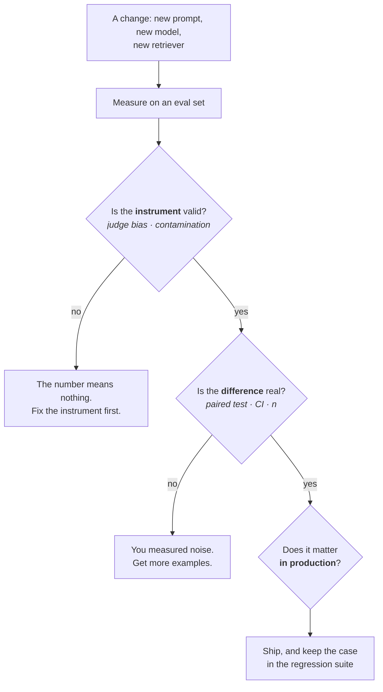

# Lesson 5 — Evaluating LLM Systems

| | |
|---|---|
| **Prepares** | The round-closing question on every applied LLM loop: "how would you know it got better?" — and the statistics most candidates skip |
| **Time** | ~13 min visible + drills |
| **Domain tag** | LLMs / Evaluation Methodology |

> 📍 **How this lesson works:** Session 2 defended *your* judge on *your* RAG study — its bias direction, your audit sample. This lesson is the general methodology: whether a measured difference is real, what an LLM judge can and cannot be trusted with, why public benchmark numbers are unreliable, and how to assemble a suite. For an Applied Scientist this is the highest-signal material in the session, because experimental judgment is the job.

## 🟢 The One Picture



**Two gates before any number counts: the instrument, then the statistics.** Candidates almost always skip straight to the third box, and interviewers notice.

---

## 🔷 Drill 1 — "You changed a prompt. Accuracy went 71% → 74% on 200 examples. Did it improve?"

*The single highest-value question in this lesson. Answer with arithmetic. 60 seconds.*

<details><summary>✅ Model answer</summary>

**Not established — and the first thing to fix is that the question was asked in the unpaired form.**

Unpaired first, to show the scale of the noise. For $p \approx 0.72$, $n = 200$:

$$\mathrm{SE} = \sqrt{\frac{p(1-p)}{n}} = \sqrt{\frac{0.72 \times 0.28}{200}} \approx 0.032$$

Each estimate carries ±3.2 percentage points of standard error, so a 3-point gap between two independent estimates is comfortably inside noise.

But both systems ran on **the same 200 examples**, so the comparison is **paired**, and pairing is far more powerful. Only the **discordant** examples carry information: those the new prompt fixed ($b$) and those it broke ($c$). Examples both got right or both got wrong tell you nothing about the difference. With $n = 200$ and a 3-point net gain, you might see $b = 12$, $c = 6$ — and <abbr title="A paired test for binary outcomes that uses only the cases where two systems disagree, ignoring cases where both are right or both are wrong">McNemar's test</abbr> on 12 versus 6 gives roughly $p \approx 0.24$: still not significant.

**So my answer is: I can't conclude an improvement.** What I'd do: run McNemar's on the paired outcomes, report a bootstrap confidence interval on the difference, and — most usefully — **read the 18 discordant examples**, because their pattern tells me more than the aggregate does. If the effect is real and I need to prove it, roughly 4× the examples buys half the interval.

> **Say it:** "Three points on 200 examples is inside noise — the standard error alone is about 3.2 points. But it's a paired comparison, so I'd run McNemar's on just the examples that changed. Twelve fixed against six broken isn't significant either. I'd get more examples, and I'd read the ones that flipped."
</details>

<details><summary>🔁 The follow-up chain</summary>

"How many examples would you need?" (for a ~3-point effect at these rates, roughly a thousand or more for paired detection — the exact number depends on the discordance rate, and the useful move is to *estimate discordance from a pilot* rather than guess) → "What if you can't get more?" (report the interval honestly and treat the change as unproven; ship on other grounds — latency, cost, qualitative review — but do not claim an improvement you did not measure) → "What if you tested 20 prompt variants and picked the best?" (**multiple comparisons** — the winner's estimate is inflated by selection; you need a held-out set to re-measure the chosen variant, and this is the most common silent error in prompt engineering).
</details>

---

## 🔷 Drill 2 — "You use an LLM as a judge. Convince me the numbers mean anything."

*Session 2 defended one judge; this is the general validity argument. 75 seconds.*

<details><summary>✅ Model answer</summary>

A judge is an **instrument with measurement error**, so I treat it the way I would treat a noisy sensor: characterize the error, then correct the design around it.

The documented biases, and the fix for each:

| Bias | What it does | Fix |
|---|---|---|
| **Position** | Prefers whichever response is shown first | Evaluate both orders, average; count disagreement between orders as a noise estimate |
| **Verbosity** | Prefers longer answers regardless of content | Control for length; check whether the score gap survives length matching |
| **Self-preference** | Prefers text from its own model family | Judge with a different family than the one generating |
| **Style over substance** | Rewards confident, well-formatted prose | Give a rubric with explicit criteria and a reference answer, not "rate 1–10" |

Two design choices do most of the work: **pairwise beats absolute** (models are much better at "which is better" than at "score this 7 or 8"), and **a reference answer plus an explicit rubric** anchors the judgment.

Then the step that makes it defensible: **audit against human labels.** Sample 100–200 items, label them myself, and report **agreement and Cohen's $\kappa$** — the chance-corrected number, since raw agreement on a skewed set can look high while carrying no information. I would state the judge's agreement rate alongside every result it produced, exactly as I would report an annotator's.

Zheng et al. (2023) is the reference point: on MT-Bench, a strong judge reached roughly human-to-human levels of agreement — which is the honest bar, since human annotators disagree with each other too.
</details>

<details><summary>🔁 The follow-up chain</summary>

"What should a judge *never* decide?" (anything with a cheaper ground truth — exact match, unit tests, schema validation, retrieval recall against gold passages; using a judge where a deterministic check exists adds error for no reason) → "What if the judge and human disagree systematically?" (that is information: measure the *direction* of the bias, then either fix the rubric or report the judge's score as an offset estimate rather than an absolute) → "How does the judge interact with your own model choice?" (if you optimize prompts against a judge for long enough you overfit the judge — the same overoptimization pattern as reward hacking in Lesson 3; a held-out human-labeled set is the guard).
</details>

---

## 🔷 Drill 3 — "A vendor claims 92% on a public benchmark. What's your first question?"

*A skepticism question. The right answer is a specific mechanism, not general doubt. 45 seconds.*

<details><summary>✅ Model answer</summary>

**"Was the benchmark in the training data?"** <abbr title="Test examples appearing in a model's training corpus, so a reported score reflects memorization rather than the ability the benchmark claims to measure">Contamination</abbr> is the default assumption for any public benchmark old enough to be scraped, not an exotic risk. Popular test sets appear verbatim in web crawls, in GitHub, and in papers quoting examples.

Concrete evidence that it matters: Zhang et al. (2024) built **GSM1k**, a fresh set matched in difficulty to GSM8K's distribution, and found accuracy drops of up to ~13 points for some model families while others held steady — a gap that is hard to explain by anything but memorization of the original.

How I would check:

1. **N-gram overlap** between test items and any accessible training corpus (13-gram matching is the common convention).
2. **Ordering and perturbation tests** — rename entities, change numbers, shuffle multiple-choice options. Memorized items degrade sharply; genuine ability does not.
3. **Canary strings** if the benchmark ships them.
4. **A private eval set** built from your own data, which is the only durable answer.

The practical version I would give an interviewer: **public benchmarks are for coarse screening; a private, task-specific set decides.** That is also the honest reason nobody ships on MMLU.
</details>

<details><summary>🔁 The follow-up chain</summary>

"If you build a private set, how do you keep *it* clean?" (never publish it, never paste it into a hosted model whose provider trains on inputs, version it, and refresh a slice periodically) → "How many examples does a private set need?" (enough for the effect size you care about — from Drill 1, low hundreds detects large differences, low thousands detects a few points; better to have 300 carefully labeled than 3,000 noisy ones) → "What about benchmarks that resist contamination by design?" (continuously refreshed sets and held-out private splits help; they trade reproducibility for freshness, so read them as a different instrument rather than a better one).
</details>

---

## 🔷 Drill 4 — "Design an evaluation suite for a RAG assistant."

*An open design question. Answer with layers, and say what each layer catches. 75 seconds.*

<details><summary>✅ Model answer</summary>

Four layers, because a single end-to-end number cannot attribute a failure to a stage.

| Layer | Measures | Catches |
|---|---|---|
| **Component** | recall@k for retrieval, nDCG@10 for the reranker | Retrieval regressions invisible in end-to-end accuracy |
| **End-to-end** | Answer correctness, **groundedness** (is every claim supported by a retrieved passage?), citation precision, correct refusal | Hallucination and over-refusal, which pull in opposite directions |
| **Regression** | A fixed suite of every previously-fixed failure | Silent reintroduction of an old bug by an unrelated change |
| **Online** | Thumbs, escalation rate, task completion | The gap between the eval set and reality |

Three practices I would insist on:

- **The oracle-context run** — feed the gold passages directly. It separates the generation ceiling from retrieval quality, and it is the single most informative diagnostic run in a RAG system (this is the method from Session 2, generalized).
- **Groundedness measured separately from correctness.** An answer can be right and unsupported (lucky parametric knowledge) or supported and wrong (bad passage). Collapsing them hides both.
- **Refusal as a scored outcome, not a failure.** If the corpus does not contain the answer, "I don't know" is the correct behavior, and a suite that never rewards it trains you to build a system that always guesses.

Frameworks such as RAGAS package several of these; the reason to know the layers rather than the tool is that the tool changes and the attribution logic does not.
</details>

<details><summary>🔁 The follow-up chain</summary>

"Where do the eval questions come from?" (real user queries where possible, stratified by type; synthetic generation from your own corpus is acceptable for coverage but **biases toward questions your corpus answers well**, so it must be mixed with real ones) → "How do you keep the set from going stale?" (add every production failure to it — the suite should grow monotonically, which also makes it the regression layer) → "What single number would you report to a product manager?" (none alone — but if forced, end-to-end correctness with its confidence interval, always with the groundedness rate beside it, because those two moving in opposite directions is the most important thing a summary can show).
</details>

---

## 🔷 Drill 5 — "Arena-style pairwise ranking is popular. What does it hide?"

*A judgment question about the field's own instrument. 45 seconds.*

<details><summary>✅ Model answer</summary>

Pairwise human preference — the Chatbot Arena design — solves real problems: it needs no reference answers, resists contamination because prompts are fresh and user-supplied, and aggregates cleanly into a Bradley–Terry or Elo rating.

What it hides:

- **Preference is not correctness.** Users reward tone, formatting, confidence, and length. A model that is more agreeable and better formatted can outrank a more accurate one — the same style-over-substance bias as an LLM judge, now in humans.
- **It is an average over an unrepresentative prompt mix.** Arena traffic is dominated by casual, general prompts; a model ranked third overall can be clearly first on your specific task. Ranking on the general distribution says little about your distribution.
- **Ratings assume a stable, transitive comparison.** Models are updated behind the same name, so the population being compared drifts under the measurement.
- **Aggregate ratings compress capabilities that trade off** — safety refusals, long-context ability, tool use — into one scalar.

The usable conclusion: **treat arena ratings as a prior for shortlisting, never as evidence for your task.** Two candidate models within a few rating points are indistinguishable for your purposes until you have run them on your own set.
</details>

<details><summary>🔁 The follow-up chain</summary>

"Is category-level arena data better?" (yes — per-category ratings and style-controlled variants address part of the objection, and both are now standard; they narrow the prompt-mix problem without removing it) → "How many pairwise votes does a rating need?" (thousands per pair for confidence intervals tight enough to separate close models — the published intervals are worth reading before quoting a rank) → "What is the equivalent trap in your own evaluation?" (reporting one aggregate number over a mixed eval set — always slice by query type, because the aggregate can hide a large regression on a small, important slice).
</details>

---

## 🟢 Concept Check

Two prompts are evaluated on the same 200 examples: 71% vs 74%. The correct analysis is:

* [ ] A two-sample proportion test on the two accuracies
* [x] A paired test on the discordant examples only — the same items were used for both systems, so McNemar's on "fixed" vs "broken" counts is both the correct and far more powerful analysis
* [ ] Accept it as an improvement, since 74 > 71
* [ ] Nothing — a 3-point difference is always noise

The most reliable fix for an LLM judge's position bias is:

* [ ] Use a larger judge model
* [x] Evaluate both orderings and average — and treat disagreement between the two orderings as a direct estimate of judge noise
* [ ] Increase the temperature
* [ ] Ask the judge to explain itself first

<details>
<summary>🔑 Answers</summary>

**Q1: option 2.** Option 1 is defensible but wasteful — it throws away the pairing and would call this noise on a technicality rather than for the right reason. Option 4 is wrong as stated: whether 3 points is noise depends on $n$ and the discordance rate, which is precisely what the test computes.

**Q2: option 2.** Order-swapping directly cancels the bias and yields a free noise estimate. Option 4 (chain-of-thought before the verdict) helps quality somewhat but does not remove position bias; option 1 reduces it without eliminating it.
</details>

---

## 🔷 Rapid-Fire Rehearsal

```rehearsal-drill
RUBRIC: mechanism
TITLE: Evaluating LLM Systems — Rapid Fire
INTRO: Statistics and instrument validity. If an answer can contain a number or a test name, it must. Then stop.
MIN: 40
MAX: 100
[[Is a 3-point gain real]]
Q: A prompt change moved accuracy from 71% to 74% on 200 examples. Did it improve?
A: **Not established.** Unpaired standard error at p ≈ 0.72, n = 200 is **√(0.72·0.28/200) ≈ 0.032** — ±3.2 points on each estimate, so a 3-point gap sits inside noise. **But both ran on the same 200 items, so the comparison is paired**, and pairing is far more powerful: only the **discordant** examples carry information — those fixed (b) and those broken (c). A 3-point net gain might be b = 12 against c = 6, and **McNemar's** on those counts gives roughly p ≈ 0.24 — still not significant. **So:** run McNemar's, report a bootstrap CI on the difference, and **read the 18 examples that flipped** — their pattern tells you more than the aggregate. Roughly 4× the examples halves the interval.
[[The multiple-comparisons trap]]
Q: You tried 20 prompt variants and picked the best. What's wrong?
A: **Selection inflates the winner's estimate.** With 20 variants, the maximum observed score is biased upward even if every variant is identical in truth — you have partly selected on noise. **The fix:** re-measure the chosen variant on a **held-out set it was never selected on**, and report *that* number. Optionally correct for multiplicity when reporting the search itself. **Why this matters more than it sounds:** it is the most common silent error in prompt engineering, because trying many variants feels like diligence rather than like a statistical hazard. The same logic applies to picking a checkpoint by validation score, then quoting that score as the result.
[[Making a judge defensible]]
Q: You use an LLM as a judge. Convince me the numbers mean anything.
A: Treat it as **an instrument with measurement error** — characterize the error, then design around it. **Documented biases and fixes:** *position* (prefers whichever is first) → evaluate both orders and average, using order disagreement as a noise estimate; *verbosity* (prefers longer) → control or match for length; *self-preference* (prefers its own family) → judge with a different family; *style over substance* → an explicit rubric with a **reference answer**, not "rate 1–10". **Two design choices do most of the work:** pairwise beats absolute scoring, and a reference answer anchors the judgment. **Then audit:** label 100–200 items by hand and report **agreement and Cohen's κ** — chance-corrected, since raw agreement on a skewed set can look high while carrying no information. Zheng et al. 2023 found strong judges reach roughly human-to-human agreement, which is the honest bar. **And never use a judge where a deterministic check exists** — exact match, unit tests, schema validation, recall against gold passages.
[[Benchmark contamination]]
Q: A vendor claims 92% on a public benchmark. First question?
A: **"Was the benchmark in the training data?"** Contamination is the default assumption for any public set old enough to be scraped — test items appear verbatim in web crawls, GitHub and papers. **The evidence to cite:** Zhang et al. 2024 built **GSM1k**, difficulty-matched to GSM8K, and found drops of up to ~13 points for some model families while others held steady — hard to explain except by memorization. **How to check:** 13-gram overlap against accessible corpora; **perturbation tests** — rename entities, change numbers, shuffle option order, since memorized items degrade sharply and genuine ability does not; canary strings if provided; and ultimately **a private eval set from your own data**. **The line to give:** public benchmarks are for coarse screening, a private task-specific set decides — which is why nobody ships on MMLU.
[[A RAG evaluation suite]]
Q: Design an evaluation suite for a RAG assistant.
A: **Four layers, because one end-to-end number cannot attribute a failure to a stage.** *Component:* recall@k for retrieval, nDCG@10 for the reranker — catches retrieval regressions invisible end-to-end. *End-to-end:* answer correctness, **groundedness** (is every claim supported by a retrieved passage?), citation precision, correct refusal — catches hallucination and over-refusal, which pull opposite ways. *Regression:* a fixed suite of every previously-fixed failure, grown from production. *Online:* thumbs, escalation rate, completion. **Three practices to insist on:** the **oracle-context run** that separates the generation ceiling from retrieval quality; **groundedness measured separately from correctness**, since an answer can be right-but-unsupported or supported-but-wrong; and **refusal scored as a correct outcome** when the corpus lacks the answer, or you will build a system that always guesses.
[[What arena ratings hide]]
Q: Arena-style pairwise ranking is popular. What does it hide?
A: It solves real problems — no reference answers needed, fresh user-supplied prompts resist contamination, and votes aggregate cleanly into a Bradley–Terry rating. **What it hides:** (1) **preference is not correctness** — users reward tone, formatting, confidence and length, so an agreeable model can outrank a more accurate one; (2) it is an **average over an unrepresentative prompt mix** dominated by casual general queries, so a model ranked third overall can be first on your task; (3) ratings assume a **stable, transitive** comparison while models are silently updated under the same name; (4) one scalar **compresses capabilities that trade off** — safety, long context, tool use. **The usable conclusion:** treat ratings as a prior for shortlisting, never as evidence for your task; two models a few points apart are indistinguishable until you run them on your own set.
```

---

## 🟢 Summary

- **Two gates before any number counts:** is the instrument valid (judge bias, contamination), and is the difference real (paired test, confidence interval, sample size)?
- **Paired comparisons use only the discordant examples.** McNemar's on "fixed vs broken" is both correct and far more powerful than comparing two accuracies — and reading the flipped examples beats both.
- **A judge is an instrument with measurement error.** Swap orders, control length, use a different model family, give a rubric with a reference answer, and report agreement with human labels.
- **Contamination is the default assumption** for public benchmarks; GSM1k quantified it. A private set is the only durable answer.
- **Evaluate in layers** — component, end-to-end, regression, online — and keep groundedness separate from correctness.
- **Arena ratings rank preference on someone else's prompt mix.** Shortlist with them; decide with your own data.

**References:** Zheng et al. 2023 (MT-Bench / LLM-as-a-judge, arXiv:2306.05685) · Wang et al. 2023 (position bias in LLM evaluators, arXiv:2305.17926) · Chiang et al. 2024 (Chatbot Arena, arXiv:2403.04132) · Zhang et al. 2024 (GSM1k contamination study, arXiv:2405.00332) · Sainz et al. 2023 (data contamination in NLP evaluation, arXiv:2310.18018) · Es et al. 2023 (RAGAS, arXiv:2309.15217) · Liu et al. 2023 (G-Eval, arXiv:2303.16634) · Card et al. 2020 (statistical power of NLP experiments, arXiv:2010.02405) · Dror et al. 2018 (significance testing in NLP, ACL 2018).

**Next:** [Mock Round — The LLM Round](06_mock_round.md)
