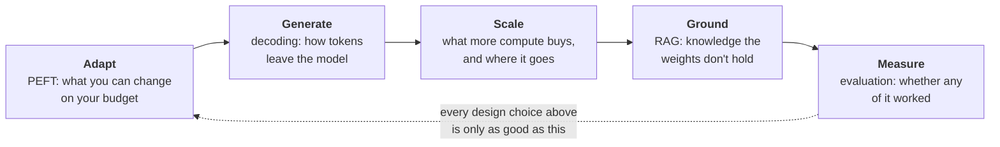

# Session 5 — LLMs, Fine-Tuning & Retrieval

| | |
|---|---|
| **What it prepares** | The LLM-specialist round — the one your resume invites by claiming NLP/LLM work, where the interviewer stops asking *what* a technique is and asks **when you would choose it and what it costs** |
| **Prerequisites** | Session 1 (QLoRA, LoRA math, memory accounting), Session 2 (your RAG failure analysis), Session 4 (KV cache, attention cost) — this session extends all three |
| **Session length** | 5 lessons + a mock round, ~5–6 hours |
| **Format** | Drill cards: answer out loud first, then open the model answer. Derivations, arithmetic, and citations sit in collapsed blocks. |

---

## 🟢 What This Round Actually Tests

Sessions 3 and 4 tested machinery an interviewer expects from *any* deep-learning candidate. This round is different: it is the one your own resume provokes. You wrote "QLoRA", "RAG", and "LLM evaluation" on a page, so an Applied Scientist interviewer will ask you to place those choices inside the full design space and defend them against the alternatives you didn't pick.

The failure mode here is **catalogue knowledge**. Most candidates can list PEFT methods, name top-p sampling, and recite "RAG grounds the model in retrieved documents." Very few can say what a rank-8 adapter costs in served memory, why nucleus sampling exists rather than plain top-k, what token budget a compute-optimal model wants, or how many eval examples they need before a two-point difference means anything. Every drill in this session targets the second version.

> 📍 **Relationship to earlier sessions.** Session 1 defended *your* QLoRA run and *your* transformer; Session 2 defended *your* RAG failure study. This session covers the same territory as **general design knowledge**: the PEFT landscape your one method sits inside, the RAG design space your one pipeline sampled from, and the evaluation methodology your one judge instantiated. Where they touch, this session assumes the earlier material and pushes outward rather than repeating it.

---

## 🟢 Scope Brief: The Five Areas

| Area | The version everyone gives | The version that scores |
|---|---|---|
| **PEFT** | "LoRA freezes the base model and trains low-rank matrices" | Where the memory actually goes, why QLoRA's saving is *optimizer states* not weights, what rank buys, and what serving 50 adapters costs |
| **Decoding** | "Top-p samples from the smallest set of tokens summing to p" | Why a *fixed* cutoff fails across distributions of different sharpness, when greedy is correct, and where beam search stops helping |
| **Scaling** | "Bigger models are better" | Compute-optimal allocation (≈20 tokens per parameter), why that rule is wrong once inference cost counts, and what "emergence" survived scrutiny |
| **RAG** | "Embed, retrieve top-k, stuff the context" | Retrieval as a recall/precision budget, hybrid + reranking as the standard stack, and the honest comparison against fine-tuning and long context |
| **Evaluation** | "We used GPT-4 as a judge" | Contamination, judge bias, paired comparison, and how many examples a claimed difference actually needs |

**The through-line:** each of the first four areas is a knob, and the fifth decides whether turning it helped. Interviewers close LLM rounds on evaluation for exactly that reason — it is where applied judgment shows.

---

## 🟢 Session Structure

1. [Lesson 1 — The PEFT Landscape: Beyond LoRA](01_peft_landscape.md)
2. [Lesson 2 — Decoding & Sampling Strategies](02_decoding_and_sampling.md)
3. [Lesson 3 — Scaling Behavior & the Post-Training Stack](03_scaling_and_post_training.md)
4. [Lesson 4 — The RAG Design Space](04_rag_design_space.md)
5. [Lesson 5 — Evaluating LLM Systems](05_evaluating_llm_systems.md)
6. [Mock Round — The LLM Round](06_mock_round.md)

Then the [Chapter Quiz](quiz.md).

🔬 **Interactive companion** (CPU-only, no model downloads, runs in about a minute): [▶ Open the LLM Systems Lab in Colab](https://colab.research.google.com/github/vinod-seth/Applied-Scientist-Interview-Gauntlet/blob/main/tutorial/05_llms_finetuning_retrieval/llm_systems_lab.ipynb) — count adapter parameters against a rank sweep, watch top-k and top-p truncate the same distribution differently, solve the Chinchilla allocation numerically, fuse BM25 with dense retrieval, and compute how many eval examples your claimed improvement needs.

> [!NOTE]
> Nothing here is scored or gated. The goal is that for every technique in this session you can state the mechanism, the cost, and the situation where you would *not* use it — the third one is what separates a specialist from a reader.

> [!IMPORTANT]
> ⚠️ **JD-DEPENDENT.** How much of this round you get depends on the team. An entry-level Applied Scientist loop for a science-heavy team may spend the whole round on Lessons 1–3 and never mention retrieval; an applied team shipping a search or assistant product will spend it on Lessons 4–5. Ask your recruiter which of the two you are interviewing for — it is question 5 on your Chapter 0 list.
