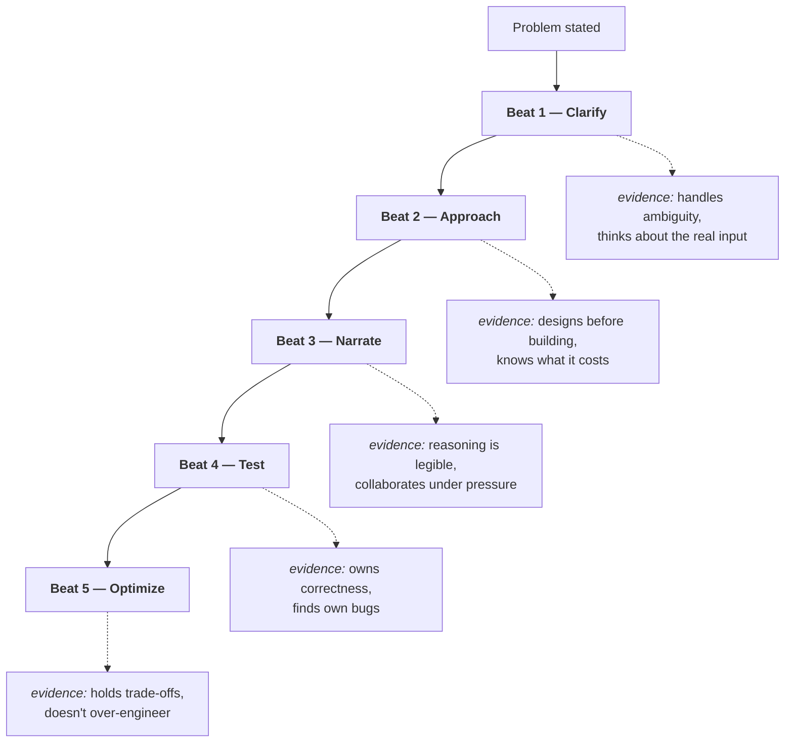

# Lesson 1 — The Five Beats: Making Solving Visible

| | |
|---|---|
| **Prepares** | Every minute of the coding round. This is the lesson your audit says you need — the one that converts 700 solved problems into a scored transcript |
| **Time** | ~12 min visible + drills |
| **Domain tag** | Coding round / interview protocol |

> 📍 **How this lesson works:** there is no algorithm in it. Each drill is a moment in the round — the first ninety seconds, the approach statement, the silence while you type, the moment before you say "done", the moment you realise you are wrong — and the model answer is a **script you can actually say**. Say each one out loud. A protocol you have only read is not a protocol you have.

## 🟢 Learning Objectives

After this lesson you can:

- **Open any problem with 2–3 targeted clarifying questions** covering input domain, output contract, and edge semantics — and stop there.
- **Deliver a four-part approach statement** (pattern, structure, complexity, why) and wait for agreement before typing.
- **Narrate an implementation** by naming the <abbr title="A condition that is true before and after every iteration of a loop, and which implies the result once the loop ends">loop invariant</abbr> you are maintaining, rather than describing syntax.
- **Test before claiming completion**, hand-tracing one normal and two <abbr title="An input at the extreme edge of the valid domain — empty, single-element, all-identical, or maximum-size">degenerate</abbr> inputs out loud.
- **Recover from a wrong approach mid-round** in a way that scores as evidence rather than collapse.

## 🟢 The One Picture

The interviewer is not marking a submission. They are collecting evidence for a <abbr title="The meeting where every interviewer presents their written evidence and the loop argues its way to a hire or no-hire decision">hiring debrief</abbr>, and each beat produces a different piece of it. A beat you skip is a piece of evidence that does not exist.



**Fast is not the goal.** A solution delivered in twelve minutes with three beats missing produces a thinner debrief note than the same solution delivered in thirty with all five.

---

## 🔷 Drill 1 — "Here's the problem. Go."

*The first ninety seconds. What comes out of your mouth before you touch the keyboard? 60 seconds.*

<details><summary>✅ Model answer</summary>

Restate the problem in one sentence, then ask **two or three** targeted questions off three axes — never twenty, and never zero:

| Axis | What you are actually asking | Example |
|---|---|---|
| **Input domain & size** | Which <abbr title="The growth rate a solution's running time may have and still finish inside the time limit at the given input size">complexity class</abbr> is admissible, and can I trust the values | "How large can *n* get? Can the values be negative, or exceed 32 bits?" |
| **Output contract** | What exactly do I return, and what if it does not exist | "Do I return the index or the value? What should I return when there's no valid answer?" |
| **Edge semantics** | The ambiguity the problem statement is deliberately hiding | "Are duplicates possible, and if so does each count separately?" |

The restatement matters as much as the questions: it is a cheap, unmissable signal that you understood the problem, and it catches a misread before it costs you twenty minutes.

> **Say it:** "So: given an unsorted array of integers, return the length of the longest run of consecutive values — and the run doesn't need to be contiguous in the array. Three quick things before I design: how large can *n* be, can values be negative or duplicated, and what do I return for an empty input?"

**The trap in both directions.** Zero questions reads as "assumes rather than checks" — the reflex your 700 problems installed, because on LeetCode the constraints are printed. Twenty questions reads as stalling. Two or three, chosen for the ones whose answers would change your design, is the calibrated signal.
</details>

<details><summary>🔁 The follow-up chain</summary>

"Why does the value range matter?" (it decides whether a counting or bucketing approach is viable, and whether intermediate sums can overflow a 32-bit accumulator — a real bug class, not a formality) → "What if I say *n* is unbounded?" (then it is a streaming problem and the design changes completely: bounded memory, one pass, and I would ask whether an approximate answer is acceptable) → "You asked about duplicates. Why?" (because it decides whether a set is a valid data structure here; if duplicates count separately, a set silently gives the wrong answer and it is the kind of bug that passes the sample case) → "Suppose I refuse to answer and say 'you decide'." (then I state the assumption explicitly, write it as a comment, and design for the general case — the failure would be assuming silently).
</details>

---

## 🔷 Drill 2 — "What's your approach?"

*The highest-leverage thirty seconds of the round. 45 seconds.*

<details><summary>✅ Model answer</summary>

Four parts, in this order, then **stop and wait**:

1. **Pattern** — "This is a sliding window over a monotone condition."
2. **Data structure** — "I'll keep a hash map of character counts for the current window."
3. **Complexity** — "That's O(n) time and O(k) space, where *k* is the alphabet size."
4. **Why this and not the obvious one** — "The brute force is O(n²) because it recomputes each window from scratch; the window lets me update in O(1) per step."

> **Say it:** "My approach: sliding window with a hash map of counts. Expand right, and while the window has more than *k* distinct characters, contract from the left. Each element enters and leaves at most once, so it's O(n) time, O(k) space. The brute force is O(n²) since it rebuilds every window. Does that sound right before I code it?"

**The last sentence is the whole drill.** Coding an approach the interviewer has not agreed to is the single most expensive mistake available to a strong coder: if they were steering you toward something else, you have now spent twenty minutes going the wrong way, and the steering attempt itself becomes negative evidence. Getting the nod costs four seconds.

If the problem is hard enough that you cannot state the optimal approach yet, **state the brute force with its complexity and say you will improve it**. That is a complete beat 2, not a failed one. Silence while you search for the clever answer is a failed one.
</details>

<details><summary>🔁 The follow-up chain</summary>

"What if you can't see any approach at all?" (say what you *do* see — the shape, the closest pattern, and what makes it not fit; then propose solving a restricted version first, e.g. "let me solve it for *k*=1 and generalise". Working from a special case out loud is scored as method; sitting silent is scored as stuck) → "The interviewer says 'can you do better?' before you've coded anything." (that is a steer, not a question — the optimal solution is better than what you proposed; ask "is the bottleneck the repeated recomputation?" and let them confirm) → "Do you write pseudocode?" (a few lines of structure, yes; a full pseudocode draft is usually a waste of the clock — the approach statement already carries the design) → "How do you handle an interviewer who says nothing?" (treat silence as assent, restate the plan in one line, and start; check in again after the core loop is written).
</details>

---

## 🔷 Drill 3 — "You've been typing in silence for four minutes."

*Silence is scored as absence of thought. What should have been audible? 45 seconds.*

<details><summary>✅ Model answer</summary>

Narrate **invariants and intent**, never syntax. The difference:

| ❌ Narrating syntax | ✅ Narrating intent |
|---|---|
| "Now I'm writing a for loop over i…" | "This loop maintains: everything left of `slow` is already deduplicated." |
| "I'll call this variable `best`…" | "`best` holds the answer for all windows ending before `right` — so I never have to look back." |
| *(silence)* | "I'm deliberately skipping the empty-input check for now; I'll add it in the test pass so I don't lose the main thread." |

That third row is the underrated one. **Deferring a concern out loud converts an omission into a plan.** An interviewer who sees you skip the empty case does not know whether you missed it or postponed it — unless you say which.

> **Say it:** "I'm writing the contraction step now. The invariant I'm keeping is that the window between `left` and `right` never holds more than *k* distinct characters, so every time the map grows past *k* I shrink from the left until it doesn't."

**Why this beat is scored heavily:** it is the only direct evidence of how you would work with a team. Correct code produced silently tells the interviewer nothing about whether you can be steered, corrected, or collaborated with — and that is exactly what a hiring debrief has to argue.
</details>

<details><summary>🔁 The follow-up chain</summary>

"Isn't talking while coding slower?" (yes, by a little, and the trade is overwhelmingly worth it; it also catches your own errors early, because stating an invariant you are about to violate usually exposes the violation) → "What do you say when you hit a bug?" (the hypothesis, the check, the fix — "the count is one too high; I think I'm adding before the boundary check rather than after; let me trace index 3" — silent debugging is the second-worst thing you can do in this round) → "What if the interviewer interrupts with a hint?" (take it, out loud: "good point, that changes the invariant to…". Interviewer hints are steering; ignoring them reads as failing *Are Right, A Lot* — the principle is about updating on evidence, and the hint is evidence) → "How do you narrate the parts that are trivial?" (you don't — say "standard boilerplate" and keep typing; narration is for decisions).
</details>

---

## 🔷 Drill 4 — "It compiles. Are you done?"

*The word "done" is a claim. What has to be true before you make it? 45 seconds.*

<details><summary>✅ Model answer</summary>

Never say "done" — say **"let me test it"**, and then actually trace, out loud, with your finger on the screen:

1. **One normal case**, walked line by line with real values. Not "it should work"; actual numbers, actual variable states.
2. **Two degenerate cases** chosen from the class list in [Lesson 4](04_testing_and_the_as_problem_set.md): empty, single element, all-identical, maximum size, or the inversion of the assumption your invariant rests on.
3. **The <abbr title="An error where a loop or index runs one step too many or too few, usually at the first or last element">off-by-one</abbr> check specifically** — the boundary of every loop and every index expression, because this is where the bugs actually are.

> **Say it:** "Let me trace `"eceba"` with *k*=2. Right at 0, window `e`, map {e:1}, best 1. Right at 1, `ec`, best 2. Right at 2, `ece`, map {e:2,c:1}, best 3. Right at 3 adds `b`, three distinct, so I contract: remove `e`, still three, remove `c`, now `eb` — wait, that leaves `eb` of length 2, and best stays 3. Good. Now the empty string: the loop body never runs and I return 0, which is the contract we agreed."

**Finding your own bug is a positive signal.** Having the interviewer find it is a negative one — same bug, opposite evidence. That asymmetry is why this beat is worth its seven minutes even when you are confident.
</details>

<details><summary>🔁 The follow-up chain</summary>

"You found a bug during the trace. Now what?" (say what the trace showed, state the fix as a one-line change to the invariant, apply it, and re-trace *that* case — the recovery is more valuable evidence than a clean first pass) → "Do you write actual test code?" (if the environment executes, a handful of asserts is excellent and fast; if it is a shared doc, the spoken trace *is* the test and it counts) → "How long should this take?" (five to eight minutes of a forty-five-minute round; if you are out of time, trace one case and *name* the others you would run — naming them still scores) → "What if the trace passes but you're unsure?" (say so and name the specific input class you are unsure about; calibrated uncertainty is scored as honesty, and it is exactly what a <abbr title="An objective third-party Amazon interviewer, trained on the Leadership Principles, who judges whether a hire raises the standard for the company">Bar Raiser</abbr> is listening for).
</details>

---

## 🔷 Drill 5 — "It's minute 25 and your approach is wrong."

*The round is not lost here. It is lost in the next sixty seconds. 60 seconds.*

<details><summary>✅ Model answer</summary>

Four moves, in order, all audible:

1. **Name it immediately.** "This isn't going to work — my invariant breaks when the values can be negative." Delay is the expensive part; an interviewer watching you defend a broken approach for five minutes is collecting the wrong evidence.
2. **Say what the failure taught you.** "The problem is that the window sum isn't monotone once negatives are allowed, so contracting from the left doesn't necessarily reduce it."
3. **Propose the pivot with its complexity.** "That points at <abbr title="An array whose entry i holds the sum of every element before i, so any range sum becomes a single subtraction">prefix sums</abbr> with a hash map instead — O(n) time, O(n) space, and it doesn't need monotonicity."
4. **Ask for the steer.** "Do you want me to take that, or is there a direction you'd prefer?"

> **Say it:** "I need to stop and correct myself. My sliding-window invariant assumed non-negative values, and you confirmed negatives are possible — so contracting the window can't be relied on to reduce the sum. The fix is prefix sums with a hash map of previously seen sums: O(n) time, O(n) space. Shall I take that?"

**Why this scores well rather than badly.** It is one of the few moments in the loop where you can demonstrate *Are Right, A Lot* — which is about updating on new evidence, not about being right first — plus **Earn Trust** through self-correction. A candidate who pivots cleanly at minute 25 and finishes at minute 42 usually scores above one who quietly ships a solution that fails on negatives.
</details>

<details><summary>🔁 The follow-up chain</summary>

"What if you have no pivot to propose?" (say the invariant that broke and ask directly: "I don't have a replacement yet — is the intended structure closer to prefix sums or to a different decomposition?" Asking a *specific* question beats going quiet, and it shows you know where the difficulty sits) → "Isn't asking for a hint a penalty?" (it is scored far more gently than silence or a wrong ship; what is penalised is asking for the whole answer or ignoring the hint once given) → "How much time do you allow before abandoning an approach?" (if you cannot see the fix within about two minutes of hitting the wall, pivot — the clock is the binding constraint, and a working simpler solution beats an unfinished optimal one) → "Does the brute force count if you run out of time?" (yes — a correct O(n²) solution, stated as such, with the O(n) improvement described but uncoded, is a passable outcome; an unfinished O(n) solution usually is not).
</details>

---

## 🟢 Concept Check

You finish the optimal solution at minute 20 with no clarifying questions asked and no spoken reasoning. The likely debrief note is:

* [ ] Strong hire — correct and fast
* [x] Mixed — the code is right, but there is no evidence of handling ambiguity, designing before building, or being steerable, so three of the five scored beats are empty
* [ ] Strong hire, provided the code is optimal
* [ ] No signal on correctness

At minute 25 you realise your invariant is wrong. The best next move is:

* [ ] Keep going and patch the edge case at the end
* [x] Say so immediately, state what the failure taught you, propose the pivot with its complexity, and ask for the steer
* [ ] Silently restart with a new approach
* [ ] Ask the interviewer for the intended solution

<details>
<summary>🔑 Answers</summary>

**Q1: option 2.** This is the exact shape of your Gap #8 risk, and it is worth internalising that speed does not compensate. The interviewer must write down what they observed; three of the five observation windows produced nothing, so the note is thin no matter how good the code is.

**Q2: option 2.** Option 1 is the common instinct and the worst outcome — a defended broken approach burns the clock and the evidence. Option 3 loses the credit for the diagnosis, which is the valuable part. Option 4 asks for the answer rather than a steer; the calibrated version names your specific blocker and asks for direction.
</details>

---

## 🔷 Rapid-Fire Rehearsal

```rehearsal-drill
RUBRIC: mechanism
TITLE: The Five Beats — Rapid Fire
INTRO: These are scripts, not facts. Say each one the way you would say it to an interviewer, at interview pace, out loud. If it does not sound like speech, it is not rehearsed yet.
MIN: 30
MAX: 90
[[Opening a problem]]
Q: The problem has just been read to you. What are the first ninety seconds?
A: **Restate it in one sentence**, then ask **two or three** targeted questions off three axes: **input domain and size** (which complexity class is admissible; can values be negative or overflow 32 bits), **output contract** (index or value; what is returned when no answer exists), and **edge semantics** (duplicates, empty input, ties). Pick the questions whose answers would *change the design* - not twenty, and not zero. The restatement is a cheap, unmissable signal that you read the problem correctly, and it catches a misread before it costs twenty minutes. **The trap cuts both ways:** zero questions reads as assuming rather than checking, which is exactly the reflex 700 solved problems installs, because on a practice site the constraints are printed.
[[The approach statement]]
Q: The interviewer asks for your approach. What is the shape of a complete answer?
A: Four parts, then **stop and wait for the nod**: **(1) pattern** - "this is a sliding window over a monotone condition"; **(2) data structure** - "a hash map of counts for the current window"; **(3) complexity** - "O(n) time, O(k) space"; **(4) why not the obvious one** - "the brute force is O(n squared) because it recomputes each window from scratch". Then: "Does that sound right before I code it?" **That last sentence is the whole beat.** Coding an approach the interviewer has not agreed to is the most expensive mistake available to a strong coder. If you cannot see the optimal approach yet, **state the brute force with its complexity and say you will improve it** - that is a complete beat, not a failed one.
[[Narrating while coding]]
Q: What should be audible while you type, and what should not?
A: **Invariants and intent, never syntax.** Not "now I write a for loop over i" but "this loop maintains: everything left of slow is already deduplicated". Not "I'll call this best" but "best holds the answer for all windows ending before right, so I never look back". And the underrated one: **defer out loud** - "I'm skipping the empty-input check for now, I'll add it in the test pass" - which converts an omission into a plan the interviewer can see. **Why it is scored heavily:** narration is the only direct evidence of how you work with a team. Silence is scored as absence of thought, and silent debugging is the second-worst thing you can do in this round.
[[Before you say done]]
Q: The code compiles. What has to happen before you claim it works?
A: Never say "done" - say **"let me test it"**, then trace out loud with real values: **one normal case** walked line by line with actual variable states, **two degenerate cases** (empty, single element, all-identical, maximum size, or the inversion of your invariant's assumption), and **an explicit off-by-one check** on every loop boundary and index expression, because that is where the bugs actually are. **The asymmetry that makes this worth seven minutes:** finding your own bug is positive evidence; the interviewer finding the same bug is negative evidence. If you are out of time, trace one case and *name* the others you would run - naming them still scores.
[[Being wrong at minute 25]]
Q: Your approach is broken and you are twenty-five minutes in. What do you do?
A: Four audible moves. **(1) Name it immediately** - "this won't work, my invariant breaks on negative values"; delay is the expensive part. **(2) Say what the failure taught you** - "the window sum isn't monotone once negatives are allowed". **(3) Propose the pivot with its complexity** - "that points at prefix sums with a hash map, O(n) time and O(n) space". **(4) Ask for the steer** - "shall I take that, or is there a direction you'd prefer?" **Why this scores well:** it is one of the few moments where you can demonstrate **Are Right, A Lot**, which is about updating on evidence rather than being right first, plus Earn Trust through self-correction. A clean pivot at minute 25 that finishes at 42 usually outscores a quiet solution that fails on negatives.
```

---

## 🟢 Summary

- Your audit scores coding **4/5 on ability** and flags **protocol** as the gap. This lesson is the gap.
- **Five beats, each scored separately:** clarify, approach, narrate, test, optimize. A skipped beat is missing evidence, and speed does not substitute for it.
- **Beat 2 ends with a question.** Getting agreement on the approach costs four seconds and protects twenty minutes.
- **Narrate invariants, not syntax** — and defer concerns out loud so an omission reads as a plan.
- **"Let me test it", never "done."** Finding your own bug is positive evidence; having it found for you is negative.
- **Being wrong is survivable; being quietly wrong is not.** Name it, diagnose it, propose the pivot with its cost, ask for the steer.

**References**

- Amazon (2026) — *Leadership Principles* (official list; *Are Right, A Lot* and *Earn Trust* as used above) — https://www.amazon.jobs/content/en/our-workplace/leadership-principles *(last verified 2026-07-20 in [Dossier Ch1](../../dossier/01_company_dossier.md))*
- This course — [Round Playbook, Round 3: Coding](../../playbooks/round_playbook.md) — the beat list this lesson expands
- This course — [Dossier Ch5, Gap #8](../../dossier/05_gap_map_and_study_plan.md) — the audit finding that protocol, not ability, is the gap

**Next:** [Lesson 2 — From Constraints to Pattern](02_constraints_to_patterns.md)
