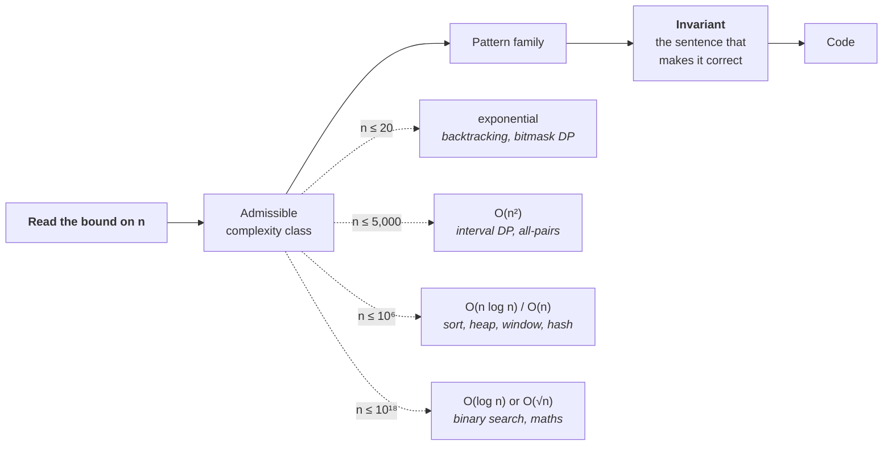

# Lesson 2 — From Constraints to Pattern

| | |
|---|---|
| **Prepares** | Beat 2 of the round — the thirty seconds where you name what you are about to build, and why it is the right size |
| **Time** | ~13 min visible + drills |
| **Domain tag** | Coding round / pattern selection |

> 📍 **How this lesson works:** you already recognise these patterns — that is what 700 problems buys. What this lesson adds is the *derivation in front of a witness*: reading the constraint first, deducing which complexity class is admissible, and naming the pattern **together with the invariant that makes it correct**. A named pattern with no invariant is a guess that happened to be right; the invariant is what survives the follow-up.

## 🟢 Learning Objectives

After this lesson you can:

- **Map an input bound to an admissible complexity class** in one step, and say why the bound rules out the alternatives.
- **Name a pattern and its invariant together** for the ten families that cover almost every interview problem.
- **Distinguish sliding window, two pointers, and <abbr title="An array where entry i holds the sum of all elements before i, so any range sum is one subtraction">prefix sums</abbr>** by the assumption each one needs, and say which assumption a given problem breaks.
- **Apply four reduction moves** when the problem matches nothing you recognise.
- **State the pattern out loud in the form an interviewer scores**, including when you are unsure.

## 🟢 The One Picture

Read the constraint *before* the problem. The bound on *n* eliminates most of the design space before you have thought about the problem at all — and doing that step audibly is itself the evidence.



**The rule of thumb behind it:** an interview-language solution does on the order of $10^8$ simple operations per second, so a bound of $n \le 10^5$ with an $O(n^2)$ plan is $10^{10}$ operations and will not run. State the arithmetic, not the folklore — "$n$ squared at $10^5$ is $10^{10}$ operations, so that's out" is a much stronger sentence than "$n$ squared is too slow."

---

## 🔷 Drill 1 — "The constraints say n ≤ 200,000. What have you learned?"

*Before reading the rest of the problem. 30 seconds.*

<details><summary>✅ Model answer</summary>

That $O(n^2)$ is dead — $4 \times 10^{10}$ operations — and therefore that the intended solution is $O(n)$ or $O(n \log n)$. That single deduction removes most of the pattern space:

| Bound on *n* | Admissible | What it points at |
|---|---|---|
| $n \le 12$ | $O(n!)$ | Permutation enumeration, travelling-salesman-shaped |
| $n \le 20$–$25$ | $O(2^n \cdot n)$ | Backtracking, subset enumeration, <abbr title="Dynamic programming where the state is a set of items encoded as the bits of an integer">bitmask DP</abbr>, meet-in-the-middle |
| $n \le 500$ | $O(n^3)$ | Floyd–Warshall, interval DP over all pairs |
| $n \le 5{,}000$ | $O(n^2)$ | Two-dimensional DP, all-pairs comparison |
| $n \le 10^6$ | $O(n \log n)$, $O(n)$ | Sorting, heaps, sliding window, hashing, one-pass scans |
| $n \le 10^{18}$ | $O(\log n)$, $O(\sqrt{n})$ | Binary search, number theory, matrix exponentiation |

The reverse reading is just as useful and is what interviewers actually probe: **a suspiciously small bound is a hint**. If $n \le 20$ in a problem that looks like it wants a clever polynomial algorithm, the intended answer is usually exponential — and the interviewer is checking whether you will over-engineer.

> **Say it:** "Before I look at the structure — *n* up to two hundred thousand means *n* squared is about 4 × 10¹⁰ operations, so that's off the table. I'm looking for O(n) or O(n log n), which points at a single pass with a hash map, a sort, or a window."
</details>

<details><summary>🔁 The follow-up chain</summary>

"What if the bound is on the *values* rather than on *n*?" (then counting or bucketing becomes available — if values are bounded by $10^6$ you can index an array by value and get $O(n + V)$ where a comparison sort would give $O(n \log n)$; this is exactly how counting sort and "find the missing number" problems work) → "The problem gives $n \le 10^5$ and a time limit that would allow $O(n \sqrt n)$. Does that change your reading?" (yes, and it is worth saying — $O(n\sqrt n)$ sits between the classes and often signals a square-root decomposition or an offline query algorithm) → "You said $O(n \log n)$ — log of what base?" (base 2, and the point is that it is a factor of ~17 at $10^5$, not a constant you can ignore when you are choosing between $O(n \log n)$ and $O(n)$; on a real machine, cache behaviour often matters more than that factor) → "Where does this rule of thumb break?" (recursion-heavy code in a slow language, allocation inside the hot loop, and anything doing string concatenation per step — the constant factor can be 50×, which is why I would measure rather than assume in production).
</details>

---

## 🔷 Drill 2 — "Name the pattern and the invariant."

*Ten families cover almost every interview problem. The second column is the one candidates skip. 90 seconds.*

<details><summary>✅ Model answer</summary>

| Trigger in the statement | Pattern | **The invariant you must be able to state** |
|---|---|---|
| "longest/shortest contiguous … such that" | Sliding window | The window `[l, r]` always satisfies the condition; every element enters and leaves at most once |
| Sorted input, "pair/triple summing to" | Two pointers | Everything outside `[l, r]` has been proven not to be part of any better answer |
| "*k*-th largest", "top *k*", "median of a stream" | Heap | The heap holds exactly the best *k* seen so far; its root is the threshold for admission |
| "minimum *x* such that *P(x)* holds" | <abbr title="Binary searching over the range of possible answers rather than over an array, valid when the yes/no test is monotone in the answer">Binary search on the answer</abbr> | *P* is monotone: false … false, true … true. `lo` is always infeasible, `hi` always feasible |
| "are these connected", "how many groups" | <abbr title="A structure that keeps disjoint sets under merge and membership queries, each in near-constant amortised time">Union–find</abbr> | Every element points, transitively, at the representative of its set |
| "order such that dependencies come first" | <abbr title="An ordering of a directed acyclic graph's nodes in which every edge points forward, produced by repeatedly removing nodes with no unmet dependency">Topological sort</abbr> | Every node emitted has all its prerequisites already emitted |
| "shortest path", "fewest steps", "levels" | BFS | On first visit, a node's recorded distance is already minimal |
| "number of ways", "min cost over stages" | DP | `dp[i]` is the exact optimum for the subproblem ending at *i*, computed only from strictly smaller subproblems |
| "next greater/smaller", "valid nesting" | <abbr title="A stack kept in increasing or decreasing order, so each element is pushed and popped at most once, giving linear total work">Monotonic stack</abbr> | The stack is monotone; anything popped has found its answer and can never be needed again |
| "all combinations/placements satisfying" | Backtracking | The partial solution is always valid; every branch pruned provably contains no solution |

**How this changes the round.** Compare two beat-2 statements for the same problem:

- "This is a monotonic stack problem." — a label. The follow-up "why is it linear?" is now a fresh question you have to answer under pressure.
- "This is a monotonic stack: I keep indices in decreasing height, so each index is pushed once and popped once, which is what makes the whole scan linear rather than quadratic." — the label, the invariant, and the complexity argument in one sentence. The follow-up is pre-answered.
</details>

<details><summary>🔁 The follow-up chain</summary>

"Which of these do candidates most often name wrongly?" (two pointers versus sliding window — they share the two-index mechanic but rest on different assumptions, which is the next drill; and DP versus greedy, where the honest test is whether a locally best choice is provably globally safe) → "Why does the invariant matter if the code is right?" (because the round is a depth interrogation: the interviewer's next question is always *why* it works, and an invariant answers it in one sentence, while a label forces you to reconstruct the argument live) → "Give me one where the invariant is the hard part." (binary search on the answer — the entire correctness rests on the predicate being monotone, and the common failure is applying it to a predicate that flips more than once) → "What if two patterns both fit?" (say so and pick on cost: "both a heap and a sort solve this; the heap is O(n log k) against O(n log n) and it also works on a stream, so I'll take the heap" — naming the alternative and the reason is the senior version).
</details>

---

## 🔷 Drill 3 — "Sliding window, two pointers, or prefix sums? They look identical."

*The distinction is an assumption, and the interviewer will break it. 60 seconds.*

<details><summary>✅ Model answer</summary>

| Technique | The assumption it needs | Breaks when |
|---|---|---|
| **Sliding window** | The condition is **monotone in window size** — growing the window can only push it further out of range, shrinking can only bring it back | Values can be **negative**, so a longer window may have a *smaller* sum. Contraction no longer helps and the invariant is invalid |
| **Two pointers (converging)** | The input is **sorted**, or has an equivalent order that lets you discard one side | The order is not available and sorting would destroy required information (e.g. original indices) |
| **Prefix sums + hash map** | Nothing about sign or order — you are looking up whether a required earlier prefix was ever seen | You need a *contiguous maximum* rather than an exact target, or the values are streamed and you cannot store the prefixes |

**The canonical trap.** "Longest subarray summing to *k*" reads exactly like a sliding-window problem, and with non-negative values it is one. Introduce negative values and the window approach silently returns wrong answers — it does not crash, it just misses. The fix is prefix sums with a hash map from prefix value to earliest index: at each position, ask whether `prefix - k` has been seen, which is $O(n)$ time and $O(n)$ space and cares nothing about sign.

> **Say it:** "Sliding window works here only if the values are non-negative, because the invariant needs the sum to be monotone in the window size. If negatives are allowed, I'd switch to prefix sums with a hash map — same O(n), extra O(n) memory, and it doesn't need monotonicity. Which case are we in?"

That last question is beat 1 doing real work: the answer determines the pattern, so it is exactly the kind of clarifying question worth spending one of your two or three on.
</details>

<details><summary>🔁 The follow-up chain</summary>

"What about the *maximum* subarray sum with negatives?" (Kadane's algorithm — a one-dimensional DP whose invariant is "`best_ending_here` is the maximum sum of any subarray ending exactly at *i*", which is a cleaner statement than the usual "reset when it goes negative") → "And maximum in a *sliding window* of fixed size?" (a monotonic deque holding indices in decreasing value; each index is pushed and popped once, so it is $O(n)$ where a heap would be $O(n \log n)$ — worth naming as the better answer) → "Why not just use a heap for that?" (a heap cannot cheaply remove the element that just left the window; you end up lazily deleting stale entries, which works but is strictly more complicated than the deque) → "Can you always convert a window problem to prefix sums?" (for sum-like conditions yes; for conditions like 'at most *k* distinct characters' there is no prefix structure to subtract, so the window is genuinely the right tool).
</details>

---

## 🔷 Drill 4 — "Nothing matches. What now?"

*The question is not whether this happens — it is whether you have a method when it does. 60 seconds.*

<details><summary>✅ Model answer</summary>

Four reduction moves, tried out loud in this order:

1. **Ask what the brute force recomputes.** Almost every optimisation in this domain is the removal of repeated work. If the $O(n^2)$ solution recomputes a sum, you want prefix sums; a maximum, a deque or heap; a membership test, a hash set; an overlapping subproblem, memoisation. *State the brute force first* — it is a complete beat 2 and it is where the improvement is found.
2. **Change the representation.** Sort it. Reverse it. Index by value instead of by position. Solve for the complement ("the longest valid run" ↔ "the shortest prefix to delete"). A large share of hard problems are easy problems in the wrong coordinates.
3. **Model it as a graph.** Nodes are states, edges are legal moves. Word ladders, grid puzzles, dependency ordering and currency conversion are all graph problems in disguise, and once it is a graph the pattern is BFS, DFS or topological sort.
4. **Binary search the answer.** If you cannot compute the optimum directly but you *can* cheaply check "is a value of *x* achievable?", and that check is monotone in *x*, then search over *x* instead. This converts an optimisation problem into a feasibility problem, which is often far easier.

> **Say it:** "I don't have a clean pattern yet, so let me start from brute force: for every pair I'd recompute the range sum, which is O(n²). The repeated work is the summing — that's what prefix sums remove, and it takes me to O(n). Let me check that against the constraint before I code it."
</details>

<details><summary>🔁 The follow-up chain</summary>

"Which move works most often?" (the first — naming what the brute force recomputes, because the whole toolbox is organised by which repeated computation each structure eliminates) → "Give an example of the complement trick." ("longest subarray whose sum is at most *k*" versus "shortest prefix and suffix to remove"; also counting the valid cases by subtracting the invalid ones from the total, which is frequently much easier) → "When is binary-search-on-the-answer the intended solution?" (when the problem says "minimise the maximum" or "maximise the minimum" — that phrasing is close to a giveaway, and the feasibility check is usually a simple greedy scan) → "What if none of the four work?" (then say where you are: "I can get O(n²) with this decomposition, I don't yet see how to remove the inner loop, and my best guess is that a monotonic structure applies. Should I code the O(n²) first?" — a located, honest position is a good outcome; going quiet is not).
</details>

---

## 🔷 Drill 5 — "Why say the pattern name out loud at all?"

*A short drill about a habit that costs nothing. 30 seconds.*

<details><summary>✅ Model answer</summary>

Because the interviewer is filling in a rubric, and the pattern name is the fastest possible route to the line that says *recognises standard structures*. It also fixes the shared vocabulary for the rest of the round — once "monotonic stack" is on the table, you and the interviewer are debugging the same object.

**And the honest handling when you are unsure.** Do not gamble on a confident label. Say the resemblance and the doubt together:

> **Say it:** "This has the shape of a sliding window — contiguous, with a condition — but the condition isn't obviously monotone in the window size, so the window invariant may not hold. Let me check that on a small case before I commit to it."

Naming a pattern wrongly and confidently is worse than not naming it: it is a claim, and the follow-up will test it. Naming it *with the doubt attached* is scored as calibration, which is the same quality the Bar Raiser is listening for everywhere else in the loop.
</details>

<details><summary>🔁 The follow-up chain</summary>

"Isn't pattern-naming a memorisation signal rather than a thinking signal?" (naming alone, yes — which is why the invariant is attached; "sliding window, because each element enters and leaves once" is reasoning, and "sliding window" alone is recall) → "What if the interviewer disagrees with your name?" (take it as a steer, restate what you think the structure is in mechanical terms rather than by label, and let them correct the mechanics — arguing about terminology is a bad use of the clock) → "Do you name it before or after clarifying?" (after — the clarifying answers can change the pattern entirely, as in the negatives case from Drill 3).
</details>

---

## 🟢 Concept Check

A problem states $n \le 22$ and asks for the minimum cost to visit every city once. The intended solution is most likely:

* [ ] Greedy nearest-neighbour, since $n$ is small
* [x] Exponential — bitmask DP over subsets, roughly $O(2^n n^2)$ — because a bound that small is a signal that no polynomial algorithm is expected
* [ ] $O(n \log n)$ after sorting by distance
* [ ] Binary search on the answer

"Longest subarray summing to exactly $k$", where values may be negative. The right structure is:

* [ ] Sliding window, contracting whenever the sum exceeds $k$
* [x] Prefix sums with a hash map from prefix value to earliest index — the window's invariant needs the sum to be monotone in window size, which negatives destroy
* [ ] Two pointers after sorting the array
* [ ] A heap of running sums

<details>
<summary>🔑 Answers</summary>

**Q1: option 2.** The bound is the hint. At $n \le 22$, $2^n n^2$ is about $2 \times 10^9$ — large but tractable with a tight inner loop, and nothing smaller is expected. Option 1 is the over-engineering trap in reverse: a greedy heuristic does not return the *minimum*, and the problem asked for it.

**Q2: option 2.** This is the trap worth having burned into muscle memory, because the window approach does not crash — it silently returns a wrong answer on inputs the sample case does not contain. Option 3 is doubly wrong: sorting destroys contiguity, which the problem requires.
</details>

---

## 🔷 Rapid-Fire Rehearsal

```rehearsal-drill
RUBRIC: mechanism
TITLE: Constraints and Patterns — Rapid Fire
INTRO: Every answer must contain a number or an invariant. A pattern name on its own is an incomplete answer here, exactly as it is in the round.
MIN: 30
MAX: 90
[[Reading the bound first]]
Q: The constraints say n is at most 200,000. What have you learned before reading the problem?
A: That **O(n squared) is dead** - 4 x 10^10 operations against a rule of thumb of about 10^8 simple operations per second - so the intended solution is **O(n) or O(n log n)**, which points at a single pass with a hash map, a sort, a heap, or a window. **Say the arithmetic, not the folklore.** The ladder: n <= 20 admits exponential (backtracking, bitmask DP); n <= 5,000 admits O(n squared); n <= 10^6 admits O(n log n); n <= 10^18 admits only O(log n) or O(sqrt n). **The reverse reading is the one interviewers probe:** a suspiciously small bound is a hint that the intended answer *is* exponential, and they are checking whether you over-engineer.
[[Pattern plus invariant]]
Q: Name four patterns with the invariant that makes each one correct.
A: **Sliding window** - the window always satisfies the condition, and each element enters and leaves at most once, which is what makes it linear. **Two pointers** - everything outside the current range has been proven not to belong to any better answer. **Heap for top-k** - the heap holds exactly the best k seen so far and its root is the admission threshold. **Binary search on the answer** - the feasibility predicate is monotone, false then true, with lo always infeasible and hi always feasible. **Why the second column matters:** the interviewer's next question is always *why does that work*, and the invariant answers it in one sentence. A bare label forces you to reconstruct the argument live.
[[Window vs prefix sums]]
Q: Longest subarray summing to exactly k. Why might a sliding window be wrong?
A: Because the window invariant needs the sum to be **monotone in window size** - growing can only overshoot, shrinking can only come back. **Negative values destroy that**: a longer window can have a smaller sum, so contracting no longer helps. The failure is silent - it returns a wrong answer rather than crashing, and the sample case usually does not expose it. **The fix is prefix sums with a hash map** from prefix value to earliest index: at each position ask whether prefix minus k has been seen. O(n) time, O(n) space, indifferent to sign. **And this is why it is a beat-1 question:** "can the values be negative?" decides the pattern, so it earns one of your two or three clarifying questions.
[[When nothing matches]]
Q: You do not recognise the problem. What is your method?
A: Four moves, out loud, in order. **(1) Ask what the brute force recomputes** - almost every optimisation here is the removal of repeated work: a recomputed sum wants prefix sums, a recomputed maximum wants a deque or heap, a recomputed membership test wants a hash set, an overlapping subproblem wants memoisation. State the brute force first; it is a complete beat 2. **(2) Change the representation** - sort, reverse, index by value instead of position, or solve the complement. **(3) Model it as a graph** - nodes are states, edges are legal moves; then it is BFS, DFS or topological sort. **(4) Binary search the answer** - if you can cheaply test "is x achievable" and the test is monotone, search over x. "Minimise the maximum" is close to a giveaway for this one.
[[Naming out loud]]
Q: Why name the pattern aloud, and how do you name one you are unsure of?
A: Because the interviewer is filling a rubric and the name is the fastest route to the line that reads *recognises standard structures* - and it fixes a shared vocabulary, so you are both debugging the same object for the rest of the round. **When unsure, attach the doubt:** "this has the shape of a sliding window - contiguous, with a condition - but the condition isn't obviously monotone in window size, so the invariant may not hold; let me check on a small case." **A confident wrong label is worse than no label**, because it is a claim and the follow-up will test it. Naming with the doubt attached is scored as calibration, the same quality assessed everywhere else in the loop.
```

---

## 🟢 Summary

- **Read the bound before the problem.** $n \le 2 \times 10^5$ with $O(n^2)$ is $4 \times 10^{10}$ operations — say the arithmetic out loud; it eliminates most of the design space in one sentence.
- **A small bound is a hint, not a mercy.** $n \le 20$ usually means the intended solution is exponential.
- **Pattern + invariant, always together.** The invariant is what pre-answers the "why does that work" follow-up that always comes.
- **Sliding window needs monotonicity in window size; negatives destroy it silently.** Prefix sums with a hash map is the sign-agnostic replacement.
- **Four reduction moves when nothing matches:** name what the brute force recomputes, change the representation, model it as a graph, or binary search the answer.

**References**

- Cormen, Leiserson, Rivest & Stein (2022) — *Introduction to Algorithms*, 4th edition, MIT Press — https://mitpress.mit.edu/9780262046305/introduction-to-algorithms/
- Skiena (2020) — *The Algorithm Design Manual*, 3rd edition, Springer — https://www.algorist.com/
- Knuth, Morris & Pratt (1977) — *Fast Pattern Matching in Strings*, SIAM Journal on Computing 6(2), 323–350 — https://doi.org/10.1137/0206024 *(the canonical example of removing recomputation — the failure function is precisely "what the brute force recomputes")*

**Next:** [Lesson 3 — Complexity & Correctness You Can Defend](03_complexity_and_correctness.md)
