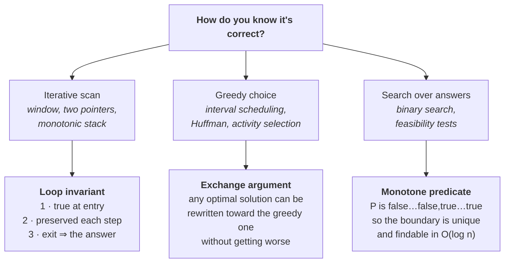

# Lesson 3 — Complexity & Correctness You Can Defend

| | |
|---|---|
| **Prepares** | The two follow-ups that always come: "what's the complexity?" and "how do you know it's right?" — plus beat 5, "can you do better?" |
| **Time** | ~14 min visible + drills |
| **Domain tag** | Coding round / analysis and proof |

> 📍 **How this lesson works:** stating $O(n \log n)$ is not the skill. The skill is stating the complexity of **the code you actually wrote**, including the costs your language hides inside its containers, and then backing correctness with an argument in one of three standard shapes. Both are recitable in one sentence each once you have the shapes. Say every model answer out loud.

## 🟢 Learning Objectives

After this lesson you can:

- **Derive the complexity of your own implementation**, including container operations whose cost is not visible in the source.
- **Prove correctness in one of three shapes** — <abbr title="A condition true before and after every loop iteration, which combined with the exit condition gives the result">loop invariant</abbr>, <abbr title="A proof that any optimal solution can be transformed step by step into the greedy one without getting worse, so greedy is optimal too">exchange argument</abbr>, or monotone predicate — and pick the right shape for the algorithm.
- **Justify a heap against a sort** with the exact bounds, and name the case where <abbr title="A selection algorithm that partitions like quicksort but recurses into only one side, finding the k-th smallest in linear average time">quickselect</abbr> beats both.
- **Use <abbr title="Averaging an operation's cost over a whole sequence of operations, so an occasional expensive step is charged against the many cheap ones">amortised analysis</abbr>** to defend a bound that is not worst-case per operation.
- **Handle "optimize it" as a trade conversation** — new bound, what it costs, and what you would measure — rather than as an instruction to rewrite.

## 🟢 The One Picture

Three algorithm families, three proof shapes. Reaching for the wrong shape is what makes correctness arguments ramble.



**The reason this is worth memorising:** correctness questions arrive with ten seconds' notice, and a candidate who reaches for the right shape sounds rehearsed in a good way. A candidate who improvises sounds uncertain about code that is, in fact, correct.

---

## 🔷 Drill 1 — "What's the complexity of what you just wrote?"

*Not of the algorithm in the abstract — of the code on the screen. 60 seconds.*

<details><summary>✅ Model answer</summary>

Count in three passes: **loop nesting**, then **the cost of each operation inside** — this is the one people skip — then **recursion depth** for anything recursive.

The middle pass matters because both interview languages hide real costs behind clean syntax:

| Looks like $O(1)$ | Actually | Consequence |
|---|---|---|
| `x in my_list` (Python) | $O(n)$ — linear scan | A loop containing it is $O(n^2)$, not $O(n)$. Use a `set` |
| `s += char` in a loop (Python) | $O(n)$ per step on rebuild | The loop becomes $O(n^2)$. Collect into a list, `"".join` at the end |
| `arr[1:]` (Python slice) | $O(n)$ — copies | Recursing on slices turns $O(n)$ recursion into $O(n^2)$ time and space |
| `std::map` lookup (C++) | $O(\log n)$ — it is a balanced tree | Use `std::unordered_map` for $O(1)$ average, unless you need ordered iteration |
| `v.insert(v.begin(), x)` (C++) | $O(n)$ — shifts every element | Use `std::deque`, or push to the back and reverse once |
| `set.count()` inside a loop | $O(\log n)$ or $O(1)$ by container | Decides whether the loop is $n \log n$ or $n$ |

> **Say it:** "The outer loop is *n*. Inside it, the map lookup and insert are O(1) on average for an unordered map, so the whole scan is O(n) time. Space is O(n) worst case for the map — that's the trade against the O(1)-space brute force, and it's the trade that buys the linear time."

**Two honesty points that raise the answer.** Say **average** for hash containers rather than pretending they are worst-case $O(1)$ — adversarial keys can degrade them, which is a real consideration and a good thing to be seen knowing. And when a bound is amortised rather than per-operation, say "amortised" — see Drill 3.
</details>

<details><summary>🔁 The follow-up chain</summary>

"You said O(n) space. Does the output count?" (conventions differ, so state yours: "O(n) auxiliary space, excluding the output" — being explicit is the whole answer, since the interviewer only wants to know that you noticed) → "What's the complexity of sorting in your language?" ($O(n \log n)$ comparisons; Python's `list.sort` is <abbr title="An adaptive mergesort that finds already-ordered runs in the input and merges them, so partially sorted data costs far less than a full sort">Timsort</abbr>, which is <abbr title="A sort that preserves the original relative order of elements that compare equal">stable</abbr> and runs in $O(n)$ on already-sorted or reverse-sorted runs — worth naming because it changes the bound on partially ordered input; C++ `std::sort` is <abbr title="Quicksort that switches to heapsort once recursion gets too deep, guaranteeing the n log n worst case quicksort alone does not">introsort</abbr>, which is *not* stable, and `std::stable_sort` is the one you want when ties carry meaning) → "Where does recursion depth bite?" (Python's default recursion limit is 1000, so a recursive DFS on a $10^5$-node path graph overflows — say this and convert to an explicit stack; in C++ it is a real stack-overflow crash rather than an exception) → "Does big-O tell you which of two O(n) solutions is faster?" (no — constant factors and memory locality decide it, which is why a contiguous array scan often beats a pointer-chasing structure with the same bound; in production I would measure rather than argue).
</details>

---

## 🔷 Drill 2 — "Prove it's correct."

*Pick the shape that fits the algorithm, then fill in three slots. 90 seconds.*

<details><summary>✅ Model answer</summary>

**Shape 1 — Loop invariant** (for scans: windows, two pointers, monotonic stacks). Three slots: it holds at entry, each iteration preserves it, and the exit condition plus the invariant gives the answer.

> "Invariant: `best` is the answer for every window ending strictly before `right`, and the current window is valid. **Initialisation:** both hold trivially for the empty window. **Maintenance:** after extending to `right`, I contract until the window is valid again, then update `best` — so both parts hold again. **Termination:** `right` has passed every position, so `best` is the answer for every window."

**Shape 2 — Exchange argument** (for greedy). Take any optimal solution, show you can swap in the greedy choice without making it worse, and repeat.

> "Sort the intervals by end time and always take the earliest-ending compatible one. Suppose an optimal schedule takes a different first interval. Its end time is no earlier than the greedy one's, so replacing it with the greedy interval cannot conflict with anything the optimal schedule takes later. The count is unchanged and the schedule is still valid — so an optimal solution exists that starts with the greedy choice, and by induction greedy is optimal."

**Shape 3 — Monotone predicate** (for binary search on the answer). Show the feasibility test flips exactly once.

> "If a capacity of *x* is enough, any larger capacity is also enough — so feasibility is monotone in *x*: false up to a boundary, true after it. That boundary is unique, so binary search over *x* finds it in $O(\log R)$ feasibility checks, each of which is an $O(n)$ greedy scan."

**The three-second version, if the clock is tight:** name the shape and the key line — "loop invariant: the window is always valid and each element enters and leaves once." That single sentence carries both the correctness argument and the linear bound.
</details>

<details><summary>🔁 The follow-up chain</summary>

"How do you know a greedy is *not* correct?" (find a counterexample — that is the whole test, and searching for one honestly, out loud, is a strong signal; the classic is coin change, where greedy is optimal for the standard denominations and wrong for coins like {1, 3, 4} at amount 6, where greedy gives 4+1+1 and the optimum is 3+3) → "Where do DP correctness arguments fit?" (they are induction on subproblem size: the recurrence is correct if `dp[i]` is computed only from strictly smaller subproblems, each already optimal — the property is <abbr title="The property that an optimal solution to a problem is built from optimal solutions to its subproblems, which is what licenses a recurrence">optimal substructure</abbr>, and its absence is what rules DP out) → "Prove your BFS finds shortest paths." (invariant: the queue holds nodes in non-decreasing distance order, so the first time a node is dequeued its recorded distance is minimal — and this is exactly the property that fails with weighted edges, which is why Dijkstra needs a priority queue) → "Is a proof expected in an interview?" (not a formal one — one or two sentences in the right shape is what is being asked for; offering it unprompted after beat 4 is a cheap, distinctive signal).
</details>

---

## 🔷 Drill 3 — "Why a heap rather than just sorting?"

*The most common "can you do better" exchange in the round. 60 seconds.*

<details><summary>✅ Model answer</summary>

Three separate arguments, and the third is the one that ends the discussion:

1. **The bound.** Top-*k* with a size-*k* min-heap is $O(n \log k)$ against $O(n \log n)$ for a full sort. At $n = 10^6$ and $k = 10$, that is $\log_2 10 \approx 3.3$ versus $\log_2 10^6 \approx 20$ — about a 6× reduction in comparison work for the same answer.
2. **The memory.** The heap holds *k* elements, not *n*. That matters when *n* does not fit in memory.
3. **The streaming argument.** You cannot sort a stream. If the data arrives continuously and you must answer at any moment, the sort is not merely slower — it is unavailable. A heap answers in $O(1)$ (peek) with $O(\log k)$ per update.

**And the case where both lose.** If you need the *k*-th largest element once, from an array you are allowed to reorder, **quickselect** is $O(n)$ on average — it partitions like quicksort but recurses into only one side (Hoare, 1961). Its worst case is $O(n^2)$ with bad pivots, which <abbr title="A pivot rule that recursively selects the median of group medians, guaranteeing a balanced split and linear worst-case selection">median-of-medians</abbr> fixes at the cost of a large constant.

> **Say it:** "A full sort is O(n log n) and gives me more than I need. A size-k min-heap is O(n log k) with O(k) memory, and it also works on a stream, which a sort can't. If it's a one-shot query on an array I'm allowed to reorder, quickselect is O(n) average — worst case O(n²) on bad pivots."
</details>

<details><summary>🔁 The follow-up chain</summary>

"Min-heap or max-heap for the *k* largest?" (**min**-heap of size *k* — the root is the smallest of your current best *k*, which is exactly the admission threshold: if the incoming element beats the root, pop and push; this inversion is the single most common error in the drill) → "What is the complexity of building a heap from *n* elements?" ($O(n)$ with the bottom-up heapify, not $O(n \log n)$ — the standard proof sums $\sum h \cdot n/2^{h}$, which converges; a good detail to volunteer) → "Where else does amortised analysis change the answer?" (a dynamic array's push is $O(1)$ amortised because doubling makes the total copy work a geometric series, and union–find with path compression and union by rank is near-constant per operation — the inverse-Ackermann bound from Tarjan 1975, which is at most 4 for any input size that fits in the universe) → "Is amortised the same as average-case?" (**no**, and this is a discriminating question: amortised is a *worst-case* guarantee over a sequence of operations with no probabilistic assumption; average-case is over a distribution of inputs. Hash-map $O(1)$ is average-case; dynamic-array push is amortised).
</details>

---

## 🔷 Drill 4 — "Can you do better?"

*Beat 5. It is a conversation about trade-offs, not an instruction to start typing. 60 seconds.*

<details><summary>✅ Model answer</summary>

Four parts, then **offer** rather than proceed:

1. **State the current bound and the bottleneck operation.** "It's O(n²), and the inner loop is re-scanning for a matching complement."
2. **Name the structure that removes it.** "A hash map of value → index removes that scan."
3. **State the new bound and what it costs.** "That's O(n) time, but O(n) extra space, and it gives up the ability to run in-place."
4. **Say what would settle it in production.** "If memory were the binding constraint, I'd keep the two-pointer version after sorting — O(n log n) time and O(1) extra space — and I'd measure peak resident memory against latency at the real input size before choosing."

> **Say it:** "Yes. The bottleneck is the inner rescan for the complement; a hash map removes it, taking me from O(n²) to O(n) time at O(n) extra space. If memory mattered more than latency I'd sort and use two pointers instead — O(n log n) time, O(1) space. Shall I code the hash-map version?"

**Two failure modes to avoid.** Rewriting unilaterally: you may be replacing correct code with unfinished code at minute 35, and the interviewer may only have wanted the *analysis*. And optimising before a correct baseline exists — first correct, then fast, then justified.
</details>

<details><summary>🔁 The follow-up chain</summary>

"What if you're already optimal?" (say so with the lower-bound argument: "I don't think you can beat O(n), because any correct algorithm has to read every element at least once" — and if a comparison-based sort is involved, the $\Omega(n \log n)$ comparison lower bound is the right thing to cite) → "Can you reduce the *space*?" (a different question and often the more interesting one — many DP tables collapse from $O(n^2)$ to $O(n)$ when the recurrence only reads the previous row, and offering that unprompted is a strong move) → "Does a better bound always mean a faster program?" (no — at small *n* the $O(n^2)$ scan over a contiguous array frequently beats the $O(n)$ hash-map version, because hashing and pointer chasing lose <abbr title="How well an access pattern reuses data already in cache; sequential scans prefetch well, while scattered pointer following stalls on memory">cache locality</abbr>; the honest answer names the crossover as an empirical question) → "The interviewer says the optimisation isn't needed. What now?" (accept immediately and return to correctness or testing — pushing on is scored as not being steerable).
</details>

---

## 🔷 Drill 5 — "Write binary search. Get the boundaries right."

*The algorithm everyone knows and most people write wrong under a clock. 60 seconds.*

<details><summary>✅ Model answer</summary>

Two independent hazards, and interviewers probe both.

**Hazard 1 — the midpoint.** `mid = (lo + hi) / 2` overflows when `lo + hi` exceeds the integer maximum. This is not a hypothetical: Joshua Bloch documented it in 2006 as a bug that had survived nine years in the Java standard library and decades in published textbooks. Write `mid = lo + (hi - lo) / 2`. In Python integers are arbitrary-precision so the bug cannot occur — say that if you are coding in Python, because knowing *why* it does not apply is stronger than not knowing the hazard exists.

**Hazard 2 — the loop condition.** Fix one template and never mix them:

| Template | Condition | Invariant | Returns |
|---|---|---|---|
| **Exact match** | `while lo <= hi` | The target, if present, is inside `[lo, hi]` | The index, or −1 when the range empties |
| **Boundary search** | `while lo < hi` | `hi` is always a feasible answer, `lo` may not be | `lo`, when they meet — the first feasible value |

The infinite loop everyone hits is a boundary search where `mid` rounds down and you assign `lo = mid`: `lo` stops moving. The fix is to bias the midpoint upward (`mid = lo + (hi - lo + 1) / 2`) whenever the update is `lo = mid`.

> **Say it:** "I'll use the boundary template: `while lo < hi`, with the invariant that `hi` is always feasible and `lo` may not be. Midpoint as `lo + (hi - lo) / 2` to avoid overflow. When they meet, `lo` is the first feasible value. And this is only valid because feasibility is monotone here — that's the precondition worth stating."
</details>

<details><summary>🔁 The follow-up chain</summary>

"How do you find the *first* and *last* occurrence of a duplicated value?" (two boundary searches with different predicates — `value >= target` for the first, `value > target` then step back for the last; do not try to handle both in one loop, which is where it becomes unreadable) → "Search a rotated sorted array." (at each step one half is sorted — decide which by comparing `nums[lo]` to `nums[mid]`, then test whether the target lies inside that sorted half; the invariant is that the target, if present, is always in the retained half) → "And with duplicates in the rotated array?" (the discriminator collapses — with `[1,3,1,1,1]` you cannot tell which half is sorted, so you shrink the ends by one and the worst case degrades to $O(n)$; naming that degradation is the point of the question) → "How do you test a binary search?" (against a linear scan on many random arrays — an exhaustive differential test on small inputs finds boundary bugs that hand-picked cases miss; the [Lab](dsa_lab.ipynb) does exactly this).
</details>

---

## 🟢 Concept Check

A loop iterates `n` times, and inside it does `if x in candidates` where `candidates` is a Python **list**. The complexity is:

* [ ] $O(n)$ — the loop runs $n$ times and membership tests are constant
* [x] $O(n \cdot m)$ where $m$ is the list length — `in` on a list is a linear scan; converting `candidates` to a `set` makes it $O(n)$ on average
* [ ] $O(n \log n)$ — membership is a binary search
* [ ] $O(1)$ amortised

"Amortised $O(1)$" and "average-case $O(1)$" differ in that:

* [ ] They are two names for the same guarantee
* [x] Amortised is a worst-case guarantee averaged over a *sequence of operations*, with no assumption about inputs; average-case is over a *distribution of inputs* and can be defeated by adversarial ones
* [ ] Amortised applies only to recursive algorithms
* [ ] Average-case is the stronger guarantee

<details>
<summary>🔑 Answers</summary>

**Q1: option 2.** This is the most common hidden-cost bug in interview Python, and it is invisible in the source — the line reads like a constant-time test. The same trap exists in C++ with `std::find` on a `vector`. Say the container, not just the operation.

**Q2: option 2.** The distinction is worth being crisp about because it is a favourite follow-up. Dynamic-array push is **amortised** $O(1)$ — doubling makes the total copying a geometric series, guaranteed for every input. Hash-map lookup is **average-case** $O(1)$ — an adversary who can choose colliding keys degrades it to $O(n)$. Option 4 inverts the strength ordering.
</details>

---

## 🔷 Rapid-Fire Rehearsal

```rehearsal-drill
RUBRIC: mechanism
TITLE: Complexity and Correctness — Rapid Fire
INTRO: Every answer needs a bound and the reason for it. "It's fast" is not an answer, and neither is a bound with no argument attached.
MIN: 30
MAX: 90
[[Complexity of the code you wrote]]
Q: How do you compute the complexity of your own implementation, not the textbook algorithm?
A: Three passes: **loop nesting**, then **the cost of each operation inside** - the pass people skip - then **recursion depth**. Both interview languages hide real costs: Python's `x in my_list` is a linear scan (use a set), `s += char` in a loop rebuilds the string for O(n squared) total, and slicing copies; C++'s `std::map` is a balanced tree at O(log n) while `unordered_map` is O(1) average, and `v.insert(v.begin(), x)` shifts every element. **Two honesty points that raise the answer:** say **average** for hash containers rather than claiming worst-case O(1), since adversarial keys degrade them, and say **amortised** when the bound is amortised rather than per-operation.
[[The three proof shapes]]
Q: The interviewer asks how you know your solution is correct. What are the shapes?
A: **Loop invariant** for scans - three slots: true at entry, preserved by each iteration, and the exit condition plus the invariant gives the answer. **Exchange argument** for greedy - take any optimal solution and show the greedy choice can be swapped in without making it worse, then induct; the interval-scheduling version is that the earliest-ending interval conflicts with no more future intervals than any alternative. **Monotone predicate** for binary search on the answer - show feasibility flips exactly once, false then true, so the boundary is unique. **If the clock is tight**, name the shape and the key line: "loop invariant - the window is always valid and each element enters and leaves once" carries both correctness and the linear bound in one sentence.
[[Heap versus sort versus quickselect]]
Q: For the k largest of n elements, why a heap rather than a sort?
A: Three arguments. **(1) The bound** - a size-k min-heap is O(n log k) against O(n log n); at n = 10^6 and k = 10 that is about 3.3 versus 20 per element. **(2) The memory** - O(k), not O(n), which matters when n does not fit. **(3) The streaming argument, which ends the discussion** - you cannot sort a stream; a heap answers at any moment. **Use a MIN-heap for the k LARGEST** - the root is the admission threshold - this inversion is the most common error. **And the case where both lose:** for a one-shot k-th largest on an array you may reorder, **quickselect is O(n) average** (Hoare 1961), with an O(n squared) worst case that median-of-medians fixes at a large constant.
[[Handling "can you do better"]]
Q: The interviewer asks whether you can do better. What is the complete response?
A: Four parts, then **offer rather than proceed**. **(1) Current bound and bottleneck** - "it's O(n squared), the inner loop re-scans for the complement". **(2) The structure that removes it** - "a hash map of value to index". **(3) New bound and its cost** - "O(n) time, but O(n) extra space, and it gives up running in place". **(4) What would settle it in production** - "if memory were binding I'd sort and use two pointers instead, O(n log n) time and O(1) space, and I'd measure peak memory against latency at the real input size". Then: "shall I code it?" **Two failure modes:** rewriting unilaterally, which can replace correct code with unfinished code at minute 35, and optimising before a correct baseline exists.
[[Binary search boundaries]]
Q: Write binary search correctly. What are the two hazards?
A: **Hazard 1, the midpoint:** `(lo + hi) / 2` overflows when the sum exceeds the integer maximum - Bloch documented this in 2006 as a bug that had survived nine years in the Java library and decades in textbooks. Write `lo + (hi - lo) / 2`. Python's arbitrary-precision integers make it impossible, and *knowing why it does not apply* is stronger than not knowing the hazard. **Hazard 2, the loop condition:** fix one template. `while lo <= hi` for an exact match, with the target inside [lo, hi] if present. `while lo < hi` for a boundary search, with the invariant that hi is always feasible and lo may not be; when they meet, lo is the first feasible value. **The infinite loop** comes from a boundary search where mid rounds down and the update is `lo = mid` - bias the midpoint upward in that case. **And state the precondition:** binary search on an answer is valid only when feasibility is monotone.
```

---

## 🟢 Summary

- **State the complexity of your code, not of the textbook algorithm.** Container operations hide linear costs behind constant-looking syntax in both Python and C++.
- **Three proof shapes cover almost everything:** loop invariant for scans, exchange argument for greedy, monotone predicate for binary search on the answer.
- **Heap over sort for top-*k*:** $O(n \log k)$, $O(k)$ memory, and it works on a stream — which a sort cannot. Quickselect is $O(n)$ average for a one-shot query.
- **Amortised ≠ average-case.** Amortised is a worst-case guarantee over a sequence; average-case assumes a distribution and can be defeated adversarially.
- **"Can you do better" is a trade conversation:** bound, bottleneck, replacement, cost, and the measurement that would settle it — then offer.
- **Binary search has two independent hazards:** midpoint overflow and the boundary template. Fix one template and state the monotonicity precondition.

**References**

- Cormen, Leiserson, Rivest & Stein (2022) — *Introduction to Algorithms*, 4th edition, MIT Press — https://mitpress.mit.edu/9780262046305/introduction-to-algorithms/ *(loop invariants, amortised analysis, and the $O(n)$ build-heap proof)*
- Hoare (1961) — *Algorithm 65: Find*, Communications of the ACM 4(7), 321–322 — https://doi.org/10.1145/366622.366647 *(quickselect)*
- Tarjan (1975) — *Efficiency of a Good But Not Linear Set Union Algorithm*, Journal of the ACM 22(2), 215–225 — https://doi.org/10.1145/321879.321884 *(the inverse-Ackermann bound for union–find)*
- Bloch (2006) — *Extra, Extra — Read All About It: Nearly All Binary Searches and Mergesorts are Broken*, Google Research Blog — https://research.google/blog/extra-extra-read-all-about-it-nearly-all-binary-searches-and-mergesorts-are-broken/
- Peters — *listsort.txt*, CPython source (the Timsort design note) — https://github.com/python/cpython/blob/main/Objects/listsort.txt

**Next:** [Lesson 4 — Test Design & the AS-Flavoured Problem Set](04_testing_and_the_as_problem_set.md)
