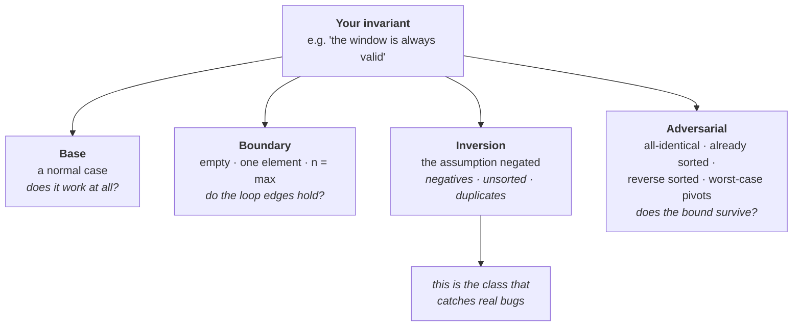

# Lesson 4 — Test Design & the AS-Flavoured Problem Set

| | |
|---|---|
| **Prepares** | Beat 4 of the round, and the specific problem flavour an Applied Scientist interviewer reaches for: data-scale problems where the algorithm meets a corpus |
| **Time** | ~14 min visible + drills |
| **Domain tag** | Coding round / testing and data-scale problems |

> 📍 **How this lesson works:** two halves. Drills 1–2 make beat 4 systematic — tests designed *before* coding, each tied to an invariant, plus the bug list that produces most interview failures. Drills 3–5 are the problems an AS interviewer picks *because* you are an AS candidate: top-*k* over a stream, near-duplicate detection, and incremental grouping. These are DSA problems with a data-scale framing, not ML implementations — **[Session 7](../07_ml_from_scratch/00_locked.md) covers writing ML algorithms from a blank editor.**

## 🟢 Learning Objectives

After this lesson you can:

- **Design test cases before writing code**, in four classes, each named for the invariant it attacks.
- **Recognise the six bug classes** that account for most interview failures, and check for them by hand.
- **Solve top-*k* over an unbounded stream**, and take a uniform sample from one with <abbr title="Keeping a fixed-size sample from a stream of unknown length by replacing a random held item with decreasing probability, giving every item an equal chance">reservoir sampling</abbr>.
- **Design near-duplicate detection at corpus scale** using <abbr title="Overlapping fixed-length token sequences from a document, used as the set whose overlap measures similarity">shingles</abbr> and <abbr title="A hashing scheme where the probability two sets produce the same minimum hash equals their Jaccard similarity">MinHash</abbr>, and say what it costs.
- **Choose between union–find and traversal** for grouping, based on whether the edges arrive all at once or incrementally.

## 🟢 The One Picture

Four test classes. Each one attacks a different way your code can be wrong, and each is named for the assumption it breaks.



**The inversion class is the one candidates skip**, and it is where the bugs live: it is precisely the input the interviewer will name in the follow-up, because they chose the problem knowing which assumption is tempting to make.

---

## 🔷 Drill 1 — "Before you write any code, what will you test?"

*Beat 4 is designed during beat 2, not improvised at minute 38. 60 seconds.*

<details><summary>✅ Model answer</summary>

Name the four classes, and attach each to the invariant it attacks:

| Class | Examples | The invariant it tests |
|---|---|---|
| **Base** | A typical mid-sized input with a known answer | The algorithm does the intended thing at all |
| **Boundary** | Empty, one element, two elements, $n$ at maximum | Every loop edge and index expression — where off-by-one errors live |
| **Inversion** | Negative values, unsorted input, duplicates, all elements equal, target absent | The assumption your invariant rests on |
| **Adversarial** | Already sorted, reverse sorted, all-identical, keys chosen to collide | The *complexity* claim, not the correctness claim |

> **Say it:** "Before I code: the base case is `[2,3,1,4]` with *k*=2. Boundaries are the empty array and a single element. The inversion case is duplicates, because my invariant assumes each value appears once. And the adversarial case is an already-sorted input, which is where a naive pivot choice degrades quickselect to O(n²)."

**Why designing them early is strictly better.** Test cases written before the code test the *specification*; test cases written after it tend to test whatever the code happens to do. And announcing them at beat 2 means that if the clock runs out, you have already earned the evidence for beat 4 even if you never run them.
</details>

<details><summary>🔁 The follow-up chain</summary>

"Which class catches the most bugs?" (inversion — it targets the assumption you did not know you were making, which is why it is the class the interviewer's follow-up will name) → "How many test cases is enough for an interview?" (four to six, one per class plus one you are suspicious of; twenty is a clock problem, and two is not a beat) → "What is the adversarial case for a hash-based solution?" (keys engineered to collide, which turns average-case $O(1)$ into $O(n)$ — a real denial-of-service class in production, and the reason production hash tables randomise their seed) → "How would you test this if you had a machine?" (a differential test against a brute-force reference on many small random inputs — it finds boundary bugs that hand-picked cases miss, and it is the single highest-value testing habit; the [Lab](dsa_lab.ipynb) runs one).
</details>

---

## 🔷 Drill 2 — "Trace it. Where are the bugs likely to be?"

*Six classes account for most of what actually goes wrong under a clock. 60 seconds.*

<details><summary>✅ Model answer</summary>

| Bug class | The specific failure | The check |
|---|---|---|
| **Off-by-one** | `<` versus `<=` in the loop bound; `mid` versus `mid ± 1` in a binary search update | Trace the first and last iteration by hand — every time |
| **Midpoint overflow** | `(lo + hi) / 2` exceeds the integer maximum in a fixed-width type | Write `lo + (hi - lo) / 2`; in Python, say why it cannot occur |
| **Mutation during iteration** | Removing from a list or map while looping over it — skipped elements or a runtime error | Iterate over a copy, or collect keys first and delete afterwards |
| **Recursion depth** | Python's default limit is 1000, so a DFS on a $10^5$-node path graph fails; in C++ it is a stack overflow | Convert to an explicit stack when depth can be $\Theta(n)$ |
| **Integer division on negatives** | Python's `//` floors toward $-\infty$ (`-7 // 2 == -4`); C++ truncates toward zero (`-7 / 2 == -3`) | State which behaviour you want when negatives are in the domain |
| **Aliasing** | `[[0] * n] * m` creates $m$ references to **one** row, so writing to one writes to all | Build with a comprehension: `[[0] * n for _ in range(m)]` |

> **Say it:** "Let me check the last iteration specifically. `right` reaches `n-1`, the window is `[left, n-1]`, and `best` updates — so the final window is included. And the empty input never enters the loop and returns 0, which matches the contract we agreed at the start."

**The aliasing bug deserves special attention** because it produces a wrong answer rather than an error, in code that looks idiomatic, on a grid — and grid problems are common. It has ended real interviews.
</details>

<details><summary>🔁 The follow-up chain</summary>

"You find a bug mid-trace. What is the right behaviour?" (state what the trace showed, state the fix as a change to the invariant rather than a patch to a line, apply it, re-trace that case — a narrated repair is stronger evidence than a clean first pass) → "How do you avoid off-by-one errors rather than catch them?" (fix conventions and never mix them: half-open intervals `[lo, hi)` everywhere, one binary-search template, and loop bounds written the same way every time — consistency removes the class rather than testing for it) → "What does the interviewer learn when you fix a bug quickly?" (that you own correctness, which is the whole point of beat 4; the same bug found by *them* produces the opposite note) → "Is running the code a substitute for tracing?" (no, and the reason matters — running tells you *that* it failed, tracing tells you *why*, and the interviewer is scoring the why).
</details>

---

## 🔷 Drill 3 — "A stream of billions of events. Keep the top 100, and also a uniform sample of 10,000."

*Two different structures, and the second one is where candidates stall. 90 seconds.*

<details><summary>✅ Model answer</summary>

**Top 100 — a min-heap of size 100.** The root is the admission threshold: if an arriving element beats it, pop and push, otherwise discard. $O(\log k)$ per element, $O(k)$ memory, and the answer is available at any moment. A sort is not merely slower here — it is unavailable, because the stream has no end.

**A uniform sample — reservoir sampling** (Vitter, 1985). Keep the first $k$ items. For item $i > k$, pick a random integer $j \in [0, i)$; if $j < k$, replace reservoir slot $j$. Every item that has arrived ends up in the reservoir with probability exactly $k/i$, and you never needed to know the stream's length.

<details><summary>📚 Why the probability works out (the follow-up they will ask)</summary>

Take $k = 1$ for clarity. Item $i$ is kept when it arrives with probability $1/i$. For it to be in the reservoir at the end of $n$ items, every later item $t > i$ must fail to replace it, each with probability $1 - 1/t = (t-1)/t$:

$$P = \frac{1}{i} \cdot \prod_{t=i+1}^{n} \frac{t-1}{t} = \frac{1}{i} \cdot \frac{i}{n} = \frac{1}{n}$$

The product telescopes. Every item ends with probability $1/n$ — uniform, in one pass, in $O(k)$ memory. The general $k$ case is the same argument with $k/i$ in place of $1/i$.
</details>

> **Say it:** "Two structures. Top-100 is a size-100 min-heap — the root is the admission threshold, O(log k) per event, O(k) memory, answerable at any moment. The uniform sample is reservoir sampling: keep the first 10,000, then for item *i* draw *j* uniformly in [0, i) and replace slot *j* if *j* < k. Each item ends up in the sample with probability k/i, and it never needs the stream length."

**Why an AS interviewer picks this problem:** it is the shape of real work — building a training set from a log you cannot buffer, or sampling production traffic for evaluation. The follow-up is usually about bias, and the honest answer is that reservoir sampling is uniform over *items*, which is exactly what you want for an unbiased evaluation set and exactly what you do **not** want when rare classes must be over-represented.
</details>

<details><summary>🔁 The follow-up chain</summary>

"Now the top-*k* is by *frequency*, and there are more distinct keys than fit in memory." (then exact counting is impossible in one pass — either shard by hash of the key across machines and merge per-shard heaps, which is exact, or accept an approximation with a <abbr title="A sublinear sketch that counts item frequencies in a fixed-size table of hash counters, over-estimating but never under-estimating">count–min sketch</abbr>, which over-estimates but never under-estimates and bounds the error probabilistically) → "How do you weight the sample by importance?" (weighted reservoir sampling — assign each item a key $u^{1/w}$ with $u$ uniform, keep the $k$ largest keys; it reduces to the standard scheme when all weights are equal) → "Is the reservoir sample independent of the heap?" (yes, and they can share a single pass — a good thing to say, since it shows you are thinking about the number of passes over the data) → "How do you *test* that a sampler is uniform?" (run it many times over a fixed stream and check the empirical selection frequency per item against $k/n$ within sampling error — this is a statistics question inside a coding round, and it is exactly the ground Session 5's evaluation lesson covered).
</details>

---

## 🔷 Drill 4 — "Find near-duplicate documents in a 100-million-document corpus."

*The training-data problem, posed as an algorithms problem. 90 seconds.*

<details><summary>✅ Model answer</summary>

Separate the two problems first — this separation *is* the first half of the answer:

**Exact duplicates** are easy: hash each document's normalised content, group by hash. $O(n)$ time, $O(n)$ memory for the hash table, and the only real design question is the normalisation (whitespace, case, boilerplate).

**Near-duplicates** are the actual question, and all-pairs comparison is $\binom{10^8}{2} \approx 5 \times 10^{15}$ comparisons — not a viable design. Three stages instead:

1. **Shingle.** Represent each document as its set of overlapping $w$-token sequences (typically $w = 5$ to $9$). Now "similar documents" means "sets with large overlap", measured by <abbr title="The size of the intersection divided by the size of the union of two sets — 1 for identical sets, 0 for disjoint ones">Jaccard similarity</abbr>.
2. **MinHash.** For a hash function $h$, the probability that two sets share the same minimum hash value equals their Jaccard similarity exactly (Broder, 1997). Keep $m$ such minima — a signature of, say, 128 integers — and comparing signatures estimates Jaccard with standard error $\approx 1/\sqrt{m}$. A document of any length is now 128 numbers.
3. **<abbr title="Locality-sensitive hashing: bucketing signatures so that similar items collide with high probability, so only bucket-mates need direct comparison">LSH</abbr> banding.** Split each signature into $b$ bands of $r$ rows and hash each band. Two documents become candidates if *any* band matches. This turns quadratic comparison into a hash-table lookup, and $b$ and $r$ tune the similarity threshold — the probability of becoming a candidate at Jaccard $s$ is $1 - (1 - s^r)^b$, a sharp S-curve.

> **Say it:** "Exact duplicates are a hash-and-group in O(n). Near-duplicates can't be all-pairs — that's 5 × 10¹⁵ comparisons. So: shingle each document into 5-token sequences, reduce each to a 128-value MinHash signature, then LSH-band the signatures so only likely-similar pairs are ever compared directly. The banding parameters set the threshold, and I'd verify candidates exactly before deleting anything."

**Why an AS interviewer picks this one:** near-duplicate removal is a standard step in building a training corpus, and it has a measurable effect on what a model memorises. It is a coding problem whose stakes are ML stakes, which is exactly the intersection they want to probe.
</details>

<details><summary>🔁 The follow-up chain</summary>

"How do you choose $b$ and $r$?" (from the threshold you want: the S-curve's midpoint sits near $(1/b)^{1/r}$, so with $m = 128$, $b = 16$ and $r = 8$ put the threshold near 0.8 — pick the operating point from the false-positive cost, since a false positive only costs an exact check while a false negative silently keeps a duplicate) → "What does this cost in memory?" (signatures dominate: 128 4-byte values × $10^8$ documents ≈ 51 GB, so it shards across machines or moves to fewer hash values — naming the arithmetic is the answer) → "Would embeddings be better than MinHash?" (they measure a different thing — MinHash measures *lexical* overlap, embeddings measure semantic similarity, and for de-duplicating training data lexical overlap is usually what you want; embeddings plus an approximate-nearest-neighbour index is the right tool for semantic dedup, at much higher cost) → "How does this connect to your own RAG work?" (⚠️ candidate-specific: near-duplicate passages inflate retrieval precision measurements and waste context window, so this is a real pre-processing step for the corpus in your Session 2 project — say what your corpus did about it, or say honestly that it did not).
</details>

---

## 🔷 Drill 5 — "Edges arrive one at a time. Report the number of groups after each."

*The problem where the wrong structure costs a factor of n. 60 seconds.*

<details><summary>✅ Model answer</summary>

**Union–find, not traversal.** BFS or DFS answers "how many connected components" in $O(V + E)$ — but only for a graph you already hold. Re-running it after every edge costs $O(E(V+E))$, which is the trap in the question.

Union–find handles the incremental case natively:

- `find(x)` walks to the representative of *x*'s set, compressing the path as it goes.
- `union(a, b)` links the smaller tree under the larger (union by rank or size).
- With both optimisations, each operation is effectively constant — the bound is $O(\alpha(n))$ amortised, where $\alpha$ is the inverse Ackermann function and is at most 4 for any input size that exists (Tarjan, 1975).
- Keep a running component count: initialise to $n$, and decrement on every `union` that actually merged two different sets.

> **Say it:** "Union–find with path compression and union by rank. Each edge is one union, effectively constant amortised — inverse Ackermann, so at most 4 in practice. I keep a component counter starting at *n* and decrement whenever a union merges two distinct sets, so the answer after each edge is O(1) to report. Re-running BFS per edge would be O(E(V+E)), which is the thing to avoid here."

**The discriminator between the two structures** is one property: union–find supports **incremental merging** but not deletion. If edges could be *removed*, union–find is the wrong tool and the problem becomes substantially harder — saying that unprompted is the senior answer.

**Why an AS interviewer picks this one:** grouping records that refer to the same entity — the same product, the same customer, the same document cluster — is entity resolution, and it is exactly this algorithm with a similarity test producing the edges. It composes directly with Drill 4: MinHash produces candidate pairs, union–find turns them into clusters.
</details>

<details><summary>🔁 The follow-up chain</summary>

"What if you need the size of each group?" (store the size at the representative and add on union — free, and it is what union-by-size already tracks) → "Path compression *or* union by rank — is one enough?" (either alone gives $O(\log n)$ amortised; both together give the inverse-Ackermann bound, and it is worth naming that the two optimisations are not redundant) → "How would you parallelise this?" (it resists naive parallelism because unions conflict; the practical approach shards the edges, builds partial forests, and merges representatives — worth flagging as non-trivial rather than claiming it is easy) → "When *is* BFS the right choice?" (when the graph is static and you need distances or paths rather than membership — union–find knows *whether* two nodes are connected, never *how far apart* they are).
</details>

---

## 🟢 Concept Check

The test class that most often exposes a real bug is:

* [ ] Base — a typical input with a known answer
* [x] Inversion — the assumption your invariant rests on, negated: negatives, duplicates, unsorted input, all-identical values
* [ ] Boundary — empty and single-element inputs
* [ ] Adversarial — already-sorted input and colliding keys

You need a uniform random sample of 10,000 items from a stream whose length is unknown and which cannot be buffered. The right method is:

* [ ] Take the first 10,000 items
* [x] Reservoir sampling — keep the first $k$, then for item $i$ draw $j$ uniformly in $[0, i)$ and replace slot $j$ if $j < k$, giving every item probability $k/i$ in one pass and $O(k)$ memory
* [ ] Sample each item independently with probability $10^{-4}$
* [ ] Buffer the stream, count it, then sample

<details>
<summary>🔑 Answers</summary>

**Q1: option 2.** Boundary cases (option 3) find off-by-one errors, which matters, but the interviewer's follow-up almost always names an *inversion* case — they picked the problem knowing which assumption is tempting. Option 4 tests the complexity claim rather than correctness, which is a different and also useful thing.

**Q2: option 2.** Option 1 is biased toward the start of the stream. Option 3 gives the right *expected* size but not exactly 10,000, and it requires knowing the stream length in advance to pick the rate. Option 4 is excluded by the premise. The telescoping product $\frac{1}{i}\prod_{t=i+1}^{n}\frac{t-1}{t} = \frac{1}{n}$ is the proof to have ready.
</details>

---

## 🔷 Rapid-Fire Rehearsal

```rehearsal-drill
RUBRIC: mechanism
TITLE: Testing and Data-Scale Problems — Rapid Fire
INTRO: The first two are protocol; the last three are problems. For the problems, give the structure, the bound, the memory, and why the obvious approach fails at scale.
MIN: 30
MAX: 90
[[Designing tests before coding]]
Q: Before writing any code, what test cases do you name, and why then?
A: Four classes, each tied to the invariant it attacks. **Base** - a typical input with a known answer: does it work at all. **Boundary** - empty, one element, two elements, n at maximum: every loop edge and index expression, where off-by-one errors live. **Inversion** - negatives, duplicates, unsorted, all-identical, target absent: the assumption the invariant rests on. **Adversarial** - already sorted, reverse sorted, colliding keys: this tests the *complexity* claim, not correctness. **Inversion is the class candidates skip and where the bugs are** - it is the case the interviewer's follow-up will name, because they chose the problem knowing which assumption is tempting. **Why name them at beat 2:** tests written before the code test the specification; tests written after tend to test whatever the code happens to do. And if the clock runs out you have already earned the evidence.
[[The six bug classes]]
Q: Where are the bugs actually likely to be?
A: **Off-by-one** - `<` versus `<=`, mid versus mid plus or minus one; trace the first and last iteration by hand every time. **Midpoint overflow** - write `lo + (hi - lo) / 2`. **Mutation during iteration** - removing from a container while looping over it; iterate a copy or collect keys first. **Recursion depth** - Python's default limit is 1000, so DFS on a 10^5-node path graph fails; use an explicit stack when depth can be linear. **Integer division on negatives** - Python floors toward minus infinity (-7 // 2 is -4), C++ truncates toward zero (-7 / 2 is -3). **Aliasing** - `[[0] * n] * m` makes m references to ONE row, so writing to one writes to all; use a comprehension. **The aliasing bug deserves special fear:** it gives a wrong answer rather than an error, in idiomatic-looking code, on grids.
[[Top-k and sampling over a stream]]
Q: Billions of events streaming past. Keep the top 100 and a uniform sample of 10,000.
A: **Top 100: a min-heap of size 100.** The root is the admission threshold - if an arriving element beats it, pop and push, else discard. O(log k) per event, O(k) memory, answerable at any moment. A sort is not slower here, it is *unavailable* - the stream has no end. **Uniform sample: reservoir sampling** (Vitter 1985). Keep the first k; for item i draw j uniform in [0, i) and replace slot j if j < k. Every item ends in the sample with probability k/i, in one pass, without ever knowing the stream length. **The proof, for k = 1:** item i is kept with probability 1/i, then survives every later item with probability (t-1)/t; the product telescopes to exactly 1/n. **Why an AS interviewer picks this:** it is how you build a training set or an evaluation sample from a log you cannot buffer.
[[Near-duplicate detection at scale]]
Q: Find near-duplicate documents in a 100-million-document corpus.
A: **Split the problem first.** Exact duplicates: normalise, hash, group - O(n). Near-duplicates: all-pairs is about 5 x 10^15 comparisons, so it is not a design. **Three stages.** **(1) Shingle** each document into overlapping 5-to-9-token sequences, so similarity becomes Jaccard overlap of sets. **(2) MinHash** - the probability that two sets share a minimum hash value *equals* their Jaccard similarity (Broder 1997); keep 128 minima and you have a fixed-size signature with standard error about 1/sqrt(m). **(3) LSH banding** - split each signature into b bands of r rows, hash each band, and treat any band collision as a candidate pair; the candidate probability at similarity s is 1 - (1 - s^r)^b, a sharp S-curve whose midpoint sets the threshold. **Memory arithmetic:** 128 four-byte values times 10^8 documents is about 51 GB, so it shards. Verify candidates exactly before deleting anything.
[[Incremental grouping]]
Q: Edges arrive one at a time and you must report the number of groups after each. What structure?
A: **Union-find, not traversal.** BFS or DFS gives components in O(V + E), but only for a graph you already hold - re-running per edge is O(E(V+E)), which is the trap. Union-find is incremental: **find** walks to the set representative, compressing the path; **union** links the smaller tree under the larger. With both optimisations each operation is effectively constant - O(alpha(n)) amortised, inverse Ackermann, at most 4 for any real input (Tarjan 1975). Keep a counter initialised to n and decrement on every union that merges two *distinct* sets, so each answer is O(1). **The discriminator, and the senior answer:** union-find supports incremental merging but **not deletion** - if edges could be removed it is the wrong tool and the problem gets much harder. **Why an AS interviewer picks it:** entity resolution is this algorithm with a similarity test producing the edges, so it composes directly with MinHash candidates.
```

---

## 🟢 Summary

- **Design tests at beat 2, in four classes:** base, boundary, **inversion**, adversarial. Inversion attacks the assumption your invariant rests on, and it is where the bugs are.
- **Six bug classes cover most interview failures:** off-by-one, midpoint overflow, mutation during iteration, recursion depth, negative integer division, and aliasing — the last produces a wrong answer in idiomatic-looking code.
- **Streams need heaps and reservoirs.** Top-*k* is a size-*k* min-heap; a uniform sample is reservoir sampling, one pass, $O(k)$ memory, no stream length required.
- **Near-duplicate detection is shingle → MinHash → LSH**, because all-pairs at $10^8$ documents is $5 \times 10^{15}$ comparisons. Say the memory arithmetic for the signatures.
- **Incremental grouping is union–find**, effectively constant per operation — and its limitation is that it merges but never splits.

**References**

- Vitter (1985) — *Random Sampling with a Reservoir*, ACM Transactions on Mathematical Software 11(1), 37–57 — https://doi.org/10.1145/3147.3165
- Broder (1997) — *On the Resemblance and Containment of Documents*, Proceedings of the Compression and Complexity of Sequences — https://doi.org/10.1109/SEQUEN.1997.666900
- Tarjan (1975) — *Efficiency of a Good But Not Linear Set Union Algorithm*, Journal of the ACM 22(2), 215–225 — https://doi.org/10.1145/321879.321884
- Cormen, Leiserson, Rivest & Stein (2022) — *Introduction to Algorithms*, 4th edition, MIT Press — https://mitpress.mit.edu/9780262046305/introduction-to-algorithms/ *(disjoint sets, heaps, amortised analysis)*
- Boyer & Moore (1991) — *MJRTY: A Fast Majority Vote Algorithm*, in *Automated Reasoning: Essays in Honor of Woody Bledsoe* — https://www.cs.utexas.edu/~moore/best-ideas/mjrty/ *(the canonical one-pass streaming algorithm; a common warm-up in this problem family)*

**Next:** [Mock Round — The 45-Minute Coding Round](05_mock_round.md)
