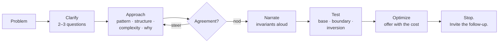

# Lesson 5 — Mock Round: The 45-Minute Coding Round

| | |
|---|---|
| **Prepares** | A full 45-minute coding round: one or two problems, five scored beats, and a follow-up chain on every answer |
| **Prerequisites** | Lessons 1–4 worked through, including their rapid-fire drills |
| **Time** | ~75 min (rapid round + three timed problems + honest self-assessment) |

> 📍 **How this round differs from every earlier mock.** Sessions 1–5 scored *what you know*. This one scores **what is audible**. You can produce a correct solution here and still fail the round, and that is not a flaw in the simulation — it is the exact failure mode your audit predicts for you. Run every problem below out loud, on a timer, in the language you expect to use in the loop.

## 🟢 Learning Objectives

After this round you can:

- **Execute all five beats under a 45-minute clock** without consciously tracking them.
- **Deliver a complete approach statement** — pattern, structure, complexity, why-not-the-obvious — and stop for agreement.
- **Recover audibly** from a wrong approach, a bug found mid-trace, and an interviewer hint.
- **Locate your own protocol gaps** across 15 checkpoints and log them as study targets.

## 🟢 Before You Start

1. **Set a real timer.** 45 minutes per set-piece problem, phone face-down. The protocol is easy at leisure and collapses under a clock — that collapse is the thing being trained.
2. **Speak everything, alone in a room.** If it stays in your head it did not happen. Record yourself for one of the three; listening back is uncomfortable and unusually effective.
3. **Pick your language and stay in it.** ⚠️ **JD-DEPENDENT** — C++ is your fluency home; an ML-implementation round would expect Python. Confirm with your recruiter (Chapter 0, item #4) and drill the one you will actually use.
4. **Write the beats on a sticky note** for the first two attempts: *clarify · approach · narrate · test · optimize*. Remove it by the third.

---

## 🟢 The Bar for This Round

| Property | What it sounds like | What fails |
|---|---|---|
| **Clarified** | Two or three questions whose answers would change the design | Starting to type; or twenty questions |
| **Designed** | Pattern + structure + complexity + why, then a pause for agreement | "Let me just start and see where it goes" |
| **Audible** | The invariant being maintained, stated as you type it | Four minutes of silence |
| **Owned** | You find your own bug in a hand-trace before claiming completion | "Done" — followed by the interviewer finding it |
| **Traded** | The optimisation offered with its cost, and what you would measure | Silently rewriting working code at minute 35 |

---

## 🟢 The Rapid Round

Fourteen questions across all four lessons, delivered in sequence. These are the *spoken* half of the round — no code, just the reasoning an interviewer hears.

<RehearsalStudio rubric="mechanism" minSeconds="35" maxSeconds="110" prompt="Answer each out loud as you would in the round: the mechanism, a number or an invariant, and the trade-off. Then stop and invite the follow-up." questions="The problem has just been read to you. What are the first ninety seconds? || Give me a complete approach statement for 'longest substring with at most k distinct characters'. || You have been typing in silence for four minutes. What should have been audible? || The code compiles. Are you done? || It is minute 25 and your invariant is broken. What do you say? || The constraint says n up to 200,000. What have you learned before reading the problem? || Name four patterns together with the invariant that makes each correct. || Longest subarray summing to exactly k, with negative values allowed. Why is a sliding window wrong? || You do not recognise the problem at all. What is your method? || What is the complexity of the code you just wrote — including what your language hides? || Prove your greedy solution is optimal. || For the k largest of n elements, why a heap rather than a sort? And when does quickselect beat both? || Write binary search. What are the two hazards? || Before writing any code, what test cases do you name, and why then?" />

> [!TIP]
> If you cannot answer one of these in under 90 seconds out loud, that is the gap — not a knowledge gap, a **rehearsal** gap. Re-run that lesson's rapid-fire drill rather than re-reading the lesson.

---

## 🟢 The Three Set-Piece Problems

Each is a full round. Timer on, out loud, all five beats. Open the model transcript **only after your attempt** — reading it first destroys the drill.

### 🔷 Problem 1 — Warm-up (target: 20 minutes)

<RehearsalStudio rubric="mechanism" minSeconds="120" maxSeconds="300" prompt="Full protocol, 20 minutes, out loud: 'Given a string s and an integer k, return the length of the longest substring containing at most k distinct characters.' Clarify, state the approach and wait, narrate the invariant while coding, trace three cases, then handle 'can you do better'." />

✅ Model transcript — what the five beats sound like

**Beat 1 — Clarify.** "So: longest substring — contiguous — with at most *k* distinct characters, returning the length. Three things: how large can the string get? Is *k* guaranteed to be at least 1, or can it be 0? And is the character set ASCII or full Unicode?" *(Answers: $n \le 10^5$; *k* can be 0; assume ASCII.)*

**Beat 2 — Approach.** "$n$ at $10^5$ rules out $O(n^2)$ — that's $10^{10}$ operations. This is a sliding window: I expand `right`, and while the window holds more than *k* distinct characters I contract from `left`. I'll keep a hash map from character to its count in the window, and the distinct count is the map's size. Each character enters and leaves at most once, so it's O(n) time and O(min(n, alphabet)) space. The brute force would recompute the distinct set for every window, which is where the $n^2$ comes from. With *k*=0 the answer is 0, which the loop handles naturally. Does that sound right before I code it?"

**Beat 3 — Narrate.** "Setting up the map and two pointers. The invariant I'm maintaining is that the window `[left, right]` never holds more than *k* distinct characters — so after each expansion I contract until that's true again, then record the length. I'm decrementing the count on contraction and erasing the key when it hits zero — that erase is what keeps the map size equal to the distinct count, so it isn't optional."

**Beat 4 — Test.** "Let me trace `"eceba"`, *k*=2. right=0: window `e`, size 1, best 1. right=1: `ec`, size 2, best 2. right=2: `ece`, still 2 distinct, best 3. right=3 adds `b`: 3 distinct, so contract — remove `e`, count 1, still 3 distinct; remove `c`, now `eb`, size 2. best stays 3. right=4 adds `a`: contract to `ba`, best still 3. Returns 3. ✅ Boundary: empty string never enters the loop, returns 0. Inversion: *k*=0 — the contraction runs until the window is empty every time, so best stays 0. ✅ And all-identical `"aaaa"` with *k*=1 gives 4, which is right."

**Beat 5 — Optimize.** "It's already O(n) time, and I don't think you can beat that — any correct solution has to look at every character. The space is O(min(n, alphabet)); with a fixed ASCII alphabet I could use a 128-element array instead of a hash map, which is the same asymptotic bound but a materially better constant and no hashing. Want me to make that change, or is the map fine?"

🔁 The follow-up chain the interviewer will run

"What if it were *exactly* k distinct rather than at most?" (compute at-most-*k* minus at-most-*(k−1)* — a standard and worth-knowing reduction, since the direct version is much fussier) → "What if the string is streamed and you can't index backwards?" (the algorithm already only moves forward, but you would need to buffer the window itself, which is $O(n)$ worst case — so the honest answer is that the memory bound changes) → "Now make it the longest substring with at most *k* **repeated** characters." (a different invariant; say so explicitly rather than trying to bend the current one — recognising when a variant is a *different* problem is a scored signal) → "What's the complexity if you'd used a `list` for the counts and scanned it each step?" ($O(n \cdot |\Sigma|)$ — the hidden-cost trap from Lesson 3).

---

### 🔷 Problem 2 — Data scale (target: 25 minutes)

<RehearsalStudio rubric="mechanism" minSeconds="150" maxSeconds="330" prompt="Full protocol, 25 minutes, out loud: 'Given a 10-million-line query log, return the 100 most frequent queries.' Do the whole protocol. Then handle the follow-up you should expect: the distinct queries no longer fit in memory." />

✅ Model transcript — the beats, plus the pivot

**Beat 1 — Clarify.** "Ten million lines, top 100 by frequency. Three things: roughly how many *distinct* queries — hundreds of thousands, or billions? Does the log fit in memory, or am I streaming it? And do ties at the boundary need deterministic handling?" *(Answers: about 2 million distinct; the file streams from disk; ties broken lexicographically.)*

**Beat 2 — Approach.** "Two phases. Count with a hash map from query to count — 2 million entries is fine in memory. Then select the top 100 with a size-100 min-heap over the map entries: push while the heap is under 100, then only push when the incoming count beats the root. That's $O(N)$ for counting and $O(D \log k)$ for selection, where $N$ is 10 million lines and $D$ is 2 million distinct queries. Sorting all distinct queries instead would be $O(D \log D)$ — about 21 comparisons per entry against 7 — and I don't need a full ordering. Memory is $O(D)$, dominated by the counting map. Sound right?"

**Beat 3 — Narrate.** "Streaming the file line by line rather than reading it whole — the log is the big object, not the map. The heap invariant is that it holds the best 100 entries seen so far and its root is the admission threshold, so the comparison against the root is what keeps this $O(D \log k)$ rather than $O(D \log D)$. Ties: I'm making the heap comparator `(count, reversed-query)` so the lexicographic rule holds at the boundary, since that was specified."

**Beat 4 — Test.** "Base: a small log where I know the answer by hand. Boundary: fewer than 100 distinct queries — the heap never fills, and I return all of them sorted, which I should check is the intended behaviour rather than an error. Inversion: all counts equal, where the tie-break rule decides the entire answer. Adversarial: one query dominating half the log, which doesn't break anything but is worth naming. And I'll confirm the output is sorted descending — the heap gives me the right *set*, not the right *order*, so I sort those 100 at the end. That's the bug this problem is designed to catch."

**Beat 5 — The pivot when the map won't fit.** "If the distinct count is in the billions, the counting map is the binding constraint, not the heap — and my design breaks there. Two options. **Exact:** shard by hash of the query across *m* partitions, count each independently, take a local top-100 from each, and merge — correct because all occurrences of a query hash to the same shard, so no count is split. **Approximate:** a count–min sketch in fixed memory, which over-estimates but never under-estimates, with an error bound tunable by width and depth. I'd take the sharded exact version if the infrastructure allows it, and the sketch only if memory is genuinely fixed — and I'd say which, rather than presenting the approximation as free."

🔁 The follow-up chain the interviewer will run

"Why min-heap rather than max-heap?" (the root of a size-*k* min-heap is the *smallest* of your current best *k*, which is exactly the admission threshold; a max-heap of size *k* gives you no cheap way to evict the weakest — this is the most common error in the whole family) → "What if the top-100 must update continuously as the log streams?" (then the heap alone is insufficient, because a count that grows can already be inside or outside the heap; you keep the count map plus a heap with lazy deletion, or a bucket structure keyed by count) → "How much memory is the count map?" (2 million entries × roughly 100 bytes of key, value, and hash-table overhead ≈ 200 MB — do the arithmetic out loud, it is always a better answer than "it should fit") → "Could you avoid the counting phase entirely?" (only approximately — a count–min sketch or a Misra–Gries heavy-hitters pass; both give bounded error, neither gives exact counts, and saying that trade cleanly is the point).

---

### 🔷 Problem 3 — Search over answers (target: 25 minutes)

<RehearsalStudio rubric="mechanism" minSeconds="150" maxSeconds="330" prompt="Full protocol, 25 minutes, out loud: 'Packages with given weights must ship in order within D days. Each day the ship carries a prefix of the remaining packages, up to its capacity. Return the minimum capacity that completes the shipment within D days.' Include the monotonicity argument — it is the part being scored." />

✅ Model transcript — the beats, with the proof

**Beat 1 — Clarify.** "Packages ship **in order**, so I can't reorder them — confirming that, because it changes the problem completely. How many packages, and how large can a single weight be? And is $D$ guaranteed to be at most the number of packages?" *(Answers: $n \le 5 \times 10^4$; weights up to 500; yes.)*

**Beat 2 — Approach.** "I can't compute the answer directly, but I *can* cheaply check a candidate: given capacity $C$, greedily fill each day until the next package would overflow, then start a new day — that's an $O(n)$ scan giving the number of days needed. And feasibility is monotone: if capacity $C$ finishes in $D$ days, any capacity above $C$ also does, because every day can carry at least as much. So the predicate is false…false, true…true, and I binary search the boundary. The range is $[\max(w), \sum w]$ — below the max, one package never fits; the sum always works in one day. That's $O(n \log(\sum w))$, about $50{,}000 \times 25$ — comfortable. Shall I code the feasibility check first?"

**Beat 3 — Narrate.** "Writing the feasibility function first, because it's the part that has to be right: `days` starts at 1, `load` at 0; for each weight, if `load + w > C` I start a new day and reset `load` to `w`, else I add it. Returns `days <= D`. Now the search: `lo = max(w)`, `hi = sum(w)`, and the boundary template — `while lo < hi`, with the invariant that `hi` is always feasible and `lo` may not be. Midpoint as `lo + (hi - lo) / 2` for overflow safety; the sum here is at most $2.5 \times 10^7$ so it doesn't overflow, but I'd rather write the safe form by habit. If `mid` is feasible, `hi = mid`; otherwise `lo = mid + 1`. Since the update on the low side is `mid + 1` and not `mid`, this terminates — that's the infinite-loop hazard."

**Beat 4 — Test.** "Base: weights 1–10 with $D$=5 gives 15, and I can check that by hand — days would be [1,2,3,4,5],[6,7],[8],[9],[10]. Boundary: $D$ equal to $n$, so the answer is exactly $\max(w)$ — that's the left end of my range and it verifies the range is right. Inversion: $D$=1, so the answer is the full sum, verifying the right end. Adversarial: all weights identical, where the day boundaries fall exactly on capacity multiples and an off-by-one in the overflow comparison would show. Let me also confirm the comparison is `>` and not `>=` — with `>=` a package exactly filling the ship would wrongly start a new day."

**Beat 5 — Optimize.** "The bound is $O(n \log(\sum w))$ and I don't see a way past it — you can't verify a capacity without scanning all packages, so $O(n)$ per check is a floor, and the search range can't be narrowed much below $\log$ of the weight sum. The real optimisation available is the *range*, not the algorithm: starting from $\lceil \sum w / D \rceil$ rather than $\max(w)$ tightens the lower bound when $D$ is small. That's a constant-factor improvement, so I'd only take it if the check were expensive."

🔁 The follow-up chain the interviewer will run

"Prove the greedy feasibility check is right — why not leave a day partly empty deliberately?" (an exchange argument: leaving a package for tomorrow when it fits today can never reduce the day count, because tomorrow's ship then carries strictly more and the remaining suffix is unchanged; so the greedy prefix-fill is optimal for any fixed capacity) → "What if packages could be reordered?" (a completely different problem — bin packing, which is NP-hard, so the honest answer is that you would use a heuristic like first-fit-decreasing with its known approximation bound, not an exact search; recognising the hardness boundary is the scored part) → "What if the feasibility check were expensive, say $O(n \log n)$?" (then the number of checks matters more and you would tighten the initial range as described, or interpolate rather than bisect) → "Where else does this pattern appear?" ("minimise the maximum" and "maximise the minimum" phrasings generally — split-array-largest-sum, allocating pages, scheduling with a deadline; the phrasing is close to a giveaway).

---

## 🟢 Honest Self-Assessment

The bar is **"I did it out loud, on a timer, without a sticky note."** Knowing a beat exists is not the same as executing it under a clock.

| # | Checkpoint | Lesson | Can you do it cold? |
|---|---|---|---|
| 1 | Restate the problem, then 2–3 targeted clarifying questions | 1 | ☐ Clean ☐ Shaky ☐ No |
| 2 | Four-part approach statement, ending in a question | 1 | ☐ Clean ☐ Shaky ☐ No |
| 3 | Narrate invariants, not syntax, while typing | 1 | ☐ Clean ☐ Shaky ☐ No |
| 4 | "Let me test it" — never "done" | 1 | ☐ Clean ☐ Shaky ☐ No |
| 5 | Recover from a broken invariant in four audible moves | 1 | ☐ Clean ☐ Shaky ☐ No |
| 6 | Map the bound on $n$ to an admissible complexity class, with arithmetic | 2 | ☐ Clean ☐ Shaky ☐ No |
| 7 | Name any pattern *together with* its invariant | 2 | ☐ Clean ☐ Shaky ☐ No |
| 8 | Say why negatives break a sliding window, and what replaces it | 2 | ☐ Clean ☐ Shaky ☐ No |
| 9 | The four reduction moves when nothing matches | 2 | ☐ Clean ☐ Shaky ☐ No |
| 10 | Complexity of *your code*, including hidden container costs | 3 | ☐ Clean ☐ Shaky ☐ No |
| 11 | Correctness in the right shape: invariant, exchange, or monotone predicate | 3 | ☐ Clean ☐ Shaky ☐ No |
| 12 | Heap vs sort vs quickselect, with the bounds and the streaming argument | 3 | ☐ Clean ☐ Shaky ☐ No |
| 13 | Binary search: both hazards, one fixed template | 3 | ☐ Clean ☐ Shaky ☐ No |
| 14 | Four test classes named before coding | 4 | ☐ Clean ☐ Shaky ☐ No |
| 15 | Stream problems: min-heap top-*k*, reservoir sampling, union–find | 4 | ☐ Clean ☐ Shaky ☐ No |

**How to read your result**

| Clean count | What it means | Next step |
|---|---|---|
| **13–15** | Coding round-ready. Your ability was never the question; the protocol is now evidenced | Move to Session 7; re-run one set-piece weekly to keep it warm |
| **8–12** | You know all of it and execute some of it under a clock | Re-run the three set-pieces on a timer, recorded. This is a rehearsal gap, not a knowledge gap |
| **≤ 7** | The protocol has not become automatic yet | Do Problem 1 out loud once a day for a week with the sticky note. It converts fast — this is the most closable gap in your whole map |

Log every ☐ Shaky and ☐ No in the Gap Log in [PROGRESS.md](../../PROGRESS.md), with the **beat** it belongs to.

---

## 🟢 The Synthesis Question

Coding interviewers occasionally close with a reflective question rather than another problem. For you it is unusually likely, because your résumé shows 700+ solved problems and an interviewer will want to know what you learned from them beyond volume.

<RehearsalStudio rubric="mechanism" minSeconds="75" maxSeconds="170" prompt="Answer out loud, ~2 minutes: 'You've solved a lot of practice problems. What do you actually do differently now when you see a new one?' Give one causal narrative, not a list of patterns." />

✅ Model answer — the arc

"Three things changed, and none of them is knowing more patterns.

**First, I read the constraints before the problem.** The bound on *n* eliminates most of the design space before I've thought about the structure at all — $n$ at $2 \times 10^5$ means $O(n^2)$ is $4 \times 10^{10}$ operations and is out, so I'm looking for a single pass, a sort, or a window. And a suspiciously *small* bound is a hint in the other direction: $n \le 20$ usually means the intended solution is exponential and I shouldn't over-engineer.

**Second, I stopped separating the pattern from its invariant.** Early on I'd recognise 'sliding window' and start typing. Now I say the invariant with the name — 'the window is always valid, and each element enters and leaves once' — because that one sentence is simultaneously the correctness argument and the complexity argument. It also tells me immediately when the pattern *doesn't* apply: the moment negative values are allowed, the window's monotonicity assumption fails, and I need prefix sums instead. That's a failure I used to find by getting a wrong answer.

**Third, and this is the one I've deliberately worked on for interviews: I design the test cases before writing the code.** Base, boundary, inversion, adversarial — and the inversion case is the one that matters, because it attacks the assumption my invariant rests on. Tests written afterwards tend to test whatever the code happens to do.

**And honestly, the thing volume did not teach me is the part I've had to train separately.** Practice sites score a submission; an interview scores a transcript. Solving quickly and silently produces no evidence of how I handle ambiguity, or whether I can be steered. So I've been drilling the protocol as its own skill — clarify, state the approach and wait for agreement, narrate the invariant, trace before claiming it works, and offer the optimisation with its cost. The problems were never the hard part for me. Making the solving visible was."

**Why this answer works:** it is true, it is specific, and it converts a potential liability — "competitive programmer who might not communicate" — into evidence of self-awareness and deliberate practice. It also pre-empts the exact concern your audit flagged. Never claim a protocol you have not rehearsed; the next problem will test it immediately.

---

## 🟢 Summary

- This round scores **what is audible**. A correct silent solution produces a thin debrief note; the five beats produce five pieces of evidence.
- The three set-pieces cover the three shapes an AS coding round actually uses: a **window** problem, a **data-scale counting** problem with an out-of-memory pivot, and a **search-over-answers** problem whose monotonicity argument is the scored part.
- Your gap is the most closable one in your map. Ability is evidenced by 700+ problems; the protocol converts in about a week of daily out-loud repetition.
- **Rehearse the synthesis answer.** "What did all that practice teach you?" is likely for your specific résumé, and the honest version of it is a strong answer.

**Session complete.** Next: the [Chapter Quiz](quiz.md), then [Session 7 — Coding: ML From Scratch](../07_ml_from_scratch/README.md).
