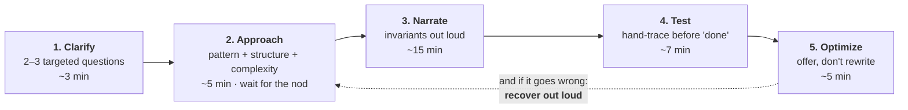

# Session 6 — Coding: DSA & Algorithms

| | |
|---|---|
| **What it prepares** | The coding round — the only round in your loop where the dossier says your **ability is already evidenced** and your **protocol is not** |
| **Prerequisites** | Dossier Ch2 (your coding score: 4/5) and Ch5 (Gap #8). No prior session is required — this round is independent of Sessions 1–5 |
| **Session length** | 4 lessons + a mock round, ~4–5 hours |
| **Format** | Drill cards: say the answer out loud first, then open the model answer. Code, traces, and complexity proofs sit in collapsed blocks. |

---

## 🟢 What This Round Actually Tests

Read your own audit before you read anything else. Chapter 2 scored Coding **4/5** — the highest of any technical dimension — on the strength of 700+ solved problems in C++. Chapter 5 then listed "grind LeetCode volume" under **things not to do**, because:

> Your coding gap is *protocol*, not ability (Gap #8).

So this session does not teach you algorithms. It teaches you to make solving **visible**. An interviewer cannot score the reasoning you did silently. The failure mode this session targets is specific and it is *caused* by fluency:

**The 700-problem reflex** — you recognise the pattern in four seconds and start typing. In an interview that skips two scored beats (clarify, approach) and converts a strong candidate into an average transcript. You can write a flawless solution and still lose the round.

**The through-line:** every beat above is scored separately. Correct code with beats 1, 2 and 4 missing scores worse than slightly-imperfect code with all five present — because the interviewer is writing evidence for a hiring debrief, not marking a submission.

---

## 🟢 Scope Brief: The Four Areas

| Area | The version everyone gives | The version that scores |
|---|---|---|
| **Protocol** | "Read the problem, write code, run it" | Five audible beats, each producing evidence: what you asked, what you proposed, what you maintained, what you tested, what you traded |
| **Pattern recognition** | "I've seen this one before" | You read the *constraint* first, derive which complexity class is admissible, and name the pattern **and its invariant** before touching the editor |
| **Complexity & correctness** | "It's O(n log n)" | The bound of the code you actually wrote — including the container costs your language hides — plus a correctness argument in one of three standard shapes |
| **Testing & recovery** | "Handle nulls and empty arrays" | Test classes designed *before* coding, each tied to an invariant; and a rehearsed way to be wrong at minute 25 without losing the round |

---

## 🟢 Session Structure

1. [Lesson 1 — The Five Beats: Making Solving Visible](01_the_five_beats.md)
2. [Lesson 2 — From Constraints to Pattern](02_constraints_to_patterns.md)
3. [Lesson 3 — Complexity & Correctness You Can Defend](03_complexity_and_correctness.md)
4. [Lesson 4 — Test Design & the AS-Flavoured Problem Set](04_testing_and_the_as_problem_set.md)
5. [Mock Round — The 45-Minute Coding Round](05_mock_round.md)

Then the [Chapter Quiz](quiz.md).

🔬 **Interactive companion** (CPU-only, standard library plus matplotlib, runs in well under a minute): [▶ Open the DSA Lab in Colab](https://colab.research.google.com/github/vinod-seth/Applied-Scientist-Interview-Gauntlet/blob/main/tutorial/06_dsa_algorithms/dsa_lab.ipynb) — measure the container costs your complexity statement hides, watch a heap beat a sort on top-k as *k* shrinks, verify reservoir sampling is uniform, break a binary search on its boundary condition, and run the protocol against a 45-minute timer.

Plain link, if the badge does not resolve: `https://colab.research.google.com/github/vinod-seth/Applied-Scientist-Interview-Gauntlet/blob/main/tutorial/06_dsa_algorithms/dsa_lab.ipynb`

---

## 🟢 How to Practise This Session

Volume is not the lever here; **observation** is. Three rules make the difference:

1. **Speak everything.** If a thought does not become a sentence, it did not happen as far as the round is concerned. Practise out loud even when alone — silent practice trains the exact habit that costs you the round.
2. **Use a timer.** Every drill and every mock problem is timed, because the protocol is easy at leisure and collapses under a clock. The Lab has a timer that logs your beats.
3. **Practise in your loop language.** ⚠️ **JD-DEPENDENT:** your fluency is C++; ML-implementation questions typically expect Python/NumPy. Chapter 0 checklist item #4 is to confirm the permitted language with your recruiter. Until then, drill the protocol in C++ and the ML-adjacent problems in Python — the beats are identical, only the container costs differ.

> [!NOTE]
> Nothing here is scored or gated. The target is that for any problem an interviewer poses, you can produce the five beats without thinking about them — leaving your whole attention for the problem.

> [!IMPORTANT]
> ⚠️ **JD-DEPENDENT.** How much of the loop is coding varies by team, and it is `[UNKNOWN]` for yours. Some Applied Scientist loops run a full DSA round; others fold coding into an ML-implementation round covered in Session 7. Ask your recruiter — it is question 4 on your [Chapter 0](../../dossier/00_target_lock.md) list. Prepare both; they share every beat above.
