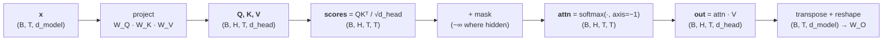

# Lesson 1 — Attention From a Blank Editor

[](https://colab.research.google.com/github/vinod-seth/Applied-Scientist-Interview-Gauntlet/blob/main/tutorial/07_ml_from_scratch/ml_from_scratch_lab.ipynb)

| | |
|---|---|
| **Prepares** | The highest-probability implementation ask in your entire loop — your résumé says you wrote this, so an interviewer can simply ask you to do it again |
| **Time** | ~14 min visible + drills + a 12-minute blank-editor task |
| **Domain tag** | ML implementation / transformer internals |

> 📍 **How this lesson works:** Session 1 defended *why* your transformer is shaped the way it is. This lesson is the other half — producing it, cold, with every shape named out loud. The code lives in collapsed blocks so you attempt each drill from nothing first. **Say the shape of every tensor as you create it.** Almost every bug in this round is a shape bug.

## 🟢 Learning Objectives

After this lesson you can:

- **Implement scaled dot-product attention** in NumPy from a blank file, naming every intermediate shape.
- **Justify the $\sqrt{d_k}$ divisor** with the variance argument, not with "it works better".
- **Apply <abbr title="A mask that stops each position attending to later positions, so a decoder cannot use tokens it has not generated yet">causal</abbr> and <abbr title="A mask that hides positions holding filler tokens added to make sequences in a batch the same length">padding</abbr> masks** in the correct place, and say what breaks if they are applied after the softmax.
- **Reshape single-head attention into multi-head** and explain why the transpose is required rather than optional.
- **Add <abbr title="Rotary position embedding: encodes position by rotating pairs of query and key dimensions by a position-dependent angle">RoPE</abbr>** to queries and keys, and show why the resulting score depends only on relative position.

## 🟢 The One Picture

Attention is four shape transitions. If you can say them in order, you can write the function; if you cannot, no amount of intuition about "queries attending to keys" will save you in an editor.



**The one shape to memorise:** the score matrix is `(B, H, T, T)` — square in sequence length, which is where the $O(T^2)$ cost you discussed in Session 4 physically lives. If your scores are not square, you have transposed something.

---

## 🔷 Drill 1 — "Write scaled dot-product attention. Name the shapes as you go."

*The base case. 90 seconds to talk through, 4 minutes to type. Attempt it before opening this.*

<details><summary>✅ Model answer</summary>

```python
def softmax(x: np.ndarray, axis: int = -1) -> np.ndarray:
    """Shift-invariant softmax. The max subtraction is not optional - see Lesson 2."""
    x = x - np.max(x, axis=axis, keepdims=True)
    e = np.exp(x)
    return e / np.sum(e, axis=axis, keepdims=True)


def scaled_dot_product_attention(q, k, v, mask=None):
    """
    q, k : (..., T_q, d_k)   v : (..., T_k, d_v)
    mask : broadcastable to (..., T_q, T_k); True where a position is FORBIDDEN
    returns: (..., T_q, d_v) and the attention weights
    """
    d_k = q.shape[-1]
    scores = q @ np.swapaxes(k, -1, -2) / np.sqrt(d_k)   # (..., T_q, T_k)
    if mask is not None:
        scores = np.where(mask, -np.inf, scores)         # BEFORE the softmax
    weights = softmax(scores, axis=-1)                   # rows sum to 1
    return weights @ v, weights                          # (..., T_q, d_v)
```

**Narrate it like this while typing:** "`q` is `(B, H, T, d_head)`. I transpose the last two axes of `k` so the matmul contracts over `d_head` and gives me `(B, H, T, T)` — square in sequence length. I scale by root `d_head`. The mask goes on the scores, not the weights. Softmax over the **last** axis, so each query's row of attention sums to one. Then weights times `v` contracts over the key axis and returns me to `(B, H, T, d_head)`."

**The axis that people get wrong is the softmax axis.** It must be the *key* axis (last). Softmaxing over the query axis compiles, runs, trains, and is wrong — a perfect example of this round's silent-bug problem.
</details>

<details><summary>🔁 The follow-up chain</summary>

"Why `swapaxes(-1, -2)` rather than `k.T`?" (because `k` is 4-D here — `.T` reverses *all* axes and would scramble the batch and head dimensions; this is a real bug people write under pressure) → "What if `T_q` and `T_k` differ?" (that is <abbr title="Attention where queries come from one sequence and keys and values from another, so the two lengths differ">cross-attention</abbr>, and the code above already handles it — the scores are rectangular `(T_q, T_k)`, which is worth pointing out because it shows the function is general rather than memorised for self-attention) → "How would you test this?" (three tests: a shape assertion; rows of `weights` summing to 1; and a comparison against a naive triple-nested Python loop on a tiny input — the loop is the reference you trust) → "What is the memory cost?" ($O(B \cdot H \cdot T^2)$ for the score matrix, which is the term FlashAttention removes by never materialising it — Session 4).
</details>

---

## 🔷 Drill 2 — "Why divide by √d_k?"

*The question that separates people who typed it from people who understand it. 45 seconds.*

<details><summary>✅ Model answer</summary>

A variance argument. Treat the components of $q$ and $k$ as independent, zero-mean, unit-variance. Their dot product is a sum of $d_k$ such products:

$$q \cdot k = \sum_{i=1}^{d_k} q_i k_i, \qquad \mathrm{Var}(q \cdot k) = \sum_{i=1}^{d_k} \mathrm{Var}(q_i k_i) = d_k$$

So the scores have standard deviation $\sqrt{d_k}$, which **grows with head dimension**. At $d_k = 64$ that is a spread of ±8 before training has done anything. Feed scores of that magnitude into a softmax and it becomes nearly one-hot — and a <abbr title="A softmax whose output is nearly one-hot, so its gradient with respect to the scores is almost zero everywhere">saturated softmax</abbr> has vanishing gradients, because $\partial p_i/\partial s_j \to 0$ when $p$ is at a corner of the simplex. Dividing by $\sqrt{d_k}$ returns the scores to unit variance and keeps the softmax in its responsive region.

This is the argument given in the original paper's footnote (Vaswani et al., 2017) — it is not folklore.

> **Say it:** "The dot product of two $d_k$-dimensional unit-variance vectors has variance $d_k$, so scores scale as root $d_k$. Without the divisor, a 64-dimensional head produces scores spread over roughly ±8, the softmax saturates toward one-hot, and its gradient vanishes. Dividing by root $d_k$ restores unit variance."
</details>

<details><summary>🔁 The follow-up chain</summary>

"What if you scaled by $d_k$ instead of $\sqrt{d_k}$?" (over-correction — scores shrink toward zero, the softmax becomes nearly uniform, and attention loses its ability to select; the standard deviation is the right normaliser because it matches the units of the quantity) → "Does this still matter after training?" (less, since the model can learn the scale into $W_Q$ and $W_K$ — but it matters enormously at *initialisation*, and a model that saturates at step 0 may never recover; this is the same class of argument as why $B=0$ in LoRA) → "Where else does softmax saturation bite?" (temperature in decoding is literally this knob applied at inference — Session 5 Lesson 2 — and a temperature below 1 is deliberately re-saturating the distribution) → "Is $\sqrt{d_k}$ or $\sqrt{d_{head}}$?" (the head dimension, since the dot product happens per head — saying `d_head` explicitly is a small precision that shows you have implemented it rather than read it).
</details>

---

## 🔷 Drill 3 — "Add masking. Where exactly, and why $-\infty$?"

*Two mask types, one placement rule, one crash you should know about. 60 seconds.*

<details><summary>✅ Model answer</summary>

**Placement:** on the **scores, before the softmax** — never on the weights after it.

Setting masked weights to zero *after* the softmax leaves the surviving weights un-renormalised: the row no longer sums to 1, so the output is a shrunken convex combination whose magnitude depends on how many positions were masked. It does not crash. It trains. It is wrong.

Using $-\infty$ before the softmax is exactly right because $e^{-\infty} = 0$, so the masked entries contribute nothing to the denominator either, and the row renormalises over the survivors automatically.

**Two masks, different shapes, combined by logical OR:**

| Mask | Shape | Rule |
|---|---|---|
| **Causal** | `(T, T)`, broadcast over batch and heads | Forbid $j > i$: `np.triu(np.ones((T, T), bool), k=1)` |
| **Padding** | `(B, 1, 1, T)` | Forbid key positions holding filler tokens |

```python
causal  = np.triu(np.ones((T, T), dtype=bool), k=1)          # (T, T)
padding = ~valid[:, None, None, :]                            # (B, 1, 1, T)
mask    = causal | padding                                    # broadcasts to (B, H, T, T)
```

**The crash worth knowing:** if an entire row is masked — a fully-padded query position — every score is $-\infty$, the softmax denominator is 0, and you get `NaN`. It then propagates through the whole batch. The fix is to mask the *output* of those rows rather than relying on the softmax, or to keep the diagonal always visible.
</details>

<details><summary>🔁 The follow-up chain</summary>

"Why is the padding mask on the *key* axis and not the query axis?" (because a padded key must never be *attended to*; a padded query produces garbage output that you discard downstream, and masking it in the scores is what creates the all-masked row and the NaN) → "Why $-\infty$ rather than a large negative number like $-10^9$?" (both work in fp32; in fp16 $-10^9$ overflows to $-\infty$ anyway, and true $-\infty$ is cleaner — but $-10^9$ is the safer choice if any downstream op does arithmetic on the scores) → "Show me the causal mask for T=4." (a 4×4 upper triangle above the diagonal — draw it; being able to sketch the matrix instantly is the cheap version of proving you have implemented it) → "How would you test the causal mask?" (feed a distinctive value into position 3 and assert the outputs at positions 0–2 are unchanged — a leakage test, and far stronger than eyeballing the matrix).
</details>

---

## 🔷 Drill 4 — "Make it multi-head. What is the reshape, exactly?"

*The step where shapes go wrong silently. 60 seconds.*

<details><summary>✅ Model answer</summary>

```python
def split_heads(x, n_heads):
    """(B, T, d_model) -> (B, H, T, d_head)"""
    B, T, d_model = x.shape
    d_head = d_model // n_heads
    x = x.reshape(B, T, n_heads, d_head)      # split the FEATURE axis
    return x.transpose(0, 2, 1, 3)            # move heads next to batch

def merge_heads(x):
    """(B, H, T, d_head) -> (B, T, d_model)"""
    B, H, T, d_head = x.shape
    return x.transpose(0, 2, 1, 3).reshape(B, T, H * d_head)
```

**Two things must both be true, and this is the whole drill:**

1. **The reshape splits the feature axis, not the time axis.** `d_model` becomes `(H, d_head)`. Reshaping `(B, T, d_model)` into `(B, H, T, d_head)` in one call would interleave time and heads and silently scramble the sequence.
2. **The transpose is mandatory, not cosmetic.** The matmul must batch over `(B, H)` and contract over `d_head`, so the two sequence axes have to be the last two. Skipping the transpose gives a result of the right *shape* in some configurations and the wrong *content* — the worst kind of bug.

`merge_heads` must transpose **back before** reshaping, for the same reason in reverse. `reshape` alone reads memory in order; if the axes are not in the order you assume, it mixes heads into features.

**Why $d_{head} = d_{model}/H$:** it keeps the total parameter and FLOP count of multi-head attention equal to single-head attention at full width. More heads do not cost more; they buy several lower-dimensional subspaces to attend in instead of one wide one.
</details>

<details><summary>🔁 The follow-up chain</summary>

"How do you catch the transpose bug in a test?" (run with `H=1` and assert the result equals your single-head implementation exactly — with one head the transpose is a no-op on content, so any discrepancy is a reshape error; then run with `H=2` on an input whose two halves are distinct) → "Does `W_O` matter, or is concatenation enough?" (it matters — concatenation alone never mixes information *across* heads, so $W_O$ is what lets the layer combine what different heads found; dropping it is a real ablation with a measurable cost) → "What about MQA and <abbr title="Grouped-query attention: keys and values use fewer heads than queries, shrinking the KV cache at serving time">GQA</abbr>?" (Session 4: keys and values get fewer heads than queries, so `split_heads` uses a different head count for K/V and they broadcast against Q — the shape bookkeeping is exactly where those implementations get fiddly) → "Is the transpose free?" (in NumPy it is a view, but the subsequent matmul may force a copy; in PyTorch this is why `.contiguous()` appears after transposes — worth naming).
</details>

---

## 🔷 Drill 5 — "Now add RoPE. Your résumé says you implemented it."

*Claim Vault #9, made executable. 90 seconds.*

<details><summary>✅ Model answer</summary>

RoPE encodes position by **rotating** pairs of dimensions by a position-dependent angle, rather than adding a position vector.

For position $m$ and dimension pair $i$, with $\theta_i = 10000^{-2i/d}$:

$$\begin{pmatrix} x'_{2i} \\ x'_{2i+1} \end{pmatrix} = \begin{pmatrix} \cos m\theta_i & -\sin m\theta_i \\ \sin m\theta_i & \cos m\theta_i \end{pmatrix} \begin{pmatrix} x_{2i} \\ x_{2i+1} \end{pmatrix}$$

```python
def rope(x, positions, base=10000.0):
    """x: (..., T, d) with d even. Rotates dimension pairs by position * theta_i."""
    d = x.shape[-1]
    i = np.arange(d // 2)
    theta = base ** (-2.0 * i / d)                     # (d/2,)
    ang = positions[:, None] * theta[None, :]          # (T, d/2)
    cos, sin = np.cos(ang), np.sin(ang)
    x_even, x_odd = x[..., 0::2], x[..., 1::2]
    return np.stack([x_even * cos - x_odd * sin,
                     x_even * sin + x_odd * cos], axis=-1).reshape(x.shape)
```

**Three facts that carry the answer:**

1. **Applied to $Q$ and $K$ only — never to $V$.** Position must influence *which* positions are attended to, not the content that gets summed. Rotating $V$ is a genuine bug and a common one.
2. **Relative position emerges from the dot product.** A rotation is <abbr title="A transformation that preserves lengths and angles; its inverse is its transpose, so inner products survive it unchanged">orthogonal</abbr>, so $\langle R_m q, R_n k \rangle = \langle q, R_{n-m} k \rangle$ — the score depends on $n - m$ alone, never on $m$ and $n$ separately. That is the entire justification for the method, and it is one line of linear algebra.
3. **Norms are preserved**, because rotations are orthogonal — so RoPE cannot change the scale of the scores, unlike an additive embedding.

> **Say it:** "RoPE rotates each pair of query and key dimensions by an angle proportional to position. Because rotations are orthogonal, the dot product of a query at $m$ with a key at $n$ collapses to a function of $n - m$ — so relative position falls out of the score without ever being added as a vector. It goes on Q and K only; rotating V would move the content instead of the addressing."
</details>

<details><summary>🔁 The follow-up chain</summary>

"Why the $10000^{-2i/d}$ frequency schedule?" (it gives each dimension pair a different wavelength, from a couple of tokens up to tens of thousands, so short-range and long-range position are both representable — the same geometric ladder as the sinusoidal embedding it descends from) → "What happens beyond the training context length?" (the angles keep rotating into ranges never seen in training and quality degrades; this is exactly what position-interpolation methods address by scaling positions down before rotating) → "⚠️ How did *you* implement it?" (candidate-specific — say the layout you used: interleaved pairs as above, or the split-half convention where the vector is halved and the two halves rotate together. Both appear in real code and they are **not interchangeable** with the same weights. Knowing which one your code used is a strong, checkable detail) → "How do you test RoPE?" (assert the norm is unchanged, and assert that the score between positions 3 and 5 equals the score between 10 and 12 for the same content — the relative-position property, tested directly).
</details>

---

## 🔷 Blank-Editor Drill

**Task.** Empty file. 12 minutes. NumPy only, no references.

Implement `multi_head_attention(x, Wq, Wk, Wv, Wo, n_heads, causal=False, valid=None)` returning `(B, T, d_model)`, with RoPE applied to queries and keys.

**Then write these four tests before you claim it works:**

| # | Test | What it catches |
|---|---|---|
| 1 | Output shape is `(B, T, d_model)` | Reshape and transpose errors |
| 2 | Attention rows sum to 1 (unmasked) | Wrong softmax axis |
| 3 | With `n_heads=1`, matches your single-head function exactly | The missing-transpose bug |
| 4 | With `causal=True`, changing token 3 leaves outputs 0–2 bit-identical | A broken or misplaced causal mask |

Test 4 is the one worth the most. It is a **leakage test**, it is three lines, and it is the single most convincing thing you can show an interviewer after writing attention — because it proves the property the mask exists for, rather than proving the mask is shaped correctly.

The reference implementation and all four tests are in [the Lab](ml_from_scratch_lab.ipynb), Part 1. Open it *after* your attempt.

---

## 🟢 Concept Check

The softmax inside attention must be taken over:

* [ ] The query axis, so each key's contributions sum to 1
* [x] The **key** axis (the last one), so each query's attention distribution over keys sums to 1
* [ ] Both axes, then normalised
* [ ] The head axis

Masking is applied by setting scores to $-\infty$ **before** the softmax rather than zeroing weights after it, because:

* [ ] $-\infty$ is faster to compute
* [x] Zeroing after the softmax leaves the surviving weights un-renormalised, so the row no longer sums to 1 and the output magnitude depends on how many positions were masked — it does not crash, it just trains wrong
* [ ] The softmax cannot accept a mask argument
* [ ] It prevents integer overflow in the scores

RoPE is applied to:

* [ ] Q, K and V, for consistency
* [x] Q and K only — position must shape *which* positions are attended to, not the content being summed; rotating V corrupts the values themselves
* [ ] V only, since values carry the content
* [ ] The output of the attention block

<details>
<summary>🔑 Click to Reveal Answer & Explanation</summary>

**Q1: option 2.** Softmaxing the wrong axis is the canonical silent bug in this round — it compiles, runs, and trains to a worse model. The check that catches it is one line: assert `weights.sum(axis=-1)` is all ones.

**Q2: option 2.** The failure is *quantitative* rather than catastrophic, which is what makes it dangerous. A row that survives with 3 of 8 positions unmasked produces an output scaled by roughly the surviving weight mass instead of a proper convex combination. Worth also naming the edge case: a fully-masked row gives a zero denominator and `NaN`, which then propagates through the entire batch.

**Q3: option 2.** This distinction — addressing versus content — is the clean way to say it, and it generalises: every positional scheme touches how positions are *selected*, never what is *retrieved*. Option 1 is the specific mistake to have already made once in your own code.
</details>

---

## 🔷 Rapid-Fire Rehearsal

```rehearsal-drill
RUBRIC: mechanism
TITLE: Attention From Scratch — Rapid Fire
INTRO: Say the shapes out loud. Every answer needs either a shape or a test in it - this round scores verification as heavily as mechanism.
MIN: 30
MAX: 90
[[Attention, with shapes]]
Q: Write scaled dot-product attention and name every shape as you go.
A: **scores = Q @ K-transposed / sqrt(d_head)**, then mask, then softmax over the last axis, then times V. Shapes: Q, K, V are **(B, H, T, d_head)**; scores are **(B, H, T, T)** - square in sequence length, which is where the O(T squared) cost physically lives; output returns to (B, H, T, d_head), then transpose and reshape to (B, T, d_model) and through W_O. **Use swapaxes(-1, -2), not .T** - on a 4-D array .T reverses every axis and scrambles batch and heads. **The axis people get wrong is the softmax axis:** it must be the KEY axis, so each query's row sums to one. Softmaxing the query axis compiles, runs, trains, and is wrong.
[[The scaling factor]]
Q: Why divide by the square root of d_k?
A: A variance argument. With components of q and k independent, zero-mean and unit-variance, the dot product is a sum of d_k such products, so **Var(q dot k) = d_k** and the scores have standard deviation **sqrt(d_k)**. At d_k = 64 that is a spread of about plus or minus 8 before training starts. Scores that large **saturate the softmax** toward one-hot, and a saturated softmax has vanishing gradients. Dividing by sqrt(d_k) restores unit variance and keeps the softmax responsive. This is the argument in the original paper's footnote, not folklore. **Scaling by d_k instead would over-correct** - scores collapse toward zero, the softmax goes uniform, and attention loses its ability to select.
[[Masking placement]]
Q: Where does the mask go, and why negative infinity?
A: **On the scores, before the softmax** - never on the weights after it. Zeroing weights after the softmax leaves the survivors **un-renormalised**: the row no longer sums to one, so the output is a shrunken combination whose magnitude depends on how many positions were masked. It does not crash; it trains wrong. Negative infinity before the softmax is exactly right because exp(-inf) = 0, so masked entries drop out of the denominator too and the row renormalises automatically. **Two masks:** causal is (T, T) upper-triangular above the diagonal; padding is (B, 1, 1, T) on the KEY axis. Combine with logical OR. **The crash to know:** a fully-masked row gives a zero denominator and NaN, which propagates through the whole batch.
[[The multi-head reshape]]
Q: What exactly is the reshape from single-head to multi-head?
A: **(B, T, d_model) -> reshape to (B, T, H, d_head) -> transpose to (B, H, T, d_head).** Two things must both hold. **(1) The reshape splits the FEATURE axis**, not the time axis - reshaping straight to (B, H, T, d_head) interleaves time with heads and silently scrambles the sequence. **(2) The transpose is mandatory** - the matmul must batch over (B, H) and contract over d_head, so the sequence axes have to be last; skipping it can give the right shape with wrong content, the worst kind of bug. Merging reverses both, transposing **before** reshaping. **Test it by running H=1 and asserting equality with your single-head function** - with one head the transpose is a content no-op, so any discrepancy is a reshape error. d_head = d_model / H keeps total FLOPs equal to single-head at full width.
[[RoPE]]
Q: Add rotary position embeddings. What does the code do and why does it work?
A: **Rotate each pair of dimensions by an angle proportional to position**: for position m and pair i, rotate (x_2i, x_2i+1) by m * theta_i with theta_i = 10000^(-2i/d). Three facts carry the answer. **(1) Q and K only, never V** - position must shape which positions are attended to, not the content that gets summed; rotating V is a real and common bug. **(2) Relative position falls out of the dot product**: rotations are orthogonal, so the inner product of R_m q with R_n k equals the inner product of q with R_(n-m) k - the score depends on n minus m alone. That one line is the whole justification. **(3) Norms are preserved**, so RoPE cannot rescale the scores the way an additive embedding can. **Test:** assert the norm is unchanged, and that the score between positions 3 and 5 equals the score between 10 and 12 for identical content.
```

---

## 🟢 Summary

- Attention is **four shape transitions**. Say them out loud: project → `(B, H, T, d_head)`, scores `(B, H, T, T)`, softmax over the **key** axis, then back through `W_O`.
- **$\sqrt{d_k}$ is a variance correction**, derived not remembered: the dot product of unit-variance vectors has variance $d_k$, and unscaled scores saturate the softmax at initialisation.
- **Masks go on scores as $-\infty$, before the softmax.** Zeroing weights afterwards breaks renormalisation silently; a fully-masked row yields `NaN`.
- **The multi-head transpose is mandatory** — the reshape splits the feature axis, and skipping the transpose can produce right-shaped, wrong-content output.
- **RoPE rotates Q and K only**, and relative position emerges because rotations are orthogonal.
- **Every claim above has a three-line test.** The leakage test for causality is the most convincing one you can show.

**References**

- Vaswani et al. (2017) — *Attention Is All You Need* — https://arxiv.org/abs/1706.03762 *(the $\sqrt{d_k}$ footnote and the multi-head formulation)*
- Su et al. (2021) — *RoFormer: Enhanced Transformer with Rotary Position Embedding* — https://arxiv.org/abs/2104.09864
- Xiong et al. (2020) — *On Layer Normalization in the Transformer Architecture* — https://arxiv.org/abs/2002.04745 *(the Pre-LN placement your résumé claims)*
- Goodfellow, Bengio & Courville (2016) — *Deep Learning*, MIT Press — https://www.deeplearningbook.org/ *(softmax saturation and gradient behaviour)*
- This course — [Dossier Ch2, Claim Vault #8–#9](../../dossier/02_resume_audit_and_score.md) — the résumé claims this lesson makes executable

**Next:** [Lesson 2 — Losses & Numerical Stability](02_losses_and_numerical_stability.md)
