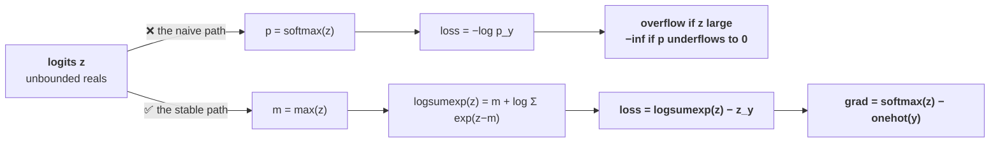

# Lesson 2 — Losses & Numerical Stability

[](https://colab.research.google.com/github/vinod-seth/Applied-Scientist-Interview-Gauntlet/blob/main/tutorial/07_ml_from_scratch/ml_from_scratch_lab.ipynb)

| | |
|---|---|
| **Prepares** | "Write the loss and its gradient" — the second-most-likely implementation ask, and the one where the bugs are invisible |
| **Time** | ~14 min visible + drills + a 12-minute blank-editor task |
| **Domain tag** | ML implementation / losses and numerics |

> 📍 **How this lesson works:** Session 3 covered cross-entropy as maximum likelihood. This lesson writes it — and writing it is a different skill, because a mathematically correct loss can still overflow, underflow, or silently return the wrong gradient. The derivation $\partial L/\partial z = p - y$ is both the answer to the theory question **and** the thing you type. Attempt every drill in a blank file first.

## 🟢 Learning Objectives

After this lesson you can:

- **Compute cross-entropy directly from <abbr title="The raw, unnormalized scores a model outputs before any softmax or sigmoid is applied">logits</abbr>** using the <abbr title="Subtracting the maximum before exponentiating, so the largest term becomes exp(0)=1 and cannot overflow">log-sum-exp</abbr> shift, and say what overflows without it.
- **Derive $\partial L/\partial z = p - y$** in two lines and explain why that simplicity is a numerical property, not a coincidence.
- **Verify any hand-written gradient** with a <abbr title="Comparing an analytic gradient against a numerical estimate from slightly perturbed inputs, to catch derivation and coding errors">finite-difference check</abbr>, including the tolerance and dtype that make the check meaningful.
- **Implement a numerically stable binary cross-entropy from logits** and handle class imbalance without resampling.
- **Implement <abbr title="Replacing a hard one-hot target with a slightly softened distribution, so the model is not pushed toward infinite confidence">label smoothing</abbr>** and state both what it buys and what it destroys.

## 🟢 The One Picture

There is one rule underneath this entire lesson: **never leave the log domain.** Every stability bug in classification losses is the same bug — someone exponentiated, and then took a log of the result.



**Read the stable path once more.** The loss never computes a probability at all. It is a difference of two log-domain quantities, and the largest exponent it ever evaluates is $e^0 = 1$.

---

## 🔷 Drill 1 — "Implement cross-entropy from logits."

*The one everyone writes wrong the first time. 60 seconds.*

<details><summary>✅ Model answer</summary>

Start from the definition and substitute the softmax:

$$L = -\log p_y = -\log \frac{e^{z_y}}{\sum_j e^{z_j}} = \log\sum_j e^{z_j} - z_y = \mathrm{logsumexp}(z) - z_y$$

and stabilise the remaining exponential by shifting by the maximum, which is exact rather than approximate because the softmax is <abbr title="Unchanged when the same constant is added to every input, so subtracting the maximum cannot alter the result">shift-invariant</abbr> and $\log \sum_j e^{z_j} = m + \log \sum_j e^{z_j - m}$ for any $m$:

```python
def log_softmax(z, axis=-1):
    m = np.max(z, axis=axis, keepdims=True)
    shifted = z - m
    return shifted - np.log(np.sum(np.exp(shifted), axis=axis, keepdims=True))

def cross_entropy_from_logits(z, y):
    """z: (N, K) logits.  y: (N,) integer class labels.  Returns mean loss."""
    log_p = log_softmax(z)                       # (N, K)
    return -np.mean(log_p[np.arange(len(y)), y])
```

**What the shift prevents, with numbers.** In float32, `exp` overflows to `inf` above about **88.7**; in float64, above about **709.8**. Logits of a few hundred are entirely ordinary in an untrained or diverging network. After the shift, the largest exponent is exactly $e^0 = 1$ — overflow becomes impossible, and the terms that underflow to zero are precisely the ones contributing nothing to the sum.

**The other half is underflow.** If you compute `p = softmax(z)` and then `log(p)`, a confidently wrong prediction gives $p_y \approx 0$, and `log(0)` is `-inf`. The usual "fix" is `log(p + 1e-9)`, which is a patch on a self-inflicted wound: the stable form never produces the zero in the first place.

> **Say it:** "I'd compute it as `logsumexp(z) - z_y` rather than softmax-then-log. Substituting the softmax into $-\log p_y$ gives that directly, and shifting by the max inside the logsumexp is exact, so the largest exponential I ever evaluate is $e^0$. That removes both failure modes — overflow above 88 in fp32, and `log(0)` when a confident prediction is wrong."
</details>

<details><summary>🔁 The follow-up chain</summary>

"Why is subtracting the max *exact* and not an approximation?" (because $\frac{e^{z_i - m}}{\sum_j e^{z_j - m}} = \frac{e^{-m}e^{z_i}}{e^{-m}\sum_j e^{z_j}}$ — the constant cancels identically; softmax is shift-invariant by construction, so this is algebra, not a tolerance) → "What does `torch.nn.CrossEntropyLoss` expect as input?" (**raw logits**, because it fuses log-softmax and negative log-likelihood internally for exactly this reason — passing it softmax output is a common and quiet bug that applies the softmax twice, flattening the distribution and slowing training) → "Is there a case where you *do* want the probabilities?" (yes — reporting, calibration, and thresholding all need them, which is your calibration project's territory; the rule is to compute probabilities for *output* and never for *loss*) → "What if the labels are soft rather than integer?" (then it is $-\sum_k y_k \log p_k$ with the same `log_softmax` — the integer-index version is just the one-hot special case, and saying so shows you know which is the general form).
</details>

---

## 🔷 Drill 2 — "Derive the gradient."

*Two lines, and the result is the most quoted expression in deep learning. 60 seconds.*

<details><summary>✅ Model answer</summary>

With $L = \mathrm{logsumexp}(z) - z_y$, differentiate term by term:

$$\frac{\partial}{\partial z_i} \log\sum_j e^{z_j} = \frac{e^{z_i}}{\sum_j e^{z_j}} = p_i, \qquad \frac{\partial}{\partial z_i}(-z_y) = -\mathbb{1}[i = y]$$

$$\boxed{\;\frac{\partial L}{\partial z_i} = p_i - \mathbb{1}[i = y] \quad\Longrightarrow\quad \nabla_z L = p - y\;}$$

```python
def cross_entropy_grad(z, y):
    """Gradient of the MEAN loss with respect to logits. Shape (N, K)."""
    p = np.exp(log_softmax(z))
    p[np.arange(len(y)), y] -= 1.0
    return p / len(y)                # divide by N because the loss was a mean
```

**Why this matters beyond elegance — three consequences worth volunteering:**

1. **The gradient is bounded in $[-1, 1]$.** No matter how catastrophically wrong the prediction, the gradient per logit cannot explode. Compare squared error on a softmax output, whose gradient carries an extra $p(1-p)$ factor that *vanishes* exactly when the model is confidently wrong — which is why cross-entropy, not MSE, is the classification loss.
2. **It needs no softmax derivative.** The Jacobian of the softmax is a messy $\mathrm{diag}(p) - pp^\top$; fusing it with the log makes the whole thing collapse. This is why frameworks implement the fused op rather than composing two.
3. **It is a debugging tool.** At initialisation with $K$ balanced classes, $p \approx 1/K$, so the loss should be $\approx \log K$ — for your four-class ESCI setup, $\log 4 \approx 1.386$. **If your first loss is not near $\log K$, stop and find out why before training anything.** That single check catches label misalignment, a double softmax, and wrong class counts.

> **Say it:** "The gradient with respect to the logits is just $p - y$. It falls out because the derivative of logsumexp is the softmax itself, and the $-z_y$ term contributes the one-hot. Two practical consequences: it's bounded by one, so it can't explode, and at init it tells me the loss should start near $\log K$ — which is the first thing I check."
</details>

<details><summary>🔁 The follow-up chain</summary>

"The divide by $N$ — why?" (because the loss was defined as a mean over the batch, so the gradient must carry the same $1/N$; forgetting it makes the effective learning rate scale with batch size, which is a real and confusing bug when someone changes the batch size and training destabilises) → "Does the $p - y$ form survive label smoothing?" (yes, and cleanly: with a soft target $\tilde{y}$ the gradient is $p - \tilde{y}$ — the derivation never assumed the target was one-hot) → "What is the gradient with respect to the *inputs* of the layer below?" (chain through the weight matrix: $\nabla_x = (p - y) W^\top$, the standard backprop step from Session 4) → "Why is your first-batch loss check better than watching the loss curve?" (because it fails *immediately* and points at a specific class of bug; a wrong-but-decreasing curve can look healthy for hours).
</details>

---

## 🔷 Drill 3 — "How do you know your gradient is right?"

*The question this whole round turns on. 60 seconds.*

<details><summary>✅ Model answer</summary>

A **finite-difference check**, using the central difference because its error is $O(h^2)$ rather than $O(h)$:

$$\frac{\partial L}{\partial z_i} \approx \frac{L(z + h e_i) - L(z - h e_i)}{2h}$$

```python
def grad_check(f, z, analytic, h=1e-5, tol=1e-7):
    """f: scalar loss function of z.  analytic: your gradient, same shape as z."""
    num = np.zeros_like(z)
    it = np.nditer(z, flags=["multi_index"])
    while not it.finished:
        idx = it.multi_index
        old = z[idx]
        z[idx] = old + h; plus  = f(z)
        z[idx] = old - h; minus = f(z)
        z[idx] = old
        num[idx] = (plus - minus) / (2 * h)
        it.iternext()
    rel = np.abs(num - analytic) / np.maximum(1e-12, np.abs(num) + np.abs(analytic))
    return rel.max()
```

**Four details that make the check meaningful rather than decorative:**

| Detail | Why |
|---|---|
| **float64, not float32** | At float32 precision the differencing noise swamps the signal and everything "fails" |
| **$h \approx 10^{-5}$** | Too large and truncation error dominates; too small and floating-point cancellation does. There is a valley, and $10^{-5}$ sits in it for float64 |
| **Relative, not absolute, error** | An absolute difference of $10^{-4}$ is fine for a gradient of size 100 and catastrophic for one of size $10^{-6}$ |
| **Tolerance $\approx 10^{-7}$** | Passing at $10^{-7}$ is a correct gradient; $10^{-4}$ usually means a real bug, not noise |

**One trap to name unprompted:** if the function has a kink at the test point — ReLU exactly at zero, or a max that changes which element wins between $z+h$ and $z-h$ — the check fails legitimately, because the derivative genuinely does not exist there. Perturb away from the kink rather than "fixing" the gradient.

> **Say it:** "I'd check it against central finite differences in float64, with $h$ around $10^{-5}$, comparing relative error and expecting about $10^{-7}$. If it fails I'd first check whether I'm sitting on a kink — a ReLU at exactly zero will fail the check for a correct implementation."
</details>

<details><summary>🔁 The follow-up chain</summary>

"Isn't that too slow for a real network?" (yes — it is $O(\text{number of parameters})$ forward passes, so you run it once on a tiny model with a few dozen parameters, not on the real one; it is a *unit test*, not a training-time check) → "What else would you test besides the gradient value?" (that the loss decreases when you take a small step along the negative gradient — a cheap directional check that catches sign errors instantly; and the $\log K$ initialisation check from Drill 2) → "How would you find *which* parameter is wrong?" (the relative-error array is per-element, so look at the argmax — usually the failures cluster in one layer or one term, and that localises the derivation error) → "Would you write this in an interview?" (offer it and let them decide — "I'd normally gradient-check this; want me to write it, or shall I state the test and move on?" is the beat-5 offer from Session 6 applied here).
</details>

---

## 🔷 Drill 4 — "Binary cross-entropy from logits, with a class imbalance."

*Your ESCI setting, as code. 75 seconds.*

<details><summary>✅ Model answer</summary>

The naive form $-y\log\sigma(z) - (1-y)\log(1-\sigma(z))$ overflows for large $|z|$. The stable identity is:

$$L = \max(z, 0) - z y + \log\left(1 + e^{-|z|}\right)$$

```python
def bce_with_logits(z, y, pos_weight=1.0):
    """z, y: (N,) logits and 0/1 labels. pos_weight up-weights the positive class."""
    stable = np.maximum(z, 0) - z * y + np.log1p(np.exp(-np.abs(z)))
    if pos_weight != 1.0:
        stable = stable * np.where(y == 1, pos_weight, 1.0)
    return np.mean(stable)
```

Two things make it safe: the $\max(z,0)$ term extracts the dominant part algebraically, and the residual exponent is $-|z| \le 0$, so `exp` can only underflow toward zero — never overflow. `np.log1p` then keeps precision when that exponential is tiny, where `log(1 + x)` would lose it to rounding.

**Handling imbalance — three options, and the ranking matters:**

| Approach | Effect | When |
|---|---|---|
| **Class weighting** (above) | Scales the loss per class; leaves the data untouched | **Default.** Cheapest, no information discarded |
| **Oversampling the minority** | Duplicates rare examples | When the minority is so rare that batches often contain none |
| **Undersampling the majority** | Discards data | Rarely justified — you are throwing away signal to fix a loss-weighting problem |

⚠️ **Candidate-specific:** ESCI's four classes are heavily skewed, and your résumé states **<abbr title="The unweighted mean of per-class F1 scores, so every class counts equally however rare it is">macro-F1</abbr>** as the primary metric. Say the connection out loud, because it is a strong answer: macro-F1 weights every class equally regardless of frequency, so it is the *evaluation* counterpart of class weighting in the *loss*. Choosing a weighted loss and an unweighted-average metric is a coherent pair; choosing macro-F1 while training on a plain unweighted loss is a mismatch an interviewer may probe.
</details>

<details><summary>🔁 The follow-up chain</summary>

"Derive the stable form." (for $z \ge 0$, $\log(1+e^{-z})$ is already safe and the identity reduces to $z - zy + \log(1+e^{-z})$; for $z < 0$ factor $e^{z}$ out of $\log(1+e^{z})$ — the two branches unify to the $\max(z,0)$ expression, and being able to sketch that is what shows you did not memorise it) → "Does class weighting change the optimal decision threshold?" (yes — it shifts the implied prior, so the calibrated threshold moves away from 0.5; this is exactly the calibration territory of your fourth project and worth linking) → "Why not just use <abbr title="A loss that multiplies cross-entropy by a factor shrinking the contribution of examples the model already classifies confidently">focal loss</abbr>?" (it down-weights easy examples and is a genuine option, but it adds a hyperparameter and is aimed at extreme imbalance with many easy negatives — the honest answer is to start with class weights and reach for focal loss only if the easy-negative problem is demonstrated) → "How would you test this implementation?" (compare against the naive formula on moderate logits where both are safe, then feed $z = 800$ and confirm the naive one returns `inf` while yours does not — that contrast *is* the demonstration).
</details>

---

## 🔷 Drill 5 — "Implement label smoothing. What does it cost?"

*A question that lands directly on your calibration project. 60 seconds.*

<details><summary>✅ Model answer</summary>

Replace the one-hot target with a softened one, for $K$ classes and smoothing $\varepsilon$:

$$\tilde{y}_k = (1-\varepsilon)\,\mathbb{1}[k = y] + \frac{\varepsilon}{K}$$

```python
def smoothed_cross_entropy(z, y, eps=0.1):
    K = z.shape[-1]
    log_p = log_softmax(z)
    target = np.full_like(log_p, eps / K)
    target[np.arange(len(y)), y] += 1.0 - eps
    return -np.mean(np.sum(target * log_p, axis=-1))
```

**What it buys.** A hard one-hot target is only satisfied as $z_y \to \infty$, so the model is pushed toward unbounded confidence forever. Smoothing gives a finite optimum, which reduces overconfidence and — the part that matters for you — **measurably improves calibration** (Szegedy et al., 2016; Müller et al., 2019).

**What it costs, and this is the part few candidates know.** Müller et al. found that label smoothing **erases information in the penultimate-layer representations** about how classes relate to one another: it tightens each class into a tighter cluster and discards the structure that says "class 2 resembles class 3 more than class 1". Consequences: a smoothed teacher is a *worse* teacher for <abbr title="Training a small model to match a larger model’s output distribution, which carries more information than the hard labels alone">knowledge distillation</abbr>, even when it is a more accurate model.

⚠️ **Candidate-specific and worth rehearsing:** this is a direct bridge to your calibration-under-shift project. Label smoothing is a *training-time* calibration intervention; temperature scaling is a *post-hoc* one. Your project showed temperature scaling fails to transfer under distribution shift — so the natural follow-up is whether smoothing holds up better. The honest answer is that you did not test it, and that the experiment would be: fit both on clean validation data, then measure ECE across corruption severities and see which degrades more slowly. **Never claim a result you did not run.**
</details>

<details><summary>🔁 The follow-up chain</summary>

"What is the optimal logit gap under smoothing?" (finite, and it depends on $\varepsilon$ and $K$ — the point to make is *finite versus unbounded*, which is the whole mechanism) → "Does the $p - y$ gradient still hold?" (yes, as $p - \tilde{y}$; the derivation never used one-hotness, and the gradient no longer goes to zero only at infinite confidence) → "Is smoothing the same as a confidence penalty?" (closely related — both discourage sharp outputs; smoothing does it by changing the target, an entropy penalty by adding a term to the loss, and they have different gradients) → "Should you smooth for a task where the labels are genuinely certain?" (less clearly beneficial — smoothing encodes a belief that the labels carry noise or that classes overlap, and where the labels are exact it mainly trades a little accuracy for calibration; whether that trade is right depends on whether the probabilities are consumed downstream).
</details>

---

## 🔷 Blank-Editor Drill

**Task.** Empty file. 12 minutes. NumPy only.

Implement `softmax_cross_entropy(logits, labels, eps=0.0)` returning **both** the mean loss and the gradient with respect to the logits, stable throughout, supporting optional label smoothing.

**Then write these four tests:**

| # | Test | What it catches |
|---|---|---|
| 1 | With $K$ balanced classes and zero logits, loss $= \log K$ | Label misalignment, wrong class count, double softmax |
| 2 | Loss on logits of magnitude $10^3$ is finite | A missing log-sum-exp shift |
| 3 | Central finite differences agree to relative error $< 10^{-7}$ (float64) | Every derivation and indexing error |
| 4 | One small step along $-\nabla$ decreases the loss | A sign error, which test 3 alone can miss if the whole gradient is negated *and* your reference is too |

Test 2 is the one to run first — it is a single line and it either finishes or returns `inf`.

Reference implementation and all four tests: [the Lab](ml_from_scratch_lab.ipynb), Part 2.

---

## 🟢 Concept Check

Cross-entropy should be computed as `logsumexp(z) - z_y` rather than `-log(softmax(z)[y])` because:

* [ ] It is algebraically different and gives a better loss surface
* [x] They are algebraically identical, but the naive form overflows `exp` above ~88 in float32 and produces `log(0) = -inf` when a confident prediction is wrong — the stable form never evaluates an exponent above $e^0$
* [ ] The naive form is slower
* [ ] `logsumexp` applies extra regularization

Your four-class classifier's loss on the very first batch is 4.7. The most likely explanation is:

* [ ] Normal — the model is untrained
* [x] A bug — with 4 balanced classes an untrained model should start near $\log 4 \approx 1.39$; 4.7 suggests misaligned labels, a double softmax, or a wrong class count
* [ ] The learning rate is too high
* [ ] The batch size is too small

Your analytic gradient fails a finite-difference check with relative error $10^{-3}$. Before assuming a derivation bug, you should check:

* [ ] Whether the loss is convex
* [x] Whether the check ran in float64 with $h \approx 10^{-5}$, and whether the test point sits on a kink such as a ReLU at exactly zero — where the derivative genuinely does not exist and a correct implementation fails legitimately
* [ ] Whether the batch size is a power of two
* [ ] Whether the labels are one-hot encoded

<details>
<summary>🔑 Click to Reveal Answer & Explanation</summary>

**Q1: option 2.** The word to use is *identical* — the two are the same function, and the difference is entirely in floating-point behaviour. Substituting the softmax into $-\log p_y$ gives the stable form directly, which is why frameworks ship a fused op and expect raw logits.

**Q2: option 2.** $\log K$ at initialisation is the cheapest sanity check in deep learning and almost nobody runs it. For four balanced classes: $\log 4 = 1.386$. A value of 4.7 is roughly $\log 110$, which is the signature of a class-count or indexing error. Options 3 and 4 affect the *trajectory*, not the value at step zero.

**Q3: option 2.** Both halves matter. Float32 differencing noise alone can produce $10^{-3}$ relative error on a perfectly correct gradient, and a kink produces a legitimate failure that no amount of re-derivation will fix. Naming the kink case unprompted is a strong signal that you have actually run these checks.
</details>

---

## 🔷 Rapid-Fire Rehearsal

```rehearsal-drill
RUBRIC: mechanism
TITLE: Losses and Numerical Stability — Rapid Fire
INTRO: Every answer needs the formula AND the test. This round scores verification as heavily as derivation - a loss you cannot check is a loss you cannot defend.
MIN: 30
MAX: 90
[[Cross-entropy from logits]]
Q: Implement cross-entropy from logits. Why not softmax then log?
A: **L = logsumexp(z) - z_y**, which comes straight from substituting the softmax into -log p_y. Stabilise by **shifting by the max**, which is exact rather than approximate because softmax is shift-invariant: log sum exp(z) = m + log sum exp(z - m). After the shift the largest exponent evaluated is exp(0) = 1. **What the naive path costs:** exp overflows to inf above about **88.7 in float32** and 709.8 in float64, and logits of a few hundred are ordinary in an untrained or diverging net; separately, a confidently wrong prediction gives p_y near zero and **log(0) = -inf**. The usual patch of log(p + 1e-9) is a bandage on a self-inflicted wound. This is why frameworks fuse log-softmax with NLL and expect **raw logits** - passing softmax output applies it twice.
[[The gradient]]
Q: Derive the gradient of softmax cross-entropy with respect to the logits.
A: From L = logsumexp(z) - z_y: the derivative of logsumexp is the softmax itself, p_i, and the second term contributes the one-hot. So **dL/dz = p - y**. Three consequences worth volunteering. **(1) It is bounded in [-1, 1]**, so it cannot explode however wrong the prediction - unlike squared error on a softmax, whose extra p(1-p) factor *vanishes* exactly when the model is confidently wrong, which is why cross-entropy is the classification loss. **(2) No softmax Jacobian is needed** - the messy diag(p) - p p-transpose collapses when fused with the log. **(3) It is a debugging tool:** at init with K balanced classes the loss should be about **log K** - 1.386 for four classes. If it is not, stop before training. Remember the 1/N if the loss was a mean.
[[Verifying a gradient]]
Q: How do you know your hand-written gradient is right?
A: **Central finite differences:** (L(z + h) - L(z - h)) / 2h, central rather than forward because the error is O(h squared). Four details make the check real: **float64**, since float32 differencing noise swamps the signal; **h around 1e-5**, because larger means truncation error and smaller means floating-point cancellation; **relative not absolute error**, since 1e-4 absolute is fine at gradient scale 100 and catastrophic at 1e-6; and a **tolerance near 1e-7**, where 1e-4 usually means a real bug. **The trap to name unprompted:** at a kink - a ReLU exactly at zero, or a max whose winner changes between z+h and z-h - the check fails legitimately because the derivative does not exist there; perturb away from the kink rather than "fixing" the gradient. It is a unit test on a tiny model, not a training-time check.
[[BCE with logits and imbalance]]
Q: Write a stable binary cross-entropy from logits and handle class imbalance.
A: **L = max(z, 0) - z*y + log1p(exp(-|z|)).** The max term extracts the dominant part algebraically, so the residual exponent is -|z| which can only **underflow**, never overflow; log1p preserves precision when that exponential is tiny. **For imbalance, three options in order:** **class weighting** is the default - it scales the loss per class and discards nothing; **oversampling the minority** when batches would otherwise contain none of it; **undersampling the majority** is rarely justified, since it throws away signal to fix a loss-weighting problem. **Candidate-specific:** ESCI is heavily skewed and my primary metric is macro-F1, which weights every class equally - so it is the evaluation counterpart of class weighting in the loss. Macro-F1 with a plain unweighted loss would be a mismatch.
[[Label smoothing]]
Q: Implement label smoothing and tell me what it costs.
A: Replace the one-hot target with **(1 - eps) on the true class plus eps/K everywhere**. **What it buys:** a hard target is only satisfied as the true logit goes to infinity, so the model is pushed toward unbounded confidence; smoothing gives a **finite optimum**, reducing overconfidence and measurably improving **calibration** (Szegedy 2016, Mueller 2019). **What it costs, which few candidates know:** Mueller et al. found smoothing **erases information in the penultimate-layer representations** about how classes relate - it tightens each class cluster and discards the structure saying class 2 resembles class 3 more than class 1. So a smoothed teacher is a *worse* teacher for distillation even when it is a more accurate model. **The bridge to my own work:** smoothing is a training-time calibration intervention, temperature scaling a post-hoc one; my project showed temperature scaling fails to transfer under shift. I have not tested whether smoothing degrades more slowly - the experiment would be to fit both on clean validation and compare ECE across corruption severities.
```

---

## 🟢 Summary

- **Never leave the log domain.** Cross-entropy is `logsumexp(z) - z_y`; the max shift is exact, and it makes overflow impossible and `log(0)` unreachable.
- **$\nabla_z L = p - y$**, in two lines. Bounded by 1, needs no softmax Jacobian, and gives you the $\log K$ initialisation check.
- **A gradient you have not finite-difference-checked is a gradient you cannot defend** — float64, $h \approx 10^{-5}$, relative error, tolerance $10^{-7}$, and watch for kinks.
- **BCE from logits is $\max(z,0) - zy + \log(1+e^{-|z|})$**, and imbalance is a *weighting* problem before it is a *sampling* problem.
- **Label smoothing buys calibration and costs representation structure** — the distillation finding is the detail that distinguishes a real answer.

**References**

- Goodfellow, Bengio & Courville (2016) — *Deep Learning*, MIT Press — https://www.deeplearningbook.org/ *(numerical stability, log-sum-exp, and cross-entropy gradients)*
- Szegedy et al. (2016) — *Rethinking the Inception Architecture for Computer Vision* — https://arxiv.org/abs/1512.00567 *(label smoothing, introduced in §7)*
- Müller, Kornblith & Hinton (2019) — *When Does Label Smoothing Help?* — https://arxiv.org/abs/1906.02629 *(the calibration benefit and the distillation cost)*
- PyTorch documentation — *`torch.nn.CrossEntropyLoss`* — https://docs.pytorch.org/docs/stable/generated/torch.nn.CrossEntropyLoss.html *(the fused log-softmax + NLL op that expects raw logits)*

**Next:** [Lesson 3 — Classical ML From Scratch](03_classical_ml_from_scratch.md)
