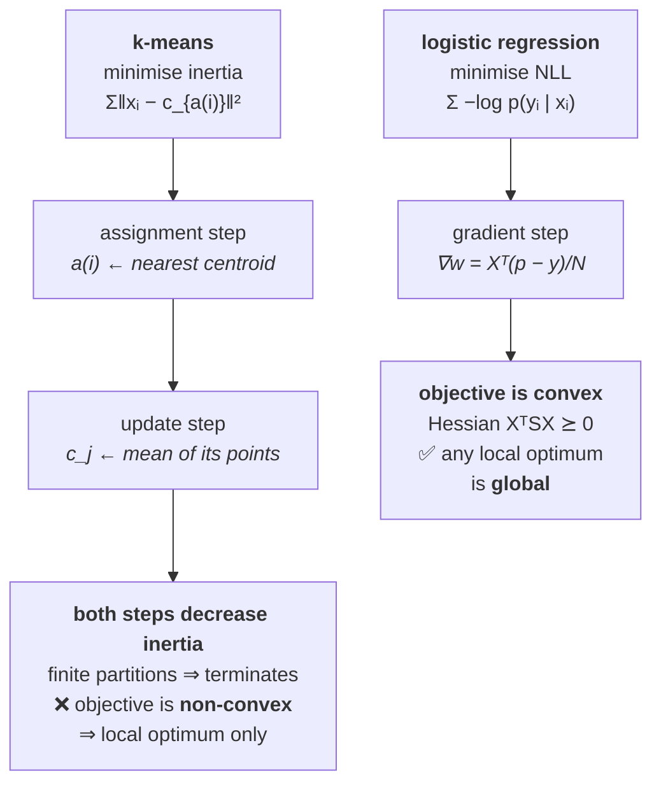

# Lesson 3 — Classical ML From Scratch

[](https://colab.research.google.com/github/vinod-seth/Applied-Scientist-Interview-Gauntlet/blob/main/tutorial/07_ml_from_scratch/ml_from_scratch_lab.ipynb)

| | |
|---|---|
| **Prepares** | The breadth probe inside an implementation round — and [Gap #5](../../dossier/05_gap_map_and_study_plan.md), *ML breadth outside NLP untested*, priority 16.2 |
| **Time** | ~15 min visible + drills + a 15-minute blank-editor task |
| **Domain tag** | ML implementation / classical models |

> 📍 **Why this lesson exists, specifically for you.** Every project on your résumé is NLP or LLM work. Your audit scores ML breadth **3/6** and flags the surface outside NLP as untested. An implementation round is where that gets probed, because writing k-means in fifteen minutes exposes immediately whether you know the *objective* or only the story about moving centroids around. Session 3 gave you the theory; this lesson makes it executable.

## 🟢 Learning Objectives

After this lesson you can:

- **Implement k-means** with vectorised distance computation, and name the numerical trade-off in the fast distance formula.
- **Prove k-means terminates**, by showing both steps monotonically decrease the <abbr title="The within-cluster sum of squared distances from each point to its assigned centroid; the quantity k-means minimizes">inertia</abbr> — and say why that does *not* prove optimality.
- **Explain what <abbr title="An initialization that picks each new centroid with probability proportional to its squared distance from the nearest existing centroid">k-means++</abbr> buys**, with its competitive guarantee.
- **Implement logistic regression and its gradient**, and explain why its optimum is global where k-means's is not.
- **Name three regimes where k-means is the wrong model** and say what replaces it.

## 🟢 The One Picture

Both algorithms below are iterative descent on an objective. The single most useful thing you can carry into this round is **knowing which objective**, because every follow-up — does it converge, to what, why does the init matter — is a question about the objective.



**That contrast is the highest-value sentence in this lesson.** k-means needs restarts and careful seeding because its landscape has genuine local minima. Logistic regression does not, and saying so — with the Hessian reason — answers three follow-ups at once.

---

## 🔷 Drill 1 — "Write k-means."

*Fifteen lines. The interviewer is watching for the vectorisation. 90 seconds.*

<details><summary>✅ Model answer</summary>

```python
def kmeans(X, k, iters=100, tol=1e-6, seed=0):
    """X: (N, D). Returns centroids (k, D), labels (N,), and the inertia history."""
    rng = np.random.default_rng(seed)
    C = kmeans_plusplus_init(X, k, rng)          # see Drill 3
    history = []
    for _ in range(iters):
        # --- assignment: (N, k) distances via broadcasting ---
        d2 = ((X[:, None, :] - C[None, :, :]) ** 2).sum(-1)   # (N, k, D) -> (N, k)
        labels = np.argmin(d2, axis=1)                        # (N,)
        inertia = d2[np.arange(len(X)), labels].sum()
        history.append(inertia)
        # --- update: mean of each cluster ---
        newC = np.stack([X[labels == j].mean(0) if np.any(labels == j)
                         else X[rng.integers(len(X))]          # empty-cluster policy
                         for j in range(k)])
        if np.abs(newC - C).max() < tol:
            C = newC; break
        C = newC
    return C, labels, history
```

**Narrate the shapes:** "`X[:, None, :]` is `(N, 1, D)` and `C[None, :, :]` is `(1, k, D)`, so the subtraction broadcasts to `(N, k, D)`; summing the last axis gives me an `(N, k)` distance matrix, and `argmin` along the cluster axis gives the labels."

**The trade-off to volunteer before being asked.** That broadcast materialises an `(N, k, D)` array — at $N = 10^6$, $k = 100$, $D = 128$ that is **51 GB**. The standard fix expands the square:

$$\|x - c\|^2 = \|x\|^2 - 2\,x^\top c + \|c\|^2$$

so the distance matrix comes from one `(N, D) @ (D, k)` matmul plus two cached norm vectors — `(N, k)` memory instead of `(N, k, D)`, and it hits BLAS. **The cost is precision:** it is a difference of large similar numbers, so when points sit far from the origin, <abbr title="Loss of precision when subtracting two nearly equal large numbers, leaving a result dominated by rounding error">catastrophic cancellation</abbr> can produce small negative "squared distances". Clip at zero, or centre the data first.

> **Say it:** "Assignment is an `(N, k)` distance matrix then `argmin`; update is the per-cluster mean. Written with broadcasting it's clear but allocates `(N, k, D)`. At scale I'd expand the square into a matmul plus cached norms — same result, `(N, k)` memory, BLAS-accelerated — and I'd clip at zero because the subtraction can go slightly negative from cancellation."
</details>

<details><summary>🔁 The follow-up chain</summary>

"What is the complexity per iteration?" ($O(NkD)$ for assignment, $O(ND)$ for the update — so assignment dominates, and that is the term every acceleration technique attacks) → "How would you speed it up without approximating?" (the triangle inequality lets you skip distance computations that cannot change an assignment — Elkan's and Hamerly's algorithms — and it is exact, which is the property worth naming) → "What about mini-batch k-means?" (sample a batch per iteration and update centroids with a running mean; it is approximate but converges far faster on large $N$, and it is the practical default at scale) → "Does the tolerance test on centroid movement guarantee the labels stopped changing?" (not strictly — tiny centroid movements can still flip a point sitting exactly between two clusters; testing for *no label changes* is the stronger stopping rule and is what several implementations actually use).
</details>

---

## 🔷 Drill 2 — "Prove it terminates."

*The question that separates understanding the objective from remembering the loop. 75 seconds.*

<details><summary>✅ Model answer</summary>

k-means minimises the **inertia**, the within-cluster sum of squares:

$$J(a, C) = \sum_{i=1}^{N} \left\| x_i - c_{a(i)} \right\|^2$$

Then a three-step argument:

1. **The assignment step cannot increase $J$.** Centroids are held fixed and each point is reassigned to its *nearest* centroid, so every term in the sum either falls or stays equal.
2. **The update step cannot increase $J$.** Assignments are held fixed, and for a fixed set of points the mean is the unique minimiser of the sum of squared distances — $\frac{d}{dc}\sum_i \|x_i - c\|^2 = -2\sum_i (x_i - c) = 0 \Rightarrow c = \bar{x}$. So replacing each centroid by its cluster mean can only reduce $J$.
3. **Therefore $J$ is non-increasing, and there are finitely many possible assignments** (at most $k^N$). A non-increasing sequence that can never revisit a strictly-worse configuration must halt in finitely many steps.

**And now the part that matters more than the proof.** Termination is *not* optimality. $J$ is **non-convex** in the assignments — the landscape genuinely has multiple local minima, and Lloyd's algorithm descends into whichever one its initialisation sits above. Finding the global optimum is NP-hard in general.

Practical consequence, which is the real answer to "so what": **run it several times from different seeds and keep the lowest inertia.** `n_init` in standard implementations exists for exactly this reason, and being able to say *why* it exists is the discriminating detail.

> **Say it:** "Both steps monotonically decrease the within-cluster sum of squares — reassignment because each point moves to its nearest centroid, and the update because the mean is the minimiser of squared distance for a fixed set. With finitely many possible assignments it must terminate. But the objective is non-convex, so it terminates at a *local* minimum — which is why you run multiple restarts and keep the best inertia."
</details>

<details><summary>🔁 The follow-up chain</summary>

"Can inertia ever increase between iterations in a real implementation?" (only through a bug or an empty-cluster policy that reseeds a centroid randomly — which is precisely why asserting monotonic decrease is the single best unit test for this algorithm) → "What is the worst-case number of iterations?" (superpolynomial in the worst case, though it converges in a handful of iterations on realistic data — the honest answer names both) → "Would a different distance metric preserve the proof?" (**no**, and this is a good trap: step 2 relies on the *mean* being the minimiser, which is a property of squared Euclidean distance. With $L_1$ the minimiser is the median, giving k-medians; with an arbitrary metric neither holds and you need k-medoids) → "How do you pick $k$?" (the elbow of the inertia curve is the common answer and a weak one, since inertia decreases monotonically in $k$ by construction; the **<abbr title="A per-point score comparing its distance to its own cluster against the nearest other cluster, averaged over the dataset">silhouette score</abbr>** is better because it has an interior optimum, and best of all is a downstream task metric if one exists).
</details>

---

## 🔷 Drill 3 — "How do you initialise it, and what happens to empty clusters?"

*Two implementation details with real theory behind one of them. 60 seconds.*

<details><summary>✅ Model answer</summary>

**k-means++ seeding** (Arthur & Vassilvitskii, 2007). Pick the first centroid uniformly at random. Then pick each subsequent centroid from the data with probability proportional to $D(x)^2$, the squared distance to the *nearest already-chosen* centroid:

```python
def kmeans_plusplus_init(X, k, rng):
    C = [X[rng.integers(len(X))]]
    for _ in range(1, k):
        d2 = np.min(((X[:, None, :] - np.array(C)[None, :, :]) ** 2).sum(-1), axis=1)
        total = d2.sum()
        probs = d2 / total if total > 0 else np.full(len(X), 1.0 / len(X))
        C.append(X[rng.choice(len(X), p=probs)])
    return np.array(C)
```

**What it buys, precisely:** the expected inertia of the seeding alone is within $O(\log k)$ of the global optimum — a guarantee that holds *before a single Lloyd iteration runs*. Uniform random seeding has no such bound and can start arbitrarily badly, for instance by placing two centroids inside one true cluster while another gets none. In practice k-means++ both converges faster and lands on better optima.

**Empty clusters.** They happen — a centroid can end up with no nearest points, and its mean is then undefined (a `nan` if you divide by zero). Three policies:

| Policy | Behaviour |
|---|---|
| **Reseed at the point furthest from its centroid** | Deterministic and attacks the worst-represented region. Usually the best choice |
| **Reseed at a random point** | Simple; breaks the monotonicity guarantee for that step |
| **Drop the cluster** | Returns fewer than $k$ clusters, which usually violates the caller's contract |

Say which one you chose and why. Silently producing `nan` centroids is the failure mode here, and it is another silent bug — the run completes.
</details>

<details><summary>🔁 The follow-up chain</summary>

"What does $D(x)^2$ sampling actually do intuitively?" (it spreads the seeds — a point far from every chosen centroid is quadratically more likely to be picked, so seeds land in distinct regions, while the randomness stops a single outlier from being chosen deterministically) → "Why squared, not linear?" (the squared weighting matches the objective being minimised, and it is what the $O(\log k)$ proof requires; linear weighting spreads less aggressively) → "Isn't seeding $O(Nk)$ expensive?" (it costs one extra pass per centroid, so $O(NkD)$ total — the same order as a *single* Lloyd iteration, which is negligible against the iterations it saves) → "Does k-means++ remove the need for restarts?" (no — it improves the expected starting point and the guarantee is in expectation, so multiple restarts still help; it makes each restart better rather than making restarts unnecessary).
</details>

---

## 🔷 Drill 4 — "Now logistic regression, with its gradient."

*The same $p - y$ you derived in Lesson 2, in a different costume. 75 seconds.*

<details><summary>✅ Model answer</summary>

```python
def sigmoid(z):
    """Stable both ways: never exponentiates a positive number."""
    out = np.empty_like(z, dtype=float)
    pos, neg = z >= 0, z < 0
    out[pos] = 1.0 / (1.0 + np.exp(-z[pos]))
    ez = np.exp(z[neg]); out[neg] = ez / (1.0 + ez)
    return out

def logistic_regression(X, y, lr=0.1, iters=500, l2=0.0):
    """X: (N, D) with a bias column. y: (N,) in {0, 1}."""
    w = np.zeros(X.shape[1])
    losses = []
    for _ in range(iters):
        p = sigmoid(X @ w)                       # (N,)
        grad = X.T @ (p - y) / len(y) + l2 * w   # (D,)  <- the same p - y
        w -= lr * grad
        losses.append(bce_with_logits(X @ w, y) + 0.5 * l2 * w @ w)
    return w, losses
```

**Three things to say while typing:**

1. **The gradient is $X^\top(p - y)/N$** — structurally identical to Lesson 2's $p - y$, now projected onto the features. One derivation covers softmax classification, binary classification, and linear regression (where $p$ is simply $Xw$). Saying that out loud is worth more than the code.
2. **The objective is <abbr title="Curving upward everywhere, so the function has no local minimum that is not also the global minimum">convex</abbr>.** The Hessian is $X^\top S X$ with $S = \mathrm{diag}(p_i(1-p_i)) \succeq 0$, so the whole matrix is positive semi-definite. **Every local optimum is global** — no restarts, no seeding strategy, and the direct contrast with k-means one drill earlier.
3. **The sigmoid needs the same care as the softmax.** The branched form above never exponentiates a positive number, so it cannot overflow. And the *loss* is still computed from logits — never `log(sigmoid(z))`.

**The failure worth volunteering: perfectly separable data.** If a hyperplane separates the classes exactly, the likelihood is maximised by pushing $\|w\| \to \infty$ — the optimum is at infinity, the weights diverge, and the model becomes arbitrarily overconfident. Any $L_2$ penalty makes the objective **strictly** convex and gives a finite unique solution. This is also a calibration story: an unregularised separable fit is maximally miscalibrated, which is your fourth project's subject matter.
</details>

<details><summary>🔁 The follow-up chain</summary>

"Why not use the normal equations, as in linear regression?" (there is no closed form — the sigmoid makes the score equations non-linear in $w$, so it is solved iteratively; Newton's method with the $X^\top S X$ Hessian is the classical choice, known as iteratively reweighted least squares, and converges in far fewer iterations than plain gradient descent) → "What does the $L_2$ penalty correspond to probabilistically?" (a zero-mean Gaussian prior on the weights, so the fit becomes MAP rather than MLE — Session 3's regularisation-as-priors, and connecting the two is a strong move) → "How would you extend it to multi-class?" (softmax regression: $W$ becomes $(D, K)$ and the gradient is $X^\top(P - Y)/N$ with one-hot $Y$ — *literally* Lesson 2's expression, and the fact that nothing else changes is the point) → "What would you check before trusting the fit?" (gradient check against finite differences, monotone loss decrease, and that the recovered boundary matches a synthetic dataset where you know the true boundary).
</details>

---

## 🔷 Drill 5 — "When is k-means the wrong model?"

*The breadth question your audit says is untested. 75 seconds.*

<details><summary>✅ Model answer</summary>

Three regimes, each with what replaces it:

| Failure regime | Why k-means breaks | What to use instead |
|---|---|---|
| **Clusters are not roughly spherical or equally sized** | Minimising squared distance to a centroid *assumes* isotropic, comparable-variance clusters; elongated or nested shapes get sliced through | A **<abbr title="A model treating the data as a weighted sum of Gaussian components, fitted by expectation-maximisation, giving soft cluster membership">Gaussian mixture</abbr>** fits per-cluster covariance and gives soft assignments; **spectral clustering** handles non-convex shapes |
| **Density varies, or there is real noise** | Every point must join a cluster, so outliers drag centroids and there is no "none of these" option | **<abbr title="Density-based clustering that grows clusters through regions of sufficient point density and labels sparse points as noise">DBSCAN</abbr>** finds density-connected regions, needs no $k$, and labels outliers as noise |
| **Features are on different scales** | Squared Euclidean distance is dominated by whichever feature has the largest units — kilometres versus grams | **Standardise first.** This is a preprocessing bug, not a model choice, and it is the most common real-world k-means failure |

**The one-line diagnosis to offer:** *k-means draws a <abbr title="A division of space in which every point belongs to whichever centre is nearest, giving straight boundaries between centres">Voronoi partition</abbr>, so its decision boundaries are always straight lines between centroids.* If the structure you want cannot be described by straight cuts, no amount of restarting or re-seeding will find it.

⚠️ **Where this touches your own work:** your résumé claims *"optimized semantic vector clustering … custom contrastive loss."* Embeddings are typically compared by **cosine** similarity, while k-means minimises **squared Euclidean** distance. Those coincide only when the vectors are $L_2$-normalised — since for unit vectors $\|x-c\|^2 = 2 - 2x^\top c$. If you clustered embeddings without normalising, the objective was not the similarity you cared about. **Know which one your code did.** This is a Claim Vault #10 question and an interviewer who works with embeddings will ask it.
</details>

<details><summary>🔁 The follow-up chain</summary>

"How do you choose between GMM and k-means in practice?" (k-means is a special case of a GMM with isotropic equal covariances and hard assignments, so start with k-means and move to a GMM when you need soft membership or per-cluster shape; the extra parameters cost data) → "How do you decide $k$ without a downstream metric?" (silhouette over a range of $k$, or a Bayesian information criterion for a GMM which penalises parameter count; state plainly that the elbow method is weak because inertia falls monotonically in $k$ by construction) → "What about high-dimensional embeddings specifically?" (distance concentration makes all pairwise distances similar as $D$ grows, so clustering quality degrades; reduce dimension first, or cluster on cosine with normalised vectors) → "Is there a k-means variant for cosine?" (yes — spherical k-means, which normalises the centroids each iteration; naming it is a small but distinctive detail).
</details>

---

## 🔷 Blank-Editor Drill

**Task.** Empty file. 15 minutes. NumPy only. Implement **both**:

- `kmeans(X, k)` with k-means++ seeding and an explicit empty-cluster policy
- `logistic_regression(X, y, l2)` returning weights and the loss history

**Then write these four tests:**

| # | Test | What it catches |
|---|---|---|
| 1 | `assert np.all(np.diff(inertia_history) <= 1e-9)` | Any k-means bug at all — the objective is *provably* non-increasing, so a violation is a guaranteed defect |
| 2 | On three well-separated Gaussian blobs, k-means recovers 3 clusters with the right point counts | Assignment/update wiring |
| 3 | Logistic-regression gradient passes the finite-difference check from Lesson 2 | Derivation and transpose errors in $X^\top(p-y)$ |
| 4 | On separable data, `l2=0` sends $\|w\| \to$ large while `l2=0.1` keeps it bounded | That you understand *why* regularisation is not optional here |

Test 1 is the best unit test in this entire session. It comes free from Drill 2's proof, it is one line, and it catches essentially every implementation error — because a correct k-means **cannot** increase its inertia.

Reference implementations and all four tests: [the Lab](ml_from_scratch_lab.ipynb), Part 3.

---

## 🟢 Concept Check

k-means is guaranteed to terminate because:

* [ ] The objective is convex, so gradient descent converges
* [x] Both steps monotonically decrease the inertia — reassignment moves each point to its nearest centroid, and the mean minimises squared distance for a fixed assignment — and there are finitely many possible assignments
* [ ] The learning rate decays over iterations
* [ ] k-means++ initialization guarantees convergence

Logistic regression needs no random restarts, unlike k-means, because:

* [ ] It has fewer parameters
* [x] Its negative log-likelihood is convex — the Hessian $X^\top S X$ with $S = \mathrm{diag}(p_i(1-p_i))$ is positive semi-definite — so every local optimum is global, whereas k-means's objective is genuinely non-convex
* [ ] Gradient descent is deterministic
* [ ] It always converges in one step

You cluster $L_2$-unnormalised sentence embeddings with k-means, intending cosine similarity. The problem is:

* [ ] Nothing — k-means works on any vectors
* [x] k-means minimises squared Euclidean distance, which is equivalent to maximising cosine similarity **only for unit-norm vectors**; unnormalised, the clustering is partly driven by vector magnitude rather than direction
* [ ] Embeddings must be reduced to two dimensions first
* [ ] k-means cannot handle more than 100 dimensions

<details>
<summary>🔑 Click to Reveal Answer & Explanation</summary>

**Q1: option 2.** Option 1 is the trap, and it is a good one: k-means very much is *not* convex, which is exactly why restarts exist. Termination and optimality are different claims, and mixing them is the most common error on this question.

**Q2: option 2.** The Hessian argument is what makes this a derivation rather than a recollection. Worth pairing with the separable-data caveat: convex is not the same as having a *finite* optimum, and on perfectly separable data the weights diverge until an $L_2$ penalty makes the objective strictly convex.

**Q3: option 2.** For unit vectors, $\|x-c\|^2 = 2 - 2x^\top c$, so minimising distance is exactly maximising cosine. Without normalisation, a long vector is penalised for its length rather than its direction. This is a live question for your own clustering claim (Claim Vault #10).
</details>

---

## 🔷 Rapid-Fire Rehearsal

```rehearsal-drill
RUBRIC: mechanism
TITLE: Classical ML From Scratch — Rapid Fire
INTRO: Name the objective before the algorithm. Every follow-up in this area - does it converge, to what, why does init matter - is a question about the objective.
MIN: 30
MAX: 90
[[Writing k-means]]
Q: Write k-means and name the shapes.
A: Two alternating steps. **Assignment:** build an (N, k) distance matrix and argmin along the cluster axis. **Update:** each centroid becomes the mean of its assigned points. Written with broadcasting, X[:, None, :] is (N, 1, D) against C[None, :, :] at (1, k, D), giving (N, k, D) before summing to (N, k). **The trade-off to volunteer:** that intermediate is (N, k, D) - at N = 10^6, k = 100, D = 128 it is **51 GB**. Expand the square instead: ||x - c||^2 = ||x||^2 - 2 x-dot-c + ||c||^2, so distances come from one matmul plus two cached norm vectors, giving (N, k) memory and BLAS speed. **The cost is precision** - it is a difference of large similar numbers, so cancellation can produce small negative squared distances; clip at zero or centre the data. Complexity is O(NkD) per iteration, dominated by assignment.
[[Why k-means terminates]]
Q: Prove k-means terminates. Does that mean it finds the best clustering?
A: Three steps. **(1) The assignment step cannot increase inertia** - centroids are fixed and each point moves to its nearest one, so every term falls or stays. **(2) The update step cannot increase it** - assignments are fixed, and the mean is the unique minimiser of the sum of squared distances, since the derivative -2 sum(x - c) is zero at c = x-bar. **(3) Inertia is therefore non-increasing and there are finitely many assignments**, so it must halt. **But termination is not optimality.** The objective is **non-convex** in the assignments, with genuine local minima, and the global optimum is NP-hard. Lloyd's algorithm descends into whichever basin its initialisation sits above - which is exactly why implementations expose n_init and you keep the lowest inertia across restarts.
[[k-means++ and empty clusters]]
Q: How do you seed k-means, and what happens to empty clusters?
A: **k-means++**: first centroid uniformly at random, then each subsequent one sampled with probability proportional to **D(x) squared**, the squared distance to the nearest already-chosen centroid. **What it buys precisely:** the expected inertia of the seeding alone is within **O(log k) of the global optimum**, before a single Lloyd iteration runs (Arthur and Vassilvitskii 2007). Uniform seeding has no such bound and can place two centroids inside one true cluster while another gets none. Squared rather than linear weighting is what the proof requires. Cost is O(NkD), the same order as one iteration. **Empty clusters** happen and their mean is undefined - a nan if you divide by zero. Best policy is reseeding at the point furthest from its centroid; say which policy you chose, because silently producing nan centroids is another bug where the run completes.
[[Logistic regression and convexity]]
Q: Write logistic regression with its gradient. Why no restarts?
A: **grad = X-transpose @ (p - y) / N**, plus the L2 term - structurally the **same p - y** as softmax cross-entropy, now projected onto the features. One derivation covers softmax classification, binary classification and linear regression. **No restarts because the objective is convex:** the Hessian is X-transpose S X with S = diag(p_i(1 - p_i)), which is positive semi-definite, so **every local optimum is global** - the direct contrast with k-means. Use the branched sigmoid that never exponentiates a positive number, and compute the loss from logits, never log(sigmoid(z)). **The failure to volunteer: perfectly separable data.** The likelihood is then maximised by driving the weight norm to infinity - the optimum is at infinity and the model becomes arbitrarily overconfident. Any L2 penalty makes it strictly convex with a finite unique solution, which is also a calibration story.
[[When k-means is wrong]]
Q: When is k-means the wrong model, and what replaces it?
A: **Three regimes.** **(1) Non-spherical or unequal-sized clusters** - minimising squared distance to a centroid assumes isotropic comparable-variance clusters, so elongated or nested shapes get sliced; use a **Gaussian mixture** for per-cluster covariance and soft assignment, or **spectral clustering** for non-convex shapes. **(2) Varying density or real noise** - every point must join a cluster, so outliers drag centroids; **DBSCAN** needs no k and labels noise. **(3) Unscaled features** - squared Euclidean distance is dominated by whichever feature has the largest units, so **standardise first**; this is the most common real-world failure and it is a preprocessing bug, not a model choice. **The one-line diagnosis:** k-means draws a Voronoi partition, so its boundaries are always straight lines between centroids. **And for embeddings specifically:** k-means minimises Euclidean distance while embeddings are compared by cosine - these coincide only for L2-normalised vectors, since for unit vectors ||x - c||^2 = 2 - 2 x-dot-c.
```

---

## 🟢 Summary

- **Name the objective first.** k-means minimises inertia; logistic regression minimises negative log-likelihood. Every follow-up is a question about the objective.
- **k-means terminates because both steps decrease inertia** and assignments are finite — but the objective is non-convex, so it lands in a local minimum. That is why restarts exist.
- **k-means++ seeds with $D(x)^2$ sampling** and is $O(\log k)$-competitive before Lloyd's algorithm even runs.
- **Logistic regression is convex** ($X^\top S X \succeq 0$), so no restarts — and diverges on separable data unless regularised.
- **The fast distance formula trades precision for memory and BLAS**; the fix is clipping or centring.
- **`assert` monotone inertia.** One line, free from the proof, catches nearly every k-means bug.

**References**

- Lloyd (1982) — *Least Squares Quantization in PCM*, IEEE Transactions on Information Theory 28(2), 129–137 — https://doi.org/10.1109/TIT.1982.1056489 *(the alternating algorithm)*
- Arthur & Vassilvitskii (2007) — *k-means++: The Advantages of Careful Seeding*, SODA — http://theory.stanford.edu/~sergei/papers/kMeansPP-soda.pdf
- Goodfellow, Bengio & Courville (2016) — *Deep Learning*, MIT Press — https://www.deeplearningbook.org/ *(convexity, maximum likelihood, and the regularisation-as-prior view)*
- This course — [Dossier Ch5, Gap #5](../../dossier/05_gap_map_and_study_plan.md) — the breadth gap this lesson targets

**Next:** [Lesson 4 — Decoding & Beam Search From Scratch](04_decoding_from_scratch.md)
