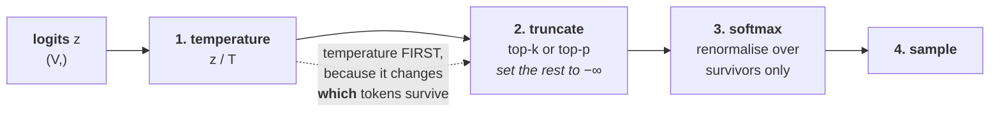

# Lesson 4 — Decoding & Beam Search From Scratch

[](https://colab.research.google.com/github/vinod-seth/Applied-Scientist-Interview-Gauntlet/blob/main/tutorial/07_ml_from_scratch/ml_from_scratch_lab.ipynb)

| | |
|---|---|
| **Prepares** | "Write beam search" — the classic ML-implementation question, and the one with the most places to be subtly wrong |
| **Time** | ~14 min visible + drills + a 15-minute blank-editor task |
| **Domain tag** | ML implementation / sequence decoding |

> 📍 **How this lesson works:** Session 5 Lesson 2 argued *which* decoding strategy to choose and why. This lesson writes them. The gap between the two is larger than it looks — a candidate who can explain nucleus sampling fluently often still gets the truncation order wrong, mishandles finished beams, or forgets that a product of four hundred probabilities underflows to zero in float64. Attempt each drill in a blank file first.

## 🟢 Learning Objectives

After this lesson you can:

- **Implement <abbr title="A divisor applied to logits before the softmax: below 1 sharpens the distribution, above 1 flattens it">temperature</abbr>, top-*k* and <abbr title="Nucleus sampling: keep the smallest set of most-likely tokens whose probabilities sum to p, then renormalize and sample from it">top-*p*</abbr> sampling** in the correct order of operations, and say what changes if you reverse it.
- **Implement beam search in <abbr title="Working with log-probabilities and sums instead of probabilities and products, so long sequences cannot underflow to zero">log space</abbr>**, and state the arithmetic reason log space is mandatory rather than stylistic.
- **Apply <abbr title="Dividing a sequence's total log-probability by a function of its length, to stop beam search preferring short outputs">length normalisation</abbr>** and explain the bias it corrects.
- **Handle finished beams correctly** — the single most common beam-search bug.
- **Test a decoder by identity**, using the exact equivalences that make decoders unusually verifiable.

## 🟢 The One Picture

Every sampler is the same pipeline, and **the order is the whole exam question.**



**Reverse steps 1 and 2 and you get a different distribution.** Temperature reshapes the probabilities, so applying it before truncation changes *which* tokens fall inside the top-*p* nucleus — a low temperature sharpens the distribution and shrinks the nucleus, a high one flattens it and widens it. Truncating first freezes the candidate set and reduces temperature to a re-weighting of a fixed shortlist. Both run. Only one matches what every framework implements.

---

## 🔷 Drill 1 — "Implement top-*k* and top-*p* sampling."

*The order of operations question. 75 seconds.*

<details><summary>✅ Model answer</summary>

```python
def sample_next(logits, temperature=1.0, top_k=None, top_p=None, rng=None):
    """logits: (V,). Returns a sampled token id."""
    rng = rng or np.random.default_rng()
    z = logits.astype(float)

    # 1. temperature FIRST - it changes which tokens survive truncation
    if temperature <= 0:
        return int(np.argmax(z))                      # T -> 0 is exactly greedy
    z = z / temperature

    # 2. truncate in the LOGIT domain, with -inf
    if top_k is not None:
        kth = np.partition(z, -top_k)[-top_k]
        z = np.where(z < kth, -np.inf, z)
    if top_p is not None:
        order = np.argsort(z)[::-1]                   # descending
        probs = softmax(z[order])
        cum = np.cumsum(probs)
        # keep every token up to and INCLUDING the one that crosses p
        cutoff = int(np.searchsorted(cum, top_p)) + 1
        keep = order[:cutoff]
        masked = np.full_like(z, -np.inf)
        masked[keep] = z[keep]
        z = masked

    # 3. softmax renormalises over survivors automatically (exp(-inf) = 0)
    p = softmax(z)
    # 4. sample
    return int(rng.choice(len(p), p=p))
```

**Three details that are each a separate follow-up:**

1. **Truncate by writing $-\infty$ into the logits, not by zeroing probabilities.** Exactly the masking argument from Lesson 1 — the softmax then renormalises over the survivors for free, and the result is a proper distribution.
2. **The nucleus must *include* the token that crosses $p$.** With probabilities $[0.5, 0.4, 0.1]$ and $p = 0.8$, the cumulative sums are $[0.5, 0.9, 1.0]$; stopping *before* crossing keeps only the first token and 0.5 of mass, which is not what $p = 0.8$ asked for. The `+ 1` is the entire fix and it is off-by-one bait.
3. **`temperature = 0` must be special-cased.** Dividing by zero gives `inf`/`nan` rather than the greedy behaviour everyone expects the limit to produce.
</details>

<details><summary>🔁 The follow-up chain</summary>

"What if both `top_k` and `top_p` are set?" (apply *k* first, then *p* within the survivors — that is the conventional composition, and it means *k* acts as a hard ceiling while *p* adapts below it) → "Why is `np.partition` better than a full sort for top-*k*?" ($O(V)$ against $O(V \log V)$, and $V$ is 50,000+ so it matters per token; for top-*p* you genuinely need the sorted order, which is why the two branches differ) → "What does top-*p* do when one token has probability 0.99?" (the nucleus collapses to that single token, which is the adaptive behaviour that makes nucleus sampling better than a fixed *k* — Session 5's argument, now visible in the code) → "How would you test this?" (identity tests: `temperature -> 0` must equal argmax; `top_k = V` and `top_p = 1.0` must both reduce to plain sampling from the full softmax; and with a fixed seed the empirical frequencies over many draws should match the truncated distribution).
</details>

---

## 🔷 Drill 2 — "Implement beam search."

*The set-piece. Attempt it cold; it is longer than people expect. 2 minutes to talk through.*

<details><summary>✅ Model answer</summary>

```python
def beam_search(step_fn, bos, eos, beam_width=3, max_len=20, alpha=0.0):
    """
    step_fn(seq) -> (V,) LOG-probabilities for the next token.
    Returns the finished sequences, best first.
    """
    live = [([bos], 0.0)]        # (sequence, cumulative log-prob)
    finished = []

    for _ in range(max_len):
        if not live:
            break
        candidates = []
        for seq, score in live:
            logp = step_fn(seq)                        # (V,) log-probs
            for token in np.argsort(logp)[::-1][:beam_width]:   # local top-b is enough
                candidates.append((seq + [int(token)], score + float(logp[token])))

        # global top-b across ALL expansions, not per-beam
        candidates.sort(key=lambda sc: sc[1], reverse=True)
        live = []
        for seq, score in candidates:
            if len(live) == beam_width:
                break
            if seq[-1] == eos:
                finished.append((seq, score))          # retire it; never expand again
            else:
                live.append((seq, score))              # only unfinished beams continue

    finished.extend(live)                              # hit max_len without EOS
    finished.sort(key=lambda sc: sc[1] / length_penalty(len(sc[0]), alpha), reverse=True)
    return finished
```

**Log space is arithmetic, not preference.** A 400-token sequence with a typical per-token probability near 0.1 has probability $10^{-400}$. The smallest positive normal float64 is about $2.2 \times 10^{-308}$, so the product **underflows to exactly zero** and every candidate ties at zero. Summing log-probabilities has no such limit. This is the same "never leave the log domain" rule as Lesson 2.

**The selection is global.** You expand all live beams, pool every candidate, and take the overall top *b*. Taking the best continuation *per beam* is a different and weaker algorithm — it cannot let one strong beam contribute two continuations, which is much of the point of beam search.

**Why only the local top-*b* per beam:** no beam can contribute more than *b* survivors to a beam of width *b*, so ranking the full vocabulary per beam is wasted work. That is an optimisation worth stating, not a shortcut.
</details>

<details><summary>🔁 The follow-up chain</summary>

"Is beam search guaranteed to find the most probable sequence?" (**no** — it is a heuristic. The exact argmax requires searching $V^T$ sequences; beam search keeps $b$ hypotheses and can prune the prefix of the true optimum at any step. Saying this unprompted is a strong signal, because many candidates assert optimality) → "What is the complexity?" ($O(\text{max\_len} \cdot b \cdot V)$ for scoring plus the sort; the $b\times$ over greedy is why beam search costs real latency in production) → "Does a larger beam always give better output?" (no, and it is a genuinely interesting result — for open-ended generation, quality often *degrades* with larger beams because the highest-likelihood text is bland and repetitive, which is exactly Holtzman et al.'s degeneration finding; beams help for constrained tasks like translation and hurt for story generation) → "How do you batch this on a GPU?" (flatten the `(b, V)` score matrix, `topk` over it, then recover beam and token indices by integer division and modulo against $V$ — the divmod trick is what the real implementations do).
</details>

---

## 🔷 Drill 3 — "Your beam search always returns very short sequences. Why?"

*A diagnosis question with a one-line cause. 45 seconds.*

<details><summary>✅ Model answer</summary>

Because every step **adds a negative number**. Log-probabilities are $\le 0$, so a sequence's cumulative score can only decrease as it grows — and a short sequence that finishes early is scored against long ones on a scale that structurally favours it. The bias is not subtle; unnormalised beam search reliably prefers the shortest plausible output.

The fix is to divide by a length penalty. Two forms are standard:

$$\text{simple: } \frac{\log P(Y)}{|Y|^\alpha} \qquad\qquad \text{GNMT: } lp(Y) = \frac{(5 + |Y|)^\alpha}{(5 + 1)^\alpha}$$

```python
def length_penalty(length, alpha=0.0):
    if alpha == 0.0:
        return 1.0                       # no normalisation
    return ((5.0 + length) ** alpha) / (6.0 ** alpha)     # Wu et al. 2016
```

with the <abbr title="The exponent controlling how strongly the length penalty rewards longer sequences; 0 disables normalisation entirely">$\alpha$</abbr> exponent typically 0.6–0.7. The GNMT form's offset makes the penalty gentler at short lengths, so it does not over-reward the first few tokens the way a raw $|Y|^\alpha$ does.

**Apply it when *comparing finished sequences*, not while expanding.** Normalising mid-search distorts the ranking between beams of different current lengths and can prune good long candidates early. The scoring line in Drill 2 divides at the final sort for exactly this reason.

> **Say it:** "Because log-probabilities are negative, so longer sequences accumulate lower scores by construction — the search is structurally biased toward finishing early. I'd divide the total log-probability by a length penalty, either $|Y|^\alpha$ or the GNMT form with $\alpha$ around 0.6, and apply it when ranking finished candidates rather than during expansion."
</details>

<details><summary>🔁 The follow-up chain</summary>

"What does $\alpha = 0$ give?" (no normalisation, the biased behaviour; $\alpha = 1$ is a plain average log-probability per token, which over-corrects and starts favouring long rambling outputs — the useful range sits between, which is why it is tuned) → "Is length normalisation principled or a hack?" (honestly, a calibrated hack — it has no probabilistic derivation, and the more principled framing is that you are optimising a different objective than sequence likelihood because likelihood is not what you actually want; saying that is better than defending it as theory) → "What else biases beam search?" (repetition — a repeated phrase is often locally high-probability, which is the self-reinforcing loop from Session 5; <abbr title="Forbidding any token that would repeat a sequence of n words already generated, by masking it out before sampling">n-gram blocking</abbr> is the usual patch) → "How would you enforce a minimum length?" (mask the EOS token to $-\infty$ until the minimum is reached — a two-line change, and a good demonstration that constraints belong in the logit domain).
</details>

---

## 🔷 Drill 4 — "What exactly happens to a beam that emits EOS?"

*The most common beam-search bug, and it is invisible in a quick test. 60 seconds.*

<details><summary>✅ Model answer</summary>

A beam that emits the <abbr title="The end-of-sequence token a model emits to signal that generation is complete">EOS</abbr> token must be **retired, not expanded, and still allowed to win**. Three properties, and each has a corresponding bug:

| Required behaviour | The bug if you get it wrong |
|---|---|
| **Stop expanding it.** No tokens after EOS | The beam keeps generating past EOS, usually emitting EOS again and again, and its score keeps dropping until it loses to worse-but-shorter candidates |
| **Keep it in the final pool.** It competes at the end | Dropping finished beams means the search returns only sequences that hit `max_len`, which is precisely the wrong set |
| **Free its slot.** The remaining beams continue at full width | Holding the slot open shrinks the effective beam width every time a beam finishes, so a width-5 search silently becomes width-2 |

The third one is the subtle one and the reason many implementations keep a *separate* `finished` list rather than a flag on the live beams — that is what the Drill 2 code does.

**When do you stop?** The standard rule: stop when you have `beam_width` finished hypotheses **and** the best live beam's score can no longer beat the worst finished one. Because scores only decrease with length, that comparison is a valid bound. The cheap approximation — stop as soon as any beam finishes — is common and slightly worse, and knowing that it is an approximation is the point.

**Why a quick test misses this:** on short sequences with a small vocabulary, all three bugs still produce plausible output. They show up as quality degradation on long generations, which is the recurring theme of this session — ML bugs do not crash.
</details>

<details><summary>🔁 The follow-up chain</summary>

"Can a finished beam ever be beaten by a beam that finishes later?" (yes — a longer sequence can have a higher *normalised* score even though its raw log-probability is lower, which is precisely why length normalisation is applied at final ranking and why you cannot stop at the first finish) → "What if no beam ever emits EOS?" (`max_len` truncation, and those unfinished beams must still enter the final pool — the `finished.extend(live)` line; forgetting it returns nothing at all on some inputs) → "Does this differ for encoder-decoder versus decoder-only?" (not in the search logic — only in what `step_fn` conditions on; keeping the search independent of the model is good design and worth pointing out) → "How does the KV cache interact with beam search?" (each beam needs its own cache, and when beams are reordered by the top-*b* selection the caches must be **gathered into the same order** — a real and painful bug in production implementations, and a strong detail to raise).
</details>

---

## 🔷 Drill 5 — "How do you test a decoder?"

*Decoders are unusually verifiable, and almost nobody exploits it. 60 seconds.*

<details><summary>✅ Model answer</summary>

By **identity**. Each of these is an exact equality, not an approximation, and each is two lines:

| Identity | What it proves |
|---|---|
| `beam_search(b=1) == greedy_decode()` | The expansion and selection logic is right — beam 1 *is* greedy, by definition |
| `beam_search(b=V**max_len) == brute_force_argmax()` | With a beam wide enough to hold every sequence, the heuristic becomes exhaustive search. On a toy vocabulary ($V=4$, length 4 = 256 sequences) you can enumerate all of them |
| `sample(temperature→0) == argmax` | The temperature limit is handled |
| `sample(top_p=1.0) == sample(no truncation)` | The nucleus cutoff includes everything when it should |
| Sampled frequencies over $10^5$ draws ≈ the truncated distribution, within $\pm 3$ standard errors | The renormalisation after truncation is correct |

**The brute-force identity is the strongest test in this session** and it is the one to volunteer, because it verifies the whole search against ground truth rather than against your own intuition. It only works on a toy problem — which is exactly what a unit test should be.

> **Say it:** "Decoders test well by identity. Beam width 1 must equal greedy exactly. On a toy vocabulary I'd enumerate every sequence and check that a sufficiently wide beam finds the true argmax. Temperature approaching zero must equal argmax, and top-p of 1.0 must equal untruncated sampling. Then a frequency check with a fixed seed for the sampler itself."
</details>

<details><summary>🔁 The follow-up chain</summary>

"How do you test something stochastic in CI?" (seed the generator for reproducibility, and test *distributional* properties with a tolerance derived from the standard error rather than exact values — the same discipline as the reservoir-sampling test in Session 6) → "What does the beam-1 test *not* catch?" (anything involving multiple beams: the global-versus-per-beam selection, finished-beam handling, and beam reordering — which is why the brute-force identity matters as well) → "Would you write these tests in an interview?" (name all five in ten seconds, then offer to write the one they find most interesting — naming them is most of the credit) → "How do you test length normalisation?" (construct two candidates by hand where the short one wins unnormalised and the long one wins normalised, then assert the ranking flips at a known $\alpha$).
</details>

---

## 🔷 Blank-Editor Drill

**Task.** Empty file. 15 minutes. NumPy only.

Implement `beam_search(step_fn, bos, eos, beam_width, max_len, alpha)` with log-space scoring, correct finished-beam handling, and length normalisation applied at final ranking.

**Then write these four tests:**

| # | Test | What it catches |
|---|---|---|
| 1 | `beam_search(b=1)` equals greedy decoding exactly | Expansion and selection wiring |
| 2 | On a random 4-token vocabulary and length 4, a wide beam matches brute-force enumeration of all 256 sequences | The whole search, against ground truth |
| 3 | A beam that emits EOS at step 2 appears in the output and was never expanded further | All three finished-beam bugs |
| 4 | Two hand-built candidates flip their ranking between $\alpha = 0$ and $\alpha = 0.7$ | Length normalisation applied in the wrong place, or not at all |

Test 2 is the one to reach for first — it is the strongest verification available anywhere in this session.

Reference implementation and all four tests: [the Lab](ml_from_scratch_lab.ipynb), Part 4.

---

## 🟢 Concept Check

In a sampling pipeline, temperature must be applied **before** top-*p* truncation because:

* [ ] It is faster in that order
* [x] Temperature reshapes the distribution, so it changes *which* tokens fall inside the nucleus — truncating first freezes the candidate set and reduces temperature to a re-weighting of a fixed shortlist
* [ ] Top-*p* requires normalized probabilities as input
* [ ] Otherwise the softmax overflows

Beam search must accumulate log-probabilities rather than multiply probabilities because:

* [ ] Logarithms are faster to compute than multiplication
* [x] A 400-token sequence at ~0.1 per token has probability $10^{-400}$, far below float64's smallest normal value of ~$2.2 \times 10^{-308}$ — the product underflows to exactly zero and every candidate ties
* [ ] Log-probabilities are always positive, which simplifies sorting
* [ ] It makes beam search find the true argmax

A beam emits EOS at step 2 of a 20-step search. The correct handling is:

* [ ] Keep expanding it so all beams stay the same length
* [x] Retire it to a finished pool — never expand it again, still let it compete at final ranking, and free its slot so the remaining beams continue at full width
* [ ] Discard it, since it stopped early
* [ ] Immediately return it as the answer

<details>
<summary>🔑 Click to Reveal Answer & Explanation</summary>

**Q1: option 2.** Concretely: at temperature 0.5 the distribution sharpens and a nucleus of $p=0.9$ might contain 3 tokens; at temperature 1.5 the same $p$ might contain 300. Truncating first destroys that interaction. Both orders run without error, which is what makes this worth knowing rather than guessing.

**Q2: option 2.** Note option 3's error too — log-probabilities are **negative** (probabilities are $\le 1$), and that negativity is exactly what causes the short-sequence bias that length normalisation corrects.

**Q3: option 2.** All three clauses are separate bugs. The third is the sneaky one: holding the slot open silently shrinks the effective beam width, so a width-5 search degrades to width-2 as beams finish, and output quality drops for a reason nobody can find by reading the scoring code.
</details>

---

## 🔷 Rapid-Fire Rehearsal

```rehearsal-drill
RUBRIC: mechanism
TITLE: Decoding From Scratch — Rapid Fire
INTRO: Order of operations and edge cases. Every answer should contain either the exact sequence of steps or the test that would catch getting it wrong.
MIN: 30
MAX: 90
[[The sampling pipeline order]]
Q: Implement top-k and top-p sampling. What is the order of operations?
A: **Temperature, then truncate, then softmax, then sample.** Temperature comes **first** because it reshapes the distribution and therefore changes **which** tokens fall inside the nucleus - at temperature 0.5 a p of 0.9 might hold 3 tokens, at 1.5 it might hold 300. Truncating first freezes the candidate set and demotes temperature to re-weighting a fixed shortlist. Both orders run; only one matches every framework. **Three details, each a separate follow-up.** Truncate by writing **negative infinity into the logits**, not by zeroing probabilities - the softmax then renormalises over survivors for free. **The nucleus must INCLUDE the token that crosses p**: with [0.5, 0.4, 0.1] and p = 0.8 the cumsum is [0.5, 0.9, 1.0], and stopping before crossing keeps only 0.5 of mass. And **temperature = 0 must be special-cased** to argmax, since dividing by zero gives nan.
[[Beam search]]
Q: Write beam search. What are the non-obvious parts?
A: Keep b hypotheses with cumulative **log-probabilities**; each step, expand every live beam, pool all candidates, and take the **global** top b. **Log space is arithmetic, not style:** a 400-token sequence at about 0.1 per token has probability 10^-400, while the smallest normal float64 is about 2.2e-308 - the product **underflows to exactly zero** and every candidate ties. **The selection must be global**, not the best continuation per beam; per-beam selection cannot let one strong beam contribute two continuations, which is much of the point. **Only the local top-b per beam needs ranking**, since no beam can contribute more than b survivors. **And say this unprompted: beam search is a heuristic, not exact** - the true argmax needs V^T sequences, and beam search can prune the optimum's prefix at any step. Complexity is O(max_len * b * V).
[[Length normalisation]]
Q: Your beam search always returns very short sequences. Diagnose it.
A: Because **every step adds a negative number** - log-probabilities are at most zero, so a sequence's score can only fall as it grows, and short finished sequences are compared against long ones on a scale that structurally favours them. **Fix: divide by a length penalty.** Either log P(Y) / |Y|^alpha, or the GNMT form ((5 + |Y|)^alpha) / 6^alpha with alpha around 0.6 to 0.7 (Wu et al. 2016), whose offset makes the penalty gentler at short lengths. **Apply it when ranking FINISHED sequences, not during expansion** - normalising mid-search distorts comparisons between beams of different current lengths and prunes good long candidates early. **Be honest about what it is:** a calibrated correction with no probabilistic derivation. The real statement is that sequence likelihood is not the objective you actually want.
[[Finished beams]]
Q: A beam emits EOS. What exactly happens to it?
A: It is **retired, not expanded, and still allowed to win** - three properties, each with its own bug. **(1) Stop expanding it:** otherwise it generates past EOS, usually re-emitting EOS, and its score keeps dropping until it loses to worse-but-shorter candidates. **(2) Keep it in the final pool:** dropping finished beams means you return only sequences that hit max_len, exactly the wrong set. **(3) Free its slot** so remaining beams continue at full width - otherwise a width-5 search silently becomes width-2 as beams finish, and quality drops for a reason nobody finds by reading the scoring code. That third one is why implementations keep a separate finished list rather than a flag. **Stopping rule:** stop when you have b finished hypotheses and the best live score can no longer beat the worst finished one - valid because scores only decrease with length.
[[Testing a decoder]]
Q: How do you test a decoder?
A: **By identity** - each is an exact equality, and each is two lines. **Beam width 1 must equal greedy decoding exactly**, by definition. **On a toy vocabulary - say V = 4 and length 4, so 256 sequences - a sufficiently wide beam must match brute-force enumeration**; this is the strongest test in the session because it checks the whole search against ground truth rather than against your intuition. **Temperature approaching zero must equal argmax.** **top_p = 1.0 must equal untruncated sampling.** And for the sampler itself, empirical frequencies over 10^5 seeded draws should match the truncated distribution within about three standard errors. **What beam-1 does NOT catch:** anything multi-beam - global versus per-beam selection, finished-beam handling, and cache reordering - which is why the brute-force identity matters too.
```

---

## 🟢 Summary

- **Temperature → truncate → softmax → sample.** Temperature first, because it decides which tokens survive the nucleus.
- **Truncate with $-\infty$ in the logit domain**, and include the token that crosses $p$.
- **Log space is mandatory arithmetic:** a 400-token product underflows float64 to exactly zero.
- **Beam search selects globally across all expansions**, is a heuristic rather than exact, and can be *worse* at larger widths for open-ended text.
- **Length normalisation corrects a structural bias** — log-probabilities are negative — and is applied at final ranking, not during expansion.
- **Finished beams must be retired, retained, and have their slot freed.** All three, or the width silently shrinks.
- **Decoders test by identity.** Beam-1 equals greedy; a wide enough beam equals brute force.

**References**

- Wu et al. (2016) — *Google's Neural Machine Translation System: Bridging the Gap between Human and Machine Translation* — https://arxiv.org/abs/1609.08144 *(the GNMT length penalty)*
- Fan, Lewis & Dauphin (2018) — *Hierarchical Neural Story Generation* — https://arxiv.org/abs/1805.04833 *(top-k sampling)*
- Holtzman et al. (2020) — *The Curious Case of Neural Text Degeneration* — https://arxiv.org/abs/1904.09751 *(nucleus sampling, and why larger beams hurt open-ended generation)*
- Vaswani et al. (2017) — *Attention Is All You Need* — https://arxiv.org/abs/1706.03762 *(beam search with length penalty in the original decoding setup)*

**Next:** [Mock Round — The 45-Minute ML Implementation Round](05_mock_round.md)
