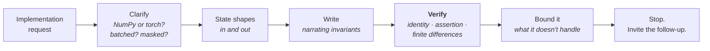

# Lesson 5 — Mock Round: The 45-Minute ML Implementation Round

| | |
|---|---|
| **Prepares** | A 45-minute ML-implementation round: one substantial implementation, a verification demand, and a follow-up chain on every design choice |
| **Prerequisites** | Lessons 1–4 including their blank-editor drills; Session 6 Lesson 1 for the five beats, which transfer unchanged |
| **Time** | ~90 min (rapid round + three timed implementations + honest self-assessment) |

> 📍 **How this round differs from Session 6's.** There, the interviewer supplied the specification and you supplied the algorithm. Here **you supply both** — nobody tells you the shape of the output or what "correct" means, so defining correctness is part of the answer. And the bugs are silent: a DSA bug throws, an ML bug trains. That is why every question below ends, explicitly or implicitly, in *"how would you know that's right?"*

## 🟢 Learning Objectives

After this round you can:

- **Produce attention, a stable loss, k-means, or beam search cold**, under a 45-minute clock, narrating shapes throughout.
- **State the verification for each** before being asked — the identity, the assertion, or the finite-difference check.
- **Handle the résumé-derived opening** — "you wrote a transformer from scratch, show me" — without hesitation.
- **Locate your own implementation gaps** across 15 checkpoints and log them as study targets.

## 🟢 Before You Start

1. **Real timer, blank file, no references.** The reference solutions are in [the Lab](ml_from_scratch_lab.ipynb); opening them before your attempt destroys the drill.
2. **NumPy, not PyTorch** — unless you ask and are told otherwise. If autograd computes the derivative, you have not shown the derivative. Asking which is wanted is a legitimate beat-1 question.
3. **Say every shape aloud as you create it.** `(B, H, T, d_head)`. This is the single highest-yield habit in this round.
4. **Have your own project numbers to hand.** Two questions below invite you to connect an implementation to your own runs — and `[FILL: metric]` is the correct answer where you do not have the figure.

---

## 🟢 The Bar for This Round

| Property | What it sounds like | What fails |
|---|---|---|
| **Shaped** | Every tensor's shape named as it is created | Writing code and discovering shapes by running it |
| **Stable** | The log-domain form, with the overflow threshold quoted | `log(p + 1e-9)` |
| **Derived** | $p - y$ produced in two lines, on demand | "The gradient is standard" |
| **Verified** | The specific test, named before the interviewer asks | "It looks right" |
| **Bounded** | What the implementation does *not* handle, said out loud | Presenting a toy implementation as production-ready |

**Beat 4 is where this round is won.** In Session 6 testing meant tracing a case by hand. Here it means naming a *numerical* test — and the candidates who do it unprompted are a small minority.

---

## 🟢 The Rapid Round

Fourteen questions across all four lessons — the spoken half, no code.

<RehearsalStudio rubric="mechanism" minSeconds="35" maxSeconds="110" prompt="Answer each out loud with the mechanism, the shape or the formula, and the test that would catch it being wrong. Then stop and invite the follow-up." questions="Write scaled dot-product attention and name every shape as you go. || Why divide by the square root of d_k? || Where does the mask go, and why negative infinity rather than zeroing weights afterwards? || What exactly is the reshape from single-head to multi-head attention? || RoPE goes on which tensors, and why does relative position fall out of the dot product? || Implement cross-entropy from logits. Why not softmax then log? || Derive the gradient of softmax cross-entropy with respect to the logits. || How do you know a hand-written gradient is correct? || Write a numerically stable binary cross-entropy from logits. || What does label smoothing buy, and what does it destroy? || Prove k-means terminates. Does that mean it finds the best clustering? || Why does logistic regression need no random restarts when k-means does? || Write beam search. Why must it work in log space? || A beam emits EOS at step 2 of 20. What exactly happens to it?" />

> [!TIP]
> If an answer comes out without a number, a shape, or a test in it, it is incomplete for this round. Add one and say it again.

---

## 🟢 The Three Set-Piece Implementations

Each is a full round. Timer on, blank file, out loud. Open the model transcript **only after your attempt**.

### 🔷 Problem 1 — The résumé question (target: 25 minutes)

<RehearsalStudio rubric="mechanism" minSeconds="150" maxSeconds="330" prompt="Full protocol, 25 minutes, out loud: 'Your resume says you implemented multi-head attention and RoPE from scratch. Write multi-head self-attention in NumPy, with a causal mask and RoPE on the queries and keys.' Clarify first, state the shapes, narrate the invariants, then verify with the leakage test." />

✅ Model transcript — what a complete answer sounds like

**Beat 1 — Clarify.** "Three things. NumPy with the maths written out, or may I use a framework? Should this be batched, and do I need padding masks as well as causal? And is this self-attention only, or should the function also handle cross-attention with different query and key lengths?" *(Answers: NumPy; batched, causal only; self-attention is fine.)*

**Beat 2 — Approach.** "Then the signature is `mha(x, Wq, Wk, Wv, Wo, n_heads, causal)` with `x` of shape `(B, T, d_model)`, returning the same shape. Inside: project to Q, K, V; split the feature axis into heads and transpose to `(B, H, T, d_head)`; apply RoPE to Q and K only; compute scores `(B, H, T, T)`; add the causal mask as $-\infty$ before the softmax; softmax over the last axis; multiply by V; merge heads back and apply `W_o`. I'll write a shift-invariant softmax helper first, because the max subtraction matters. Sound right?"

**Beat 3 — Narrate.** "Softmax helper first — subtracting the max makes it overflow-proof and the result is identical because softmax is shift-invariant. Now `split_heads`: I reshape `(B, T, d_model)` to `(B, T, H, d_head)` — splitting the **feature** axis, not the time axis — then transpose to put heads next to batch. The transpose is not cosmetic; the matmul has to batch over `(B, H)` and contract over `d_head`. RoPE next, on Q and K only — rotating V would move the content instead of the addressing. Scores are `(B, H, T, T)`, square in sequence length. Mask is upper-triangular above the diagonal, written as $-\infty$ into the scores so the softmax renormalises over the survivors for free."

**Beat 4 — Verify.** "Four checks. Output shape is `(B, T, d_model)`. Attention rows sum to one — that catches a wrong softmax axis, which is the classic silent bug here. With `n_heads=1` this must equal a single-head implementation exactly, which catches the missing transpose. And the important one: a **leakage test** — I'll perturb token 3 and assert that outputs at positions 0 through 2 are bit-identical. That proves the property the causal mask exists for, rather than proving the mask has the right shape."

**Beat 5 — Bound it.** "What this doesn't handle: no dropout, no padding mask, no KV cache — so it's a training-time forward pass, not an inference path. For generation I'd cache K and V per layer and the score matrix becomes `(B, H, 1, T)` per step. And the memory is $O(B H T^2)$ for the scores, which is the term FlashAttention removes by tiling and never materialising it."

🔁 The follow-up chain the interviewer will run

"Which RoPE layout did you use?" (interleaved pairs, or split-half — both exist in real code and they are **not interchangeable with the same weights**; ⚠️ candidate-specific: know which one your own project used, because this is a checkable detail an interviewer familiar with the implementations will probe) → "Now add a padding mask." (`(B, 1, 1, T)` on the **key** axis, combined with the causal mask by logical OR — and name the all-masked-row NaN case before they find it) → "Make it MQA." (K and V get a single head that broadcasts against Q's many heads; the shape bookkeeping in `split_heads` is where it gets fiddly, which is worth saying) → "What is the parameter count?" ($4 d_{model}^2$ for the four projections, independent of head count — which is the reason $d_{head} = d_{model}/H$ was chosen).

---

### 🔷 Problem 2 — Loss and gradient (target: 20 minutes)

<RehearsalStudio rubric="mechanism" minSeconds="150" maxSeconds="330" prompt="Full protocol, 20 minutes, out loud: 'Implement softmax cross-entropy from logits, returning both the loss and the gradient with respect to the logits, with optional label smoothing. Then convince me the gradient is right.' The convincing is half the question." />

✅ Model transcript — the beats, with the verification

**Beat 1 — Clarify.** "Integer class labels or soft targets? Mean or sum reduction over the batch? And should label smoothing default to off?" *(Answers: integers; mean; off by default.)*

**Beat 2 — Approach.** "Loss is `logsumexp(z) - z_y`, which comes straight from substituting the softmax into $-\log p_y$ — I won't compute probabilities at all for the loss. Inside `logsumexp` I subtract the max, which is exact because softmax is shift-invariant, so the largest exponent I ever evaluate is $e^0$. The gradient is $p - y$ divided by $N$ for the mean. With smoothing, the target becomes $(1-\varepsilon)$ on the true class plus $\varepsilon/K$ everywhere, and the gradient is $p - \tilde{y}$ — the derivation never assumed one-hot."

**Beat 3 — Narrate.** "`log_softmax` first: subtract the max, then subtract the log of the sum of exponentials. Both operations keep `keepdims=True` so broadcasting works against the `(N, K)` array. For the gradient I take `exp` of the log-probabilities to get $p$, subtract one at the label positions using fancy indexing, and divide by $N$ — that $1/N$ has to match the mean in the loss, or the effective learning rate silently scales with batch size."

**Beat 4 — Verify.** "Four tests, and I'd run the second one first because it's a single line. **(1)** With $K$ balanced classes and zero logits the loss must be $\log K$ — $1.386$ for four classes. That one check catches label misalignment, a double softmax, and a wrong class count. **(2)** Loss on logits of magnitude $10^3$ must be finite; the naive softmax-then-log form returns `inf` there, and showing that contrast *is* the demonstration. **(3)** Central finite differences in float64, $h \approx 10^{-5}$, relative error below $10^{-7}$. **(4)** A small step along the negative gradient must decrease the loss — that catches a sign error, which test 3 can miss if I've negated consistently."

**Beat 5 — Bound it.** "Caveat on the finite-difference check: if the test point sits on a kink the check fails for a correct implementation, so I'd perturb away from one. And this is the fused form — if someone hands me probabilities instead of logits, this function is wrong for them and I'd want that in the docstring."

🔁 The follow-up chain the interviewer will run

"Why is subtracting the max exact rather than approximate?" (the $e^{-m}$ factor cancels identically between numerator and denominator — softmax is shift-invariant by construction, so it is algebra rather than a tolerance) → "What would you expect the loss to be at init for your own ESCI setup?" (⚠️ candidate-specific: four classes, so $\log 4 \approx 1.386$ if balanced — and ESCI is *not* balanced, so the expected value shifts toward the entropy of the class prior, which is a sharper answer and shows you thought about your actual data) → "What does label smoothing cost?" (representation structure — Müller et al. found it erases inter-class similarity information in the penultimate layer, so a smoothed teacher distills worse even when it is more accurate) → "Extend to multi-class softmax regression." ($W$ becomes `(D, K)` and the gradient is $X^\top(P - Y)/N$ — the same expression, which is the point).

---

### 🔷 Problem 3 — Search, and proving it (target: 25 minutes)

<RehearsalStudio rubric="mechanism" minSeconds="150" maxSeconds="330" prompt="Full protocol, 25 minutes, out loud: 'Implement beam search with length normalization, then prove to me it is correct.' The proof is the scored half - reach for the brute-force identity." />

✅ Model transcript — the beats, with the identity test

**Beat 1 — Clarify.** "Does the model give me log-probabilities or raw logits per step? Is there an EOS token, and should unfinished beams at `max_len` still be returned? And do you want length normalisation applied during search or only at final ranking?" *(Answers: log-probs; yes to EOS and yes return unfinished; my choice on normalisation, with justification.)*

**Beat 2 — Approach.** "Beam of *b* hypotheses, each a sequence plus a cumulative log-probability. Each step: expand every live beam over the vocabulary, pool all candidates, take the **global** top *b* — not the best continuation per beam, which is a weaker algorithm because it can't let one strong beam contribute two continuations. Log space is not stylistic: a 400-token sequence at roughly 0.1 per token is $10^{-400}$, and float64's smallest normal is $2.2\times10^{-308}$, so the product underflows to exactly zero and every candidate ties. Length normalisation at final ranking only, because normalising mid-search distorts comparisons between beams of different current lengths. And I should say upfront that beam search is a **heuristic** — it is not guaranteed to find the most probable sequence."

**Beat 3 — Narrate.** "Two lists: `live` and `finished`. When a candidate ends in EOS it goes to `finished` and is never expanded again — three things have to be true there. It stops being expanded, or it keeps emitting EOS and its score decays until it loses. It stays in the final pool, or I only ever return sequences that hit `max_len`. And its slot is freed, or a width-5 search silently becomes width-2 as beams finish. That third one is why I keep a separate list rather than a flag."

**Beat 4 — Verify.** "The strong one first: on a toy vocabulary — say four tokens and length four, so 256 sequences — I **enumerate all of them** and assert a sufficiently wide beam finds the true argmax. That checks the entire search against ground truth rather than against my intuition. Then: beam width 1 must equal greedy decoding *exactly*, by definition. A beam that emits EOS at step 2 must appear in the output and have no tokens after EOS. And two hand-built candidates must flip their ranking between $\alpha=0$ and $\alpha=0.7$, which proves the normalisation is applied and applied in the right place."

**Beat 5 — Bound it.** "Not batched, and no KV cache. In production each beam needs its own cache, and when the top-*b* selection reorders beams the caches have to be **gathered into the same order** — that's a real bug in production implementations. Also worth saying: a larger beam is not always better. For open-ended generation quality often degrades with width, because the highest-likelihood text is bland and repetitive — that's Holtzman's degeneration result. Beams help for translation and hurt for story generation."

🔁 The follow-up chain the interviewer will run

"Prove the stopping rule is sound." (scores only decrease with length, so once you hold *b* finished hypotheses and the best live score cannot beat the worst finished one, no future candidate can either — a valid bound rather than a heuristic cutoff) → "How would you batch this on a GPU?" (flatten the `(b, V)` score matrix, `topk` over the flattened axis, then recover beam and token indices by integer division and modulo against $V$) → "Why is length normalisation not derived from anything?" (it isn't — it is a calibrated correction, and the honest framing is that sequence likelihood is not the objective you actually want; defending it as theory is worse than admitting it) → "Where does this connect to your own work?" (⚠️ candidate-specific: your RAG generator used some decoding configuration — say which, and whether you ever varied it. If generation was the dominant error source in your failure analysis, decoding settings are a plausible contributor you may or may not have controlled for. An honest "I fixed it at the default and did not ablate it" is a fine answer and a real limitation to name).

---

## 🟢 Honest Self-Assessment

The bar is **"I wrote it in a blank file, on a timer, and named the test before being asked."**

| # | Checkpoint | Lesson | Can you do it cold? |
|---|---|---|---|
| 1 | Scaled dot-product attention, every shape named | 1 | ☐ Clean ☐ Shaky ☐ No |
| 2 | The $\sqrt{d_k}$ variance argument | 1 | ☐ Clean ☐ Shaky ☐ No |
| 3 | Masks as $-\infty$ before the softmax; the NaN row case | 1 | ☐ Clean ☐ Shaky ☐ No |
| 4 | `split_heads` / `merge_heads` with the mandatory transpose | 1 | ☐ Clean ☐ Shaky ☐ No |
| 5 | RoPE on Q and K, and the relative-position argument | 1 | ☐ Clean ☐ Shaky ☐ No |
| 6 | Cross-entropy as `logsumexp(z) - z_y`, with the overflow numbers | 2 | ☐ Clean ☐ Shaky ☐ No |
| 7 | $\nabla_z L = p - y$ derived in two lines | 2 | ☐ Clean ☐ Shaky ☐ No |
| 8 | The finite-difference check, with dtype, $h$, and tolerance | 2 | ☐ Clean ☐ Shaky ☐ No |
| 9 | Stable BCE-with-logits; imbalance as weighting first | 2 | ☐ Clean ☐ Shaky ☐ No |
| 10 | Label smoothing: the calibration gain and the distillation cost | 2 | ☐ Clean ☐ Shaky ☐ No |
| 11 | k-means, plus the monotone-inertia termination proof | 3 | ☐ Clean ☐ Shaky ☐ No |
| 12 | Convex vs non-convex: why logistic regression needs no restarts | 3 | ☐ Clean ☐ Shaky ☐ No |
| 13 | Three regimes where k-means is wrong, with replacements | 3 | ☐ Clean ☐ Shaky ☐ No |
| 14 | Beam search in log space, with finished-beam handling | 4 | ☐ Clean ☐ Shaky ☐ No |
| 15 | The decoder identity tests, especially brute-force enumeration | 4 | ☐ Clean ☐ Shaky ☐ No |

**How to read your result**

| Clean count | What it means | Next step |
|---|---|---|
| **13–15** | Implementation round-ready | Move to Session 8. Re-run Problem 1 monthly — it is the one your résumé guarantees |
| **8–12** | You can explain all of it and write some of it | Redo the blank-editor drills for every ☐ Shaky. The gap is typing, not understanding, and it closes fast |
| **≤ 7** | The material is known but not *produced* | Work one lesson at a time, blank editor, and do not move on until the four tests pass without references |

Log every ☐ Shaky and ☐ No in the Gap Log in [PROGRESS.md](../../PROGRESS.md), with the **test** you could not name.

---

## 🟢 The Synthesis Question

<RehearsalStudio rubric="mechanism" minSeconds="80" maxSeconds="180" prompt="Answer out loud, ~2.5 minutes: 'You have written attention, a loss, a clustering algorithm and a decoder from scratch today. What do they have in common, and what would you check first in code you had never seen before?' Give one causal narrative, not a list." />

✅ Model answer — the arc

"Three things run through all four, and they are the things I'd check first in unfamiliar code.

**First, shapes and axes — because that is where the silent bugs live.** Attention softmaxes over the key axis; get it wrong and it still trains. The multi-head reshape splits the feature axis and then *must* transpose; skip the transpose and you can get right-shaped, wrong-content output. k-means broadcasts to `(N, k, D)` and reduces to `(N, k)`. None of these throw. So the first thing I'd check in someone else's implementation is whether every reduction is over the axis the maths says it should be.

**Second, stay in the log domain.** Cross-entropy is `logsumexp(z) - z_y`, never softmax-then-log, because `exp` overflows above 88 in float32 and a confident wrong prediction gives `log(0)`. Beam search accumulates log-probabilities because a 400-token product underflows float64 to exactly zero. Masking writes $-\infty$ into logits rather than zeroing probabilities, so the renormalisation stays correct. It's the same rule three times: exponentiate as late as possible, and never take the log of something you just exponentiated.

**Third — and this is the one I'd actually lead with — know the objective, then assert a property of it.** k-means minimises inertia, and both its steps provably decrease it, so `assert np.all(np.diff(inertia) <= 0)` catches essentially every bug for free. Cross-entropy at initialisation must be $\log K$. Attention rows must sum to one. Beam width 1 must equal greedy *exactly*, and on a toy vocabulary a wide enough beam must match brute-force enumeration. Every one of those is a line or two, and each checks a *property* rather than a value, so it doesn't need a known-good reference to compare against.

**What I'd check first in unfamiliar code, in order:** the reduction axes; whether the loss consumes logits or probabilities; and then whether there's a single assertion in the file that would fail if the algorithm were wrong. That third absence is usually the real finding — most research code has no test that could distinguish a correct implementation from a plausible one."

**Why this answer works:** it is a *causal* account rather than a list, it names concrete failures rather than principles, and it ends on a judgement about code quality that an Applied Scientist is expected to hold. It also demonstrates the property this round is really testing — that you think about verification before someone asks.

---

## 🟢 Summary

- This round scores **shapes, stability, derivation, and verification** — and verification is where most candidates simply stop.
- The three set-pieces are the three highest-probability asks: the **attention your résumé guarantees**, the **loss with its gradient**, and **beam search with a proof**.
- **ML bugs do not crash.** Every implementation in this session has a property-based test that costs one or two lines — the monotone inertia assertion, the $\log K$ check, the row-sum check, the beam-1 identity.
- **Name what your implementation does not handle.** No dropout, no KV cache, not batched. Bounding your own work is scored as judgement, not as weakness.

**Session complete.** Next: the [Chapter Quiz](quiz.md), then [Session 8 — Behavioral: Leadership Principles & STAR](../08_leadership_principles_star/00_locked.md) *(locked)* — which your [Gap Map](../../dossier/05_gap_map_and_study_plan.md) ranks as the **largest single gap in the course** at priority 24.
