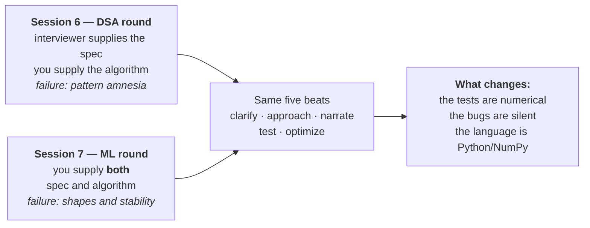

# Session 7 — Coding: ML From Scratch

| | |
|---|---|
| **What it prepares** | The ML-implementation round — the one where the interviewer says *"you wrote a transformer from scratch. Write me the attention."* |
| **Prerequisites** | Session 6 (the five beats transfer unchanged), Session 1 (RoPE, your transformer), Session 3 (loss theory), Session 5 (decoding theory). Dossier Ch2 claims #8–#9 and Ch5 Gap #5 |
| **Session length** | 4 lessons + a mock round, ~5–6 hours |
| **Format** | Drill cards plus a **blank-editor drill** per lesson: implement it cold, on a timer, before opening the reference. |

---

## 🟢 What This Round Actually Tests

Your resume makes two claims that are unusual because they are **verifiable on the spot**:

| Claim Vault # | Resume text | Why it is different from every other claim |
|---|---|---|
| **8** | "custom Pre-LayerNorm Transformer encoder from scratch" | An interviewer cannot check your macro-F1 in the room. They *can* hand you an editor |
| **9** | "Implemented RoPE and Multi-Head Attention" | Same. This is the single most re-implementable line on your résumé |

Every other number on your résumé is `❌ UNVERIFIED` and gets defended with words. These two get defended with **code, live, from nothing**. That asymmetry is the whole reason this session exists.

The second driver is [Gap #5](../../dossier/05_gap_map_and_study_plan.md) — *ML breadth outside NLP untested*, priority 16.2. Session 3 gave you the theory of the classical models. An implementation round is where that breadth actually gets probed, because writing k-means in fifteen minutes exposes whether you understand the objective or just the story.

**The failure mode is different from Session 6's, and this is the thing to internalise.** A DSA bug throws or returns an obviously wrong number. An ML bug **trains anyway**. A transposed axis, a softmax over the wrong dimension, a missing mask, a loss taken on probabilities instead of logits — none of these crash. They produce a slightly worse model, and you find out three days later, if at all. Interviewers know this, which is why the follow-up in this round is almost always *"how would you know that's right?"*

---

## 🟢 Scope Brief: The Four Areas

| Area | The version everyone gives | The version that scores |
|---|---|---|
| **Attention** | `softmax(QKᵀ/√d)V`, written from memory | Every shape named as you type it, the $\sqrt{d_k}$ justified by a variance argument, masking done with $-\infty$ before the softmax and not zeros after it |
| **Losses** | "Cross-entropy is $-\log p_y$" | Computed from **logits** with the log-sum-exp shift, the $(p - y)$ gradient derived, and verified against finite differences |
| **Classical ML** | "k-means alternates assignment and update" | The objective it monotonically decreases, why that guarantees termination but not optimality, and what k-means++ actually buys |
| **Decoding** | "Beam search keeps the top *b* sequences" | In log space, with length normalisation, finished beams handled correctly, and the reshape-then-truncate order for samplers |

**The through-line:** in every one of the four, the mechanism is the easy half. The scored half is the **verification** — the test you would write to catch the silent version of the bug.

---

## 🟢 Session Structure

1. [Lesson 1 — Attention From a Blank Editor](01_attention_from_scratch.md)
2. [Lesson 2 — Losses & Numerical Stability](02_losses_and_numerical_stability.md)
3. [Lesson 3 — Classical ML From Scratch](03_classical_ml_from_scratch.md)
4. [Lesson 4 — Decoding & Beam Search From Scratch](04_decoding_from_scratch.md)
5. [Mock Round — The 45-Minute ML Implementation Round](05_mock_round.md)

Then the [Chapter Quiz](quiz.md).

🔬 **Interactive companion** (CPU-only, NumPy + Matplotlib, no model downloads, runs in about half a minute): [▶ Open the ML From Scratch Lab in Colab](https://colab.research.google.com/github/vinod-seth/Applied-Scientist-Interview-Gauntlet/blob/main/tutorial/07_ml_from_scratch/ml_from_scratch_lab.ipynb) — every implementation in this session, written in NumPy and then **tested**: attention against a naive loop, the softmax shift against an overflow, gradients against finite differences, k-means inertia proven monotone, and beam search against exhaustive enumeration.

Plain link, if the badge does not resolve: `https://colab.research.google.com/github/vinod-seth/Applied-Scientist-Interview-Gauntlet/blob/main/tutorial/07_ml_from_scratch/ml_from_scratch_lab.ipynb`

---

## 🟢 How to Practise This Session

1. **Blank editor, every time.** Each lesson ends with a timed implementation task. Reading the reference solution first destroys the drill — the whole skill is producing it from nothing, which is exactly the condition of the round.
2. **Say the shape of every tensor as you create it.** `(B, H, T, d_head)` out loud. Almost every bug in this round is a shape bug, and narrating shapes catches them before NumPy does.
3. **Write the test before you claim it works.** Session 6 taught "let me test it" rather than "done". Here the tests are numerical: a known-value case, a shape assertion, a finite-difference check, or a comparison against a slow reference you trust.
4. **NumPy, not PyTorch, when asked to write "from scratch."** If autograd is doing the derivative, you have not shown the derivative. Ask which is wanted — it is a legitimate beat-1 clarifying question.

> [!NOTE]
> Nothing here is scored or gated. The target is that for each of the four areas you can produce a correct implementation cold, name every shape, and state the test that would catch the silent bug.

> [!IMPORTANT]
> ⚠️ **JD-DEPENDENT.** Whether your loop contains a dedicated ML-implementation round is `[UNKNOWN]` — it is question 4 on your [Chapter 0](../../dossier/00_target_lock.md) list, and the same question that decides your language. Some teams fold this into the coding round covered in Session 6; some run both; some run neither and probe implementation verbally inside the project round. Lesson 1 is worth doing regardless, because **your résumé invites it in any round**.
